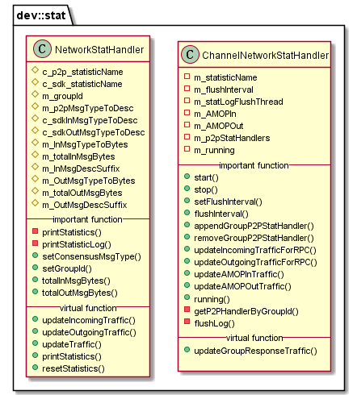

# libstat 模块

作者：TrustChain [微信公众号]

libstat：网络状态统计。

## 主要内容有：

+ 负责P2P通信网络状态统计;

+ 负责SDK通信网络状态统计。



## 涉及知识点：

+ NetworkStatHandler.cpp
```
//p2p:统计共识消息、区块同步消息的网络状态
consType = dev::eth::ProtocolID::Raft;
consType = dev::eth::ProtocolID::PBFT;
m_p2pMsgTypeToDesc = {{consType, "CONS"}, {dev::eth::ProtocolID::BlockSync, "SYNC"}};

//SDK:c_sdkInMsgTypeToDesc
std::map<int32_t, std::string> const c_sdkInMsgTypeToDesc = {
    {dev::channel::ChannelMessageType::CHANNEL_RPC_REQUEST, "RPC"},
 {dev::channel::ChannelMessageType::CLIENT_REGISTER_EVENT_LOG, "RegitsterEvent"},  {dev::channel::ChannelMessageType::CLIENT_UNREGISTER_EVENT_LOG, "UnregitsterEvent"}};
//SDK:c_sdkOutMsgTypeToDesc
std::map<int32_t, std::string> const c_sdkOutMsgTypeToDesc = {
    {dev::channel::ChannelMessageType::CHANNEL_RPC_REQUEST, "RPC"},
    {dev::channel::ChannelMessageType::TRANSACTION_NOTIFY, "Txs"},
    {dev::channel::ChannelMessageType::EVENT_LOG_PUSH, "EventLog"}};

//记录每种类型消息的大小之和
std::shared_ptr<std::map<int32_t, uint64_t>> m_InMsgTypeToBytes;
std::shared_ptr<std::map<int32_t, uint64_t>> m_OutMsgTypeToBytes;
```

+ ChannelNetworkStatHandler.cpp

```
//每个群组有个p2p统计CHANNEL_RPC_REQUEST类型的输入输出包的大小
std::shared_ptr<std::map<GROUP_ID, NetworkStatHandler::Ptr>> m_p2pStatHandlers;
p2pStatHandler->updateOutgoingTraffic(ChannelMessageType::CHANNEL_RPC_REQUEST, _msgSize);
p2pStatHandler->updateIncomingTraffic(ChannelMessageType::CHANNEL_RPC_REQUEST, _msgSize);

//updateAMOPInTraffic、updateAMOPOutTraffic两个函数统计AMOP通信的消息大小

//统计响应消息的消息大小
void ChannelNetworkStatHandler::updateGroupResponseTraffic(
p2pStatHandler->updateOutgoingTraffic(_msgType, _msgSize);

}
```

参考文献：

[1] https://github.com/FISCO-BCOS/FISCO-BCOS/releases/tag/v2.7.2

[2] https://fisco-bcos-documentation.readthedocs.io/zh_CN/latest/