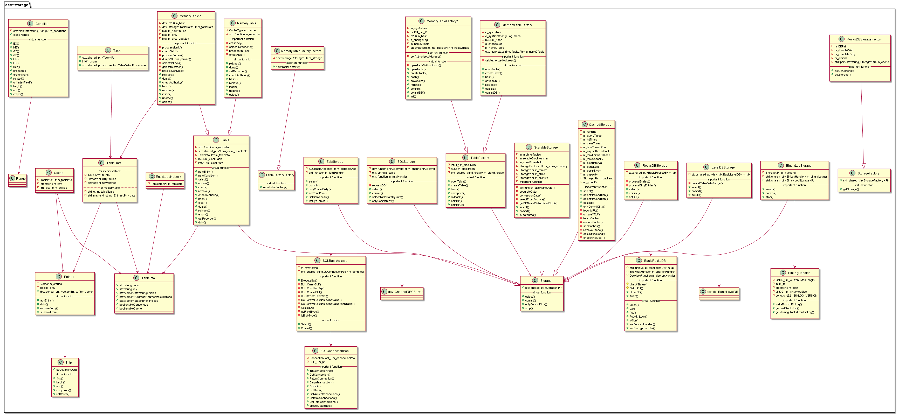

# libstorage 模块
作者：TrustChain [微信公众号]

libstorage：数据落盘存储模块。


## 主要内容有：

+ 数据落盘存储模块，通过Storage和MemoryTable框架管理；

+ CRUD数据、区块数据默认情况下都保存在AMDB，合约局部变量存储可根据需要配置为MPTState或StorageState，无论配置哪种State，合约代码都不需要变动；

+ 当使用MPTState时，合约局部变量保存在MPT树中。当使用StorageState时，合约局部变量保存在AMDB表中；

+ 尽管MPTState和AMDB最终数据都会写向RocksDB，但二者使用不同的RocksDB实例，没有事务性，因此当配置成使用MPTState时，提交数据时异常可能导致两个RocksDB数据不一致。



## 涉及知识点：

+ BasicRocksDB.cpp：操作数据，增删改查，有加密和压缩选项；一般是压缩后再加密；有BatchPut、PutWithLock两种提供性能的操作；

+ BinaryLogStorage.cpp：写区块数据到binlog，有select查表、commit写区块数据到表中；

+ BinLogHandler.cpp：writeBlocktoBinLog函数先把区块数据编码写入一个buffer,处理后再把buffer数据写入m_fd二进制文件；该文件内容有：length(4B)+block heigth+block data+CRC32; Entry：ID+vecField bitmap+ every Field value；

+ CachedStorage.cpp：每一个groupID有专门的缓存:任务线程池+异步线程池+MRU队列；

+ LevelDBStorage.cpp：有select查表、commit写区块数据到表中；

+ MemoryTable2.cpp：TableData{key, entries}，一般根据key值查询，有就在entries增加entry；TableInfo数据结构为表头元数据；

+ MemoryTableFactory.cpp、MemoryTableFactory2.cpp：用于系统表、用户表的操作；

+ ScalableStorage.cpp:主要是将区块数据或者区块state状态数据归档存储到s_block_to_dbname表中。

+ SQLBasicAccess.cpp：SQL操作、类似BuildQuerySql函数过滤一些字符，比如\,`等；

+ SQLConnectionPool.cpp：目前仅支持mysql数据库类型的连接池；

+ SQLStorage.cpp：通过json-rpc、channelMessage、AMOP接口进行sql操作数据库表；

+ ZdbStorage.cpp：连接mysql数据库、重点是initSysTables函数；
```

void ZdbStorage::initSysTables()
{
    createSysTables();
    createSysConsensus();
    createAccessTables();
    createCurrentStateTables();
    createNumber2HashTables();
    createTxHash2BlockTables();

    createCnsTables();
    createSysConfigTables();
    if (g_BCOSConfig.version() >= V2_6_0)
    {
        // the compressed table include:
        // _sys_hash_2_block, _sys_block_2_nonce_ and _sys_hash_2_header_
        m_rowFormat = " ROW_FORMAT=COMPRESSED ";
        m_valueFieldType = "longblob";
    }
    createHash2BlockTables();
    createSysBlock2NoncesTables();

    createBlobSysHash2BlockHeaderTable();
    insertSysTables();
}

```

参考文献：

[1] https://github.com/FISCO-BCOS/FISCO-BCOS/releases/tag/v2.7.2

[2] https://fisco-bcos-documentation.readthedocs.io/zh_CN/latest/