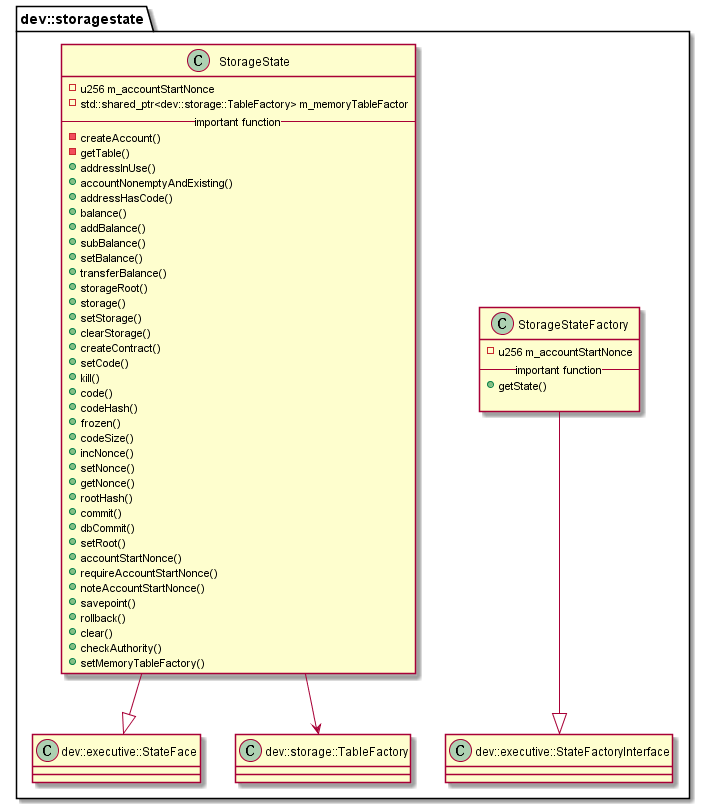

#  libstoragestate 模块
作者：TrustChain [微信公众号]

libstoragestate：当使用StorageState时，存储区块链的状态数据。

## 主要内容有：

+ 账户数据存储方式：AMDB表，不存历史状态，性能更高;目前已经支持LevelDB、RocksDB和MySQL；

+ Table[{主key,Entries[]},{主key,Entries[]}]；

+ Entry示例: {Name:Alice，item_id:1001001,item_name:laptop};

+ 表分类：系统表、用户表、账户表。系统表默认存在，由存储驱动保证系统表的创建。用户表：用户调用CRUD接口所创建的表。StorageState账户表。




##  涉及知识点：
+ 数据结构
```

#StorageState账户表的字段
const char* const STORAGE_KEY = "key";
const char* const STORAGE_VALUE = "value";
const char* const ACCOUNT_BALANCE = "balance";
const char* const ACCOUNT_CODE_HASH = "codeHash";
const char* const ACCOUNT_CODE = "code";
const char* const ACCOUNT_NONCE = "nonce";
const char* const ACCOUNT_ALIVE = "alive";
const char* const ACCOUNT_AUTHORITY = "authority";
const char* const ACCOUNT_FROZEN = "frozen";
```
+ 转账操作：transferBalance函数。
```

void StorageState::transferBalance(Address const& _from, Address const& _to, u256 const& _value)
{
    subBalance(_from, _value);
    addBalance(_to, _value);
}
```

+ 获取账户的状态根：storageRoot函数。
```

h256 StorageState::storageRoot(Address const& _address) const
{
    auto table = getTable(_address);
    if (table)
    {
        return table->hash();
    }
    return h256();
}

```
参考文献：

[1] https://github.com/FISCO-BCOS/FISCO-BCOS/releases/tag/v2.7.2

[2] https://fisco-bcos-documentation.readthedocs.io/zh_CN/latest/