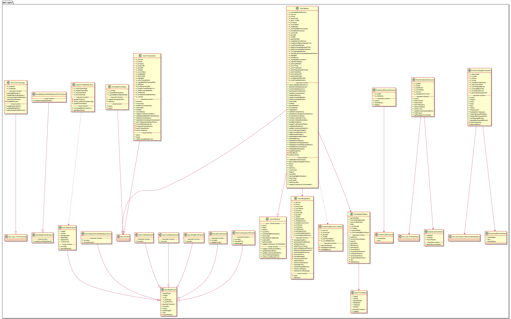

# libsync 模块

作者：TrustChain [微信公众号]

libsync：区块、交易的同步逻辑，由SyncMaster管理。


## 主要内容有：

+ 区块/状态同步机制：区块状态树状广播、采用gossip协议定期同步区块状态策略；

+ 交易同步机制：交易树状广播和交易转发时随机发送给25%的节点。



## 涉及知识点：

+ Common.h

```
enum SyncPacketType : byte
{
    StatusPacket = 0x00,
    TransactionsPacket = 0x01,
    BlocksPacket = 0x02,
    ReqBlocskPacket = 0x03,
    TxsStatusPacket = 0x04,
    TxsRequestPacekt = 0x05,
    PacketCount
};

enum class SyncState
{
    Idle,         ///< Initial chain sync complete. Waiting for new packets
    Downloading,  ///< Downloading blocks
    Size          /// Must be kept last
};
```
+ DownloadingBlockQueue.cpp

```
//重要数据结构
std::priority_queue<BlockPtr, BlockPtrVec, BlockQueueCmp> m_blocks; 
std::shared_ptr<ShardPtrVec> m_buffer;  // use buffer for faster push return

//分片
class DownloadBlocksShard
{
public:
    DownloadBlocksShard(int64_t _fromNumber, int64_t _size, bytes const& _blocksBytes)
      : fromNumber(_fromNumber), size(_size), blocksBytes(_blocksBytes)
    {}
    int64_t fromNumber;
    int64_t size;
    bytes blocksBytes;
};
using ShardPtr = std::shared_ptr<DownloadBlocksShard>;
using ShardPtrVec = std::list<ShardPtr>;
```

```
//入队列
void DownloadingBlockQueue::push(RLP const& _rlps)
{
ShardPtr blocksShard = make_shared<DownloadBlocksShard>(0, 0, _rlps.data().toBytes());
m_buffer->emplace_back(blocksShard);
}
//出队列
void DownloadingBlockQueue::pop()
{
//m_blockSizeExpandCoeff: the expand coeff of memory-size after block-decode
// Note: the memory size occupied by Block object will increase to at least treble
// for:
// 1. txsCache of Block
// 2. m_rlpBuffer of every Transaction
// 3. the Block occupied memory calculated without cache

auto blockSize = m_blocks.top()->blockSize() * m_blockSizeExpandCoeff;
m_blockQueueSize -= blockSize;
m_blocks.pop();
}
//清除队列
void DownloadingBlockQueue::clearQueue()
{
    WriteGuard l(x_blocks);
    std::priority_queue<BlockPtr, BlockPtrVec, BlockQueueCmp> emptyQueue;
    swap(m_blocks, emptyQueue);  // Does memory leak here ?
    // give back the memory to os
#ifndef FISCO_DEBUG
    MallocExtension::instance()->ReleaseFreeMemory();
#endif
}

//从缓存m_buffer循环取区块分片blocksShard到区块队列m_blocks中
void DownloadingBlockQueue::flushBufferToQueue()
{
    WriteGuard l(x_buffer);
    bool ret = true;
    while (m_buffer->size() > 0 && ret)
    {
        //返回list第一个元素的引用
        auto blocksShard = m_buffer->front();
        //删除list容器的第一个元素
        m_buffer->pop_front();
        ret = flushOneShard(blocksShard);
    }
}
```
+ DownloadingTxsQueue.cpp

```
//重要的数据结构
//交易分片vector
std::shared_ptr<std::vector<std::shared_ptr<DownloadTxsShard>>> m_buffer;
//节点树拓扑状传播路由
TreeTopology::Ptr m_treeRouter = nullptr;
//交易分片类
class DownloadTxsShard
{
public:
    DownloadTxsShard(bytesConstRef _txsBytes, NodeID const& _fromPeer)
      : txsBytes(_txsBytes.toBytes()), fromPeer(_fromPeer)
    {
        knownNodes = std::make_shared<dev::h512s>();
    }

    void appendKnownNode(dev::h512 const& _knownNode) { knownNodes->push_back(_knownNode); }
    bytes txsBytes;
    NodeID fromPeer;
    std::shared_ptr<dev::h512s> knownNodes;
};
```

```
void DownloadingTxsQueue::push(
    SyncMsgPacket::Ptr _packet, dev::p2p::P2PMessage::Ptr _msg, NodeID const& _fromPeer)
{
std::shared_ptr<DownloadTxsShard> txsShard =
        std::make_shared<DownloadTxsShard>(_packet->rlp().data(), _fromPeer);
    //_msg->packetType() == SyncPacketType的TransactionsPacket
    int RPCPacketType = 1;
    if (_msg->packetType() == RPCPacketType && m_treeRouter)
    {
        int64_t consIndex = _packet->rlp()[1].toPositiveInt64();
        SYNC_LOG(DEBUG) << LOG_DESC("receive and send transactions by tree")
                        << LOG_KV("consIndex", consIndex)
                        << LOG_KV("fromPeer", _fromPeer.abridged());
        //获取需要转发的节点ID
        auto selectedNodeList = m_treeRouter->selectNodes(m_syncStatus->peersSet(), consIndex);
        // append all the parent nodes into the knownNode
        auto parentNodeList = m_treeRouter->selectParent(m_syncStatus->peersSet(), consIndex, true);
        for (auto const& _parentNodeId : *parentNodeList)
        {
            txsShard->appendKnownNode(_parentNodeId);
        }
        // forward the received txs
        for (auto const& selectedNode : *selectedNodeList)
        {
            //排除msg的来源节点fromPeer
            if (selectedNode == _fromPeer || !m_service)
            {
                continue;
            }
            //异步发送p2pMessage
            m_service->asyncSendMessageByNodeID(selectedNode, _msg, nullptr);
            txsShard->appendKnownNode(selectedNode);
            SYNC_LOG(DEBUG) << LOG_DESC("forward transaction")
                            << LOG_KV("selectedNode", selectedNode.abridged());
        }
    }
    WriteGuard l(x_buffer);
    //存放交易分片
    m_buffer->emplace_back(txsShard);
}
```

```
//把队列分片中的交易经过条件判断后提交交易池TxPool
void DownloadingTxsQueue::pop2TxPool(
    std::shared_ptr<dev::txpool::TxPoolInterface> _txPool, dev::eth::CheckTransaction _checkSig)
{
// fetch from buffer(only one thread can callback this function)
// localBuffer指向待处理的m_buffer，然后m_buffer指向新的vector; std::shared_ptr<std::vector<std::shared_ptr<DownloadTxsShard>>> localBuffer;
{
localBuffer = m_buffer;
m_buffer = std::make_shared<std::vector<std::shared_ptr<DownloadTxsShard>>>();
}
    for (size_t i = 0; i < localBuffer->size(); ++i)
    {
    auto txs = std::make_shared<dev::eth::Transactions>();
    std::shared_ptr<DownloadTxsShard> txsShard = (*localBuffer)[i];
    RLP const& txsBytesRLP = RLP(ref(txsShard->txsBytes))[0];
    dev::eth::TxsParallelParser::decode(
    txs, txsBytesRLP.toBytesConstRef(), _checkSig, true);
    // parallel verify transaction before import
    tbb::parallel_for(tbb::blocked_range<size_t>(0, txs->size()),[&](const tbb::blocked_range<size_t>& _r) {});
   //遍历交易
   for (auto tx : *txs)
   {
    //提交交易池
    auto importResult = _txPool->import(tx);
   }
    }
}
```

+ GossipBlockStatus.cpp

```
//重要的消息处理函数
std::function<void(int64_t const&)> m_gossipBlockStatusHandler = nullptr;
//继承Worker，启动线程处理
```

+ NodeTimeMaintenance.cpp

```
//记录节点系统时间，并协调各节点系统时间尽量一致
// maps between nodeID and the timeOffset
std::shared_ptr<std::map<dev::h512, int64_t> > m_node2TimeOffset;
std::atomic<int64_t> m_medianTimeOffset = {0};
void NodeTimeMaintenance::tryToUpdatePeerTimeInfo(SyncStatusPacket::Ptr _peerStatus)
{
}
```

+ SyncMsgPacket.cpp

```
//SyncMsgPacket:父类,重要数据结构
RLP m_rlp;              /// The result of decode
RLPStream m_rlpStream;  // The result of encode

//SyncStatusPacket:同步节点状态，encode时包括如下字段：
int64_t number;
h256 genesisHash;
h256 latestHash;

//SyncStatusPacketWithAlignedTime:节点对齐时间，encode时包括如下字段：
int64_t number;
h256 genesisHash;
h256 latestHash;
int64_t alignedTime;

//SyncTransactionsPacket:同步交易的包，encode时包括如下字段：
std::vector<bytes> const& _txRLPs
uint64_t const& _consIndex

//SyncBlocksPacket:同步区块的包，encode时每个区块为一个字段
void SyncBlocksPacket::encode(std::vector<dev::bytes> const& _blockRLPs)
{
    m_rlpStream.clear();
    unsigned size = _blockRLPs.size();
    prep(m_rlpStream, BlocksPacket, size);
    for (bytes const& bs : _blockRLPs)
        m_rlpStream.append(bs);
}

//SyncReqBlockPacket:请求区块的包，encode时包括如下字段：
int64_t _from
unsigned _size

//SyncTxsStatusPacket:同步交易哈希的包，encode时包括如下字段：
int64_t const& _number
std::shared_ptr<std::set<dev::h256>> _txsHash

//SyncTxsReqPacket:请求交易的包，encode时包括如下字段：
std::shared_ptr<std::vector<dev::h256>> _requestedTxs
```

+ SyncStatus.cpp
```
//三种状态
//SyncStatus
struct SyncStatus
{
    SyncState state = SyncState::Idle;
    PROTOCOL_ID protocolId;
    int64_t currentBlockNumber;
    int64_t knownHighestNumber;
    h256 knownLatestHash;
};

//SyncPeerStatus：节点状态
NodeID nodeId;
int64_t number;
h256 genesisHash;
h256 latestHash;
DownloadRequestQueue reqQueue;
bool isSealer = false;

//SyncMasterStatus的重要数据结构
std::map<NodeID, std::shared_ptr<SyncPeerStatus>> m_peersStatus;
//SyncMasterStatus的重要函数
NodeIDs SyncMasterStatus::filterPeers(int64_t const& _neighborSize, std::shared_ptr<NodeIDs> _peers,
    std::function<bool(std::shared_ptr<SyncPeerStatus>)> const& _allow)
{
}
void SyncMasterStatus::foreachPeer(
    std::function<bool(std::shared_ptr<SyncPeerStatus>)> const& _f) const
{
}
void SyncMasterStatus::foreachPeerRandom(
    std::function<bool(std::shared_ptr<SyncPeerStatus>)> const& _f) const
{
}
```

+ SyncMsgEngine.cpp
```
//class DownloadBlocksContainer：重要数据结构
std::vector<dev::bytes> m_blockRLPsBatch;

// class SyncMsgEngine
std::shared_ptr<dev::ThreadPool> m_txsWorker;//发送syncMsg
std::shared_ptr<dev::ThreadPool> m_txsSender;//发送tx
std::shared_ptr<dev::ThreadPool> m_txsReceiver;//接收tx
std::shared_ptr<dev::ThreadPool> m_timeAlignWorker;//时间对齐
```

```

//SyncMsgEngine::messageHandler()-->SyncMsgEngine::interpret()
bool SyncMsgEngine::interpret(SyncMsgPacket::Ptr _packet, dev::p2p::P2PMessage::Ptr _msg, dev::h512 const& _peer)
{
    try
    {
        auto self = std::weak_ptr<SyncMsgEngine>(shared_from_this());
        switch (_packet->packetType)
        {
        //接收处理状态包
        case StatusPacket:
            onPeerStatus(*_packet);
            break;
        //m_txsReceiver工作线程处理：TransactionsPacket，放入交易队列
        case TransactionsPacket:
            m_txsReceiver->enqueue([self, _packet, _msg]() {
                auto msgEngine = self.lock();
                if (msgEngine)
                {
                    msgEngine->onPeerTransactions(_packet, _msg);
                }
            });
            break;
          //获取区块并放入下载区块队列
        case BlocksPacket:
            onPeerBlocks(*_packet);
            break;
        //记录<from节点，需要size个区块>的请求
        case ReqBlocskPacket:
            onPeerRequestBlocks(*_packet);
            break;
        // receive transaction hash, _msg is only used to ensure the life-time for rlps of _packet
       //m_txsWorker工作线程处理：TxsStatusPacket，发送含有交易哈希值的交易集给peer
        case TxsStatusPacket:
            m_txsWorker->enqueue([self, _packet, _peer, _msg]() {
                auto msgEngine = self.lock();
                if (msgEngine)
                {
                    msgEngine->onPeerTxsStatus(_packet, _peer, _msg);
                }
            });
            break;
        // receive txs-requests,  _msg is only used to ensure the life-time for rlps of _packet
       //m_txsSender工作线程处理：TxsRequestPacekt， 发送含有交易集的包给peer
        case TxsRequestPacekt:
            m_txsSender->enqueue([self, _packet, _peer, _msg]() {
                auto msgEngine = self.lock();
                if (msgEngine)
                {
                    msgEngine->onReceiveTxsRequest(_packet, _peer, _msg);
                }
            });
            break;
        default:
            return false;
        }
    }
    catch (std::exception& e)
    {
        return false;
    }
    return true;
}
```

```
std::shared_ptr<SyncMasterStatus> m_syncStatus;
/**
m_syncStatus处理这三种类型的消息：StatusPacket、BlocksPacket、ReqBlocskPacket
*/
//处理状态消息包
void SyncMsgEngine::onPeerStatus(SyncMsgPacket const& _packet)
{
m_syncStatus->newSyncPeerStatus(info);
}

//获取区块并放入下载区块队列
void SyncMsgEngine::onPeerBlocks(SyncMsgPacket const& _packet)
{
RLP const& rlps = _packet.rlp();
m_syncStatus->bq().push(rlps);
}

//记录<from节点，需要size个区块>的请求
void SyncMsgEngine::onPeerRequestBlocks(SyncMsgPacket const& _packet)
{
RLP const& rlp = _packet.rlp();
// request
int64_t from = rlp[0].toInt<int64_t>();
unsigned size = rlp[1].toInt<unsigned>();
auto peerStatus = m_syncStatus->peerStatus(_packet.nodeId);
peerStatus->reqQueue.push(from, (int64_t)size);
}
```

```
auto self = std::weak_ptr<SyncMsgEngine>(shared_from_this());
auto msgEngine = self.lock();
/**
msgEngine处理这三种类型的消息：TransactionsPacket、TxsStatusPacket、TxsRequestPacekt
*/

//m_txsReceiver工作线程处理：TransactionsPacket，放入交易队列
msgEngine->onPeerTransactions(_packet, _msg);
void SyncMsgEngine::onPeerTransactions(SyncMsgPacket::Ptr _packet, dev::p2p::P2PMessage::Ptr _msg)
{
m_txQueue->push(_packet, _msg, _packet->nodeId);
}

//m_txsWorker工作线程处理：TxsStatusPacket，发送含有交易哈希值的交易集给peer
msgEngine->onPeerTxsStatus(_packet, _peer, _msg);
void SyncMsgEngine::onPeerTxsStatus(
    std::shared_ptr<SyncMsgPacket> _packet, dev::h512 const& _peer, dev::p2p::P2PMessage::Ptr)
{
// pop all downloaded txs into the txPool
m_txQueue->pop2TxPool(m_txPool);

RLP const& rlps = _packet->rlp();
std::set<dev::h256> txsHash = rlps[1].toSet<dev::h256>();
//过滤一些未知的交易哈希
auto requestTxs = m_txPool->filterUnknownTxs(txsHash, _peer);
std::shared_ptr<SyncTxsReqPacket> txsReqPacket = std::make_shared<SyncTxsReqPacket>();
txsReqPacket->encode(requestTxs);
auto p2pMsg = txsReqPacket->toMessage(m_protocolId);
// send request to the peer
m_service->asyncSendMessageByNodeID(_peer, p2pMsg, nullptr);
}

//m_txsSender工作线程处理：TxsRequestPacekt， 发送含有交易集的包给peer
msgEngine->onReceiveTxsRequest(_packet, _peer, _msg);
void SyncMsgEngine::onReceiveTxsRequest(
    std::shared_ptr<SyncMsgPacket> _txsReqPacket, dev::h512 const& _peer, dev::p2p::P2PMessage::Ptr)
{
RLP const& rlps = _txsReqPacket->rlp();
std::vector<dev::h256> reqTxs = rlps[0].toVector<dev::h256>();
//从请求包或者的交易哈希集合，从交易池捞出真实的交易
auto txs = m_txPool->obtainTransactions(reqTxs);
std::shared_ptr<std::vector<bytes>> txRLPs = std::make_shared<std::vector<bytes>>();
   //遍历交易集，并打包
    for (auto tx : *txs)
    {
        txRLPs->emplace_back(tx->rlp(WithSignature));
        tx->appendNodeContainsTransaction(_peer);
    }
    std::shared_ptr<SyncTransactionsPacket> txsPacket =
        std::make_shared<SyncTransactionsPacket>();
    txsPacket->encode(*txRLPs);
    auto p2pMsg = txsPacket->toMessage(m_protocolId);
    //发送含有交易集的包给peer
    m_service->asyncSendMessageByNodeID(_peer, p2pMsg, CallbackFuncWithSession(), Options());

}
```

+ SyncTransaction.cpp
```
//重要数据结构
/// Block queue and peers
std::shared_ptr<SyncMasterStatus> m_syncStatus;
/// Message handler of p2p
std::shared_ptr<SyncMsgEngine> m_msgEngine;
std::shared_ptr<DownloadingTxsQueue> m_txQueue;
void SyncTransaction::doWork()
{
    maintainDownloadingTransactions();
    maintainTransactions();
    forwardRemainingTxs();
 }

void SyncTransaction::maintainDownloadingTransactions()
{
    m_txQueue->pop2TxPool(m_txPool);
}

//SyncTransaction::maintainTransactions()-->sendTransactions
()-->broadcastTransactions()
void SyncTransaction::sendTransactions(std::shared_ptr<Transactions> _ts,
    bool const& _fastForwardRemainTxs, int64_t const& _startIndex)
{
// send the transactions from RPC
broadcastTransactions(selectedPeers, _ts,_fastForwardRemainTxs, _startIndex);

sendTxsStatus(_ts, selectedPeers);

}

void SyncTransaction::broadcastTransactions(std::shared_ptr<NodeIDs> _selectedPeers,
    std::shared_ptr<Transactions> _ts, bool const& _fastForwardRemainTxs,
    int64_t const& _startIndex)
{
peers = m_syncStatus->filterPeers()
m_syncStatus->foreachPeerRandom([&](shared_ptr<SyncPeerStatus> _p) {
m_service->asyncSendMessageByNodeID(_p->nodeId, msg, CallbackFuncWithSession(), Options());
});
```

+ SyncTreeTopology.cpp

```
// the nodeList include both the consensus nodes and the observer nodes
std::shared_ptr<dev::h512s> m_nodeList;

std::shared_ptr<dev::h512s> SyncTreeTopology::selectNodesForBlockSync(
    std::shared_ptr<std::set<dev::h512>> _peers)
{ 
    Guard l(m_mutex);
    std::shared_ptr<dev::h512s> selectedNodeList = std::make_shared<dev::h512s>();
    // the node doesn't locate in the group
    if (!locatedInGroup())
    {
        return selectedNodeList;
    }
    // here will not overflow
    // the sync-tree-toplogy is:
    // consensusNode(0)->{0->{2,3}, 1->{4,5}}
    // however, the tree-toplogy is:
    // consensusNode(0)->{1->{3,4}, 2->{5,6}}
    // so every node of tree-toplogy should decrease 1 to get sync-tree-toplogy
    int64_t offset = m_startIndex - 1;

    int64_t nodeIndex = m_nodeIndex + 1 - m_startIndex;
    // find the parent nodes
    selectParentNodes(selectedNodeList, _peers, nodeIndex, offset);

    // the node is the consensusNode, chose the childNode
    if (m_consIndex >= 0)
    {
        recursiveSelectChildNodes(selectedNodeList, 0, _peers, offset);
    }
    // the node is not the consensusNode
    else
    {
        recursiveSelectChildNodes(selectedNodeList, nodeIndex, _peers, offset);
    }

    return selectedNodeList;
}
```

+ SyncMaster.cpp
```
//重要数据结构
/// Downloading txs queue
std::shared_ptr<DownloadingTxsQueue> m_txQueue;
/// Block queue and peers
std::shared_ptr<SyncMasterStatus> m_syncStatus;
/// Message handler of p2p
std::shared_ptr<SyncMsgEngine> m_msgEngine;
dev::ThreadPool::Ptr m_downloadBlockProcessor = nullptr;
dev::ThreadPool::Ptr m_sendBlockProcessor = nullptr;
// sync transactions
SyncTransaction::Ptr m_syncTrans = nullptr;
// handler for find the tree router
SyncTreeTopology::Ptr m_syncTreeRouter = nullptr;
// thread to gossip block status
GossipBlockStatus::Ptr m_blockStatusGossipThread = nullptr;
// settings
dev::eth::Handler<int64_t> m_blockSubmitted;
```

```
//SyncMaster::start()--> startWorking()-->workLoop()-->SyncMaster::doWork()
void SyncMaster::start()
{
    startWorking();
    m_syncTrans->start();
    if (m_blockStatusGossipThread)
    {
        m_blockStatusGossipThread->start();
    }
}
void SyncMaster::doWork()
{
// maintain the connections between observers/sealers
maintainPeersConnection();
m_downloadBlockProcessor->enqueue([this]() {
    try
    {
        // flush downloaded buffer into downloading queue
        maintainDownloadingQueueBuffer();
        // Not Idle do
        if (isSyncing())
        {
            // check and commit the downloaded block
            if (m_syncStatus->state == SyncState::Downloading)
            {
                bool finished = maintainDownloadingQueue();
                if (finished)
                    noteDownloadingFinish();
            }
        }
        // send block-download-request to peers if this node is behind others
        maintainPeersStatus();
    }
});
// send block-status to other nodes when commit a new block，即StatusPacket类型
maintainBlocks();
// send block to other nodes
m_sendBlockProcessor->enqueue([this]() {maintainBlockRequest();});
}

void SyncMaster::maintainPeersStatus()
{
//会下载区块同步节点状态
// Start download
noteDownloadingBegin();
SyncReqBlockPacket packet;
unsigned size = to - from + 1;
packet.encode(from, size);
m_service->asyncSendMessageByNodeID(
    _p->nodeId, packet.toMessage(m_protocolId), CallbackFuncWithSession(), Options());

}
```
参考文献：

[1] https://github.com/FISCO-BCOS/FISCO-BCOS/releases/tag/v2.7.2

[2] https://fisco-bcos-documentation.readthedocs.io/zh_CN/latest/