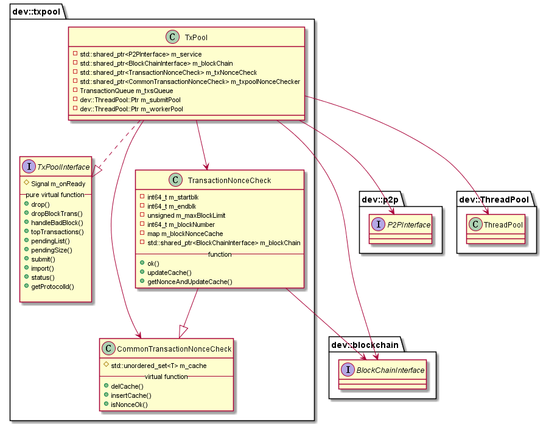

# libtxpool 模块
作者：TrustChain [微信公众号]

libtxpool：交易池。

## 主要内容有：

+ 交易流：客户端（创建交易|交易签名）-->接入节点（交易验签|交易池处理|交易广播）；备注：客户端通过Channel或RPC信道将交易发送给接入节点。
+ 缓存区块交易nonce：缓存最近commited区块及交易nonce。 



## 涉及知识点：

+ 交易池：记录客户端提交的交易。

1. 交易分类：一类是部署合约的交易，一类是调用合约的交易；

2. 交易验签：私钥签名，公钥验签。

3. 交易验重：m_txNonceCheck+m_txpoolNonceChecker；

4. 数据结构：
```
// transaction queue
using TransactionQueue = std::set<dev::eth::Transaction::Ptr, transactionCompare>;
TransactionQueue m_txsQueue;
std::unordered_map<h256, TransactionQueue::iterator> m_txsHash;
// dropped transaction queue
h256Hash m_dropped；
//记录交易池的交易nonce
std::shared_ptr<CommonTransactionNonceCheck> m_txpoolNonceChecker;
```

+ 交易池处理：把交易提交到submitPool的队列，检查其他节点同步状态（sealerList节点+observerList节点），交易import到队列成功，并返回通知notifyReceipt给客户端；把交易的rpccallback回调函数放入workerPool的队列做进一步处理。

```
TxPool::submit：m_submitPool->enqueue--》m_syncStatusChecker--》TxPool::import--》TxPool::notifyReceipt；
TxPool::import：setImportTime、check m_maxMemoryLimit、check txpool size、verify （nonce&signature）；
TxPool::notifyReceipt：m_workerPool->enqueue([callback, receipt]；
TxPool::verify：check TX in m_txsHash(交易池)--》check TX in m_dropped(丢弃交易集合)--》check nonce【m_txNonceCheck】--》check transaction signature【Transaction::sender函数】--》txPoolNonceCheck--》check chainId and groupId。
```

+ 缓存区块交易nonce：记录已commited区块及交易nonce。
```


//记录交易池缓存的最近区块的交易nonce
std::shared_ptr<TransactionNonceCheck> m_txNonceCheck;
//记录无效的交易
std::shared_ptr<std::map<dev::h256, dev::u256>> m_invalidTxs;
std::shared_ptr<std::set<h256>> m_txsHashFilter;
        // dropped transaction queue
h256Hash m_dropped；
```

+ 丢弃缓存区块：commited区块、bad 区块。
```
TxPool::dropTransactions--》
TxPool::dropBlockTxsFilter【在 m_txsHashFilter去除对应区块的交易】--》
TxPool::removeInvalidTxs【removeTrans（）、m_dropped.insert（）、m_txpoolNonceChecker->delCache（）、m_txsHashFilter->erase（）】。
```
参考文献：

[1] https://github.com/FISCO-BCOS/FISCO-BCOS/releases/tag/v2.7.2

[2] https://fisco-bcos-documentation.readthedocs.io/zh_CN/latest/