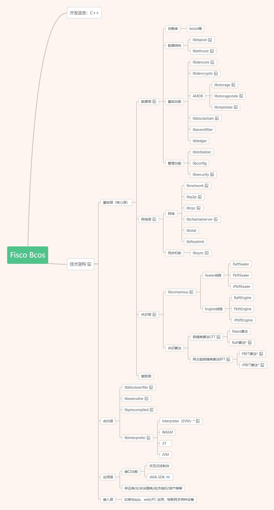
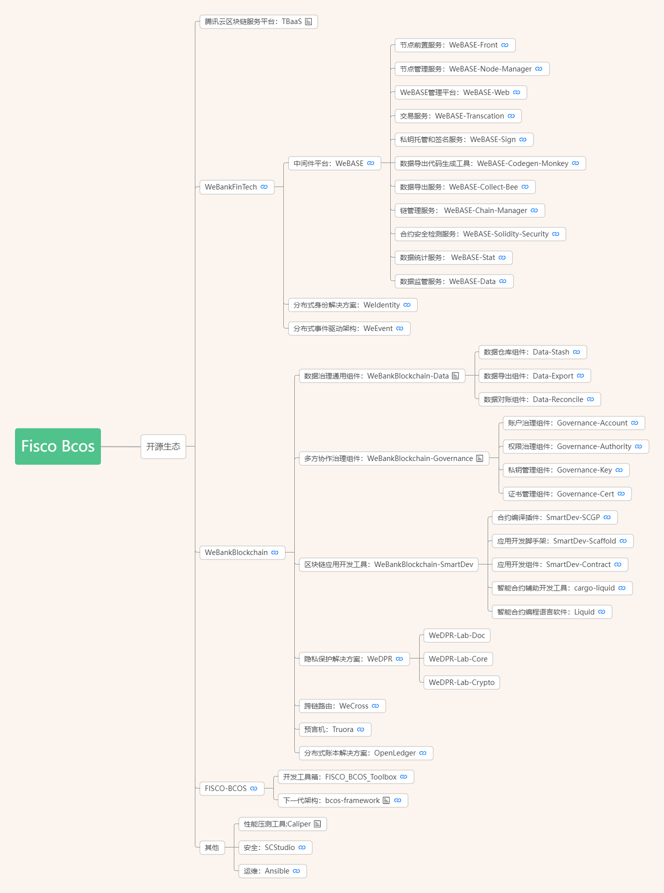

# FISCO BCOS 源码知识图谱
作者：TrustChain [微信公众号]

## 一、源码知识图谱：
+ 客户端（创建交易|交易签名）-->接入节点（交易验签|交易广播|交易池处理）-->共识节点（交易排序打包|执行区块|区块共识）--广播区块-->全网节点(验证交易|存储交易)。

## 二、开源生态

## 三、依赖库
+ TBB：https://github.com/oneapi-src/oneTBB

+ Boost：https://github.com/boostorg/boost

+ Snappy：https://github.com/google/snappy

+ LevelDB：https://github.com/google/leveldb

+ RocksDB：https://github.com/facebook/rocksdb

+ Cryptopp：https://github.com/weidai11/cryptopp

+ Secp256k1：https://github.com/FISCO-BCOS/secp256k1

+ JsonCpp：https://github.com/open-source-parsers/jsoncpp

+ JsonRpcCpp：https://github.com/cinemast/libjson-rpc-cpp

+ TASSL：https://github.com/jntass/TASSL

+ TCMalloc：https://github.com/google/tcmalloc

+ LibFF：https://github.com/scipr-lab/libff

+ GroupSig：https://github.com/FISCO-BCOS/group-signature-lib

+ EVMC：https://github.com/FISCO-BCOS/evmc/

+ EVMONE：https://github.com/FISCO-BCOS/evmone/

+ MHD：https://raw.githubusercontent.com/FISCO-BCOS/LargeFiles/master/libs/libmicrohttpd-0.9.63.tar.gz

+ Libzdb：https://cdn.mysql.com/archives/mysql-connector-c/mysql-connector-c-6.1.11-src.tar.gz

+ Paillier：https://github.com/FISCO-BCOS/paillier-lib/

+ VRF：https://github.com/cyjseagull/vrf

+ MPIR：https://github.com/FISCO-BCOS/mpir/

## 四、学习笔记

+ [1. Fisco-Bcos>libethcore 模块](libethcore.md ':include')

+ [2. Fisco-Bcos>libtxpool 模块](libtxpool.md ':include')

+ [3. Fisco-Bcos>libdevcore 模块](libdevcore.md ':include')

+ [4. Fisco-Bcos>libdevcrypto 模块](libdevcrypto.md ':include')

+ [5. Fisco-Bcos>libstorage 模块](libstorage.md ':include')

+ [6. Fisco-Bcos>libstoragestate 模块](libstoragestate.md ':include')

+ [7. Fisco-Bcos>libmptstate 模块](libmptstate.md ':include')

+ [8. Fisco-Bcos>libblockchain 模块](libblockchain.md ':include')

+ [9. Fisco-Bcos>libeventfilter 模块](libeventfilter.md ':include')

+ [10. Fisco-Bcos>libledger 模块](libledger.md ':include')

+ [11. Fisco-Bcos>libinitializer 模块](libinitializer.md ':include')

+ [12. Fisco-Bcos>libconfig 模块](libconfig.md ':include')

+ [13. Fisco-Bcos>libsecurity 模块](libsecurity.md ':include')

+ [14. Fisco-Bcos>libnetwork 模块](libnetwork.md ':include')

+ [15. Fisco-Bcos>libp2p 模块](libp2p.md ':include')

+ [16. Fisco-Bcos>librpc 模块](librpc.md ':include')

+ [17. Fisco-Bcos>libchannelserver 模块](libchannelserver.md ':include')

+ [18. Fisco-Bcos>libstat 模块](libstat.md ':include')

+ [19. Fisco-Bcos>libflowlimit 模块](libflowlimit.md ':include')

+ [20. Fisco-Bcos>libsync 模块](libsync.md ':include')

+ [21. Fisco-Bcos>libconsensus 模块](libconsensus.md ':include')

  - [libconsensus_pbft 子模块](libconsensus_pbft.md ':include')
  - [libconsensus_raft 子模块](libconsensus_raft.md ':include')
  - [libconsensus_rotating_pbft 子模块](libconsensus_rotating_pbft.md ':include')

+ [22. Fisco-Bcos>libblockverifier 模块](libblockverifier.md ':include')

+ [23. Fisco-Bcos>libexecutive 模块](libexecutive.md ':include')

+ [24. Fisco-Bcos>libprecompiled 模块](libprecompiled.md ':include')

+ [25. Fisco-Bcos>libinterpreter 模块](libinterpreter.md ':include')

