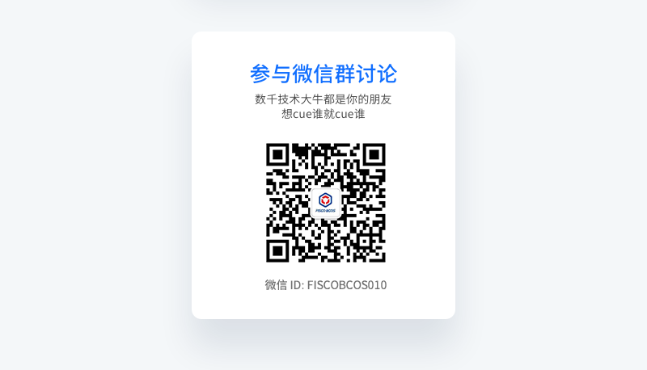
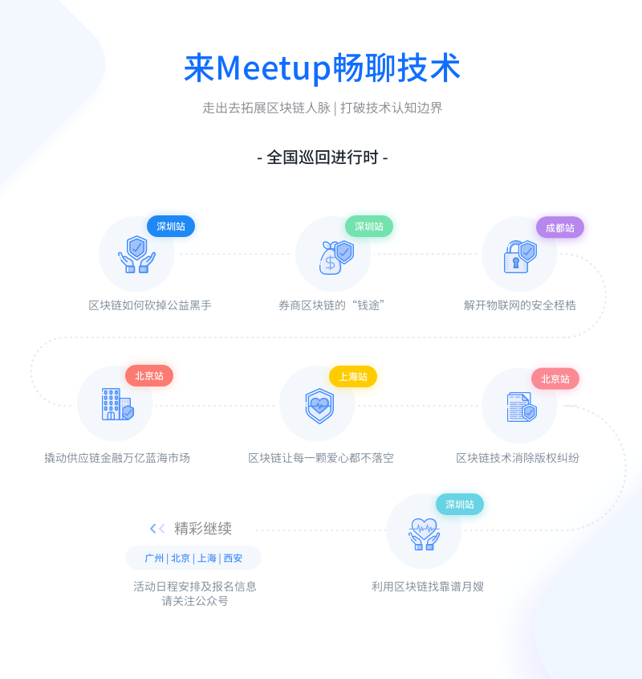
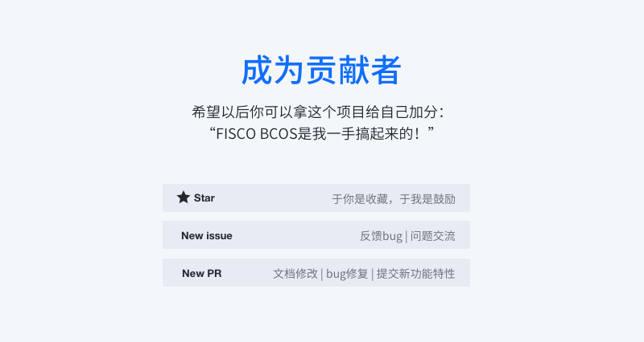

# 社区资源和更多开源工具

FISCO BCOS是国内企业主导研发、对外开源、安全可控的企业级金融联盟链底层平台。由金融区块链合作联盟（深圳）（简称：金链盟）成立的开源工作组协作打造，工作组成员包括博彦科技、华为、深证通、神州信息、四方精创、腾讯、微众银行、亦笔科技和越秀金科等金链盟成员机构。

## FISCO BCOS社区资源

- [Github主页](https://github.com/FISCO-BCOS/FISCO-BCOS/tree/master-2.0)  
- [技术文档](https://fisco-bcos-documentation.readthedocs.io)

- [深度解析系列文章](http://mp.weixin.qq.com/mp/homepage?__biz=MzA3MTI5Njg4Mw==&hid=2&sn=4f6d7251fbc4a73ed600e1d6fd61efc1&scene=18#wechat_redirect) 
- [贡献代码](https://mp.weixin.qq.com/s/_w_auH8X4SQQWO3lhfNrbQ)
- [反馈问题](https://github.com/FISCO-BCOS/FISCO-BCOS/issues)
- [应用案例集](https://mp.weixin.qq.com/s/cUjuWf1eGMbG3AFq60CBUA)

## 更多开源工具

- **FISCO BCOS企业级金融联盟链底层平台**: [GitHub](https://github.com/FISCO-BCOS/FISCO-BCOS/tree/master-2.0) 、[Gitee](https://gitee.com/FISCO-BCOS/FISCO-BCOS/tree/master-2.0) 、 [文档](https://fisco-bcos-documentation.readthedocs.io/zh_CN/latest/index.html) 
- **WeBASE 区块链中间件平台**：[GitHub](https://github.com/WeBankFinTech/WeBASE) 、 [Gitee](https://gitee.com/WeBank/WeBASE) 、  [文档](https://webasedoc.readthedocs.io/) 
- **WeIdentity 基于区块链的实体身份标识及可信数据交换解决方案**: [GitHub](https://github.com/WeBankFinTech/WeIdentity) 、 [Gitee](https://gitee.com/WeBank/WeIdentity) 、 [文档](https://weidentity.readthedocs.io/) 
- **WeDPR 即时可用，场景式隐私保护高效解决方案套件和服务**：[GitHub](https://github.com/WeBankBlockchain/WeDPR-Lab-Core) 、 [Gitee](https://gitee.com/WeBankBlockchain/WeDPR-Lab-Crypto) 、 [文档](https://wedpr-lab.readthedocs.io/) 
- **WeCross 区块链跨链协作平台**: [GitHub](https://github.com/WeBankBlockchain/WeCross) 、 [Gitee](https://gitee.com/WeBank/WeCross) 、 [文档](https://wecross.readthedocs.io/) 
- **Truora 可信预言机服务**：[GitHub](https://github.com/WeBankBlockchain/Truora) 、 [Gitee](https://gitee.com/WeBankBlockchain/Truora) 、  [文档](https://truora.readthedocs.io/) 
- **webankblockchain-liquid（简称WBC-Liquid） 智能合约编程语言软件**：[GitHub](https://github.com/WeBankBlockchain/liquid) 、 [Gitee](https://gitee.com/WeBankBlockchain/liquid) 、  [文档](https://liquid-doc.readthedocs.io/)
- **WeBankBlockchain-Data 数据治理通用组件**：
    - Data-Stash 数据仓库组件： [GitHub](https://github.com/WeBankBlockchain/Data-Stash) 、 [Gitee](https://gitee.com/WeBankBlockchain/Data-Stash) 、  [文档](https://data-doc.readthedocs.io/zh_CN/latest/docs/WeBankBlockchain-Data-Stash/index.html)
    - Data-Export 数据导出组件： [GitHub](https://github.com/WeBankBlockchain/Data-Export) 、 [Gitee](https://gitee.com/WeBankBlockchain/Data-Export) 、  [文档](https://data-doc.readthedocs.io/zh_CN/latest/docs/WeBankBlockchain-Data-Export/index.html)
    - Data-Reconcile 数据对账组件：  [GitHub](https://github.com/WeBankBlockchain/Data-Reconcile) 、 [Gitee](https://gitee.com/WeBankBlockchain/Data-Reconcile) 、  [文档](https://data-doc.readthedocs.io/zh_CN/latest/docs/WeBankBlockchain-Data-Reconcile/index.html)
- **WeBankBlockchain-Governance 多方治理协作组件**：
    - Governance-Account 账户治理组件： [GitHub](https://github.com/WeBankBlockchain/Governance-Account) 、 [Gitee](https://gitee.com/WeBankBlockchain/Governance-Account) 、  [文档](https://governance-doc.readthedocs.io/zh_CN/latest/docs/WeBankBlockchain-Governance-Acct/index.html)
    - Governance-Authority 权限治理组件：[GitHub](https://github.com/WeBankBlockchain/Governance-Authority) 、 [Gitee](https://gitee.com/WeBankBlockchain/Governance-Authority) 、  [文档](https://governance-doc.readthedocs.io/zh_CN/latest/docs/WeBankBlockchain-Governance-Auth/index.html)
    - Governance-Key 私钥管理组件： [GitHub](https://github.com/WeBankBlockchain/Governance-Key) 、 [Gitee](https://gitee.com/WeBankBlockchain/Governance-Key) 、  [文档](https://governance-doc.readthedocs.io/zh_CN/latest/docs/WeBankBlockchain-Governance-Key/index.html)
    - Governance-Cert 证书管理组件：[GitHub](https://github.com/WeBankBlockchain/Governance-Cert) 、 [Gitee](https://gitee.com/WeBankBlockchain/Governance-Cert) 、  [文档](https://governance-doc.readthedocs.io/zh_CN/latest/docs/WeBankBlockchain-Governance-Cert/index.html)
- **WeEvent 基于区块链的分布式事件驱动架构**：[GitHub](https://github.com/WeBankFinTech/WeEvent) 、 [Gitee](https://gitee.com/WeBank/WeEvent) 、  [文档](https://weevent.readthedocs.io/)
- **WeBankBlockchain-SmartDev 区块链应用开发工具**：
    - SmartDev-Contract 智能合约库组件：[GitHub](https://github.com/WeBankBlockchain/SmartDev-Contract) 、 [Gitee](https://gitee.com/WeBankBlockchain/SmartDev-Contract) 、  [文档](https://smartdev-doc.readthedocs.io/zh_CN/latest/docs/WeBankBlockchain-SmartDev-Contract/index.html)
    - SmartDev-SCGP 合约编译插件：[GitHub](https://github.com/WeBankBlockchain/SmartDev-SCGP) 、 [Gitee](https://gitee.com/WeBankBlockchain/SmartDev-SCGP) 、  [文档](https://smartdev-doc.readthedocs.io/zh_CN/latest/docs/WeBankBlockchain-SmartDev-SCGP/index.html)
    - SmartDev-Scaffold 应用开发脚手架：[GitHub](https://github.com/WeBankBlockchain/SmartDev-Scaffold) 、 [Gitee](https://gitee.com/WeBankBlockchain/SmartDev-Scaffold) 、  [文档](https://smartdev-doc.readthedocs.io/zh_CN/latest/docs/WeBankBlockchain-SmartDev-Scaffold/index.html)

## 加入FISCO BCOS社区

