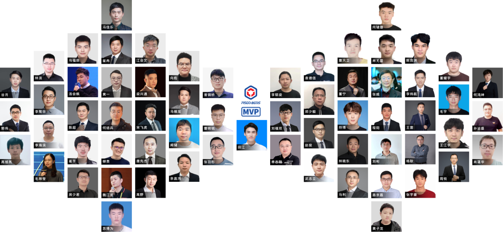

## MVP

**2023年度 | FISCO BCOS MVP榜单**

作者：小助手

为了鼓励为开源社区贡献高质量技术内容的意见先锋与意见领袖，开源社区开放FISCO BCOS MVP认定，截止2023年，开源社区共认定63位MVP 。

这些优秀的贡献者或是将FISCO BCOS技术落地到各领域应用中，助力产业数字化，或是在多渠道布道，将开源社区精神传播到更远的地方。

下面，让我们一起来认识这些技术的践行者、社区的布道者。

