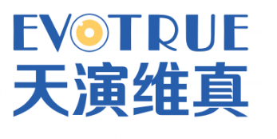

##  合作伙伴

**FISCO BCOS 合作伙伴**

作者：小助手

为了更好地推动区块链落地产业，为行业培育更多专业人才，助力区块链生态蓬勃发展，金链盟FISCO BCOS合作伙伴计划面向业界长期招募“产业应用合作伙伴”、“人才培育合作伙伴”与“生态发展合作伙伴”。

产业应用合作伙伴旨在助力区块链技术更好落地应用，推动区块链产业发展；人才培育合作伙伴将与FISCO BCOS开源社区共同携手，基于FISCO BCOS开源区块链技术，开展课程研发、人才培育与人才认证等工作，助力共建区块链人才培育体系，为产业发展提供专业技能人才；生态发展合作伙伴将与FISCO BCOS开源社区共建区块链开源生态，以坚实的基础科技支撑引领产业高质量发展。

自FISCO BCOS合作伙伴计划启动以来，有众多伙伴踊跃申请。截止2023年通过认证的金链盟FISCO BCOS合作伙伴共计50家（35家产业应用合作伙伴、13家人才培育合作伙伴、2家生态发展合作伙伴），为推动FISCO BCOS落地产业应用，助力区块链产业发展发挥重要作用。
认证合作伙伴公示如下，欢迎大家添加小助手【FISCOBCOS010】了解并报名加入计划。

### FISCO BCOS产业应用合作伙伴

（下列根据公司名称首字母排序）

**北京版权家科技发展有限公司**

北京版权家科技发展有限公司携手FISCO BCOS提供数字版权服务，开发的版权区块链系统联合版权监管机构、司法机构、国家授时中心、CA等提供版权确权、盗版监测、版权维权以及版权交易等一站式版权综合服务，实现创作即确权、使用即授权、发现即维权！

**北京众享比特科技有限公司**

北京众享比特科技有限公司成立于2014年7月，是国内首批从事区块链底层平台和应用案例开发的技术驱动型公司之一，基于FISCO BCOS为国内外众多客户提供区块链产品和综合解决方案服务。
众享比特是国家高新技术企业、北京市“专精特新”中小企业、2021北京市知识产权示范单位，获得2022/2021北京民营企业中小百强、2021/2020/2019毕马威中国领先金融科技50企业、2020/2019中关村瞪羚企业等荣誉。

**广电运通集团股份有限公司**

广电运通创立于1999年，隶属于广州无线电集团，是国有控股的高科技上市企业（证券代码:002152），主营业务覆盖智能金融、公共安全、交通出行、政务、大文旅、新零售及教育等领域，携手FISCO BCOS为全球客户提供具有竞争力的智能终端、运营服务及大数据解决方案。

公司从国内金融自助设备起步，凭借多年来积累的场景落地能力、技术研发、供应链等优势，贯彻新发展理念，聚焦金融科技和城市智能两条主线，在智能金融、智能交通、智能安全、智能便民等领域，以科技赋能传统产业升级。在海外市场，公司已建立9大全球分支机构，产品及服务已进入全球100多个国家和地区。面对新一轮科技浪潮，广电运通将继续加快区块链、人工智能、大数据、物联网等前沿信息技术与实体经济的深度融合，为建设智慧大湾区和“数字中国”贡献力量。

**广州市一链区块链科技有限公司**

广州市一链区块链科技有限公司专注于区块链技术产品与行业应用解决方案，拥有软著专利10余项，成功应用FISCO BCOS于政企 “审计监管”场景，上线“区块链数据防篡改平台”。
平台致力于“让天下的数据可信，没有造假”，已成功落地广汽本田、招商高速公路、安居宝等客户的审计监管场景。

**虎彩集团有限公司**

虎彩集团有限公司成立于1989年，是一家集数字印刷、原浆啤酒、智慧婚拍三大业务板块于一体的集团企业，旗下拥有数十家成员企业，涵盖虎彩印艺、泰山原浆啤酒、鲜檬智慧婚拍三大品牌。总部位于东莞国家级高新技术开发区松山湖。 

基于公司数字化和工业互联网战略，虎彩于2020年成立虎彩区块链创新应用中心，将区块链技术发展为公司工业互联网五大核心能力之一。基于FISCO BCOS，虎彩构建了包含从营销、物流、商城到内容的大量产业区块链应用，包括小虎智数营销、运力链、兑换商城、内容生态平台、统一交易结算平台和印刷链等平台，已广泛应用在虎彩实际业务中，服务超百万的合作伙伴和用户。

**济南泉链海沃数字科技有限公司**

济南泉链海沃数字科技有限公司是一家专注于RegTech(监管科技)细分领域的高新技术企业，由区块链领域知名学者、工信部认证的区块链技术专家以及金融科技领域人才组建，是国内首批进入政府试点目录的商用区块链公司之一，是航天信息、人民在线、山东数字出版等大型企业的区块链重点合作商。

公司携手FISCO BCOS，提供一站式区块链应用解决方案，已推出链联金服平台、防篡改对比审查系统、专项资金监管、区块链超融合一体机、共享单车治理、社区数字化防疫、分布式大数据共享等产品，获得国内多项区块链赛事大奖。

**价值互联（广州）区块链科技有限责任公司**

价值互联（广州）区块链科技有限责任公司（简称“价值互联”或“Value++”），成立于2017年，专注于区块链相关技术、产品的研发和销售，通过打造基于区块链技术的数据交换和流通平台，融合区块链、隐私安全计算、云计算、人工智能等先进技术，构建企业间数据交换、交易、流通和共享平台，解决企业数据互信和数据的自由流通和交换，激活企业沉睡数据，实现数据聚合升华，帮助企业迈入DT智能化时代。

**江苏安凰领御科技有限公司**

江苏安凰领御科技有限公司成立于2017年8月，公司聚焦于区块链各应用场景，携手FISCO BCOS提供物联网安全服务、区块链产品、可信安全服务能力输出等多项解决方案与服务。致力于成为行业领先的区块链解决方案与服务提供商，助力政府、企业数字化转型。

安凰领御于2020年11月获得了国家网信办区块链备案企业称号，2021年5月成功入选IDC区块链数字存证领域创新者。

**京北方信息技术股份有限公司**

京北方信息技术股份有限公司[股票代码：002987]作为领先的金融科技服务提供商，向以金融机构为主的客户提供软件与信息技术服务，为企业数字化建设聚势赋能。公司以大数据、云计算、人工智能、区块链、隐私计算及5G应用为引领，将前沿科技与金融业务场景深度耦合，成为行业发展的新引擎。

京北方基于FISCO BCOS打造了通用的区块链公共服务平台，平台拥有区块链分布式账本、加密算法、数据存储、网络协议、共识机制、智能合约、应用API接口等核心模块。该平台支持业务信息上链、金融交易、合同文件和金融数据存证服务，优化业务流程，提升系统运行效率。平台支持金融业应用，可用于供应链金融、票据管理、跨境结算、工资代发等场景。利用加密算法、公私钥体系、共识算法、时间戳等技术，平台可出具金融区块链证书，提升金融安全，相关发明专利已获得国家知识产权局专利授权。

**科大讯飞股份有限公司**

科大讯飞股份有限公司是一家专业从事智能语音及语言技术，人工智能技术研究，软件及芯片产品开发，语音信息服务及电子政务系统集成的国家级骨干软件企业。2008年，科大讯飞在深圳证券交易所挂牌上市。

科大讯飞致力于面向政府、行业和用户，构建一套基于区块链的数字身份、公共数据共享、智能感知的新型区块链基础设施，实现对数据要素的全面互联，解决数据跨地域、跨行业、跨系统的可信流通，推动数字经济变革。公司携手FISCO BCOS，提供区块链基础设施平台和区块链应用解决方案，已推出开放联盟链服务、存证溯源平台、版权保护系统、供应链金融融资平台等。

**南京安链数据科技有限公司**

南京安链数据科技有限公司是国内专业、领先的区块链公司，研发方向覆盖区块链、大数据分析等领域，已成功应用FISCO BCOS于物流、金融、溯源、存证等多业务场景，大幅降低区块链应用层开发成本。

**厦门哈希科技有限公司**

厦门哈希科技有限公司成立于2018年4月，隶属于北京哈希数道集团，是中关村北京绿色碳汇研究院理事单位，是致力于碳汇全产业链及生态价值开发与服务的绿色生态科技公司。

公司坚持自主创新、掌握自主核心技术，以GEP为切入点，基于区块链底层平台FISCO BCOS，先后打造多个国家级、省级、市级生态价值开发及碳中和体系建设，通过林业碳汇、碳普惠等串联碳汇生态产业链，助力数字化转型，赋能碳市场交易，拓展“两山”转化通道，引领绿色低碳产业体系。将数字化的“绿水青山”变成真正价值的“金山银山”，为各地方政府职能机构及金融资源体提供全链条生态价值服务。

**熵链科技（福建）有限公司**

熵链科技（福建）有限公司是一家专注于产业数字化应用的综合服务商。公司于2017年率先布局区块链技术，搭建领先的区块链产业生态服务平台，为产业数字化发展提供先进的区块链解决方案。针对区块链供应链金融、农业溯源、分布式商业、数据存证与数据资产化等领域拥有自主的技术解决方案。熵链科技作为福建省区块链协会首任会长单位以及BSN福建省区块链主干网指定唯一运营商，汇聚全球领先区块链产业资源，具有专业的实践应用和市场拓展服务能力。

**上海久誉软件系统有限公司**

上海久誉软件系统有限公司成立于2013年，是由上海久事公司和上海公共交通卡股份有限公司共同投资组建的一家专业从事软件开发和系统集成的企业。

携手FISCO BCOS，上海久誉围绕支付清算、消费交换两大核心技术，在卡基业务、移动支付、城市公交“一卡通”、“一票换乘”资金清分清算、智能终端、数据服务等行业领域拥有一流技术；公司集行业知识、应用开发、系统集成、运营管理、项目实施和增值服务为一体，坚持“自主创新、自有品牌、立足上海、辐射周边”的发展战略，在金融电子化、社会信息化等行业领域，为客户提供行业解决方案、系统集成服务及机具销售。公司在成立近5年时间内已获得二十三项项软件著作权和十七项软件产品认证证书。

**上海碳抵信息科技有限公司**

上海碳抵信息科技有限公司是一家专注于碳中和数字化的金融科技公司。公司长期深耕金融数字化服务业，在软件及小程序开发，数字化及运营管理等方面具备较强能力。

目前，公司战略聚焦于“碳中和数字化”与“协同低碳”，致力于通过SaaS平台为政府及企业提供快速便捷的碳减排、碳中和服务，以及助力碳普惠体系建设运营、低碳数据增信等多元服务。

基于区块链底层平台FISCO BCOS，公司打造了碳低链服务平台，为科技赋能低碳减排提供了新的实践探索思路。碳抵科技的合作伙伴包括多家低碳领域专业机构，服务客户包括多家大型公司以及多个大中型会议。

**上海旺链信息科技有限公司**

上海旺链信息科技有限公司成立于2016年，是高速成长的国家高新技术企业、国家工信部区块链重点实验室成员单位，总部位于上海，在宁波、合肥、长沙、西安、雅加达、新加坡设有分公司。2018年，荣登工信部赛迪区块链“中国区块链企业百强榜”；2020年，荣膺“亚洲创新企业Top10”；2022年，入选“2022中国产业区块链100强”。

旺链科技以数据中心运营、云计算为依托，自研云管平台和云操作系统，为全球客户提供前沿的高新技术解决方案，包括智慧农业、区块链溯源、供应链金融、工业互联网、边缘计算、元宇宙模型渲染、高速分布式存储、自治组织管理等多个应用场景，已成功服务包含航空、政府、金融、能源、农业、医疗、教育、房地产、快消和汽车等在内的数十个行业数百家客户。
旺链科技和FISCO BCOS一直保持良好的合作关系，基于FISCO BCOS研发了VoneBaaS区块链基础服务平台；公司也持续参与社区建设，多次荣登FISCO BCOS贡献榜单。

**上海新致软件股份有限公司**

上海新致软件股份有限公司成立于1994年，是国内领先的软件服务提供商。公司总部坐落于上海，在北京、深圳、大连、重庆、成都、贵安、武汉、东京等多地设立了分支机构。2020年12月，新致软件正式登陆A股科创板，使公司迎来新的发展篇章。

公司依托20多年服务金融行业的实践经验，基于云计算、大数据、人工智能、区块链四大基础实验室的研发能力，为金融客户提供包括渠道、核心、数据、管理等全面的信息化解决方案，满足金融客户实现智能化、安全合规、业务多样化等需求，连续多年在中国保险业、银行业IT解决方案市场份额中占据领先地位。同时，公司的相关产品及服务已广泛应用于电信、医疗、汽车等诸多领域，赢得包括中国太保、中国人寿、中国人保、交通银行、建设银行、中国银联、中国电信、上海汽车、复星集团等众多优质客户。

**上海信医科技有限公司**

上海信医科技有限公司，是坐落在上海区块链生态谷的医疗区块链与大数据领军企业，是国家卫健委及上海、山东、湖北、浙江、四川、江西等多省市医疗区块链的核心成员与技术支撑单位；也是多家企业及多个健康医疗大数据中心等主流平台的合作伙伴。

信医科技为多家医疗平台的建设提供FISCO BCOS区块链技术支持，包括“信医链电子病历夹应用”、“基于区块链的商业保险结算与审核支撑服务”、“基于区块链的中药饮片流转质量服务与监管平台”等。公司参与广州国家实验室、上海申康、国家健康医疗大数据（北方）中心多个专病库与科创大数据平台建设，覆盖近百个专病库。

**上海域乎信息技术有限公司**

上海域乎信息技术有限公司是一家以区块链技术为核心的高新技术企业，专注于区块链技术与数字资产服务，2018年通过工信部区块链系统功能测试，曾参与工信部物联网区块链蓝皮书和区块链技术安全标准编写。域乎应用FISCO BCOS实现农业数字化，确保数字农业主体身份和数据可信，助力企业、政府、银行等机构实现可信数据共享。

**深圳市瀚兰区块链地产有限公司**

深圳瀚兰区块链地产有限公司基于区块链帐本管理技术自主研发互联网平台兰房链，由成熟的区块链底层技术及海内外区块链专家团队提供技术支持，实现一种“非接触”式的可信赖的新型房地产商业模式，在房地产开发行业中建立信用及价值体系，立足数字经济，打造的房地产数字化运营管理SaaS工具，解决房地产开发中的痛点，为房地产行业上下游企业提质增效。

**中碳绿信科技（深圳）有限公司**

中碳绿信科技（深圳）有限公司成立于2018年5月17日，是中国碳中和发展集团旗下专注于以区块链赋能双碳经济的国家高新技术企业。

绿信科技为产业打造跨组织协同、驱动价值共识、提炼数字资产的金融级可信协同网络-绿信链。通过降低区块链技术的使用门槛与成本，促进全球更多企业和个体基于区块链建立数字信用，实现商业创新，连接绿色金融。

**深圳市新国都数字科技有限公司**

深圳市新国都数字科技有限公司成立于 2016 年，是上市公司新国都股份(300130) 旗下公司。新国都数科依托数字科技能力，形成了数字政企、数字征信、数字安全、数字用工四大核心业务板块，主要提供数据治理、数据产品、数据应用开发、数据资产运营、数据安全等服务。

新国都数科坚持以“数据资产运营商”为使命，以大数据、人工智能、区块链技术为核心，携手FISCO BCOS在区块链底层平台、隐私计算等领域开展合作，提供数据分析、平台技术、区块链产品和运营服务，为政府、金融机构、国有企业提供数字化服务综合解决方案，致力于为社会诚信体系建设做出贡献。

**数金公共服务（青岛）有限公司**

数金公共服务（青岛）有限公司是一家数字金融科技企业，是数字人民币试点落地机构和标准组成员企业，业务涉及绿色低碳及数字金融等领域。公司深度参与数字人民币试点推广过程中的技术研发、产品创新、运营拓展、资源协同以及生态建设等服务，为政府、企业以及金融机构接入数字人民币系统、开展数字人民币活动提供“场景+技术+服务”支持，推动数字金融科技生态构建和产业升级。

公司携手FISCO BCOS 围绕个人碳普惠领域推出了场景化解决方案，包括利用区块链做数据的可信存证，解决数据的多方信任问题；链接碳普惠的各参与方，构建一个开放、共创、可信的碳普惠联盟链生态。

**数字广东网络建设有限公司**

数字广东网络建设有限公司作为广东省数字政府建设运营中心和中国电子二级机构，坚持数字政府公益性、基础性、平台性、保障性定位，聚焦数字政府公共服务、基础设施、平台建设、安全防护等主责主业，有力支撑广东省经济社会高质量发展，有力推进治理体系和治理能力现代化，为积极探索中国式现代化的广东路径作出了重要贡献。公司目前拥有近3000名员工，其中技术类人员占比超过七成。

数字广东公司现已建成省市一体化的政务云平台、一网共享平台和公共支撑平台，持续夯实数字政府基础底座，并打造了粤省事、粤商通、粤政易、广东政务服务网、“一网统管”粤治慧平台、粤公平等一系列数字政府改革建设重要成果，全面支撑广东数字政府改革建设事业走在全国前列，在改善民生服务、优化营商环境、提升政府治理能力现代化等方面发挥了重要作用。数字广东将携手FISCO BCOS持续探索区块链在智慧政务领域的应用场景。

**四川虹信软件股份有限公司**

四川虹信软件股份有限公司是四川长虹旗下旗舰企业之一，历经十余年高速发展，成为拥有四大核心能力的高新技术企业，专注于智慧企业、智慧城市、军民融合三大业务领域前沿IT技术研发、咨询与实施。借助在智能家居领域的优势，长虹携手FISCO BCOS建立可信互联物联网，虹信软件承担身份认证模块，利用FISCO BCOS证书认证体系，完善物联网中群组/节点准入验证机制，为跨品牌智能家居场景提供可信数据基础。

**四川万物数创科技有限公司**

四川万物数创科技有限公司是具备科技创新能力的新经济企业。企业核心产品CoT Network万物共算网络是自主可控的多元弹性网络计算系统，融合区块链分布式计算以及边缘计算技术，为各行业和场景提供区块链系统及应用、多元计算软硬件产品、区块链服务、以及行业整体解决方案的咨询和实施。目前，四川万物基于FISCO BCOS落地了社区智慧化治理和服务、智慧党建等方向应用案例案例。

公司核心团队由海外归国专家及世界500强企业管理者组成，拥有多项知识产权和优质合作伙伴。

**泰康养老保险股份有限公司**

泰康养老保险股份有限公司是由泰康人寿保险股份有限公司和泰康资产管理有限责任公司共同出资成立的全国性、股份制专业养老保险公司。业务范围涵盖团体保险、企业年金、个人养老保险三大领域。目前在全国已成立了23家分公司及9家企业年金中心。

泰康养老作为国内五家专业养老保险公司之一，始终奉行“专业化、规范化、国际化”的发展战略，携手泰康资产，依托泰康人寿十七年丰富的员工福利及补充养老保险管理经验，坚持“以客户为中心、以价值为导向，做强员福、做大年金”的经营策略，致力于为广大企业和企业员工提供团体寿险、意外伤害险、短期健康险、团体养老险、企业年金、个人养老险全方位的员工福利计划和一站式服务，用专业的服务做市场上最好的企业员工福利解决方案的好管家。泰康养老已基于FISCO BCOS落地多个应用，未来将继续携手FISCO BCOS针对保险健康管理场景探索更多解决方案。

**万高信息科技有限公司**

万高成立于2014年，于2015年组建珠海分公司，为澳门提供长期、稳定、充足的人力资源保障，万高团队按不同业务划分，专责专项管理。技术研发团队稳定且项目经验丰富，旨在为客户提供更好的技术建议和开发服务。

目前公司已接受FISCO BCOS专业培训的人员有8人，并计划让更多的人员接受FISCO BCOS的专业培训。万高专注移动及数据应用程式开发，2019年疫情期间，成功采用FISCO BCOS技术开发澳门健康码供澳门政府应对疫情，并助力粤澳两地健康码在2020年5月实现跨境互认。迄今，粤澳健康码跨境互认系统已服务上亿人次通关。

**武汉链动时代科技有限公司**

武汉链动时代科技有限公司携手FISCO BCOS解决区块链应用开发“最后一公里”问题，研发的“inBC区块链存证服务系统”对链上数据进行格式化协同，实现区块链存证一键触达；”Falcon零代码开发平台” 通过图形化拖拽、参数配置等即可高效完成系统搭建和部署。

**武汉领晟旺链科技有限公司**

武汉领晟旺链科技有限公司成立于2018年11月，是武汉市区块链协会秘书长单位，其前身为菲旺科技区块链事业部。公司是国内领先的区块链+智慧城市数权服务提供商，围绕“智链城市”建设，在政务、物联网、数据安全等方面打造并落地了一系列产品及解决方案，其中基于FISCO BCOS开发的“链税通” 是全国税收治理领域第一个区块链项目；“明厨亮灶区块链物联网平台”被评选为工信部2020年新型信息消费示范项目。

同时，公司获批成为工业和信息化重点领域（区块链）人才能力评价机构，目前已获得区块链相关软著15项，已申报了8项专利。

**易宝支付有限公司**

易宝支付成立于2003年，是首批获得中国人民银行《支付业务许可证》的第三方支付机构。2006年易宝创立B端行业支付模式，为企业客户提供集技术、产品、服务为一体的一站式数字化交易服务解决方案。目前，易宝已累计服务超过百万家商户，覆盖航空、旅游、零售、能源、汽车、互联网3.0、跨境、金融、政务、本地生活等众多行业头部客户，业务规模位居行业前列。

公司基于FISCO BCOS孵化了极速不卡顿的交易级联盟链——亿链，亿链首创支付节点合约规则，并引入公信力节点，可保障数字资产永久留存、可信流通。通过打造聚焦Web3.0经济系统的技术底座，持续为企业客户提供极速、安全、稳定的链上交易解决方案，构建生态共融的开放联盟链，引领Web3.0可信生态的升级跃迁。

**易联众信息技术股份有限公司**

易联众信息技术股份有限公司是国内民生信息服务领域上市公司。自2000年成立以来，易联众牢记“让天下没有难过的人生”的企业使命，以大数据为驱动，重点围绕“医疗保障、卫生健康、人力资源和社会保障”等民生领域，提供全方位的整体解决方案和产品与技术服务体系。公司充分利用大数据、区块链及人工智能等技术，持续研发并提升产品创新能力，推动主营业务数字创新。

**浙江天演维真网络科技股份有限公司**

浙江天演维真网络科技股份有限公司是全国领先的乡村振兴数字化服务整体解决方案提供商，成功应用FISCO BCOS于农业全过程溯源，目前正在融合区块链与物联网技术研发智慧农业云平台、探索区块链+农业金融应用场景。

**中国铁塔股份有限公司**

中国铁塔股份有限公司是由国务院推动成立的国有大型通信基础设施服务企业。主要从事通信铁塔等基站配套设施和高铁地铁公网覆盖、大型室内分布系统的建设、维护和运营，同时依托独特资源面向社会提供信息化应用和智能换电、备电、充电等能源应用服务，是我国移动通信基础设施建设的“国家队”和5G新基建的“主力军”，是全球最大通信基础设施服务商。
中国铁塔入选2019年《财富》全球未来50强（排名第22位）和全球数字经济100强（排第71位），2018-2020连续三年被评为中国证券金紫荆奖“最具投资价值上市公司”，在第十一届中国证券金紫荆奖中荣获“十四五最具投资价值上市公司”特别大奖。

中国铁塔聚焦自主可控区块链技术研发，具备FISCO BCOS开发能力，正在基于FISCO BCOS开源技术建设区块链管理平台。中国铁塔也致力于区块链应用研究，开展的“区块链+税务”的研究成果获得国资委主办的首届“国企数字场景创新专业赛”大赛一等奖，业务模式受到社会各界关注与国内外权威媒体报道。

**中金数据（武汉）超算技术有限公司**

中金数据（武汉）超算技术有限公司成立于2016年，位于武汉市国家网络人才与创新产业基地，是一家主要以数据中心外包与运维服务为基础，对外开展云计算、区块链、网络与信息安全、超级计算、系统集成等信息技术服务业务的高新技术企业，同时，也是武汉市科技“小巨人”企业、武汉市“瞪羚”企业，并获得武汉市大数据企业20强、武汉市软件与信息技术百强企业等资质荣誉。

公司携手FISCO BCOS提供国内领先的安全数据底座和可信数据服务。公司基于云计算和区块链底层技术搭建的中金数据云链平台，面向用户提供纵贯数据中心、云计算、大数据、区块链的开发、部署、应用的一体化服务，被评为湖北省发展和改革委员会2022年数字经济试点示范项目、入选“2022年湖北省区块链十大优秀应用案例”。

### FISCO BCOS人才培育合作伙伴

（下列根据公司名称首字母排序）

**巴比特学院**

巴比特是国内领先的区块链信息与技术服务商,已发展成集资讯内容、线下活动、培训、孵化器、投资和区块链技术落地应用于一体的生态体平台。巴比特学院是巴比特旗下教育培训品牌，携手FISCO BCOS打造区块链人才高地，向社会输送优质区块链人才。

**北京柏链道捷教育科技有限公司**  

柏链教育是国内领先的区块链及数字化教育人才服务机构，入选工信部重点领域人才评价和能力提升任务承担单位，携手FISCO BCOS推出《区块链工程技术系列认证课程》，学员通过认证考试可获得国家级区块链技术证书。

**北京智谷星图教育科技有限公司**

智谷星图是一家具有国际化视野的前沿科技产教融合机构，提供区块链技术解决方案的同时，围绕前沿科技（区块链、人工智能等技术）为高校提供实验室共建、专业共建和产业学院共建等服务。

智谷星图的团队成员多数来自美国硅谷，拥有成熟的新技术研发能力，包括区块链底层技术积累。同时，产品及教研团队则拥有丰富的教育行业从业经验，顾问团队来自斯坦福大学、卡耐基梅隆大学等知名高校。依托于强大的硅谷产学研资源及全球产业合作方，智谷星图紧扣产业发展趋势，用新技术推动高等教育的进步，力求培养具有国际化视野及实践能力的综合型人才。

**广东中创智慧科技有限公司**

广东中创智慧科技有限公司成立于2018年，从事数字经济产教融合的业务。公司是广东省发改委评定的产教融合型企业、广东省产教融合促进会副会长单位，以数字经济产教融合专家为定位。中创智科通过自身优势资源，以及强大的整合能力，发展数字经济产教融合的业务，为广东省各类院校的专业建设和人才培养提供最优产教融合解决方案。包括：区块链、大数据、人工智能、信创、网络安全、工业互联网六个领域，与广东省今年7月8日发布的《广东省数字经济发展指引》中重点发展的数字经济新兴产业高度契合。

中创携手FISCO BCOS支持了2022年度教育部区块链国家级培训计划项目，支持了深圳市人社局区块链应用操作员赛项，同时，也是广东省人社厅区块链应用操作员赛项唯一技术支持单位，广东省教育厅区块链技术应用赛项唯一技术支持单位。

**教链科技（深圳）科技有限公司**

教链科技（深圳）有限公司是国际领先的区块链教培产品及应用解决方案供应商，致力于构建数字化时代的职业教育培训基础设施。教链科技专注于区块链人才发展的专业服务，提供创新课题申报、学科专业共建、区块链培训课程、国家区块链人才技能等级认证培训、实训游学营和师资培训等服务。

秉着“让每位区块链从业者都拥有中高级技能职称”的愿景，教链科技已经发布了《区块链应用操作员》职业培训教材，承办了国内多期区块链应用操作员职业培训，其区块链在线实训平台已通过国家工业和信息化部备案。教链科技拥有目前国内最大的区块链应用操作考试题库以及培训课程资源，基于FISCO BCOS开发的应用系统已对超过8000件的区块链课程进行版权上链保护，也是广东、海南、浙江、上海、安徽等全国多个省市的区块链职业认证合作伙伴。

**链人国际咨询（北京）有限责任公司** 

链人国际服务G端、B端、C端，是中国领先的区块链产业人才综合服务商，三部委区块链人才认证服务商，工信部人才交流中心区块链产业人才研究所运营方，拥有院士科学家人才库、从业者人才库和师资人才库。已在高校公开课、区块链开发工程师（周末班）、《企业级联盟链原理及应用》线上课中培训FISCO BCOS区块链。

**南京秉蔚信息科技有限公司**

南京秉蔚信息科技有限公司聚焦区块链、人工智能、大数据新工科专业工程实践能力建设。与全球知名产业企业合作，以岗位技能需求为设计出发点，为高校提供泛IT领域的专业课程资源库，以真实商业案例实现过程为蓝本，为院校提供案例数据、实验实训手册以及实验实训环境，并和高校教师组成混编师资为学生提供专业技能实训教学服务，是“互联网+教育”领域的综合人才培养解决方案提供商，助力高校建设产学融合的新工科教育新生态。

公司坚持以赛促教、以赛促学，积极参与高校相关赛事。2023年联合微众区块链作为技术支持单位支持“中国大学生计算机设计大赛-区块链应用与开发”赛道，围绕FISCO BCOS及其周边组件进行赛道命题。目前公司已与全国100余所高校有过深度合作。

**前海丰创区块链（深圳）有限公司**

丰创区块链成立于2016年12月，是国内较早成立并高速发展的区块链培训、咨询服务公司，目前公司具有完备、高效、成熟的运营团队，是国内最专业、最权威的区块链教育和运营团队之一，是国内首个官方（国家工信部人才交流中心）指定授权的区块链人才提升机构。

目前公司已培养了首期区块链行业产品经理、区块链金融行业工程师等行业领军人才，学员遍及山东、山西、河南、河北、安徽、江苏、浙江、广东、湖南、湖北、北京、上海等25个省份（直辖市），涵盖传统行业中高层管理者、区块链爱好者、应届大学生等 。

**深圳点宽网络科技有限公司**

深圳点宽网络科技有限公司是一家致力于协助高校实现交叉学科建设的教育科技公司，主要在金融科技领域协助高校培养“金融+科技”的复合人才。公司为高校相关专业提供课程、实训系统、专业建设解决方案以及共建金融科技产业学院。点宽以自主研发的课程产品和实训系统产品为依托，目前已自研金融科技相关课程超400个小时，全自主研发行业实训系统6套，协助高校的经济管理、数学统计、金融工程和金融数学等专业实现金融科技人才培养服务。

公司携手FISCO BCOS，落地了面向高校区块链专业人才培养的BCW v1.0区块链编程实践平台，用于区块链专业知识学习和智能合约编程实践。创新项目CERX研学资源交换平台正在研发中，该平台是一个基于FISCO BCOS区块链技术的分布式研学资产交换网络，其目标是在高校之间创建一个数据、算法模型、论文和课程的数据资产流转平台，公司首席架构师曾凭对社区的贡献荣获FISCO BCOS年度MVP。

**深圳市火链教育科技有限公司**

深圳市火链教育科技有限公司，简称”火链科技“，是一家专注于区块链行业生态构建、输出区块链核心技术及教育的公司，拥有国内领先的行业科技与教学水平。

公司主要的产品与业务包括，为政府提供区块链技术支持与咨询服务，构建区块链生态结构，赋能地方经济；为企事业单位输出技术服务，主导或参与DApps开发；与全国各大高校合作建立区块链学院，开设区块链专业，并面向社会招生。

**深圳职业技术学院**

深圳职业技术学院2019年起开办区块链技术应用专业，并面向全国招生，以FISCO BCOS国产开源区块链为技术主线，成立区块链与数字经济研究所和FISCO BCOS区块链人才培育SIG，深化区块链部署运维、智能合约编程、工程项目开发等能力的培养，为区块链产业输送高素质技术技能人才。多名学生在国家及省市各类区块链比赛中获得10余项大奖，其中2名学生荣获FISCO BCOS年度MVP。

**腾讯教育腾实学院**

腾实学院是腾讯教育旗下的学院，提供全面、最新的教育人才培养解决方案，学院切实推动教育部关于“世界一流大学和一流学科”、“特色高水平高职学校和专业”建设的宏伟目标，涵盖区块链、人工智能、大数据等十大领域课程内容。去年开始，腾实学院与FISCO BCOS展开培训领域广泛合作。

**西南林业大学**

西南林业大学建设有云南省供应链管理区块链工程研究中心和云南省高校供应链管理区块链创新团队，承担了多项区块链领域的国家级项目和省部级重大项目，其研发的安全可控区块链基础服务平台“西林链”已在跨境贸易、数字烟叶、供应链和绿色食品溯源等多个领域进行应用。中心和团队携手FISCO BCOS提供区块链产品、技术研发和人才培养等服务，助力政府和企业的数字化转型。

“西林链”于2022年3月通过了国家网信办第七批境内区块链信息服务备案，2022年5月通过了中国电子技术标准化研究院“区块链系统功能测试”和中国合格评定国家认可委员会（CNAS）认证

### FISCO BCOS生态发展合作伙伴

**北京区块链技术应用协会**

北京区块链技术应用协会是中国首家区块链应用协会，于2016年正式发起成立，是依法在民政部门注册，在北京市投资促进服务中心指导成立的非营利性专业性社会组织。协会基于“政策引导、理论研究、场景应用、资本接入、技术实践“的全业务链整合原则，利用丰富的社会资源，与国内一流高校科研院所、国内外知名企业及核心会员单位共同构建政、产、学、研、用一体的区块链生态体系，旨在通过区块链集聚行业资源，跨界融合推进区块链发展，促进先进技术的创新与发展。
协会携手FISCO BCOS在区块链行业赛事、生态交流、人才培养等多方面开展合作，推动技术成果落地应用，营造产业发展良好生态，加快推动区块链蓬勃发展。

**四川省区块链行业协会**

四川省区块链行业协会是在四川省经济和信息化厅的指导下，在四川省民政厅登记注册成立的社会团体。协会成立旨在推动四川区块链与实体经济融合发展，加强行业企、事业单位和个人之间的合作与联系，加速区块链技术的应用，发展四川区块链产业、积极推动本土企业开拓国内外市场，并发挥协会的纽带作用，起到推进四川省区域内区块链产业的良好发展作用。

蜀信链是在四川省经济和信息化厅指导下，在四川省区块链行业协会组织下，由全省区块链相关从业与应用机构共同参与建设和运营的区域性区块链基础设施，目前已适配FISCO BCOS。协会将携手FISCO BCOS开源社区，通过多方协同共同打造合作共赢的区块链产业生态。
