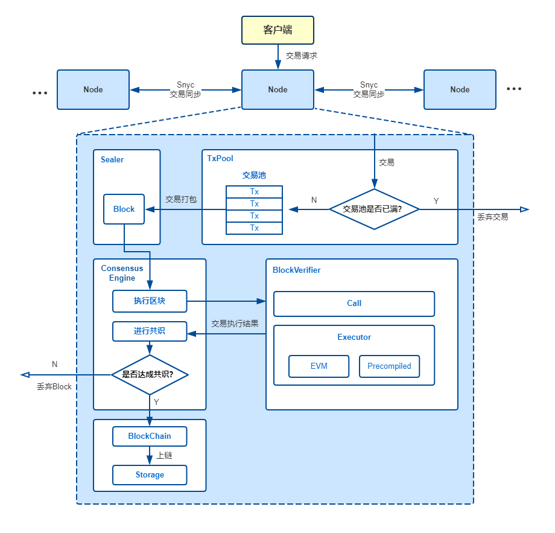

# 交易流

标签：``交易流`` ``架构``

----
## 1 总体方案

用户通过SDK或curl命令向节点发起RPC请求以发起交易，节点收到交易后将交易附加到交易池中，打包器不断从交易池中取出交易并通过一定条件触发将取出交易打包为区块。生成区块后，由共识引擎进行验证及共识，验证区块无误且节点间达成共识后，将区块上链。当节点通过同步模块从其他节点处下载缺失的区块时，会同样对区块进行执行及验证。

## 2 整体架构
整体架构如下图所示：

**Node**：区块节点

**TxPool**：交易池，节点自身维护的、用于暂存收到的交易的内存区域

**Sealer**：打包器

**Consensus Engine**：共识引擎

**BlockVerifier**：区块验证器，用于验证一个区块的正确性

**Executor**：执行引擎，执行单个交易

**BlockChain**：区块链管理模块，是唯一有写权限的模块，提交区块接口需要同时传入区块数据和执行上下文数据，区块链管理将两种数据整合成一个事务提交到底层存储

**Storage**：底层存储

主要关系如下：

 1. 用户通过操作SDK或直接编写curl命令向所连接的节点发起交易。
 2. 节点收到交易后，若当前交易池未满则将交易附加至TxPool中并向自己所连的节点广播该交易；否则丢弃交易并输出告警。
 3. Sealer会不断从交易池中取出交易，并立即将收集到的交易打包为区块并发送至共识引擎。
 4. 共识引擎调用BlockVerifier对区块进行验证并在网络中进行共识，BlockVerifier调用Executor执行区块中的每笔交易。当区块验证无误且网络中节点达成一致后，共识引擎将区块发送至BlockChain。
 5. BlockChain收到区块，对区块信息（如块高等）进行检查，并将区块数据与表数据写入底层存储中，完成区块上链。

## 3 方案流程

### 3.1 合约执行流程

执行引擎基于执行上下文（Executive Context）执行单个交易，其中执行上下文由区块验证器创建用于缓存暂存区块执行过程中执行引擎产生的所有数据，执行引擎同时支持EVM合约与预编译合约，其中EVM合约可以通过交易创建合约、合约创建合约两种方式来创建，其执行流程如下：

EVM合约创建后，保存到执行上下文的_sys_contracts_表中，EVM合约的地址在区块链全局状态内自增，从0x1000001开始（可定制），EVM合约执行过程中，Storage变量保存到执行上下文的c_(合约地址)表中。

预编译合约分永久和临时两种：(1) 永久预编译合约，整合在底层或插件中，合约地址固定；(2) 临时预编译合约，EVM合约或预编译合约执行时动态创建，合约地址在执行上下文内自增，从0x1000开始，至0x1000000截止，临时预编译合约仅在执行上下文内有效预编译合约没有Storage变量，只能操作表，其执行流程如下：

