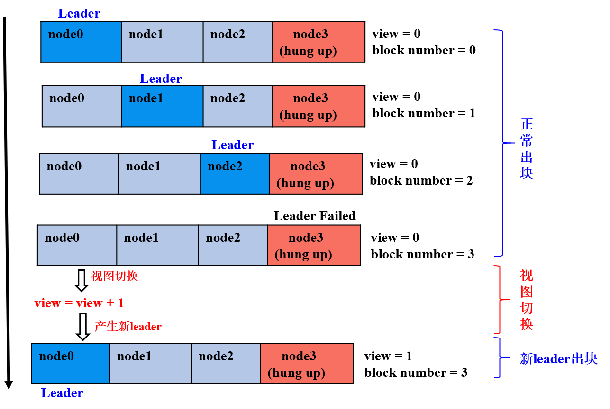
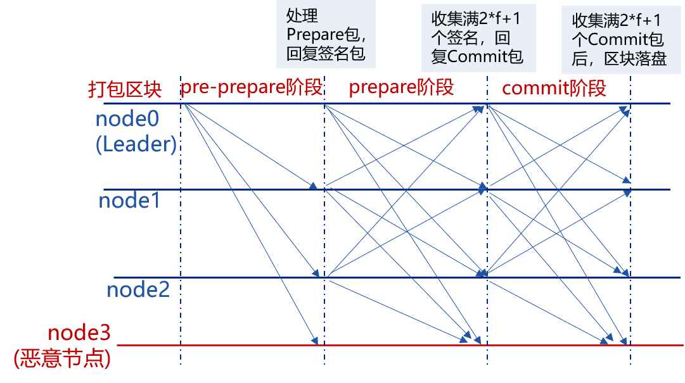
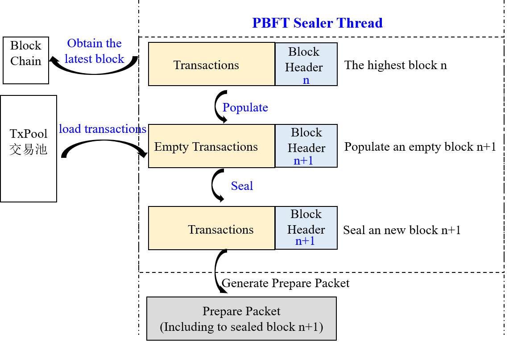

# PBFT基础流程

标签：``PBFT`` ``共识算法`` ``设计方案``

----

**PBFT**(Practical Byzantine Fault Tolerance)共识算法可以在少数节点作恶(如伪造消息)场景中达成共识，它采用签名、签名验证、哈希等密码学算法确保消息传递过程中的防篡改性、防伪造性、不可抵赖性，并优化了前人工作，将拜占庭容错算法复杂度从指数级降低到多项式级别，在一个由(3\*f+1)个节点构成的系统中，只要有不少于(2\*f+1)个非恶意节点正常工作，该系统就能达成一致性，如：7个节点的系统中允许2个节点出现拜占庭错误。

FISCO BCOS区块链系统实现了PBFT共识算法。


## 1. 重要概念

节点类型、节点ID、节点索引和视图是PBFT共识算法的关键概念。区块链系统基本概念请参考[关键概念](../../tutorial/key_concepts.md)。

### 1.1 节点类型

- **Leader/Primary**: 共识节点，负责将交易打包成区块和区块共识，每轮共识过程中有且仅有一个leader，为了防止leader伪造区块，每轮PBFT共识后，均会切换leader；

- **Replica**: 副本节点，负责区块共识，每轮共识过程中有多个Replica节点，每个Replica节点的处理过程类似；

- **Observer**: 观察者节点，负责从共识节点或副本节点获取最新区块，执行并验证区块执行结果后，将产生的区块上链。

其中Leader和Replica统称为共识节点。


### 1.2 节点ID && 节点索引

为了防止节点作恶，PBFT共识过程中每个共识节点均对其发送的消息进行签名，对收到的消息包进行验签名，因此每个节点均维护一份公私钥对，私钥用于对发送的消息进行签名，公钥作为节点ID，用于标识和验签。

> **节点ID** : 共识节点签名公钥和共识节点唯一标识, 一般是64字节二进制串，其他节点使用消息包发送者的节点ID对消息包进行验签


考虑到节点ID很长，在共识消息中包含该字段会耗费部分网络带宽，FISCO BCOS引入了节点索引，每个共识节点维护一份公共的共识节点列表，节点索引记录了每个共识节点ID在这个列表中的位置，发送网络消息包时，只需要带上节点索引，其他节点即可以从公共的共识节点列表中索引出节点的ID，进而对消息进行验签:

> **节点索引** : 每个共识节点ID在这个公共节点ID列表中的位置


### 1.3 视图(view)

PBFT共识算法使用视图view记录每个节点的共识状态，相同视图节点维护相同的Leader和Replicas节点列表。当Leader出现故障，会发生视图切换，若视图切换成功(至少2\*f+1个节点达到相同视图)，则根据新的视图选出新leader，新leader开始出块，否则继续进行视图切换，直至全网大部分节点(大于等于2\*f+1)达到一致视图。


FISCO BCOS系统中，leader索引的计算公式如下：

```bash
leader_idx = (view + block_number) % node_num
```


下图简单展示了`4(3*f+1, f=1)`节点FISCO BCOS系统中，第三个节点(node3)为拜占庭节点情况下，视图切换过程：




- 前三轮共识： node0、node1、node2为leader，且非恶意节点数目等于`2*f+1`，节点正常出块共识；

- 第四轮共识：node3为leader，但node3为拜占庭节点，node0-node2在给定时间内未收到node3打包的区块，触发视图切换，试图切换到`view_new=view+1`的新视图，并相互间广播viewchange包，节点收集满在视图`view_new`上的`(2*f+1)`个viewchange包后，将自己的view切换为`view_new`，并计算出新leader；

- 为第五轮共识：node0为leader，继续打包出块。


### 1.4 共识消息

PBFT模块主要包括**PrepareReq、SignReq、CommitReq和ViewChangeReq**四种共识消息：

- **PrepareReqPacket**: 包含区块的请求包，由leader产生并向所有Replica节点广播，Replica节点收到Prepare包后，验证PrepareReq签名、执行区块并缓存区块执行结果，达到防止拜占庭节点作恶、保证区块执行结果的最终确定性的目的；

- **SignReqPacket**: 带有区块执行结果的签名请求，由收到Prepare包并执行完区块的共识节点产生，SignReq请求带有执行后区块的hash以及该hash的签名，分别记为SignReq.block_hash和SignReq.sig，节点将SignReq广播到所有其他共识节点后，其他节点对SignReq(即区块执行结果)进行共识；

- **CommitReqPacket**: 用于确认区块执行结果的提交请求，由收集满`(2*f+1)`个block_hash相同且来自不同节点SignReq请求的节点产生，CommitReq被广播给所有其他共识节点，其他节点收集满`(2*f+1)`个block_hash相同、来自不同节点的CommitReq后，将本地节点缓存的最新区块上链；

- **ViewChangeReqPacket**: 视图切换请求，当leader无法提供正常服务(如网络连接不正常、服务器宕机等)时, 其他共识节点会主动触发视图切换，ViewChangeReq中带有该节点即将切换到的视图(记为toView，为当前视图加一)，某节点收集满`(2*f+1)`个视图等于toView、来自不同节点的ViewChangeReq后，会将当前视图切换为toView。

这四类消息包包含的字段大致相同，所有消息包共有的字段如下：

| 字段名 | 字段含义 |
| ------ | ------ |
| 字段名 | 字段含义 |
| idx | 当前节点索引|
| packetType | 请求包类型(包括PrepareReqPacket/SignReqPacket/CommitReqPacket/ViewChangeReqPacket) |
| height | 当前正在处理的区块高度(一般是本地区块高度加一) |
| blockHash | 当前正在处理的区块哈希 |
| view | 当前节点所处的视图 |
| sig | 当前节点对blockHash的签名|

PrepareReqPacket类型消息包包含了正在处理的区块信息:

| 消息包类型 | 字段名  |字段含义 |
| ------ | ------ | ----- |
| PrepareReqPacket | block | 所有共识节点正在共识的区块数据 |

## 2. 系统框架

系统框架如下图:


PBFT共识主要包括两个线程:

- PBFTSealer: PBFT打包线程，负责从交易池取交易，并将打包好的区块封装成PBFT Prepare包，交给PBFTEngine处理；

- PBFTEngine: PBFT共识线程，从PBFTSealer或者P2P网络接收PBFT共识消息包，区块验证器(Blockverifier)负责开始执行区块，完成共识流程，将达成共识的区块写入区块链，区块上链后，从交易池中删除已经上链的交易。


## 3. 核心流程

PBFT共识主要包括Pre-prepare、Prepare和Commit三个阶段：

- **Pre-prepare**：负责执行区块，产生签名包，并将签名包广播给所有共识节点；
- **Prepare**：负责收集签名包，某节点收集满`2*f+1`的签名包后，表明自身达到可以提交区块的状态，开始广播Commit包；
- **Commit**：负责收集Commit包，某节点收集满`2*f+1`的Commit包后，直接将本地缓存的最新区块提交到数据库。




下图详细介绍了PBFT各个阶段的具体流程：

```eval_rst
.. mermaid::

   graph TB
        classDef blue fill:#4C84FF,stroke:#4C84FF,stroke-width:4px, font:#1D263F, text-align:center;

        classDef yellow fill:#FFEEB8,stroke:#FFEEB8,stroke-width:4px, font:#1D263F, text-align:center;

        classDef light fill:#EBF5FF,stroke:#1D263F,stroke-width:2px,  font:#1D263F, text-align:center;

        subgraph 共识处理流程
        A((开始))-->B
        B(获取PBFT请求类型)-->|Prepare请求|C
        B-->|Sign请求|D
        B-->|Commit请求|F
        C(Prepare是否有效?)-->|是|G
        C-->|否|B

        G(addRawPrepare<br/>缓存Prepare请求)-->H
        H(Prepare内区块是空块?)-->|否|I
        H-->|是|T
        T(视图切换)

        I(execBlock<br/>执行Prepare内区块)-->J
        J(generateSignPacket<br/>产生签名请求)-->K
        K(addPrepareCache<br/>缓存执行后区块)-->L
        L(broadcacstSignReq<br/>广播签名请求)

        D(isSignReqValid<br/>签名请求是否有效?)-->|是|M
        D-->|否|B
        M(addSignReq<br/>缓存收到的签名请求)-->N
        N(checkSignEnough<br/>签名请求是否达到2*f+1?)-->|是|O
        N-->|否|B
        O(updateLocalPrepare<br/>备份Prepare请求)-->P
        P(broadcastCommitReq<br/>广播Commit请求, 表明节点已达到可提交区块状态)
  
        F(isCommitReqValid <br/> Commit请求是否有效?)-->|是|Q
        Q(addCommitReq <br/> 缓存Commit请求)-->R
        R(checkCommitEnough <br/> Commit请求是否达到2*f+1?)-->|是|S
        R-->|否|B
        S(CommitBlock<br> 将缓存的执行后区块提交到DB)

        class A,B light
        class C,G,H,I,J,K,L,T light
        class D,M,N,O,P light
        class Q,F,R,S light
        end
```


### 3.1 leader打包区块


PBFT共识算法中，共识节点轮流出块，每一轮共识仅有一个leader打包区块，leader索引通过公式`(block_number + current_view) % consensus_node_num`计算得出。

节点计算当前leader索引与自己索引相同后，就开始打包区块。区块打包主要由PBFTSealer线程完成，Sealer线程的主要工作如下图所示：





- **产生新的空块**: 通过区块链(BlockChain)获取当前最高块，并基于最高块产生新空块(将新区块父哈希置为最高块哈希，时间戳置为当前时间，交易清空)；

- **从交易池打包交易**: 产生新空块后，从交易池中获取交易，并将获取的交易插入到产生的新区块中；

- **组装新区块**: Sealer线程打包到交易后，将新区块的打包者(Sealer字段)置为自己索引，并根据打包的交易计算出所有交易的transactionRoot；

- **产生Prepare包**: 将组装的新区块编码到Prepare包内，通过PBFTEngine线程广播给组内所有共识节点，其他共识节点收到Prepare包后，开始进行三阶段共识。


### 3.2 pre-prepare阶段

共识节点收到Prepare包后，进入pre-prepare阶段，此阶段的主要工作流程包括：

- **Prepare包合法性判断**：主要判断是否是重复的Prepare包、Prepare请求中包含的区块父哈希是否是当前节点最高块哈希(防止分叉)、Prepare请求中包含区块的块高是否等于最高块高加一；

- **缓存合法的Prepare包**: 若Prepare请求合法，则将其缓存到本地，用于过滤重复的Prepare请求；

- **空块判断**：若Prepare请求包含的区块中交易数目是0，则触发空块视图切换，将当前视图加一，并向所有其他节点广播视图切换请求；

- **执行区块并缓存区块执行结果**: 若Prepare请求包含的区块中交易数目大于0，则调用BlockVerifier区块执行器执行区块，并缓存执行后的区块；

- **产生并广播签名包**：基于执行后的区块哈希，产生并广播签名包，表明本节点已经完成区块执行和验证。


### 3.3 Prepare阶段

共识节点收到签名包后，进入Prepare阶段，此阶段的主要工作流程包括：

- **签名包合法性判断**：主要判断签名包的哈希与pre-prepare阶段缓存的执行后的区块哈希相同，若不相同，则继续判断该请求是否属于未来块签名请求(产生未来块的原因是本节点处理性能低于其他节点，还在进行上一轮共识，判断未来块的条件是：签名包的height字段大于本地最高块高加一)，若请求也非未来块，则是非法的签名请求，节点直接拒绝该签名请求；

- **缓存合法的签名包**：节点会缓存合法的签名包；

- **判断pre-prepare阶段缓存的区块对应的签名包缓存是否达到`2*f+1`，若收集满签名包，广播Commit包**：若pre-prepare阶段缓存的区块哈希对应的签名包数目超过`2*f+1`，则说明大多数节点均执行了该区块，并且执行结果一致，说明本节点已经达到可以提交区块的状态，开始广播Commit包；

- **若收集满签名包，备份pre-prepare阶段缓存的Prepare包落盘**：为了防止Commit阶段区块未提交到数据库之前超过`2*f+1`个节点宕机，这些节点启动后重新出块，导致区块链分叉(剩余的节点最新区块与这些节点最高区块不同)，还需要备份pre-prepare阶段缓存的Prepare包到数据库，节点重启后，优先处理备份的Prepare包。


### 3.4 Commit阶段

共识节点收到Commit包后，进入Commit阶段，此阶段工作流程包括：

- **Commit包合法性判断**：主要判断Commit包的哈希与pre-prepare阶段缓存的执行后的区块哈希相同，若不相同，则继续判断该请求是否属于未来块Commit请求(产生未来块的原因是本节点处理性能低于其他节点，还在进行上一轮共识，判断未来块的条件是：Commit的height字段大于本地最高块高加一)，若请求也非未来块，则是非法的Commit请求，节点直接拒绝该请求；

- **缓存合法的Commit包**：节点缓存合法的Commit包；

- **判断pre-prepare阶段缓存的区块对应的Commit包缓存是否达到`2*f+1`，若收集满Commit包，则将新区块落盘**：若pre-prepare阶段缓存的区块哈希对应的Commit请求数目超过`2*f+1`，则说明大多数节点达到了可提交该区块状态，且执行结果一致，则调用BlockChain模块将pre-prepare阶段缓存的区块写入数据库；


### 3.5 视图切换处理流程

当PBFT三阶段共识超时或节点收到空块时，PBFTEngine会试图切换到更高的视图(将要切换到的视图toView加一)，并触发ViewChange处理流程；节点收到ViewChange包时，也会触发ViewChange处理流程：

- **判断ViewChange包是否有效**: 有效的ViewChange请求中带有的块高值必须不小于当前节点最高块高，视图必须大于当前节点视图；

- **缓存有效ViewChange包**： 防止相同的ViewChange请求被处理多次，也作为判断节点是否可以切换视图的统计依据；

- **收集ViewChange包**：若收到的ViewChange包中附带的view等于本节点的即将切换到的视图toView且本节点收集满`2*f+1`来自不同节点view等于toView的ViewChange包，则说明超过三分之二的节点要切换到toView视图，切换当前视图到toView。


