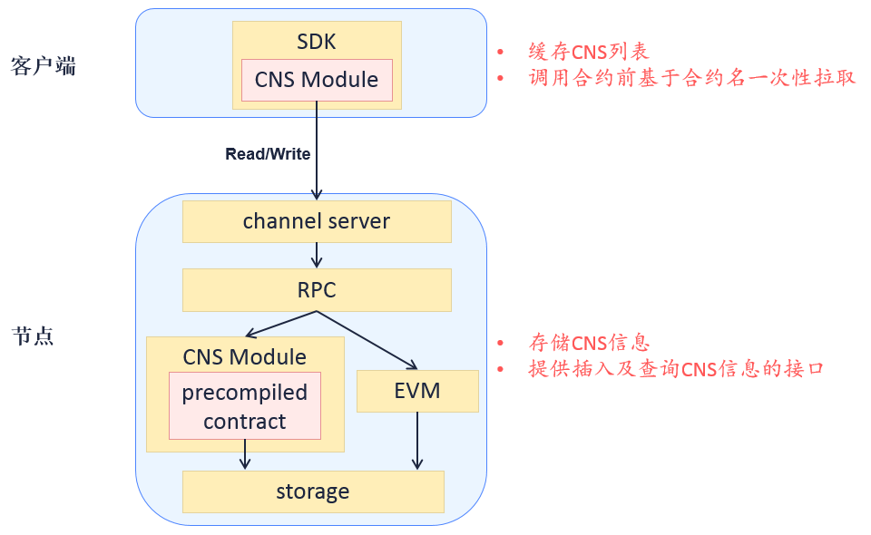
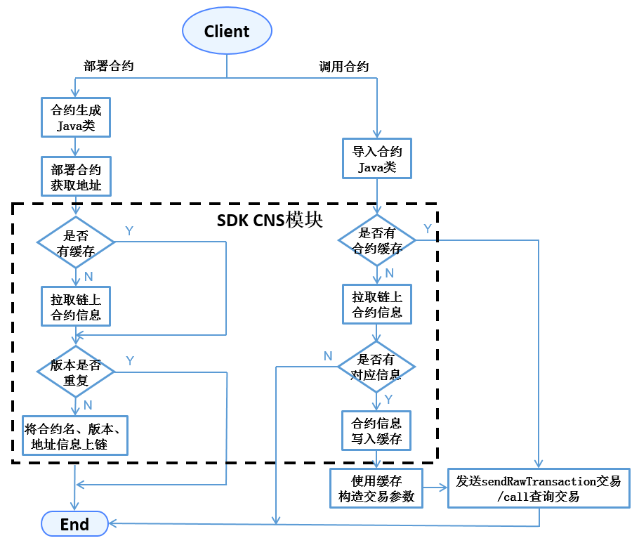

# CNS方案

标签：``合约命名服务`` ``CNS表结构``

----
## 概述

调用以太坊智能合约的流程包括： 
1. 编写合约；
2. 编译合约得到合约接口abi描述；
3. 部署合约得到合约地址address；
4. 封装合约的abi和地址，通过SDK等工具实现对合约的调用。

从合约调用流程可知，调用之前必须准备合约abi以及合约地址address。这种使用方式存在以下的问题： 
1. 合约abi为较长的JSON字符串，调用方不需直接感知；
2. 合约地址为20字节的魔数，不方便记忆，若丢失后将导致合约不可访问；
3. 合约重新部署后，一个或多个调用方都需更新合约地址；
4. 不便于进行版本管理以及合约灰度升级。

为解决以上问题，给调用者提供良好的智能合约调用体验，FISCO BCOS提出**CNS合约命名服务**。

## 名词解释

- **CNS**（Contract Name Service）通过提供链上合约名称与合约地址映射关系的记录及相应的查询功能，方便调用者通过记忆简单的合约名来实现对链上合约的调用。
- **CNS信息**为合约名称、合约版本、合约地址和合约abi
- **CNS表**用于存储CNS信息

## CNS对比以太坊原有调用方式的优势

- 简化调用合约方式；
- 合约升级对调用者透明，支持合约灰度升级。

## 对标ENS

ENS (Ethereum Name Service) ，以太坊名称服务。

ENS的功能类似我们较熟悉的DNS(Domain Name Service)域名系统，但提供的不是Internet网址，而是将以太坊(Ethereum)合约地址和钱包地址以xxxxxx.eth网址的方式表示，用于存取合约或转账。两者相比：

- ENS映射的地址类型包括合约地址及钱包地址，CNS可支持，当地址类型为钱包地址时合约abi为空。
- ENS有竞拍功能，CNS不需支持。
- ENS支持多级域名，CNS不需支持。

## 模块架构



<center>CNS架构</center>

## 核心流程

用户调用SDK部署合约及调用合约流程如下：



<center>SDK部署合约及调用合约流程</center>

- 部署合约时，SDK生成合约对应的Java类，调用类的deploy接口发布合约获得合约地址，然后调用CNS合约insert接口上链CNS信息。
- 调用合约时，SDK引入合约的Java类，并加载实例化。load加载接口可传入合约地址（原有以太坊方式）或合约名称和合约版本的组合（CNS方式），SDK处理CNS方式时通过调用CNS模块查询链上信息来获取合约地址。
- 对于缺少版本号的合约调用，由SDK实现默认调用合约的最新版本。
- 上链的合约abi信息属于可选字段。

## 数据结构

### CNS表结构

CNS信息以系统表的方式进行存储，各账本独立。CNS表定义如下：

<table border="3">
<tr bgcolor="#CDCDCD">
  <td><center>Field</center></td>
  <td><center>Type</center></td>
  <td><center>Null</center></td>
  <td><center>Key</center></td>
  <td><center>Expain</center></td>
</tr>
<tr><td>name</td><td>string</td><td>No</td><td>PRI</td><td>合约名称，name和version为联合主键</td></tr>
<tr><td>version</td><td>string</td><td>No</td><td></td><td>合约版本，name和version为联合主键</td></tr>
<tr><td>address</td><td>string</td><td>No</td><td></td><td>合约地址</td></tr>
<tr><td>abi</td><td>string</td><td>YES</td><td></td><td>合约abi</td></tr>
<tr><td>_status_</td><td>string</td><td>No</td><td></td><td>分布式存储通用字段，“0”可用“1”删除</td></tr>
</table>

### 合约接口

```
pragma solidity ^0.4.2;
contract CNS
{
    function insert(string name, string version, string addr, string abi) public returns(uint256);
    function selectByName(string name) public constant returns(string);
    function selectByNameAndVersion(string name, string version) public constant returns(string);
}
```

- CNS合约不暴露给用户，为SDK与底层CNS表的交互接口。
- insert接口提供CNS信息上链的功能，接口四个参数分别为合约名称name、合约版本version、合约地址addr和合约ABI信息abi。SDK调用接口需判断name和version的组合与数据库原有记录是否重复，在不重复的前提下才能发起上链交易。节点在执行交易时，precompiled逻辑会Double Check，发现数据重复就直接抛弃该交易。insert接口对CNS表的内容只增不改。
- selectByName接口参数为合约名称name，返回表中所有基于该合约的不同version记录。
- selectByNameAndVersion接口参数为合约名称name和合约版本version，返回表中该合约该版本的唯一地址。

#### 更新CNS表方式

**预编译合约**是FISCO BCOS底层通过C++实现的一种高效智能合约，用于FISCO BCOS底层的系统信息配置与管理。引入precompiled逻辑后，FISCO BCOS节点执行交易的流程如下：

CNS合约属于预编译合约类型，节点将通过内置C++代码逻辑实现对CNS表的插入和查询操作，不经EVM执行，因此CNS合约只提供了函数接口描述而没有函数实现。**预置CNS合约的precompiled地址为0x1004。**

#### 合约接口返回示例

selectByName和selectByNameAndVersion接口返回的string为Json格式，示例如下：
```json
[
    {
        "name" : "Ok",
        "version" : "1.0",
        "address" : "0x420f853b49838bd3e9466c85a4cc3428c960dde2",
        "abi" : "[{\"constant\":false,\"inputs\":[{\"name\":\"num\",\"type\":\"uint256\"}],\"name\":\"trans\",\"outputs\":[],\"payable\":false,\"type\":\"function\"},{\"co
nstant\":true,\"inputs\":[],\"name\":\"get\",\"outputs\":[{\"name\":\"\",\"type\":\"uint256\"}],\"payable\":false,\"type\":\"function\"},{\"inputs\":[],\"payable\":false,\
"type\":\"constructor\"}]"
    },
    {
        "name" : "Ok",
        "version" : "2.0",
        "address" : "0x420f853b49838bd3e9466c85a4cc3428c960dde2",
        "abi" : "[{\"constant\":false,\"inputs\":[{\"name\":\"num\",\"type\":\"uint256\"}],\"name\":\"trans\",\"outputs\":[],\"payable\":false,\"type\":\"function\"},{\"co
nstant\":true,\"inputs\":[],\"name\":\"get\",\"outputs\":[{\"name\":\"\",\"type\":\"uint256\"}],\"payable\":false,\"type\":\"function\"},{\"inputs\":[],\"payable\":false,\
"type\":\"constructor\"}]"
    }
]
```

## SDK_API

SDK开发者可使用`org.fisco.bcos.web3j.precompile.cns`中以下两接口实现CNS的注册及查询功能。

### registerCns
- 描述：public TransactionReceipt registerCns(String name, String version, String addr, String abi)
- 功能：上链合约信息
- 参数：name——合约名，version——合约版本，addr——合约地址，abi——合约abi
- 返回：上链交易回执，回执中含上链结果信息及错误信息（如有）

### resolve
- 描述：public String resolve(String contractNameAndVersion)
- 功能：基于合约名和合约版本查询合约地址
- 参数：contractNameAndVersion——合约名+合约版本信息
- 返回：合约地址，如无参数指定版本的合约信息，接口抛出异常
- 说明：contractNameAndVersion通过`:`来分割合约名和合约版本，当缺少合约版本时，SDK默认调用使用合约的最新版本进行查询

注意：
1. 在调用接口前，需将sol合约转换Java类，并将生成的Java类以及abi、bin文件置于正确的目录，详细使用方法请参考[Web3SDK](../../sdk/java_sdk.md)；
2. 两个接口的使用例子可参考[ConsoleImpl.java](https://github.com/FISCO-BCOS/console/blob/master/src/main/java/console/contract/ConsoleContractImpl.java)中的deployByCNS和callByCNS接口实现。

## 操作工具

控制台可提供部署合约、调用合约、基于合约名查询链上已有合约的功能，2.6及其以上版本控制台使用手册请参考[这里](../../console/console_of_java_sdk.md), 1.x版本控制台使用手册请参考[这里](../../console/console.md)。

控制台提供的命令包括：

- deployByCNS：通过CNS方式部署合约
- callByCNS：通过CNS方式调用合约
- queryCNS：根据合约名称和合约版本号（可选参数）查询CNS表信息
