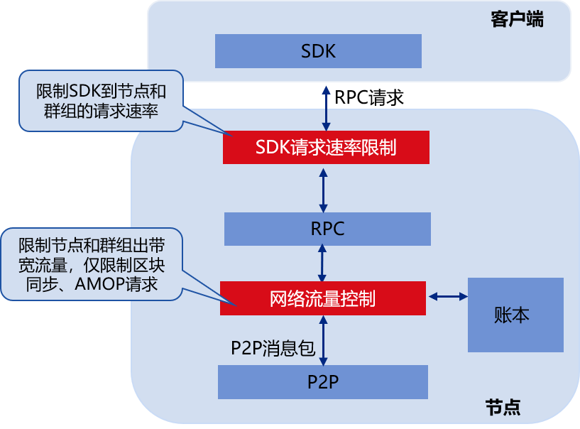

# 流量控制

标签：``流量控制`` ``速率限制``

----

为实现区块链系统柔性服务，并防止多群组架构下，多个群组运行在相同进程中，某些群组占用资源过多干扰到其他群组，FISCO BCOS v2.5.0引入了流量控制功能。

## 模块架构

下图是流量控制的模块图，主要包括SDK请求速率限制以及网络流量限制，前者限制SDK到节点的请求速率，后者通过限制区块同步和AMOP请求流量，限制节点出带宽流量，防止区块同步、AMOP请求消息包过多影响共识模块性能。




## SDK请求速率限制

SDK请求速率限制包括节点级别的请求速率限制和群组级别的请求速率限制：

- **节点级别请求速率限制**：限制SDK客户端到节点的总的请求速率，当SDK到节点的请求速率超过指定阈值后，节点会拒绝SDK的请求，达到QoS目标的同时，防止过多的SDK请求导致节点异常；

- **群组级别请求速率限制**：限制SDK客户端到群组的请求速率，当SDK发向指定群组的请求速率超过阈值后，群组会拒绝SDK请求。


```eval_rst
.. note::
   节点和群组都开启请求速率限制时：
    - 区块链节点收到SDK发送的请求包后，首先调用节点级别的请求速率限制模块判断是否应该接收该请求；
    - 被接收的请求继续进入到群组级别的请求速率限制模块，通过群组级别请求速率限制模块检查的请求最终才会被转发到相应群组并被处理。
```

## 节点网络流量控制

类似于SDK请求速率限制，网络流量限制也包括节点级别的流量控制和群组级别的流量控制：

- **节点级别的流量控制**：限制节点的平均出带宽，当节点平均出带宽超过阈值后，节点收到区块同步请求后会暂缓发送区块，也会拒绝收到的AMOP请求，避免区块同步、AMOP消息包发送对节点共识的影响；

- **群组级别的流量控制**：限制每个群组的平均出带宽，当群组平均出带宽流量超过阈值后，该群组会暂停区块发送和AMOP请求包转发逻辑，优先将网络流量提供给共识模块使用。

```eval_rst
.. note::
   节点和群组都开启流量控制功能时：
    - 当节点收到客户端的AMOP请求时，调用节点级流量控制模块判断是否可以接收该AMOP请求；
    - 当某个群组收到其他节点对应群组的区块请求后，群组向其回复区块前，(1) 调用节点级流量控制模块，判断节点平均出带宽是否超过设置的阈值；(2) 调用群组级流量控制模块，判断群组的出带宽是否超过设置的阈值，当且仅当节点级和群组级平均出带宽均没有超过设置阈值时，该群组才会回复区块
```

## 配置选项

```eval_rst
.. note::
    - 节点级别的流量控制配置选项位于 ``config.ini`` ，具体可参考 `这里 <../../manual/configuration.html#id12>`_ 
    - 群组级别的流量控制选项位于 ``group.{group_id}.ini`` ，具体可参考 `这里 <../../manual/configuration.html#id34>`_ 
```