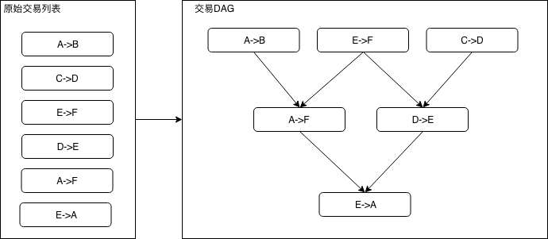
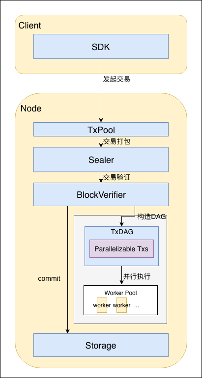
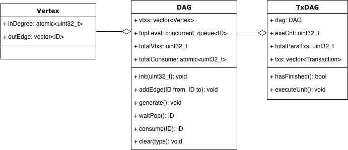
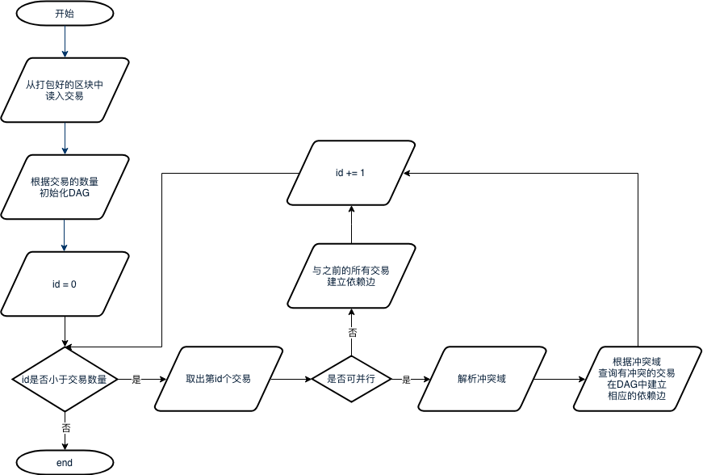

# 交易并行

标签：``交易并行`` ``DAG`` 

----

## 1 名词解释

### 1.1 DAG

一个无环的有向图称做有向无环图（**D**irected **A**cyclic **G**raph），简称DAG图。在一批交易中，可以通过一定方法识别出每笔交易需要占用的互斥资源，再根据交易在Block中的顺序及互斥资源的占用关系构造出一个交易依赖DAG图，如下图所示，凡是入度为0（无被依赖的前序任务）的交易均可以并行执行。如下图所示，基于左图的原始交易列表的顺序进行拓扑排序后，可以得到右图的交易DAG。

## 2 模块架构

其中主要流程包括：

- 用户直接或间接通过SDK发起交易。交易可以是能够并行执行的交易和不能并行执行的交易；
- 交易进入节点的交易池中，等待打包；
- 交易被Sealer打包为区块，经过共识后，发送至BlockVerifier进行验证；
- BlockVerifier根据区块中的交易列表生成交易DAG；
- BlockVerifier构造执行上下文，并行执行交易DAG；
- 区块验证通过后，区块上链。

## 3 重要流程

### 3.1 交易DAG构建

#### 3.1.1 DAG数据结构

方案中所用到的DAG数据结构如下：

其中：
- 顶点（Vertex）
	- inDegree用于存储顶点当前的入度;
    - outEdge用于保存该顶点的出边信息，具体为所有出边所连顶点的ID列表。
- DAG：
	- vtxs是用于存储DAG中所有节点的列表；
    - topLevel是一个并发队列，用于存储当前入度为0的节点ID，执行时供多个线程并发访问；
    - totalVtxs：顶点总数
    - totalConsume：已经执行过的顶点总数；
    - void init(uint32_t \_maxSize)：初始化一个最大顶点数为maxSize的DAG；
    - void addEdge(ID from, ID to)：在顶点from和to之间建立一条有向边；
    - void generate()：根据已有的边和顶点构造出一个DAG结构；
    - ID waitPop(bool needWait)：等待从topLevel中取出一个入度为0的节点；
    - void clear()：清除DAG中所有的节点与边信息。
- TxDAG:
	- dag：DAG实例
    - exeCnt：已经执行过的交易计数；
    - totalParaTxs：并行交易总数；
    - txs：并行交易列表
    - bool hasFinished()：若整个DAG已经执行完毕，返回true，否则返回false;
    - void executeUnit()：取出一个没有上层依赖的交易并执行；
#### 3.1.2 交易DAG构造流程

流程如下：

1. 从打包好的区块从取出区块中的所有交易；
2. 将交易数量作为最大顶点数量初始化一个DAG实例；
3. 按序读出所有交易，如果一笔交易是可并行交易，则解析其冲突域，并检查是否有之前的交易与该交易冲突，如果有，则在相应交易间构造依赖边；若该交易不可并行，则认为其必须在前序的所有交易都执行完后才能执行，因此在该交易与其所有前序交易间建立一条依赖边。

### 3.2 DAG执行流程

流程如下：

1. 主线程会首先根据硬件核数初始化一个相应大小的线程组，若获取硬件核数失败，则不创建其他线程；
2. 当DAG尚未执行完毕时，线程循环等待从DAG中pop出入度为0的交易。若成功取出待执行的交易，则执行该交易，执行完后将后续的依赖任务的入度减1，若有交易入度被减至0，则将该交易加入topLevel中；若失败，则表示DAG已经执行完毕，线程退出。