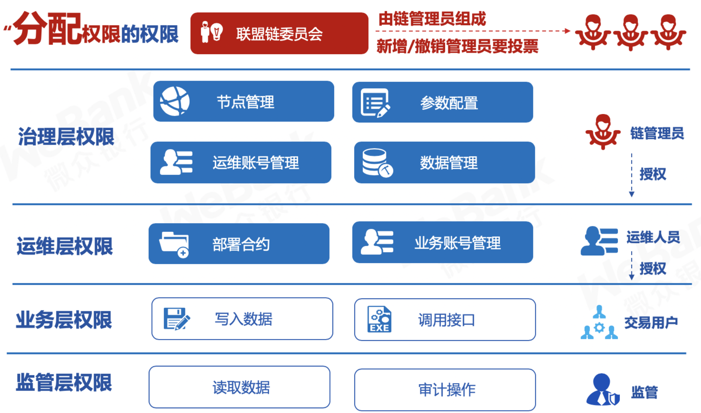

# 基于角色的权限控制

标签：``安全控制`` ``权限控制`` 

----

当前基于表的权限控制，由于涉及到许多系统表，要求用户对底层的逻辑有一定理解，使用门槛较高。从2.5.0版本开始，基于已有的表权限控制模型，新增了ChainGovernance预编译合约，用于实现基于角色的权限控制。

## 角色定义

分为治理方、运维方、监管方和业务方。**考虑到权责分离，治理方、运维方和开发方权责分离，角色互斥。**

- 治理方：拥有投票权，可以参与治理投票（AUTH_ASSIGN_AUTH），可以增删节点、修改链配置、添加撤销运维、冻结解冻合约、对用户表的写权限控制。链级别的可变配置的权限。
- 运维方：由治理方添加运维账号，运维账号可以部署合约、创建表、管理合约版本、冻结解冻本账号部署的合约。
- 业务方：业务方账号由运维添加到某个合约，可以调用该合约的写接口。
- 监管方：监管方监管链的运行，能够获取链运行中权限变更的记录、能够获取需要审计的数据

## 权限

以下简称治理账号为**委员**。

- 权限项命名符合动宾结构。
- 增删委员、修改委员权重、修改生效阈值三个操作，需要**有效投票权重/总权重>生效阈值**生效。其中**总权重=SUM(委员权重)**
- 治理账号可以添加运维账号，但治理账号不拥有运维的权限
- 运维账号可以为某个合约添加业务账号，但运维账号没有业务账号权限



### 权限项

|权限操作|控制方式|命名|默认阈值|修改方式|
|:--|:--|:--|:--|:--|
|增删委员 |控制写权限表|AUTH_ASSIGN_AUTH|0.5|委员投票|
|修改委员权重|控制写权限表|AUTH_ASSIGN_AUTH|0.5|委员投票|
|修改生效投票阈值（投票委员权重和大于该值）|控制写权限表|AUTH_ASSIGN_AUTH|0.5|委员投票|
|增删节点（观察/共识）|控制写共识表|AUTH_CTRL_NODE||委员可操作|
|修改链配置项|控制写配置表|AUTH_MODIFY_CONFIG||委员可操作|
|冻结解冻合约|合约生命周期|AUTH_CTRL_CONTRACT_LIFE||委员可操作|
|添加撤销运维||AUTH_CTRL_OPERATOR||委员可操作|
|用户表写权限||AUTH_CTRL_USER_TABLE||委员可操作|
|部署合约|_sys_tables_的写权限|AUTH_CREATE_TABLE||运维操作|
|创建表|_sys_tables_的写权限|AUTH_CREATE_TABLE||运维操作|
|合约版本管理|CNS|AUTH_CTRL_CNS||运维操作|
|冻结解冻本账号部署的合约|修改合约状态|||运维操作|
|调用合约|合约表写权限|||业务操作|

### 计票与生效

- 所有治理操作需要**有效投票数/委员数>生效阈值**才能生效
- 每次投票操作，如果是委员投票，则记录操作内容和投票委员，不重复计票
- 每次投票操作，计票结束后，计算**有效投票数/委员数**，如果大于此操作的生效阈值，则对应操作生效，写入
- **投票设置过期时间，根据块高，blockLimit的10倍，固定不可改**

## 功能列表

1. 增删委员计票与生效
2. 修改委员权重计票与生效
3. 修改生效阈值计票与生效
4. 委员增删运维
5. 委员解冻冻结合约
6. 委员增删节点
7. 委员修改系统配置
8. 权限项默认阈值存储
9. 运维部署合约的权限
10. 运维管理合约版本的权限

## 委员相关
```solidity
function grantCommitteeMember(address user) public returns (int256);
function updateCommitteeMemberWeight(address user, int256 weight) public returns (int256);
function revokeCommitteeMember(address user) public returns (int256);
function listCommitteeMembers() public returns (string);
// threshold取值范围[0,100]
function updateThreshold(int256 threshold) public returns (int256);
```

## 运维相关
```solidity
function grantOperator(address user) public returns (int256);
function revokeOperator(address user) public returns (int256);
function listOperator() public returns (string);
```

## 数据结构

## 表:`_sys_committee_votes_`

|`_id_`|`_status_`|`_num_`|key|value|origin|enable_num|
|:--|:--|:--|:--|:--|:--|:--|

- key是账户，value记录`grant/revoke`，origin记录投票人
- key是`账户_update_weight`，value记录目标权重，origin记录投票人
- key是`账户_weight`，value记录权重
- key是`auth_threshold`，value记录当前阈值
- key是`update_auth_threshold`，value记录目标阈值，origin记录投票人
