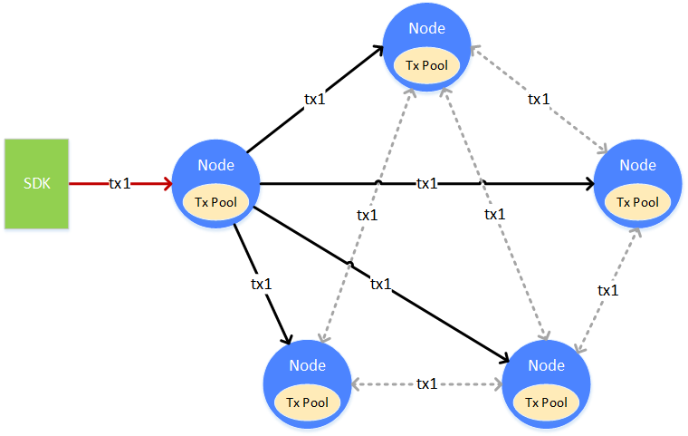

# 同步基础流程

标签：``数据同步`` ``广播策略`` ``状态同步``

----

同步，是区块链节点非常重要的功能。它是[共识](../consensus/index.md)的辅助，给共识提供必需的运行条件。同步分为交易的同步和状态的同步。交易的同步，确保了每笔交易能正确的到达每个节点上。状态的同步，能确保区块落后的节点能正确的回到最新的状态。只有持有最新区块状态的节点，才能参与到共识中去。

## 交易同步

交易同步，是让区块链的上的交易尽可能的到达所有的节点。为共识中将交易打包成区块提供基础。

一笔交易（tx1），从客户端上发往某个节点，节点在接收到交易后，会将交易放入自身的交易池（Tx Pool）中供共识去打包。与此同时，节点会将交易广播给其它的节点，其它节点收到交易后，也会将交易放到自身的交易池中。交易在发送的过程中，会有丢失的情况，为了能让交易尽可能的到达所有的节点，收到广播过来交易的节点，会根据一定的策略，选择其它的节点，再进行一次广播。

**交易广播策略**

如果每个节点都没有限制的转发/广播收到的交易，带宽将被占满，出现交易广播雪崩的问题。为了避免交易广播的雪崩，FISCO BCOS根据经验，选择了较为精巧的交易广播策略。在尽可能保证交易可达性的前提下，尽量的减少重复的交易广播。

* 对于SDK来的交易，广播给所有的节点
* 对于其它节点广播来的交易，随机选择25%的节点再次广播
* 一条交易在一个节点上，只广播一次，当收到了重复的交易，不会进行二次广播

通过上述的策略，能够尽量的让交易到达所有的节点，但也会在极小的概率下出现某交易无法到达某节点的情况。此情况是允许的。交易尽可能到达更多的节点，是为了让此交易尽快的被打包、共识、确认，尽量的让交易能够更快的得到执行的结果。当交易未到达某个节点时，只会使得交易的执行时间变长，不会影响交易的正确性。

## 状态同步

状态同步，是让区块链节点的状态保持在最新。区块链的状态的新旧，是指区块链节点当前持有数据的新旧，即节点持有的当前区块块高的高低。若一个节点的块高是区块链的最高块高，则此节点就拥有区块链的最新状态。只有拥有最新状态的节点，才能参与到共识中去，进行下一个新区块的共识。

在一个全新的节点加入到区块链上，或一个已经断网的节点恢复了网络时，此节点的区块落后于其它节点，状态不是最新的。此时就需要进行状态同步。如图，需要状态同步的节点（Node 1），会主动向其它节点请求下载区块。整个下载的过程会将下载的负载分散到多个节点上。

**状态同步与下载队列**

区块链节点在运行时，会定时向其它节点广播自身的最高块高。节点收到其它节点广播过来的块高后，会和自身的块高进行比较，若自身的块高落后于此块高，就会启动区块下载流程。

区块的下载通过请求的方式完成。进入下载流程的节点，会随机的挑选满足要求的节点，发送需要下载的区块区间。收到下载请求的节点，会根据请求的内容，回复相应的区块。

收到回复区块的节点，在本地维护一个下载队列，用来对下载下来的区块进行缓冲和排序。下载队列是一个以块高为顺序的优先队列。下载下来的区块，会不断的插入到下载队列中，当队列中的区块能连接上节点当前本地的区块链，则将区块从下载队列中取出，真正的连接到当前本地的区块链上。

## 同步场景举例

### 交易同步

一笔交易被广播到所有节点的过程：

1. 一笔交易通过channel或RPC发送到某节点上
2. 收到交易的节点全量广播此交易给其它节点
3. 其它节点收到交易后，为了保险起见，选择25%的节点再广播一次
4. 节点收到广播过的交易，不会再次广播

### 状态同步

节点出块时的广播逻辑

1. 某个节点出块
2. 此节点将自己最新的状态（最新块高，最高块哈希，创世块哈希）广播给所有的节点
3. 其它的节点收到peer的状态后，更新在本地管理的peer数据

**组内成员的同步**

组内成员在某时刻意外关闭，但其它成员在出块，当此组员再次启动时，发现区块落后于其它组员：

1. 组员再次启动
2. 收到其它组员发来的状态包
3. 比较发现自己的最高块高落后于其它组员，启动下载流程
4. 将相差的区块按区间划分成多个下载请求包，发送给多个组员，负载均衡
5. 等待其它节点回复区块包
6. 其它节点接受响应，从自己的区块链上查询出区块，回复给启动的节点
7. 节点收到区块，放入下载队列
8. 节点从下载队列中将区块拿出，写到区块链上
9. 若下载未结束，则继续请求，若下载结束，则切换自身状态，开启交易同步，开启共识

**新组员的同步**

非组员作为一个新组员加入到某个组中，且此节点第一次启动，从原来的组员中同步区块：

1. 非组员未被注册到组中，但非组员先启动
2. 此时发现自己不在组中，不进行状态广播，也不进行交易广播，只等待其它组员发来状态消息
3. 此时组员中并没有此新组员，不会向新组员广播状态
4. 管理员将新组员加入到组中
5. 组员向新组员广播自身状态
6. 新组员收到组员状态，比较自身块高（为0），启动下载流程
7. 之后的下载流程，与组内成员区块同步流程相同

