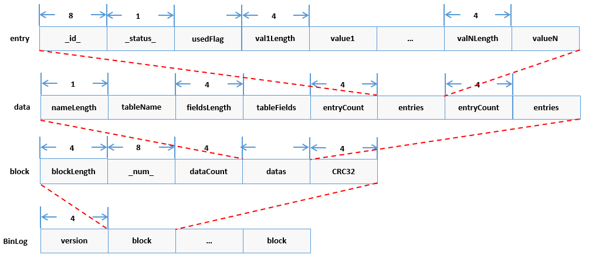

# 海量数据治理

区块链在运行的过程中，随着上链业务数的增加，会出现链数据量成比例增加和链性能有一定程度衰减的情况。其中性能衰减对业务体验影响较大，并且无法通过增加硬盘容量等硬件方式解决。通过分析，我们可采用**scalable存储模式**，通过对写入本地的链上数据按照一定维度进行划分，分别存于不同存储实例，从而控制节点所访问的单个存储实例大小，稳定链处理能力；同时，对本地的存储实例，在实现其备份归档后可以有选择地进行实例删除，控制本地存储的整体数据量。

```eval_rst
.. important::

    - FISCO BCOS从2.7.1版本开始，通过配置“数据仓库”，实现对海量数据治理的支持；

    - FISCO BCOS为实现海量数据治理的功能，需配合WeBankBlockchain-Data-Stash，相关操作见  `[文档] <https://data-doc.readthedocs.io/zh_CN/latest/docs/WeBankBlockchain-Data-Stash/install.html>`_ 
    
    - 更多“数据仓库”的使用请参考 `[文档] <https://data-doc.readthedocs.io/zh_CN/latest/docs/WeBankBlockchain-Data-Stash/index.html>`_ 。

```

## scalable存储模式

FISCO BCOS节点在配置scalable存储模式时，对于本地经裁剪后缺少的数据，将通过Data-Stash访问“数据仓库”数据源进行获取。

### 模式启用

- 设置群组的ini配置文件中`[storage].type=scalable`来选择链的存储模式为`scalable`。
- 设置群组的ini配置文件中`[storage].binary_log=true`来启用binlog。如用户使用build_chain脚本搭链，并选择scalable存储模式，配置文件会自动开启binlog。
- 参考[说明](https://data-doc.readthedocs.io/zh_CN/latest/docs/WeBankBlockchain-Data-Stash/quickstart.html#id7)进行数据库配置，其中设置访问的数据源为“数据仓库”数据库。

### 文件组织

节点使用scalable存储模式后，其数据目录内容如下：

- `nodeX/data/groupX/block/Scalable/blocksDB/`下分文件夹存储区块数据。每个文件夹为独立的DB实例，用DB记录的首个块高来进行文件夹命名。用户在配置了“数据仓库”，实现数据备份归档后，较旧（较低块高）的子文件夹**允许删除**。
- `nodeX/data/groupX/block/Scalable/state`存储整体的状态数据，该文件夹**不可删除**。

## binlog

binlog文件记录了每个区块的每个交易对区块链状态的修改结果。binlog机制的作用在于：

1. 提供了区块维度的数据操作结果的记录；
2. 节点可通过binlog文件而非通过原有的拉取区块重放交易的方式来恢复数据；
3. binlog文件为“数据仓库”的快照构建提供数据来源。

用户可通过设置群组的ini配置文件中`[storage].binary_log=true`来启用binlog（binlog默认关）。开启binlog后，`nodeX/data/groupX/BinaryLogs/`的目录如下。每个binlog文件以其记录的首个区块内容进行命名，且按从小到大的顺序来记录区块。如下图中，文件`18.binlog`记录的区块为块高18到块高29。

```bash
├── 0.binlog
├── 18.binlog
├── 30.binlog
└── 32.binlog
```

基于1，用户可根据下图描述的binlog协议，通过访问binlog文件来获取指定key的历史修改记录。解析binlog文件的具体操作可参考[binlog_reader GitHub源码链接](https://github.com/FISCO-BCOS/FISCO-BCOS/blob/master-2.0/fisco-bcos/tools/binlog_reader.cpp)或[binlog_reader Gitee源码链接](https://gitee.com/FISCO-BCOS/FISCO-BCOS/blob/master-2.0/fisco-bcos/tools/binlog_reader.cpp)的相关实现。



