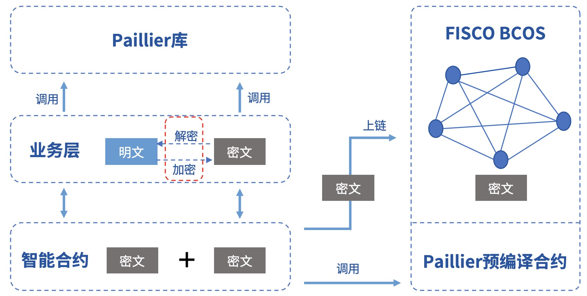
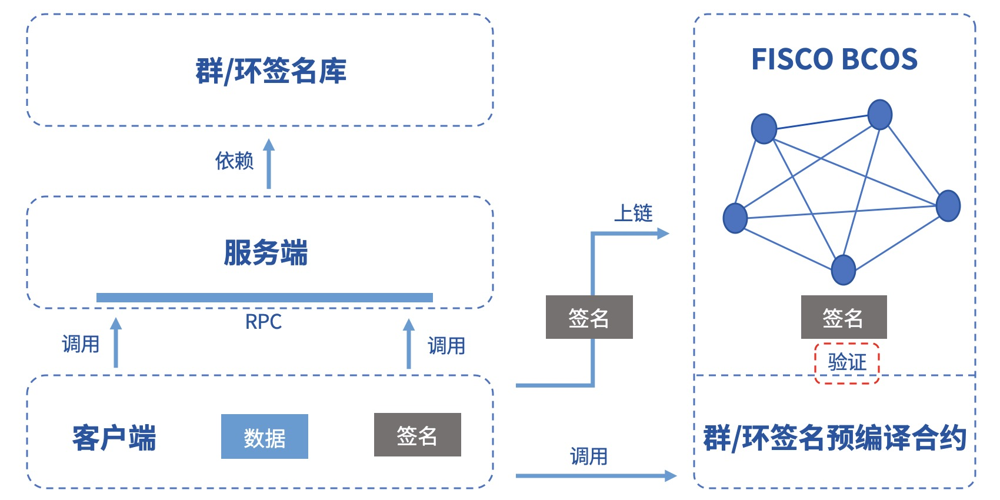

# 合约隐私保护

标签：``隐私合约`` ``隐私保护`` ``合约开发`` ``同态加密`` ``环签名``

----
隐私保护是联盟链的一大技术挑战。为了保护链上数据、保障联盟成员隐私，并且保证监管的有效性，FISCO BCOS以[预编译合约](https://fisco-bcos-documentation.readthedocs.io/zh_CN/latest/docs/manual/smart_contract.html#id2)的形式集成了同态加密、群/环签名验证功能，提供了多种隐私保护手段。

文档一、二节分别对同态加密和群/环签名算法以及相关应用场景进行了简单介绍，第三、四节则详细介绍了FISCO BCOS隐私保护模块启用方法以及调用方式。


```eval_rst
.. note::
    1. FISCO BCOS 2.3.0+ 支持同态加密、群签名和环签名
    2. FISCO BCOS 2.3.0， 2.4.0以及2.4.1，需要手动编译二进制启用隐私保护模块
    3. FISCO BCOS 2.5.0+默认启用隐私保护模块
```

## 同态加密

### 算法简介

同态加密(Homomorphic Encryption)是公钥密码系统领域的明珠之一，已有四十余年的研究历史。其绝妙的密码特性，吸引密码学家前赴后继，在业界也受到了广泛的关注。

- 同态加密本质是一种公钥加密算法，即加密使用公钥pk，解密使用私钥sk；
- 同态加密支持密文计算，即由相同公钥加密生成的密文可以计算​f( )操作，生成的新密文解密后恰好等于两个原始明文计算f( )的结果；
- 同态加密公式描述如下：


FISCO BCOS采用的是paillier加密算法，支持加法同态。paillier的公私钥兼容主流的RSA加密算法，接入门槛低。同时paillier作为一种轻量级的同态加密算法，计算开销小易被业务系统接受。因此经过功能性和可用性的权衡，最终选定了paillier算法。


### 功能组件

FISCO BCOS同态加密模块提供的功能组件包括：

- paillier同态库[GitHub源码](https://github.com/FISCO-BCOS/paillier-lib)/[Gitee源码](https://gitee.com/FISCO-BCOS/paillier-lib)，包括java库和c++同态接口。

- paillier[预编译合约](#id18)，供智能合约调用，提供密文同态运算接口。

### 使用方式

对于有隐私保护需求的业务，如果涉及简单密文计算，可借助本模块实现相关功能。凡是上链的数据可通过调用paillier库完成加密，链上的密文数据可通过调用paillier预编译合约实现密文的同态加运算，密文返还回业务层后，可通过调用paillier库完成解密，得到执行结果。具体流程如下图所示：



### 应用场景

在联盟链中，不同的业务场景需要配套不同的隐私保护策略。对于强隐私的业务，比如金融机构之间的对账，对资产数据进行加密是很有必要的。在FISCO BCOS中，用户可以调用同态加密库对数据进行加密，共识节点执行交易的时候调用同态加密预编译合约，得到密文计算的结果。

## 群/环签名

### 算法简介

**群签名**

群签名(Group Signature)是一种能保护签名者身份的具有相对匿名性的数字签名方案，用户可以代替自己所在的群对消息进行签名，而验证者可以验证该签名是否有效，但是并不知道签名属于哪一个群成员。同时，用户无法滥用这种匿名行为，因为群管理员可以通过群主私钥打开签名，暴露签名的归属信息。群签名的特性包括：

- 匿名性：群成员用群参数产生签名，其他人仅可验证签名的有效性，并通过签名知道签名者所属群组，却无法获取签名者身份信息；
- 不可伪造性：只有群成员才能生成有效可被验证的群签名；
- 不可链接性：给定两个签名，无法判断它们是否来自同一个签名者；
- 可追踪性：在监管介入的场景中，群主可通过签名获取签名者身份。

**环签名**

环签名(Ring Signature)是一种特殊的群签名方案，但具备完全匿名性，即不存在管理员这个角色，所有成员可主动加入环，且签名无法被打开。环签名的特性包括：

- 不可伪造性：环中其他成员不能伪造真实签名者签名；
- 完全匿名性：没有群主，只有环成员，其他人仅可验证环签名的有效性，但没有人可以获取签名者身份信息。

### 功能组件

FISCO BCOS群/环签名模块提供的功能组件包括：

- 群/环[签名库](https://github.com/FISCO-BCOS/group-signature-lib)，提供完整的群/环签名算法c++接口

- 群/环签名[预编译合约](#id18)，供智能合约调用，提供群/环签名验证接口。

### 使用方式

有签名者身份隐匿需求的业务可借助本模块实现相关功能。签名者通过调用群/环签名库完成对数据的签名，然后将签名上链，业务合约通过调用群/环签名预编译合约完成签名的验证，并将验证结果返还回业务层。如果是群签名，那么监管方还能打开指定签名数据，获得签名者身份。具体流程如下图所示：


### 应用场景

群/环签名由于其天然的匿名性，在需要对参与者身份进行隐匿的场景中有广泛的应用前景，例如匿名投票、匿名竞拍、匿名拍卖等等，甚至在区块链UTXO模型中可用于实现匿名转账。同时，由于群签名具备可追踪性，可以用于需要监管介入的场景，监管方作为群主或者委托群主揭露签名者身份。

### 开发示例

FISCO BCOS专门为用户提供了群/环签名开发示例，包括：

- 群/环签名服务端: 提供完整的群/环签名RPC服务。[GitHub源码](https://github.com/FISCO-BCOS/group-signature-server)、[Gitee源码](https://gitee.com/FISCO-BCOS/group-signature-server)

- 群/环签名客户端: 调用RPC服务对数据进行签名，并提供签名上链以及链上验证等功能。[GitHub源码](https://github.com/FISCO-BCOS/sig-service-client)、[Gitee源码](https://gitee.com/FISCO-BCOS/sig-service-client)

示例框架如下图所示，具体操作方法请参阅[客户端指南 Github链接](https://github.com/FISCO-BCOS/sig-service-client)或[客户端指南 Gitee链接](https://gitee.com/FISCO-BCOS/sig-service-client)。



## 启用方法

FISCO BCOS隐私保护模块是通过预编译合约实现的，默认被启用。使用源码编译请参考[这里](../blockchain_dev/get_executable.md).

### 搭建联盟链

假设当前位于`FISCO-BCOS/build`目录下，则使用下面的指令搭建本机4节点的链指令如下，更多选项[参考这里](https://fisco-bcos-documentation.readthedocs.io/zh_CN/latest/docs/manual/build_chain.html)。

```bash
bash ../manual/build_chain.sh -l 127.0.0.1:4 -e bin/fisco-bcos
```


## 预编译合约接口

隐私模块的代码和用户开发的预编译合约都位于`FISCO-BCOS/libprecompiled/extension`目录，因此隐私模块的调用方式和用户开发的预编译合约[调用流程](https://fisco-bcos-documentation.readthedocs.io/zh_CN/latest/docs/manual/smart_contract.html#id12)相同，不过有两点需要注意：

1.已为隐私模块的预编译合约分配了地址，无需另行注册。隐私模块实现的预编译合约列表以及地址分配如下：

源码可参考链接：[GitHub链接](https://github.com/FISCO-BCOS/FISCO-BCOS/tree/master/libprecompiled/extension)、[Gitee链接](https://gitee.com/FISCO-BCOS/FISCO-BCOS/tree/master/libprecompiled/extension)

   | 地址   | 功能       | 源码 |
   | ------ | ---------- | ------------------------------------------------------------ |
   | 0x5003 | 同态加密   | PaillierPrecompiled.cpp                                      |
   | 0x5004 | 群签名     | GroupSigPrecompiled.cpp                                      |
   | 0x5005 | 环签名     | RingSigPrecompiled.cpp                                       |

2.需要通过`solidity`合约方式声明隐私模块预编译合约的接口，合约文件需保存在控制台合约目录`console/contracts/solidity`中，各个隐私功能的合约接口如下，可直接复制使用:

- 同态加密

  ```solidity
  // PaillierPrecompiled.sol
  pragma solidity ^0.4.24;
  contract PaillierPrecompiled{
      function paillierAdd(string cipher1, string cipher2) public constant returns(string);
  }
  ```

- 群签名

  ```solidity
  // GroupSigPrecompiled.sol
  pragma solidity ^0.4.24;
  contract GroupSigPrecompiled{
  		function groupSigVerify(string signature, string message, string gpkInfo, string paramInfo) public constant returns(bool);
  }
  ```

- 环签名

  ```solidity
  // RingSigPrecompiled.sol
  pragma solidity ^0.4.24;
  contract RingSigPrecompiled{
       function ringSigVerify(string signature, string message, string paramInfo) public constant returns(bool);
  }
  ```

## 控制台调用

使用新编译出的二进制搭建节点后，部署控制台v1.0.2以上版本，将预编译合约接口声明文件拷贝到控制台合约目录。以调用同态加密为例，命令如下:

```solidity
# 在console目录下启动控制台
bash start.sh

# 调用合约
call PaillierPrecompiled 0x5003 paillierAdd "0100E97E06A781DAAE6DBC9C094FC963D73B340D99FD934782A5D629E094D3B051FBBEA26F46BB681EB5314AE98A6A63805834E26BD0154243581DD77709C5DB15357DBEC34F8D8B9D5892FDF5F5FC56B1474CF58D6AC23AA867E34653B469058DCDBDC283D493711022131FBCBCFAC639919A7C0FE45EECDBD43FA543492D3058737F567626318282C2C35027B05E901F45CB3B71479FC49FD08B3F81C82326DEF28739D6A7D090F93D1B5058CDA89134AB103DB49EA51FF14310179FF9B3284BC6C3B6BA3BB0FCB35FEA6AF1453A4AAEB3EB82E9B99875BEA89CD970905B40E6E5FC906F0959769865FF29A83CD23ACC0C832A0DE30D0C691335A7ABE2EA0782778E14DAACACD60767862D5E285E8FB7B6D62C9AABE1BE751DD68001F492D6FD4C46583B25FF1806A954E8DB5ED935C5A2CA6816C4EDB48D4A41D146E09EF1CA5AFECC38F38E4147D9C6D07429F058266CC879AF8AA88510E85608756585C8D78400DFFA32244B99DC1A533780CAEA07578AF340C3C4ABED09355A006FCE99F22BE113F5317256198ACB6CA9D8501EDF42A11CFCCF677755D081E48249B9345FA8C2F73E6CB37CB17C2A5A1EA4DC44949A63E8DA45F3DCE827654688312F399873E897CDD413C84DC0891884BEF8ECBC99F48CBB3DA2D04B40CDCB03A6CD8FDC11277A5AA5F73DB6B828AB24978480604D0143A0A5020EE985A88EEC73FD9DF205E5CD5C54C06ADD092E839B91F28887C9BF7775275552E1B673997A792683B784827078CC7BF7121318B0565739588268372EDD320B1BB2FEE8D873222C00AF93D07C0572BF3E089806EA7E3C8D334973B4BE61E31E389CB919FCEE834E1D9EBA624DE324D85425BCCDF8C3F8F3A94E33A307CAAE5922E46FFE96A521ECB6E7D681E7CF6A1900EEF0DDF23ADEC6EFA8842110FF1F266AEDA7B501DBC94D20817DD43D9EB056E3DA4DA977E85A53207F2C229F9302EB5029B5C31EE40FC7E25591CDC6B4AD206BDFB50C5F7D2DA2D6B8AB7A6B575C20FDD12A37EBECF27D60B651842DED09776218613F72628C1A3540252895A192DF51A1B7479EFC45A4B489FC" "0100E97E06A781DAAE6DBC9C094FC963D73B340D99FD934782A5D629E094D3B051FBBEA26F46BB681EB5314AE98A6A63805834E26BD0154243581DD77709C5DB15357DBEC34F8D8B9D5892FDF5F5FC56B1474CF58D6AC23AA867E34653B469058DCDBDC283D493711022131FBCBCFAC639919A7C0FE45EECDBD43FA543492D3058737F567626318282C2C35027B05E901F45CB3B71479FC49FD08B3F81C82326DEF28739D6A7D090F93D1B5058CDA89134AB103DB49EA51FF14310179FF9B3284BC6C3B6BA3BB0FCB35FEA6AF1453A4AAEB3EB82E9B99875BEA89CD970905B40E6E5FC906F0959769865FF29A83CD23ACC0C832A0DE30D0C691335A7ABE2EA07827736DDD4C285AB8C5F53DA58502BD2E312C939139E591C83D009C763836B05676CEDE46C9BFEBA7AF6242739F1E27A0AABB13F37CFF2DFEE5D14D52A660FDD012748025F9915585123FD263E211C594A0EDB7AFDA1240A2C340C44C3568FA47AB2CC00459DF31828C56CAC0284B5D0D3BC3D6F37969FACED77B03107B88F60A73E1F9FEBE6152FB00BDAECA9954AC28D4D9599FE234AF2E52748DBEB65570F2B99A638C275235494189B887FAEA39FE12CB1BAE9AE085E353D4DC01863052FE141D87D98E78C46FFD0F634D498E4E4B2F87B60D505F8401DCCC1BC0D9E32B8C5AF6A6257DB61DDD166CC17E712626218C16D00C24042D928028972816919C1CD9E1AB2F3135D798BE795D79013C3BDE507811E05D88050E7DF1BD3ED0EB7405BA21E854551A7EBD6351E0B9300428C77B1FA532DB9C5D9A0D4BB9F7E96BAFA259D419D75398141801B148C3EF9AE437A424E4E781238964C10EE39260DD0058392CD83C1DFEDAE2D557E5E7D643608B1BB0327AB92550A66F6D636F9F638A5077D721E6BD9344851E3FE288984F120C05A62DD9E283498B5AD680E91E0CBAD3093598B54E8A6964EB406068BB765945B182CD5EBC8910F2DE80C902751EEB77FCB583784DD852E4B6FF2CC1EBA44A5F750B2AD11240F7B95D87055F3CC5A837FA682117ACA1787CF107C9D4B111C8B9FBB78553452E351A8F0E3C50F536CA3304C"

# 返回结果
0100E97E06A781DAAE6DBC9C094FC963D73B340D99FD934782A5D629E094D3B051FBBEA26F46BB681EB5314AE98A6A63805834E26BD0154243581DD77709C5DB15357DBEC34F8D8B9D5892FDF5F5FC56B1474CF58D6AC23AA867E34653B469058DCDBDC283D493711022131FBCBCFAC639919A7C0FE45EECDBD43FA543492D3058737F567626318282C2C35027B05E901F45CB3B71479FC49FD08B3F81C82326DEF28739D6A7D090F93D1B5058CDA89134AB103DB49EA51FF14310179FF9B3284BC6C3B6BA3BB0FCB35FEA6AF1453A4AAEB3EB82E9B99875BEA89CD970905B40E6E5FC906F0959769865FF29A83CD23ACC0C832A0DE30D0C691335A7ABE2EA0782774D011D9A668B26E65506EF2E8B3EBA70B882DE36FEC5951B64B9D967EE5E05B1AF62EE569358360C43220A756E7FB610FCBD5A366D077C48342EE3025735D6590531A7E609ADE2608BB4173167F972AB860674DB89769E2D97EE3E308D3CA04802EF8F85BC6BFCD270F1FC6AEA5C09F51E8914273D8BD7833D55D9AF3D0102315880A57D531E30EDD8E777CDE8708AE7DDF83A8C5B48854FD4CD4E7372CED017C0BACD49E409C45F7071113B12494D3955BA1D7618E196A14012B11ADB63B857C9033604575FC7FF1D5833A53ACDE8877311FFE78F0CAEBAA27B0E5ADCDD809AEDCD5C7D2CA7F15E53AB7D62ADF04686E05B1F79CA91AFD2CE120AAD7D0F15C8E7B59968CE13BA10C99B50BE696C22A59109C3E6E5EDBE364FF5717443C175DEE5680908AEF67AF6261644AEEFAD42538A8686481CF0109296D1A2FF030143A0DED95F54CC158BF3A3FCD0B2278BDB6942D6E536CA45E3015B764FF5A94B57D232F86CFC66A29C55B9A78336026FFB6D8882E6F4CE2F8D007C225B6B3DE814FC60EB278B25FB0A1F6B4A34E920CA952BC3F14D121D5438E12634AD951EBD5911B281E3ADEC43410B91DC28B68F9D79D7F203245E87EE1DB3883B0C925C5A9BA157AB2F07ACD9A09F89EF211EED16358E78EDAF091FBA914225BF8A7DCDD2DD12EC0ABBC10E9E5F7DD48239B0A68CBD81637B1C0D7ED1DF89D714DFC6C1B7B6B3
```

**注：** 控制台输入的密文可通过paillier库中的java库生成。源代码链接：[GitHub链接](https://github.com/FISCO-BCOS/paillier-lib/tree/master/paillierJava)、[Gitee链接](https://gitee.com/FISCO-BCOS/paillier-lib/tree/master/paillierJava)

## solidity合约调用

以调用同态加密为例，通过在solidity合约中创建预编译合约对象并调用其接口，在控制台`console/contracts/solidity`创建`CallPaillier.sol`文件，文件内容如下:

```solidity
// CallPaillier.sol
pragma solidity ^0.4.24;
import "./PaillierPrecompiled.sol";

contract CallPaillier {
    PaillierPrecompiled paillier;
    function CallPaillier() {
        // 调用PaillierPrecompiled预编译合约
        paillier = PaillierPrecompiled(0x5003);
    }
    function add(string cipher1, string cipher2) public constant returns(string) {
        return paillier.paillierAdd(cipher1, cipher2);
    }
}
```

部署`CallPaillier`合约，然后调用`CallPaillier`合约的`add`接口，使用上面的密文作为输入，可以得到相同的结果。
