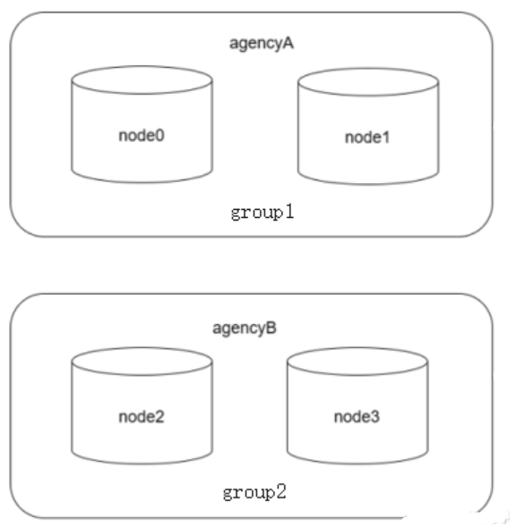
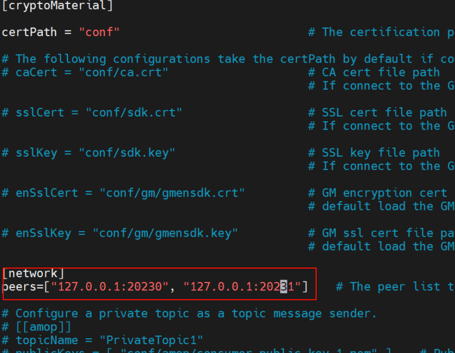
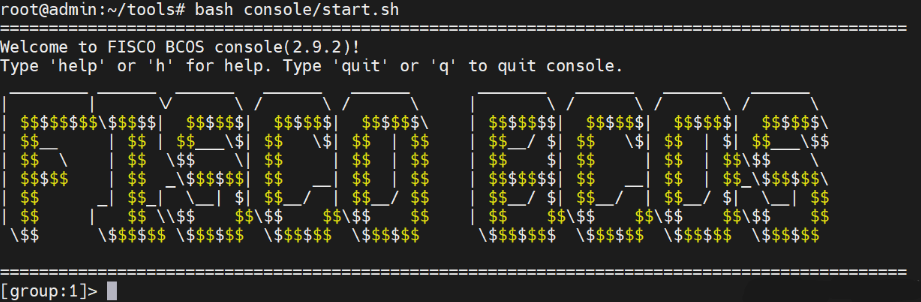
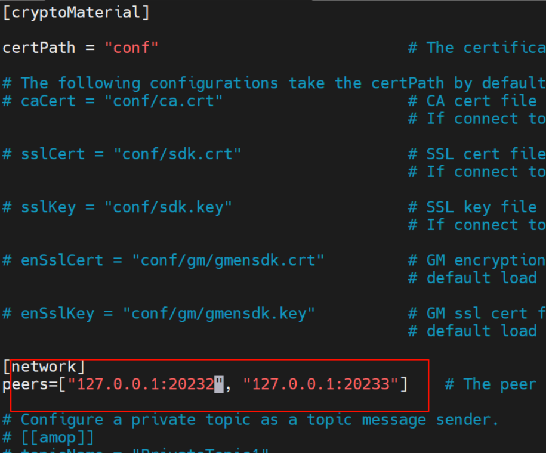
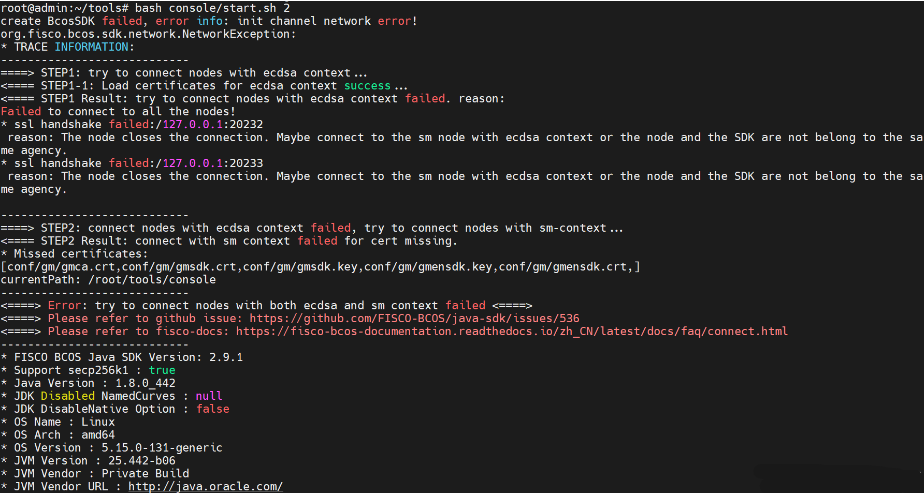
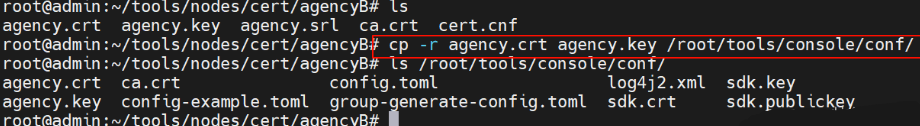
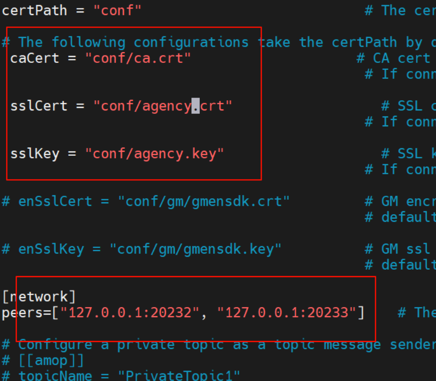
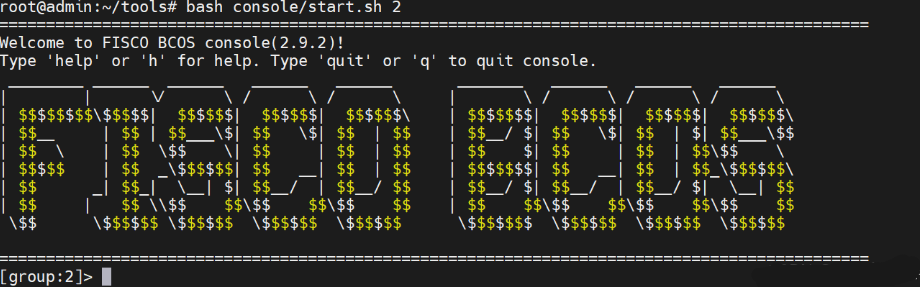

# FISCO BCOS 双机构双群组搭链

基于给定的虚拟机环境以及链环境（地址“/root/tools”），搭建如下图所示的单机、双机构、二群组、四节点的星形组网拓扑区块链系统。



其中，二群组名称分别为 `group1`、`group2`，两个机构名称为 `agencyA`、`agencyB`。
`p2p_port`、`channel_port`、`jsonrpc_port` 起始端口分别为 `30330`、`20230`、`8545`，确保搭建的区块链系统能正常运行。

## 编写 `ipconf` 文件
```bash
127.0.0.1:2 agencyA 1
127.0.0.1:2 agencyB 2
```

## 搭建区块链网络
```bash
bash build_chain.sh -f ipconf -p 30330,20230,8545 -e bin/fisco-bcos
```

命令执行成功会输出 `All completed`。如果执行出错，请检查 `nodes/build.log` 文件中的错误信息。

## 启动节点
```bash
bash nodes/127.0.0.1/start_all.sh
```

## 配置控制台

### 解压
```bash
tar zxvf console.tar.gz
```

### 拷贝控制台配置文件
```bash
cp -r console/conf/config-example.toml console/conf/config.toml
```

### Console 连接 `agencyA` 中节点

#### 拷贝 SDK (SDK 是通过握手信息才确定群组信息)
```bash
cp -r nodes/127.0.0.1/sdk/* console/conf/
```

### 修改配置文件
```bash
vim console/conf/config.toml
```



### 启动控制台
```bash
bash console/start.sh
```
可以看到控制台成功连接到 `agencyA`



## Console 连接 `agencyB` 中节点

### 存在问题
如果使用一开始搭链生成的 SDK 来配置控制台，会出现节点连接失败和握手失败的问题。

### 问题复现
修改控制台配置文件，连接节点的端口为 `agencyB` 的节点。



```bash
root@admin:~/tools# bash console/start.sh 2
create BcosSDK failed, error info: init channel network error!
org.fisco.bcos.sdk.network.NetworkException:
* TRACE INFORMATION:
----------------------------
====> STEP1: try to connect nodes with ecdsa context...
<==== STEP1-1: Load certificates for ecdsa context success...
<==== STEP1 Result: try to connect nodes with ecdsa context failed. reason:
Failed to connect to all the nodes!
* ssl handshake failed:/127.0.0.1:20232
  reason: The node closes the connection. Maybe connect to the sm node with ecdsa context or the node and the SDK are not belong to the same agency.
* ssl handshake failed:/127.0.0.1:20233
  reason: The node closes the connection. Maybe connect to the sm node with ecdsa context or the node and the SDK are not belong to the same agency.

----------------------------
====> STEP2: connect nodes with ecdsa context failed, try to connect nodes with sm-context...
<==== STEP2 Result: connect with sm context failed for cert missing.
* Missed certificates:
[conf/gm/gmca.crt,conf/gm/gmsdk.crt,conf/gm/gmsdk.key,conf/gm/gmensdk.key,conf/gm/gmensdk.crt,]
currentPath: /root/tools/console
----------------------------
<====> Error: try to connect nodes with both ecdsa and sm context failed <====>
<====> Please refer to github issue: https://github.com/FISCO-BCOS/java-sdk/issues/536
<====> Please refer to fisco-docs: https://fisco-bcos-documentation.readthedocs.io/zh_CN/latest/docs/faq/connect.html
----------------------------
* FISCO BCOS Java SDK Version: 2.9.1
* Support secp256k1 : true
* Java Version : 1.8.0_442
* OS Name : Linux
* OS Arch : amd64
* OS Version : 5.15.0-131-generic
* JVM Version : 25.442-b06
* JVM Vendor : Private Build
* JVM Vendor URL : http://java.oracle.com/
```



## 问题解决

需要将 `agencyB` 的 `agency.crt`、`agency.key` 复制到控制台的 `conf` 目录下。
```bash
cp -r agency.crt agency.key /root/tools/console/conf/
```



`ca.crt` 可以用一开始搭链生成的 `sdk` 中 `ca.crt`，也可以使用 `nodes/cert/` 目录下的 `ca.crt`，或者是 `nodes/cert/机构名/` 目录下的 `ca.crt`。
它们的 `ca.crt` 都是一样的。

### 修改控制台配置文件
```bash
vim console/conf/config.toml
```



### 启动控制台
```bash
bash console/start.sh 2
```
可以看到控制台成功连接到 `agencyB`。


