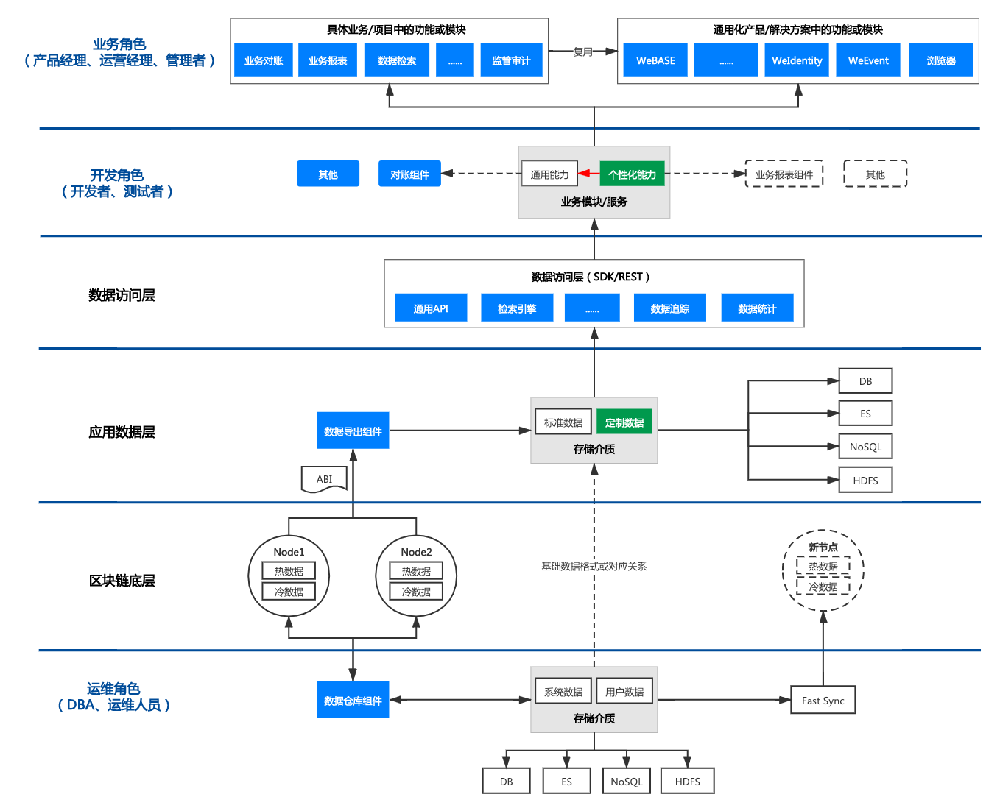
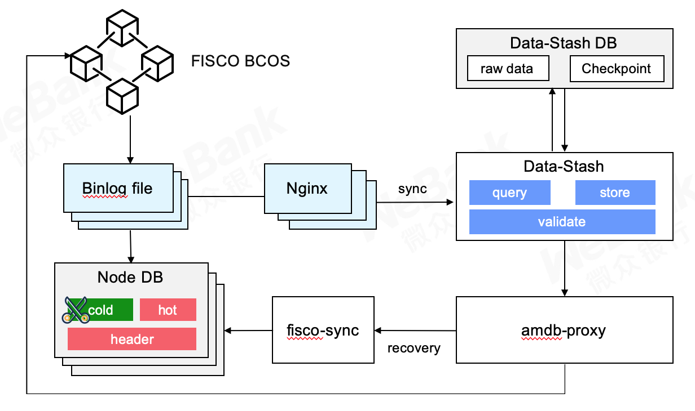

# 数据治理通用组件

标签：``WeBankBlockchain-Data`` ``数据治理`` ``通用组件`` ``数据导出`` ``数据仓库`` ``数据对账``

----

## 组件定位

数据治理通用组件的全名是WeBankBlockchain-Data数据治理通用组件，它是一套稳定、高效、安全的区块链数据治理组件解决方案，可无缝适配FISCO BCOS区块链底层平台。
它由数据导出组件(Data-Export)、数据仓库组件(Data-Stash)、数据对账组件(Data-Reconcile)这三款相互独立、可插拔、可灵活组装的组件所组成，开箱即用，灵活便捷，易于二次开发。
    
这三个组件分别从底层数据存储层、智能合约数据解析层和应用层三个方面，提供了区块链数据挖掘、裁剪、扩容、可信存储、抽取、分析、审计、对账、监管等数据治理方面的关键能力。
WeBankBlockchain-Data已在金融、公益、农牧产品溯源、司法存证、零售等多个行业落地和使用。

## 设计目标

在区块链底层和区块链应用之间，横亘着一条区块链技术、业务和产品的鸿沟，存在着区块链数据扩容难度大、链上数据难以查询和分析、典型场景缺乏通用化产品或组件支持等多种挑战。

社区也经常会有朋友问到：
区块链节点服务器的磁盘快满了，该怎么办？
如何批量查询智能合约里的数据？
我想查询某个账号发过的所有交易怎么查？
微众银行区块链对账方案是怎么做的，有没有通用的解决方案？
……

为什么强大的区块链还有这些问题呢？

首先，随着区块链数据的“爆炸式”增长，链上已经积累了亿计的交易、几T的数据，节点服务器逐渐无法满足交易数据的存储需求，单纯对节点存储空间进行扩容不仅开发成本高、硬件成本高，而且在数据扩容过程中因技术要求较高，易引发系统性风险，且不能一劳永逸地解决问题。另一方面，大量交易冷数据不仅浪费空间，而且会影响区块链节点出块和执行交易的性能。

其次，区块链由于特定的链式存储结构，链上数据只能通过智能合约接口的方式获取和调用，不仅执行效率低下，且随着链上数据的增加，其查询和计算性能逐级衰减，无法满足大数据分析和复杂查询的诉求，比如需要检索已经部署在链上的所有合约。基于特定场景的数据导出解决方案，由于智能合约存在较大差异，需要针对智能合约做特定开发，成本很高，不能复用。

最后，基于区块链的可信数据缺乏通用的产品和可复用的组件，部分场景之间存在类似的需求，比如业务对账、区块链浏览器、业务分析、监管审计等。不同项目之间存在着大量重复的开发，费时费力，同时区块链应用的开发者完成工作目标需要经历陡峭的学习曲线，还可能在开发、测试中引入各类风险。

WeBankBlockchain-Data 从底层数据存储层、智能合约数据解析层和应用层等多个层次入手，提供区块链数据挖掘、裁剪、扩容、可信存储、抽取、分析、审计、对账、监管等数据治理方面的关键能力，满足数据治理全流程开发场景的需求，如下图所示：

区块链数据经过区块链共识节点的多方共识，一旦生成就不会被修改。

在运维层，区块链的历史区块数据可被数据仓库组件完整或部分导出到本地。作为可信存储镜像，导出的数据仅在本地有效，被修改不会影响链上共识。我们建议使用方建立管理方法，限制对本地数据的修改。

在应用数据层，数据导出组件支持导出源数据、初步解析和基于合约解析的多维数据。所有参与者均可部署自己的导出服务，作为本地查询或分析的可信数据源。

在业务层，业务对账组件支持机构内外部对链上链下业务数据进行对账。

## 组件简介
目前，WeBankBlockchain-Data由数据仓库组件(Data-Stash)、数据导出组件(Data-Export)、数据对账组件(Data-Reconcile)三个相互独立、可插拔、可灵活组装的组件构成，后续会根据业务和场景诉求提供更多的功能和解决方案子组件。

### WeBankBlockchain-Data-Stash  数据仓库组件
提供FISCO BCOS节点数据扩容、备份和裁剪的能力。
可基于binlog协议同步区块链底层节点数据，支持断点续传，数据可信验证，并提供快速同步机制。

请参考  
- [Github地址](https://github.com/WeBankBlockchain/Data-Stash)
- [Gitee地址](https://gitee.com/WeBankBlockchain/Data-Stash)
- [文档](https://data-doc.readthedocs.io/zh_CN/latest/docs/WeBankBlockchain-Data-Stash/index.html)
- [快速开始](https://data-doc.readthedocs.io/zh_CN/latest/docs/WeBankBlockchain-Data-Stash/quickstart.html)

### WeBankBlockchain-Data-Export  数据导出组件
支持将链上数据导出到MySQL等结构化存储中，解决区块链数据复杂查询、分析和处理的问题。
只需简单配置、无需开发、即可实时导出个性化的业务数据，实现将裸数据转化为标准化、结构化、有序化、可视化的高价值数据。

请参考  
- [Github地址](https://github.com/WeBankBlockchain/Data-Export)
- [Gitee地址](https://gitee.com/WeBankBlockchain/Data-Export)
- [文档](https://data-doc.readthedocs.io/zh_CN/latest/docs/WeBankBlockchain-Data-Export/index.html)
- [快速开始](https://data-doc.readthedocs.io/zh_CN/latest/docs/WeBankBlockchain-Data-Export/install.html)
    
### WeBankBlockchain-Data-Reconcile  数据对账组件
提供区块链数据的对账解决方案。
灵活配置、无需开发，支持自定义对账数据和对账格式，支持定时对账和触发对账，对账处理模块可插拔可扩展。

请参考  
- [Github地址](https://github.com/WeBankBlockchain/Data-Reconcile)
- [Gitee地址](https://gitee.com/WeBankBlockchain/Data-Reconcile)
- [文档](https://data-doc.readthedocs.io/zh_CN/latest/docs/WeBankBlockchain-Data-Reconcile/index.html)
- [快速开始](https://data-doc.readthedocs.io/zh_CN/latest/docs/WeBankBlockchain-Data-Reconcile/install.html)

## 使用场景

企业级区块链应用存在多元化角色参与，诸如业务角色、运营人员、开发角色、运维角色等。针对区块链数据，每一个特定的角色都有着不同的数据治理诉求。WeBankBlockchain-Data分别从区块链底层节点数据维护、应用数据处理和业务数据应用三个维度，抽象、设计了对应的组件来满足不同角色的对数据治理的需求。

### 场景1：节点数据维护

数据仓库组件Data-Stash是一款针对区块链节点数据处理的轻量化、高安全、高可用组件，主要面向运维人员和开发人员。

数据备份：Data-Stash可以通过Binlog协议对区块链节点数据进行准实时全量备份，区块链节点可以根据实际情况进行冷热数据裁剪和分离，在确保数据安全可信的基础上，解决节点扩容问题，降低开发和硬件成本。在解决节点扩容问题的同时，可以使得节点“轻装上阵”，不仅能够减少节点空间的开销，而且能够有效提升节点执行交易的性能。

数据同步：对于加入区块链网络的新节点，可以通过Data-Stash，在Fisco Sync工具的配合下，快速同步区块链网络的数据，确保节点以最快的速度参与到区块链网络的“工作”中，降低新节点因等待数据同步而造成的时间浪费。

### 场景2：应用数据处理

数据导出组件Data-Export 提供了导出的区块链标准数据、自动基于智能合约代码智能分析而生成的定制数据，存储到MySQL和ElasticSearch等存储介质中，主要面向开发人员。

复杂查询与分析：现有区块链对查询功能不太友好，且链上计算非常宝贵，Data-Export支持将链上存储的区块链数据导出到链下的分布式存储系统中。开发者可以基于已导出的区块链系统基础数据，智能合约部署合约账户、事件和函数等数据，进行二次开发，定制复杂查询和数据分析的逻辑，快速实现业务需求。例如，开发者可对交易明细根据业务逻辑进行统计和关联查询分析，开发各类反洗钱和审计监管报表等等。

区块链数据可视化：Data-Export会自动生成Grafana的配置文件，无需开发，即可实现区块链数据可视化。区块链数据可视化不仅能够作为区块链数据大盘、数据查看、运营分析的工具，同时也可以运用在应用开发、调试、测试阶段，以可见即可得的方式提升研发体验和效率。此外，Data-Export还提供了Restful API供外部系统集成。运维人员可以通过Grafana实时监控业务系统的状态，业务人员可以在集成后的业务后台系统上获得该业务的实时进展。

区块链中间件平台WeBASE的数据导出子系统已经整合了Data-Export，同时，Data-Export也可以独立与区块链底层集成，以灵活地支持业务需求，迄今已在数十个生产系统中稳定、安全运行。

如今，Data-Export作为区块链数据治理的关键组件，以开源形式发布，由社区伙伴通力完善，以适应更多的使用场景、打造更多的功能。

### 场景3：业务数据应用

在业务层，数据对账是区块链交易系统中最常见的场景之一。基于数个区块链DAPP应用的开发和实践经验，我们封装和开发了数据对账组件Data-Reconcile，提供基于区块链智能合约账本的通用化数据对账解决方案，并提供了一套可动态延展的对账框架，支持定制化开发，主要面向开发人员，为业务人员提供服务。

企业内部对账：Data-Reconcile支持企业内部系统之间的对账，例如区块链链上数据与链下业务系统之间的对账。开发人员可以利用Data-Reconcile快速进行二次开发，将业务系统数据和链上数据进行核算比对，保证了企业内部业务系统数据的可靠和运行安全。

企业间对账：Data-Reconcile可以帮助开发者快速构建跨机构间的对账应用系统。例如，在结算时，A企业定期将自身业务系统交易数据导出为对账文件，发送至与文件存储中心。B企业可借助Data-Reconcile定期拉取A企业对账文件，配合Data-Export，与企业内部的链上数据进行对账处理。Data-Reconcile在保证对账结果可信的同时提升了对账的效率，可实现准实时对账。

综上所述，WeBankBlockchain-Data 是一套稳定、高效、安全的立体化区块链数据治理解决方案，旨在通过提供一系列相互独立、可插拔、可灵活组装的组件，应对和处理区块链海量数据的问题，为用户带来更加便捷、简单、低成本和轻量化的用户体验，从而推动区块链数据治理的发展。

