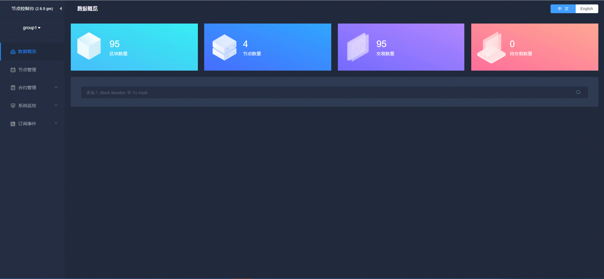

# WeBASE管理平台

标签：``WeBASE`` ``中间件平台`` ``节点管理`` ``系统监控`` ``系统管理`` 

----
微众银行开源的自研区块链中间件平台——[WeBASE(WeBank Blockchain Application Software Extension)](https://webasedoc.readthedocs.io/zh_CN/latest/) 是区块链应用和FISCO BCOS节点之间搭建的中间件平台。WeBASE屏蔽了区块链底层的复杂度，降低区块链使用的门槛，大幅提高区块链应用的开发效率，包含节点前置、节点管理、交易链路，数据导出，Web管理平台等子系统。用户可以根据业务所需，选择子系统进行部署，可以进一步体验丰富交互的体验、可视化智能合约开发环境IDE。

WeBASE管理平台是由四个WeBASE子系统组成的一套管理FISCO-BCOS联盟链的工具集。详细了解可以参考[《WeBASE管理平台使用手册》](https://webasedoc.readthedocs.io/zh_CN/latest/) 。

## 主要功能

1. 区块链数据概览
2. 节点管理
3. 合约管理
4. 私钥管理
5. 系统管理
6. 系统监控
7. 交易审计
8. 订阅事件
9. 账号管理
10. 群组管理

## WeBASE管理平台搭建
搭建可参考[《WeBASE一键部署文档》](https://webasedoc.readthedocs.io/zh_CN/latest/docs/WeBASE/install.html)。

### [WeBASE快速入门](https://webasedoc.readthedocs.io/zh_CN/latest/docs/WeBASE-Install/developer.html)
开发者只需要搭建节点和节点前置服务(WeBASE-Front)，就可通过WeBASE-Front的合约编辑器进行合约的编辑，编译，部署，调试。搭建可参考[《WeBASE快速入门文档》](https://webasedoc.readthedocs.io/zh_CN/latest/docs/WeBASE-Install/developer.html)。

### [WeBASE管理台](https://webasedoc.readthedocs.io/zh_CN/latest/docs/WeBASE/install.html)
通过WeBASE一键脚本，可以搭建一个WeBASE的基础环境，可以方便用户体验WeBASE核心功能如：区块浏览，节点查看，合约IDE，系统管理，节点监控，交易审计，私钥管理。搭建可参考[《WeBASE一键部署文档》](https://webasedoc.readthedocs.io/zh_CN/latest/docs/WeBASE/install.html)。
### [WeBASE其他](https://webasedoc.readthedocs.io/zh_CN/latest)
WeBASE其他组件可以参考[《WeBASE文档》](https://webasedoc.readthedocs.io/zh_CN/latest)

[build_chain_code]:https://github.com/FISCO-BCOS/FISCO-BCOS/blob/master/manual/build_chain.sh
