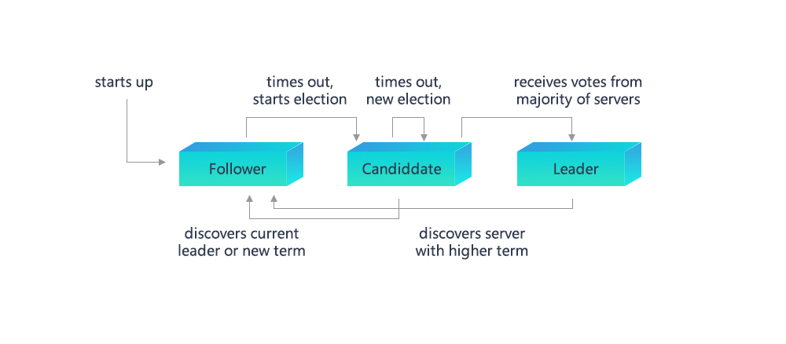

# Raft

## 1 Definitions

### 1.1 Raft
Raft（Replication and Fault Tolerant）is a partition tolerant consistency protocol, which ensures the system consistency in a N-node system with (N+1)/2 (ceil to int) working nodes. For example, a 5-node system allows 2 nodes to appear Byzantine error, like node crashing down, network partition, message delay. Raft is easier to understand than Paxos, and it is proved to have the same fault tolerance and performance with Paxos. For detail introduction please check the [website](https://raft.github.io/) and [dynamic demonstration](http://thesecretlivesofdata.com/raft/).

### 1.2 Node type

In Raft algorithm, each node owns one of the three identities: **Leader**, **Follower** and **Candidate**:
* **Leader**：interact with outsider, elected by Follower nodes, each consensus round contains one and only Leader node, who is responsible for taking transaction out of txPool, sealing block and writing it on chain;
* **Follower**：synchronize in light of leader node, select new leader node when the old leader becomes invalid;
* **Candidate**：contemporary identity of Follower nodes during election of leader.

### 1.3 Node ID & node index
In Raft algorithm, each nodes has a fixed and only ID (usually a 64-byte string), which is node ID; each consensus node maintains a public consensus node list, which records the ID of each consensus node. Node index refers to the location of the node in the list.

### 1.4 Terms
Raft algorithm divides time into Terms with uncertain length. Terms is sequential numbers. Each Term starts from election, if election succeeds, the current leader generates blocks; if fails and no leader is elected, a new Term and round of election will be started.


## 1.5 Message
In Raft algorithm, nodes communicate with each other by sending messages. Current Raft model contains 4 kinds of message: **VoteReq**, **VoteResp**、**Heartbeat**, **HeartbeatResp**:
* **VoteReq**：vote request, sent by Candidate nodes to other nodes for leader election;
* **VoteResp**：vote response, used to respond the vote request by approve/disapprove the request;
* **Heartbeat**：heartbeat, sent by leader node periodically with 2 functions: (1) to maintain leader's identity, which will not change as long as leader can send heartbeat and receive response from other nodes; (2) to replicate block data, leader node will encode block data to its heartbeat and broadcast the block after sealing it, other nodes receives the heartbeat and decode the block data and place the block to their buffers;
* **HeartbeatResp**：heartbeat response after node receives heartbeat, when the heartbeat contains block data, the heartbeat response will contain hash of the block;

Fields commonly contained in messages are:

| field   | definition                     |
| --------- | ---------------------------- |
| idx       | self index of node                 |
| term      | term of current node           |
| height    | highest block number of this node |
| blockHash | hash of the highest block of this node  |

Fields exclusive in each message type include:
<table border="1" cellspacing="0" cellpadding="0">
<thead>
  <tr>
    <td>message type</td>
    <td>field</td>
    <td>definition</td>
  </tr>
</thead>
<tr>
  <td rowspan="3" align="left">VoteReq</td>
  <td>candidate</td>
  <td>Candidate node self index</td>
</tr>
<tr>
    <td>lastLeaderTerm</td>
    <td>Term of the last leader met by Candidate, the detail functions are introduced in 3.1.2 section</td>
</tr>
<tr>
  <td>lastBlockNumber</td>
  <td>Number of the latest block met by Candidate, the detail functions are introduced in 3.1.2 section</td>
</tr>
<tr>
  <td rowspan="2" align="left">VoteResp</td>
  <td>voteFlag</td>
  <td>flag the vote request to mark whether it's approved or not, if not, mark the reject reason, the detail functions are introduced in 3.1.2 section</td>
</tr>
<tr>
  <td>lastLeaderTerm</td>
  <td>Number of the latest block met by nodes that receive VoteReq, the detail functions are introduced in 3.1.2 section</td>
</tr>
<tr>
  <td rowspan="3" align="left">Heartbeat</td>
  <td>leader</td>
  <td>index of leader node who sends heartbeat</td>
</tr>
<tr>
  <td>uncommitedBlock</td>
  <td>when Leader node prepares to commit a new block, it will encode block data to the field and broadcast it through heartbeat, the detail functions are introduced in 3.2 section</td>
</tr>
<tr>
  <td>uncommitedBlockNumber</td>
  <td>block number of uncommitedBlock, the detail functions are introduced in 3.2 section</td>
</tr>
<tr>
  <td rowspan="1" align="left">HeartbeatResp</td>
  <td>uncommitedBlockHash</td>
  <td>when receiving uncommitedBlock data from leader, nodes write the hash of uncommitedBlock (fingerprint) into heartbeat response, and send back to leader, stating that nodes have received the block data leader prepared to commit, the detail functions are introduced in 3.2 section</td>
</tr>
</table>

## 2 System framework
The system framework is as below:


* Raft Sealer：take transaction out of txPool and seal block and send to Raft Engine for consensus; delete the on-chain transactions from txPool;
* Raft Engine：start consensus process within consensus nodes and write the consensused block to blockchain.

## 3 Core process

### 3.1 Node status transfer
The relations of node types are shown as below. And the transfer of each status will be introduced in the following context:



#### 3.1.1 Election
Raft consensus model adapts heartbeat mechanism to start leader election. Node is set as follower of Term 0 since started. As long as follower can receive valid heartbeat or RequestVote message from leader or candidate, it will stay in follower status. If follower doesn't receive these messages in some time (which is called ***Election Timeout***), it will assume that the leader is invalid and increase its Term to become candidate, then a new round of leader election will be started:
1. Follower increases its Term, and becomes Candidate;
2. Candidate votes for itself and broadcasts RequestVote to other node for votes;
3. Candidate node keeps in Candidate status unless: (1) the node wins election; (2) Candidate receives heartbeat from other node during election; (3) no leader is elected after *Election Timeout*. Raft algorithm avoid even votes of nodes by random timer to ensure only one node will be time-out and enter candidate status and get most votes to become leader.

#### 3.1.2 Vote
Node will respond with different strategies according to the content of received VoteReq:
1. ***Term of VoteReq less than or equal self Term***

    * If the node is Leader, disapprove the request. Candidate becomes Follower after receiving the response and increases timeline of voting;
    * If the node is not leader:
        * If Term of VoteReq is less than self Term, disapprove the request. If Candidate receives more than half of the same response, it is time-out and becomes follower and increase timeline of voting;
        * If Term of VoteReq equals self Term, disapprove the request and process no more. Each node can only vote to one Candidate on a first come basis, in order to ensure there will be only one Candidate will be elected to be Leader in each round.

2. ***lastLeaderTerm of VoteReq less than self lastLeaderTerm***

    Each node has a lastLeaderTerm field to indicate the Term of the last Leader it has witnessed. LastLeaderTerm can only be updated by Heartbeat. If the lastLeaderTerm in VoteReq is less than self lastLeaderTerm, then it has problem for leader to access the Candidate. If currently Candidate is in internet silos, it will keep sending vote request to outside, therefore nodes need to disapprove the request to stop it.

3. ***lastBlockNumber of VoteReq is less than self lastBlockNumber***

    Each node contains a lastBlockNumber field to indicate the block number of the latest block witnessed by nodes. During block generation, nodes will replicate block (please check 3.2 section for details), during which there can be part of nodes who receive the new block data and part of nodes who don't. This will cause inconsistency in lastBlockNumber of each node, to solve which nodes need to vote for node who has the newest data. Therefore, node will disapprove the vote request under this circumstance.

4. ***node vote for the first time***

    To avoid Follower restarting election due to network dithering, it is stipulated that for the first time of node to vote, it should disapprove the request, and set its firstVote field to the index of the Candidate.

5. ***Not disapprove vote request in step 1~4***

   Approve the vote request.

#### 3.1.3 Heartbeat time-out
When Leader becomes internet silos, though it can send heartbeat which can also be received by Follower, it cannot receive heartbeat response. In this situation Leader suffers internet problems, which can stuck the system for it can still send heartbeat to Follower who therefore cannot transfer status. To solve this problem, the model adopts heartbeat time-out mechanism. Leader will record each heartbeat response, if it stops update overtime, Leader will abandon its identity and transfer to Follower.

### 3.2 Block replication
Raft protocol strongly depends on the usability of Leader to ensure consistency of group data, because data can only be transferred from Leader to Follower. When Raft Sealer commits block data to group Leader, Leader will set the data to uncommitted status first, attach it with heartbeat for Follower to replicate and respond. When half of nodes are confirmed having received the data, it will write the data into data base, then the block data transfer to committed status. After that, Leader broadcasts the data to Follower through Sync model. The process of block replication is as below:

```eval_rst
.. mermaid::

  sequenceDiagram
    participant Sealer
    participant Leader
    participant Follower

    Sealer->>Leader: seal the transaction to block, stuck itself
    Leader->>Follower: encode the block to RLP code and attach to heartbeat package]
    Note right of Follower: decode heartbeat package, write <br/> the decoded block <br/> to cache
    Follower->>Leader: send ACK
    loop collect ACK
      Leader->>Leader: check if most nodes has received and replicated block
    end
    Leader->>Sealer: stop stuck
    Leader->>Leader: execute block
    Leader->>Leader: abandon on-chain transaction

```

The conditions of RaftSealer to verify whether the transaction can be sealed include: (1) Leader node; (2) there is non-syncing peer; (3) uncommitBlock field is empty. Only when 3 of them are met can the transaction be sealed.

