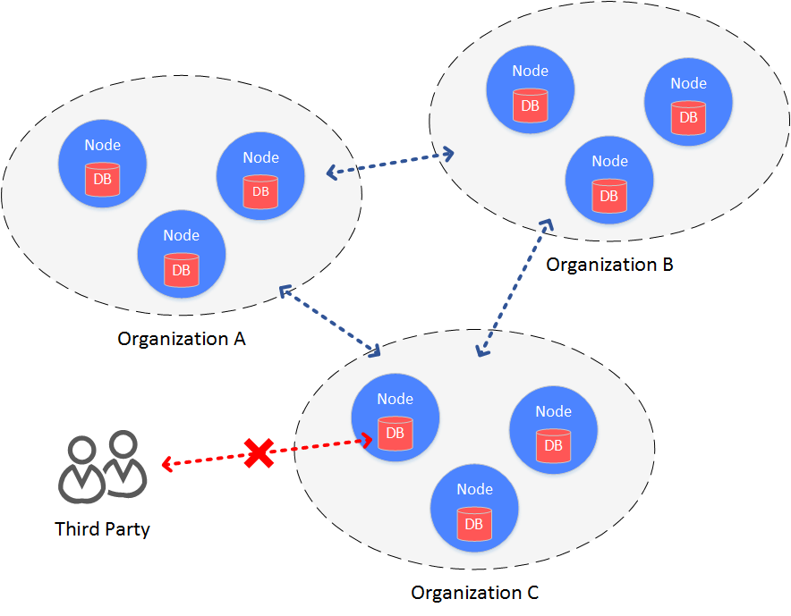
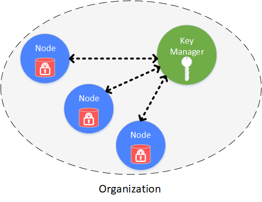
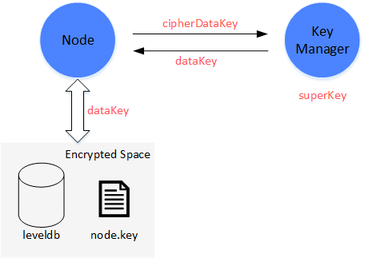

# Disk encryption

## Background

In consortium chain structure, all agencies build a chain between each other, making data accessible to each agency.

When it comes to cases the require high data security, consortium members want to prevent other agencies to access the data on blockchain. Therefore, access control needs to be adopted on the data on consortium chain.

There are 2 aspects of data access control in consortium chain:

* access control on communication data
* access control on node storage data

FISCO BCOS manages access of communication data through node certificate and SSL verification. The following context introduces about its access control on node storage data, which is, disk encryption.





## Concept

Disk encryption is conducted inside each agency. Each agency encrypts the disk of node data internally. When the disk is taken away from the agency and the node is started in external network, the disk will be unable to be decrypted and the node fail to be started. So data in the consortium chain will be well-protected.

## Solution





Disk encryption is conducted and managed securely and independently by each agency. Disk of each node is encrypted. The access of encrypted data is managed by key manager, which is deployed inside agency and manages key to node disk data that is not open to outside network. When the node is started, it will acquire the key from key manager to access its own encrypted data.

The following objects are encrypted:

* node local database: leveldb
* node private key: node.key，gmnode.key (OSCCA)

## Implementation

The implementation of disk encryption is realized by dataKey (hold by node itself) and superKey (managed by key manager).

**Node**

* node encrypts and decrypts its Encrypted Space by dataKey.
* node doesn't store dataKey in local disk, but stores the encrypted dataKey-cipherDataKey.
* When node is started, it requests dataKey from key manager by cipherDataKey.
* DataKey is only in storage of node, when node is stoped, dataKey will be discarded.

**Key Manager**

Key manager holds superKey and responds to the access requests from all started nodes.

- Key Manager has to be on line in real time to respond to nodes' start request.
- When node is started, it will send cipherDataKey to Key Manager to decrypt it by superKey. If succeed, key manager will return dataK to node.
- Key Manager can only be accessed within internal network.




## Process

Process of disk encryption includes node initial config and node safe operation.

### Node initial config
Before started, dataKey of node needs to be configured

```eval_rst
.. important::
    When node is generated, before started, it has to be decided whether to adopt disk encryption. Once configured and started, node's status cannot be transferred.
```

（1）Manager defines dataKey of node and sends to Key Manager to acquire cipherDataKey.

（2）Configure cipherDataKey to node config file

（3）Start node

### Node safe operation

When node is started, it will acquire dataKey from key manager to access local data.

（1）Start node, read cipherDataKey in config file and send to Key Manager.

（2）Key Manager receives cipherDataKey and decrypts it using superKey, sends the decrypted dataKey back to node.

（3）Node gets dataKey to interact with local data (Encrypted Space). Data in Encrypted Space will be decrypted by dataKey, which is also needed for encryption when writing data to Encrypted Space.

### How can it protect data?

When a node's disk is accidentally brought to external network, the data will not be exposed.

（1）When node is started in external network, it will fail to connect with Key Manager and acquire dataKey, even though is has cipherDataKey.

（2）When node is not started, the local data can not be exposed in that there is no dataKey for decryption of Encrypted Space.


The detail operations of disk encryption are introduced here: [Operations of disk encryption](../../manual/storage_security.md).
