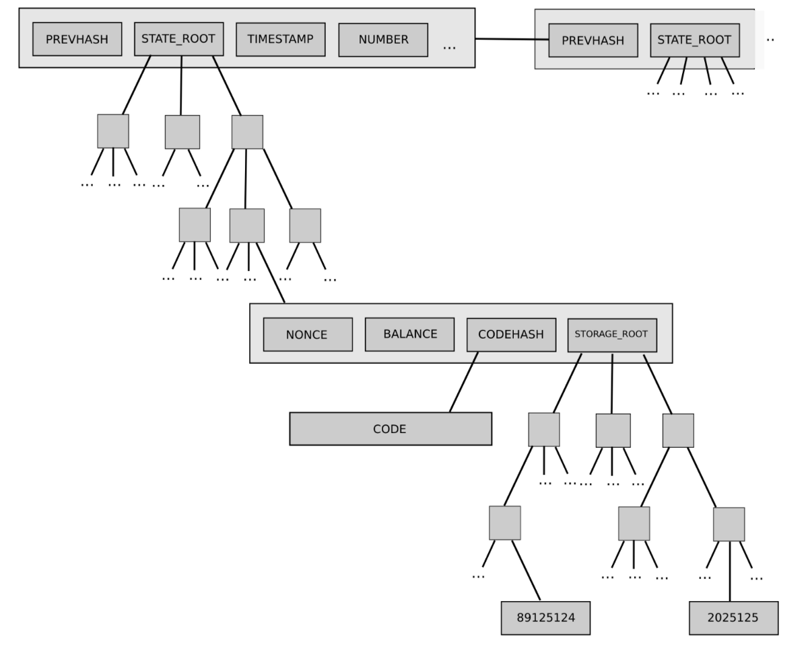

# MPT State

MPT State is a classic data storage type in Ethereum. Through MPT tree, all contract data is organized to be inquired and retrieved.

```eval_rst
.. important::
    Recommend to ues **storage state**.
```

## MPT tree

MPT(Merkle Patricia Trie) is a prefix tree to index data by hash.

In a broad sense, MPT is a prefix tree to retrieve value by key, which is using key to index in MPT tree, after passing middle nodes it will arrive at the leaf node that stores the data.

Narrowly speaking, MPT tree is a Merkle tree. Each node on tree is indexed by hash of the node. When using key to retrieve value, it will get the hash of next node first so as to retrieve the data of the next node from the bottom database, and then use key to get the hash of the next next node until it arrives at the leaf node stored with value.

When a leaf node of MPT tree updates its data, the hash of the node will be updated too. Consequently, the hash of all middle nodes backtracking to root node will be updated. Finally, hash of the root node will be updated. When searching new data, locate the root node by its new hash, and iterate back by layers to reach the new data. If searching historical data, locate the old root node by its old hash and iterate down to reach the historical data.

Implementation diagram of MPT tree (source of picture: the Ethereum Yellowpaper)


## State

Data is stored in accounts in Ethereum. Each account stores contract (user) code, parameter, nonce, etc., which is retrieved by account address. Ethereum makes address as the key for query of account by MPT.

As the change of account data, the hash will change accordingly. Meanwhile, hash of the MPT root changes too. Different account data indicates different MPT root. For this aspect, Ethereum proposes a concept called State, in which the hash of MPT root is called State Root. Different state roots refers to different states, and will lead to different MPT root nodes. And then search account data of this state from different root nodes through account address. Different state may lead to different MPT root nodes and accounts.

State root is a field of block. Each block has different state. Operation of transactions in block will change data of account. Account data varies in each block, so as the block state, specifically, state root. The history data of account can be retrieved by taking out the state root of block to locate the MPT root node..

(source of picture: the Ethereum Yellowpaper)



## Trade Off

MPT State is imported to retrieve data, The historical information of account can be retrieved according to the state root of block. However, it also brings out massive hash computings and breaks the consecutiveness of bottom data storage. MPT state is born with disadvantages in performance. We can say that MPT State has extremely good traceability at the cost of performance.

In transactional cases of FISCO BCOS, performance matters more than traceability. Therefore, FISCO BCOS has re-designed the bottom storage and implemented [Storage State](storage.md). Storage State has better performance regardless of losing part of traceability.

