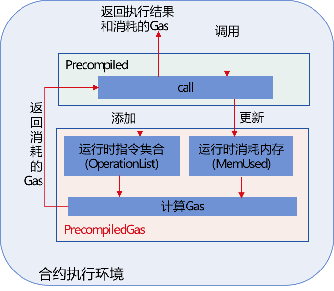
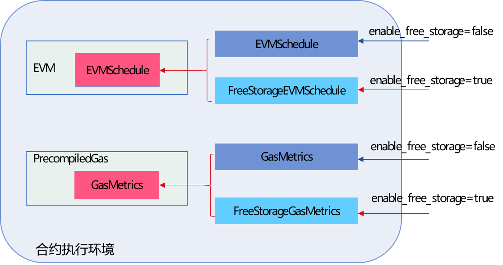

# Gas

The EVM virtual machine has a full set of Gas mechanisms to measure the CPU, memory and storage resources consumed by each transaction on the chain. FISCO BCOS 2.0 introduced the Precompiled contract and supports the built-in C ++ contract. To improve the security of the Precompiled contract, FISCO BCOS v2.4.0 introduced the Gas mechanism in the Precompiled contract.

In addition, in the original gas mechanism of EVM, the main gas consumption of transactions comes from storage. Considering that the consortium chain scenario pays more attention to CPU and memory consumption, FISCO BCOS v2.4.0 adjusts the storage gas and introduces the `Free Storage` Gas measurement mode to improve The proportion of CPU and memory in the transaction gas consumption.


## Precompiled contract supports Gas calculation

```eval_rst
.. note::
    The feature of Precompiled contract supporting Gas calculation is supported from v2.4.0. When ``supported_version`` is less than v2.4.0, or the old chain directly replaces binary upgrade, this feature is not supported.
```

### Module architecture

FISCO BCOS v2.4.0 has added a `PrecompiledGas` module for Gas calculation. Gas overhead mainly includes three dimensions of CPU, memory and storage. The module diagram is as follows:



`PrecompiledGas` mainly records the basic operations that are called during the execution of the Precompiled contract for each transaction, and the gas consumption of the memory. The Gas calculation procedure when the transaction calls the Precompiled contract is as follows:

- When the virtual machine executes the transaction to call the `call` interface of the `Precompiled` contract, each time a basic operation is called, its corresponding `OPCode` is added to the **runtime instruction set** of `PrecompiledGas`

- When the virtual machine executes the transaction and calls the `call` interface of the` Precompiled` contract, when the memory occupied by the basic operation changes, the memory consumed by the `PrecompiledGas` runtime will be updated

- After the execution of the `Precompiled` contract, the interface can be called to calculate the gas consumption of the `Precompiled` contract based on the instruction set and memory consumed during the process of running the `Precompiled` contract.


### Precompiled contract Gas measurement standard

FISCO BCOS Precompiled contract Gas measurement reference EVM, mainly including CPU, memory and storage three dimensions. The specific Gas calculation method of the Precompiled contract is described in detail below.

#### Precompiled contract memory Gas calculation

Precompiled contract memory consumption mainly comes from input, output and additional memory consumption generated at runtime. When the total memory consumed by a transaction is `txMemUsed`, the corresponding memory Gas calculation formula is as follows. That is: every 32 bytes increase the memoryGasUnit gas, the value of memoryGasUnit is 3.

```
    MemoryGas(txMemUsed) = memoryGasUnit * txMemUsed / 32 + (txMemUsed * txMemUsed)/512
```

#### Precompiled contract CPU and storage Gas calculation

In order to calculate the gas consumed by the basic operation of the Precompiled contract, FISCO BCOS v2.4.0 maps the Precompiled contract to a specific operation code and defines the Gas corresponding to each basic operation.

##### The opcode corresponding to the basic operation of the Precompiled contract

The `PrecompiledGas` module maps the basic operations of the Precompiled contract to the operation codes as follows:

operations | Descriptions | Opcode
-|-|-
EQ | ConditionPrecompiled EQ call to determine whether two operands are equal | 0x00 |
GE | ConditionPrecompiled GE call to determine whether the lvalue is greater than or equal to the rvalue | 0x01 |
GT | ConditionPrecompiled GT call to determine whether the lvalue is greater than the rvalue | 0x02 |
LE | ConditionPrecompiled LE call to determine whether the lvalue is less than or equal to the rvalue | 0x03 |
LT | ConditionPrecompiled LT call to determine whether the lvalue is less than the rvalue | 0x04 |
NE | ConditionPrecompiled NE call to determine whether the lvalue is not equal to the rvalue| 0x05 |
Limit | ConditionPrecompiled Limit call to limit the number of data queried from the CRUD interface | 0x06 |
GetInt | EntryPrecompiled getInt call, convert the string to int256/uint256 and return | 0x07 |
GetAddr | EntryPrecompiled getAddress call to convert the string to Address | 0x08 |
Set | EntryPrecompiled set call, set the value of the specified Key to the specified Value | 0x09 |
GetByte32 | EntryPrecompiled getByte32, convert string to byte 32| 0x0a |
GetByte64 | EntryPrecompiled getByte64, convert string to byte 64 | 0x0b |
GetString | EntryPrecompiled getString to get the value corresponding to the entered Key | 0x0c |
CreateTable | TableFactoryPrecompiled createTable call to create table | 0x0d |
OpenTable | OpenFactory call of TableFactoryPrecompiled to open the table | 0x0e |
Select | TablePrecompiled select call, query table | 0x0f |
Insert | Insert call of TablePrecompiled to insert the specified record into the table | 0x10 |
Update | The update call of TablePrecompiled updates the specified record in the specified table | 0x11 |
Remove | TablePrecompiled's remove call deletes the specified record in the specified table | 0x12 |
PaillierAdd | Homomorphic plus interface | 0x13 |
GroupSigVerify | Group signature verification interface | 0x14 |
RingSigVerify | Ring signature verification interface | 0x15 |


##### Precompiled contract basic operation measurement standard

`PrecompiledGas` defines the Gas consumption corresponding to each basic operation of the Precompiled contract, as follows:

操作 | Gas消耗
-|-
EQ | 3 |
GE | 3 |
GT | 3 |
LE | 3 |
LT | 3 |
NE | 3 |
Limit | 3 |
GetInt | 3 |
GetAddr | 3 |
Set | 3 |
GetByte32 | 3 |
GetByte64 | 3 |
GetString | 3 |
CreateTable | 16000 |
OpenTable | 200 |
Select | 200 |
Insert | 10000 |
Update | 10000 |
Remove | 2500 |
PaillierAdd | 20000 |
GroupSigVerify | 20000 |
RingSigVerify | 20000 |


## EVM Gas measurement standard plug-in

As mentioned above, when measuring transaction resource consumption for some scenarios, more attention is paid to CPU and Gas. FISCO BCOS v2.4.0 introduces the Gas measurement mode of `Free Storage` to increase the proportion of CPU and memory in transaction Gas consumption.


```eval_rst
.. note::
    The EVM Gas measurement standard supports the feature of plug-in configuration starting from v2.4.0. This feature is not supported when ``supported_version`` is less than v2.4.0, or the old chain directly replaces binary upgrade
```

### 模块架构

In order to support the Gas measurement standard plug-in configuration and FreeStorage's Gas measurement mode, FISCO BCOS v2.4.0 introduces `FreeStorageEVMSchedule` in the Ethereum EVMSchedule, introduces `FreeStorageGasMetrics` on the basis of PrecopmiledGas ’GasMetrics, and according to `evm.enable_free_storage` in the `genesis` file Configuration items determine which Gas measurement mode is enabled, as shown below:



In order to increase the proportion of CPU and memory in transaction gas consumption, `FreeStorageEVMSchedule` adjusts the gas consumption of creating contracts, `SSTORE`, `SLOAD` and other operations; `FreeStorageGasMetrics` mainly adjusts `CreateTable`, `Insert`, `Gas consumption for Remove`, `Update` and other operations.

### Gas measurement standard

The following describes the EVM virtual machine and Precompiled contract Gas measurement standards in non-FreeStorage mode and FreeStorage mode:

**EVM virtual machine Gas measurement standard**


Gas | Description | Gas consumption in EVMSchedule mode | Gas consumption in FreeStorageEVMSchedule mode
-|- | - | - 
CreateGas | Gas consumption for contract creation  | 32000 | 16000 |
sloadGas| Gas consumed by reading 32 bytes of data from storage  | 200 |  1200|
sstoreSetGas| Add 32 bytes of data to the stored Gas consumption | 20000 | 1200 |
sstoreResetGas| Update Gas consumption of 32 bytes of stored data |5000 | 1200 |

 **Precompiled contract Gas measurement standard**


Gas | Description| Gas consumption in GasMetrics mode | Gas consumption in FreeStorageGasMetrics mode
-|- | - | - 
CreateTableGas| Gas consumption for creating tables | 16000 | 500 | 
StoreGas| Gas consumption for inserting data into or updating data in a table | 10000 | 200 | 
RemoveGas| Gas consumption to delete data in the table | 2500 | 200 | 


### Configuration item

```eval_rst
.. note::
    The EVM Gas measurement standard supports plug-in configuration items located in the `` genesis`` file. For details, please refer to `here <../../manual/configuration.html#evm>`_ 
```