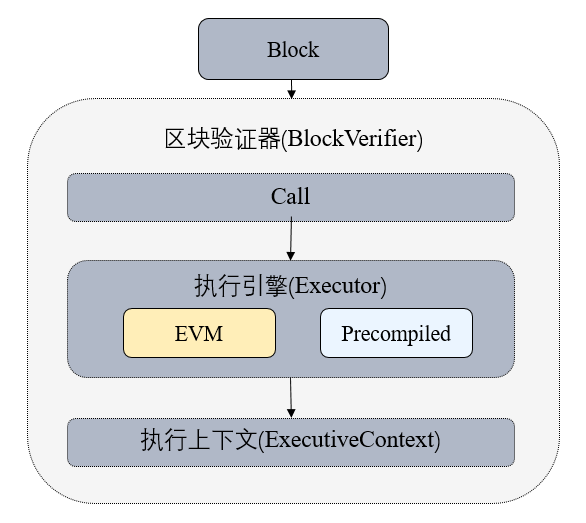

## Precompiled contract

Precompiled contract offers a method to program contract using C++. It separates contract logic with data, and has better performance than solidity contract. The update can be achieved by modifying the codes in bottom layer.

### Precompied contract and solidity contract

|table      |  precompiled contract                         |     Solidity contract|
|:--------|:-----|:-----|
|address      | fixed address, defined in codes                      |   confirmed during deployment|
|contract code  |  data stored in table, separate with contract, contract logic can be updated|     contract variety and data stored in MPT tree|
|execution      | in C++ bottom layer, higher performance, support parallel execution       |    EVM virtual machine， serial execution|

### Model structure

The structure of Precompiled is as below:
- Block verifier will verify type of contract by the address of the called contract during transaction execution. Address 1-4 indicates Ethereum Precompile contract; address 0x1000-0x10000 belongs to C++ Precompiled contract, other addresses belong to EVM contract.



### Crucial process
- The execution of Precompiled contract needs a object acquired through contract address.
- Each Precompiled contract object will implement `call` API, in which the detail logic of Precompile contract is implemented.
- `call` programs according to abi of transaction, acquires `Function Selector` and parameter, and executes the relative logic.

```eval_rst
.. mermaid::

    graph TB
        Start(Start) --> branch1{Precompiled contract}
        branch1 --> |Yes|op1[acquire contract object through address]
        branch1 --> |No|op2[EVM]
        op1 --> op3[analyze call function and parameter]
        op3 --> End(return execution result)
        op2 --> End(return execution result)
```

### API definition

Every Precompiled contract has to realize its own `call` API, which accepts 3 parameters: `ExecutiveContext` executive context, abi code of `bytesConstRef` and exterior account address to judge whether it has write permission.[`Precompiled` source code](https://github.com/FISCO-BCOS/FISCO-BCOS/blob/04db9d5e9d7a9d321d90cef8dc5e2010a53ed8d3/libprecompiled/Precompiled.h#L37).

|API|Parameter description|Api description|
|:----|:------|:------|
|`virtual bytes call(std::shared_ptr<ExecutiveContext> context, bytesConstRef param, Address const& origin = Address())`|`context` is block executive context, `param` is the parameter of abi code, `origin` is address of the called exterior account|implementation of contract API|
|`virtual uint32_t getParamFunc(bytesConstRef param)`|`param` is the parameter of abi code|acquire `Function Select` (the former 4 big endian byte of sha3 in function name) of the called function|
|`virtual uint32_t getFuncSelector(std::string const& _functionName)`|`_functionName` is function name|calculate `Function Select` according to the function name|
|`virtual bytesConstRef getParamData(bytesConstRef param)`|`param` is the parameter of abi code|acquire abi code of parameter of the called function|
