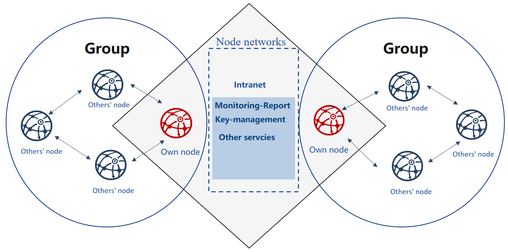

# Enterprise deployment tool

**Introduction**

[FISCO BCOS generator](https://github.com/FISCO-BCOS/generator) provides companies with an easy toolkit for deployment, administration, and monitoring of multi-group consortium chain.

-   It eliminates the complexity of generating and maintaining the blockchain and offers alternative deployment methods.
-   It requires agencies to share node credentials and manage their private key but not exposed to the outsider, maintaining the security of all nodes.
-   It helps agencies deploy nodes safely through e-certificate trading, supporting equality of all nodes.



**Design background**

There cannot be exhaustive trust between equal agencies in consortium chain, where e-certificate will be needed for nodes to authenticate each other’s identity.

The certificate is the identity documentation for each agency. And the generation of the certificate depends on its public & private key pair. The private key represents its identity information that is private and strictly confidential. In the process of activation and operation, node signs on the data packet with the private key to fulfilling identity authentication. Provided that an agency’s private key is revealed, anyone else can pretend as the owner and get authorized without the affirmation of this agency.

```eval_rst
.. important:
    During deployment and operation of the consortium chain, each agency is the only generator and custodian of its private key, and should never reveal it to anyone.
```

When initializing the group of FISCO BCOS, nodes should reach an agreement to create a Genesis Block. Genesis Block, unique and only within one group, bears the identity information of the initial nodes, which is formed through e-credential exchanging.

Current IT administration tools for consortium chain usually ignore the requirement for equality and security of companies during initialization. And initialization needs agencies to agree on identity information on Genesis Block. So, who should be the information generator is crucial. Firstly, an agency generates its node information first and then activate blockchain for other nodes to join in. Secondly, a third-party authority makes information for all nodes and sends the node configuration files to each agency.

Additionally, FISCO BCOS 2.0+ adapts more private and scalable multi-group architecture. It is an architecture where data and transactions between groups are separated by running independent consensus algorithm, a way to maintain privacy and security in blockchain scenarios.

In the above models, there is always one agency who gains priority to join the consortium chain or acquires private keys of all nodes.

How to make sure the group is formed in a balanced, safe, and private way? How to guarantee reliable and effective operation of nodes? The privacy and security of group ledgers, as well as the confidentiality of group formation and maintenance, need to be achieved efficiently.

**Design concept**

FISCO BCOS generator is a solution designed for problems described above. It takes into consideration the equal deployment and group formation of different agencies based on flexibility, security, ease-of-use, and equality.

Flexibility:

-   No installation, ready to use
-   Alternative deployment methods
-   Allow multiple changes in architecture

Safety:

-   Allow multiple changes in architecture
-   The private key is kept internally
-   Negotiation between agencies is based on certificates only

Ease-to-use:

-   Support multiple networking models
-   Alternative commands for various needs
-   Monitor audit script

Equality:

-   The equal authority of agencies
-   All agencies co-generate Genesis Block
-   Same administrative power within groups

For consortium chain based on existed root credential, it can fast configure multiple groups on-chain to adapt for different business needs.

Each agency can generate a configuration file folder locally that includes no private key   Agencies can keep their private keys internally and prevent malicious attackers in disguise of nodes or any information leakage, even if the configuration files are lost. In this way, security and usability of nodes can be achieved at the same time.

Users agree to generate the Genesis Block and node configuration file folder and then activate nodes so that they will conduct multi-group networking according to the configuration files.

```eval_rst
.. toctree::
   :hidden:
   :maxdepth: 1

   tutorial_one_click.md
   tutorial_detail_operation.md
   <!-- tutorial_detail_operation_gm.md -->
   installation.md
   config.md
   operation.md
```

