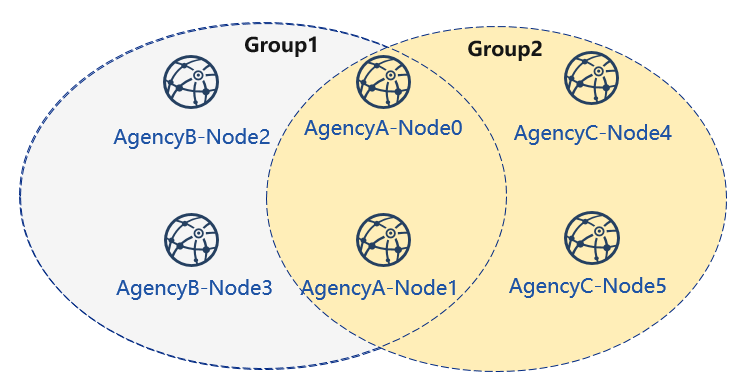
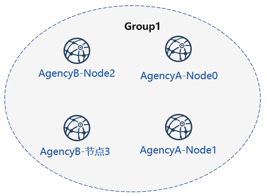
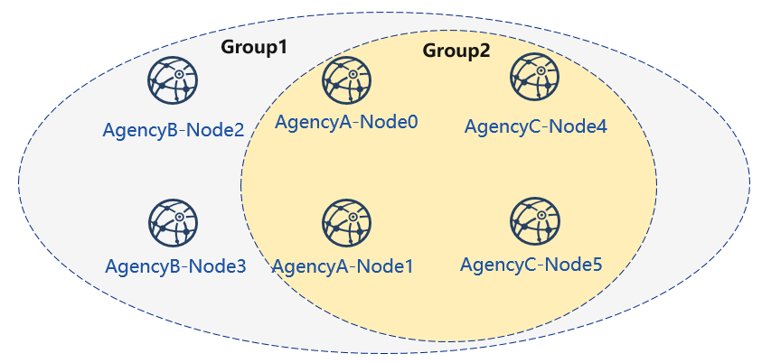

# enterprise deployment tools

FISCO BCOS enterprise deployment tools are designed for multi-agency production environments. For ensure the security of the agency's private keys, enterprise deployment tools provide agencies' collaboration to deploy an alliance chain.

This chapter will demonstrate how to use enterprise deployment tools by deploying a **6 nodes 3 agencies 2 groups** alliance chain. For more parameter options, please [refer to here](./operation.md).

<!-- TODO: ADD gm operation add console details fix type tired-->

This chapter is a process that multi-agency peer-to-peer deployment and a situation that the private key of the agency does not come out of intranet. The tutorial for generating configuration files of all agency nodes through a single agency's click start can refer to [FISCO BCOS Enterprise Deployment Tool ClickStart deployment](./tutorial_one_click.md).

## Download and install

**download**

```bash
cd ~/
git clone https://github.com/FISCO-BCOS/generator.git

# If you have network issue for exec the command above, please try:
git clone https://gitee.com/FISCO-BCOS/generator.git
```

**install**

This operation requires sudo permission.

```bash
cd generator && bash ./scripts/install.sh
```

Check whether the installation is successful. If it is, output usage: generator xxx

```bash
./generator -h
```

**download fisco-bcos binary**

download the latest fisco-bcos binary to `./meta`, you can try `--cdn` to improve your download speed.

```bash
./generator --download_fisco ./meta
```

**check fisco-bcos version**

Output will be: FISCO-BCOS Version : x.x.x-x

```bash
./meta/fisco-bcos -v
```

**PS**:  If someone wants to use [Source Code Compile](../manual/get_executable.md) fisco-bcos binary, they need to replace the binary in the `meta` folder with the compiled binary.

## Typical example

For ensure the security of the agency's private keys, enterprise deployment tools provide a secure way to build chain between agencies. This chapter will demonstrate how to make a chain between agencies in a deployment model of **6 nodes 3 agencies 2 groups**.

### Node networking overview

A networking model of 6 nodes 3 agencies 2 groups is shown as follows. Agency B and agency C is located in Group 1 and Group 2, and agency A belongs to both Group 1 and Group 2.



### Machine address

The IP address of each node and port are as follows:

| Agency  | Node  | Group    | P2P address     | RPC listening address | channel listening IP|
| ------- | ----- | -------- | --------------- | ----------------------------- | -------------- |
| agencyA | node0 | group1,2 | 127.0.0.1:30300 | 127.0.0.1:8545        | 0.0.0.0:20200 |
|         | node1 | group1,2 | 127.0.0.1:30301 | 127.0.0.1:8546        | 0.0.0.0:20201 |
| agencyB | node2 | group1   | 127.0.0.1:30302 | 127.0.0.1:8547         | 0.0.0.0:20202 |
|         | node3 | group1   | 127.0.0.1:30303 | 127.0.0.1:8548       | 0.0.0.0:20203 |
| agencyC | node4 | group2   | 127.0.0.1:30304 | 127.0.0.1:8549        | 0.0.0.0:20204 |
|         | node5 | group2   | 127.0.0.1:30305 | 127.0.0.1:8550        | 0.0.0.0:20205 |

```eval_rst
.. note::
    - The public IP of the cloud host is a virtual IP. If you enter the external IP in rpc_ip/p2p_ip/channel_ip, the binding will fail. You must fill in 0.0.0.0

    - The RPC/P2P/Channel listening port must be in the range of 1024-65535, and must not conflict with other application listening ports on the machine

    - For security and ease of use consideration, FISCO BCOS v2.3.0 latest node config.ini configuration splits listen_ip into jsonrpc_listen_ip and channel_listen_ip, but still retains the parsing function of listen_ip, please refer to `here <../manual/configuration.html#configure-rpc>`_

    - In order to facilitate development and experience, the reference configuration of channel_listen_ip is `0.0.0.0`. For security reasons, please modify it to a safe listening address according to the actual business network situation, such as: intranet IP or specific external IP
```

### cooperate agencies

Building chain involves the cooperation between multiple agencies, including:

- Certificate authority agency
- alliance chain member agency(next named "agency")

### Key process

In this section, we briefly provide How **Certificate authority agency** and **alliance chain member agency** cooperate to build a blockchain.

#### 1. Initialize chain certificate

1.  Certificate authority agency operation:
    -   Generate chain certificate

#### 2. Generate group 1

1.  Certificate authority agency operations
    -   generate agency certificate
    -   send the certificate to agencies
2.  Operation between agencies
    -   modify the configuration file `node_deployment.ini`
    -   generate node certificate and node P2P port address file `peers.txt`
3.  Select one of the agencies to create `group.genesis`
    -   collect all node certificates in the group
    -   modify configuration file `group_genesis.ini`
    -   generate genesis block files for the group
    -   distribute genesis block files to other agencies
4.  Operation between agencies: generating nodes
    -   collect P2P port address files of other nodes in the group
    -   generate node
    -   start node

#### 3. Initialize a new institution

1.  Certificate authority agency operations
    -   generate agency certificate
    -   send the certificate to the new agency

#### 4. Generate group2

1.  New agency operation
    -   modify the configuration file `node_deployment.ini`
    -   generate node certificate and node P2P port address file
2.  Select one of the agencies as a group to create genesis block
    -   collect all node certificates in the group
    -   modify configuration file `group_genesis.ini`
    -   generate genesis block files for the group
    -   distribute genesis block files to other agency
3.  New agency independent operation: create nodes
    -   collect P2P port address files of other nodes in the group
    -   generate nodes
    -   start nodes
4.  Existing agency's operations: configure new groups
    -   collect P2P port address files of other nodes in the group
    -   configure P2P port address of the new group and the new nodes
    -   restart nodes

#### 5. Existing nodes join group 1

1.  Group 1 original agency operation:
    -   send group 1 genesis block to the existing node
    -   configure console
    -   get the entering node nodeid
    -   add nodes to group1 by using console

## Chain initialization

All the operations in this example are performed on the local machine. We use different catalogs to simulate various agencies' environment and use the file copy operation to simulate the sending in the network. After performing `Download and Install` in the tutorial, please copy the generator to the corresponding agency's generator directory.

### Institutional initialization

We use **generator downloaded from the tutorial as certificate agency**.

**Initialize agencyA**

```bash
cp -r ~/generator ~/generator-A
```

**Initialize agencyB**

```bash
cp -r ~/generator ~/generator-B
```

### Initialize chain certificate

A single chain has a unique ca.crt.

use [`--generate_chain_certificate`](./operation.html#generate-chain-certificate) to generate chain certificate

Operate in the certificate agency directory:

```bash
cd ~/generator
```

```bash
./generator --generate_chain_certificate ./dir_chain_ca
```

view the chain certificate and the private key:

```bash
ls ./dir_chain_ca
```

```bash
# the above order has explained
# From left to right,  they are chain's certificate, and chain's private key.
ca.crt  ca.key
```

## AgencyA, B to build group 1

### Initialize agencyA

In the tutorial, for operating simply, the certificate of agency and the private key are directly generated. In actual application, the private key `agency.key` should be created locally by agency first, and then the certificate request file is made, and the certificate `agency.crt` is obtained from the certificate agency

Operate in the certificate directory:

```bash
cd ~/generator
```

Generate agencyA certificate:

```bash
./generator --generate_agency_certificate ./dir_agency_ca ./dir_chain_ca agencyA
```

View agency certificate and the private key:

```bash
ls dir_agency_ca/agencyA/
```

```bash
# From left to right, they are agency's certificate, and agency's private key
agency.crt  agency.key  ca.crt
```

For sending the chain certificate, agency certificate, and agency private key to agencyA, we use an example is to send the certificate from the certificate agency to the corresponding agency through the file copy, and put the certificate in the subdirectory of meta which is agency's working directory.

```bash
cp ./dir_agency_ca/agencyA/* ~/generator-A/meta/
```

### Initialize agencyB

Operate in the certificate directory:

```bash
cd ~/generator
```

Generate agencyB certificate:

```bash
./generator --generate_agency_certificate ./dir_agency_ca ./dir_chain_ca agencyB
```

For sending the chain certificate, agency certificate, and agency private key to agencyB, we use an example is to send the certificate from the certificate agency to the corresponding agency through the file copy, and put the certificate in the subdirectory of meta which is agency's working directory.

```bash
cp ./dir_agency_ca/agencyB/* ~/generator-B/meta/
```

```eval_rst
.. important::

    Only one root certificate, ca.crt, can be used in an alliance chain. Do not generate multiple root certificates and private keys when deploying various servers. A group can only have one genesis block group.x.genesis.
```

### AgencyA modifies configuration file

[node_deployment.ini](./config.md#node-deployment-ini) is the node configuration file. Enterprise deployment tool generates the corresponding node certificate according to the configuration of `node_deployment.ini` and the node configuration folder etc..

AgencyA modifies the `node_deployment.ini` in the conf folder, as shown below:

Execute the following command in the ~/generator-A directory

```bash
cd ~/generator-A
```

```bash
cat > ./conf/node_deployment.ini << EOF
[group]
group_id=1

[node0]
; host ip for the communication among peers.
; Please use your ssh login ip.
p2p_ip=127.0.0.1
; listen ip for the communication between sdk clients.
; This ip is the same as p2p_ip for physical host.
; But for virtual host e.g. vps servers, it is usually different from p2p_ip.
; You can check accessible addresses of your network card.
; Please see https://tecadmin.net/check-ip-address-ubuntu-18-04-desktop/
; for more instructions.
rpc_ip=127.0.0.1
channel_ip=0.0.0.0
p2p_listen_port=30300
channel_listen_port=20200
jsonrpc_listen_port=8545

[node1]
p2p_ip=127.0.0.1
rpc_ip=127.0.0.1
channel_ip=0.0.0.0
p2p_listen_port=30301
channel_listen_port=20201
jsonrpc_listen_port=8546
EOF
```

### AgencyA modifies configuration file

AgencyB modifies the `node_deployment.ini` in the conf folder, as shown below:

Execute the following command in the ~/generator-B directory

```bash
cd ~/generator-B
```

```bash
cat > ./conf/node_deployment.ini << EOF
[group]
group_id=1

[node0]
; host ip for the communication among peers.
; Please use your ssh login ip.
p2p_ip=127.0.0.1
; listen ip for the communication between sdk clients.
; This ip is the same as p2p_ip for physical host.
; But for virtual host e.g. vps servers, it is usually different from p2p_ip.
; You can check accessible addresses of your network card.
; Please see https://tecadmin.net/check-ip-address-ubuntu-18-04-desktop/
; for more instructions.
rpc_ip=127.0.0.1
channel_ip=0.0.0.0
p2p_listen_port=30302
channel_listen_port=20202
jsonrpc_listen_port=8547

[node1]
p2p_ip=127.0.0.1
rpc_ip=127.0.0.1
channel_ip=0.0.0.0
p2p_listen_port=30303
channel_listen_port=20203
jsonrpc_listen_port=8548
EOF
```

### AgencyA generates and sends node information

Execute the following command in the ~/generator-A directory

```bash
cd ~/generator-A
```

AgencyA generates the node certificate and the P2P connection information file. In this step, we need to use the above configuration `node_deployment.ini` and the agency certificate and private key in the agency meta folder.

```bash
./generator --generate_all_certificates ./agencyA_node_info
```

view generated files:

```bash
ls ./agencyA_node_info
```

```bash
# From left to right, they are the node certificate that needs to have interacted with the agencyA and the file that node P2P connects to the address (the node information of agency generated by the node_deployment.ini)
cert_127.0.0.1_30300.crt cert_127.0.0.1_30301.crt peers.txt
```

When the agency generates a node, it needs to specify the node P2P connection address of other nodes. Therefore, AgencyA needs to send the node P2P connection address file to AgencyB.

```bash
cp ./agencyA_node_info/peers.txt ~/generator-B/meta/peersA.txt
```

### AgencyB generates and sends node information

Execute the following command in the ~/generator-B directory

```bash
cd ~/generator-B
```

AgencyB generates the node certificate and the P2P connection information file:

```bash
./generator --generate_all_certificates ./agencyB_node_info
```

The agency that generates the genesis block needs the node certificate. In the example, the agencyA generates the genesis block. Therefore, in addition to sending the node P2P connection address file, the agencyB needs to send the node certificate to agencyA.

Send certificate to agencyA

```bash
cp ./agencyB_node_info/cert*.crt ~/generator-A/meta/
```

Send the node P2P connection address file to agencyA

```bash
cp ./agencyB_node_info/peers.txt ~/generator-A/meta/peersB.txt
```

### AgencyA generates the genesis block of group1

Execute the following command in the ~/generator-A directory

```bash
cd ~/generator-A
```

AgencyA modifies `group_genesis.ini` in the conf folder. For configuration items, refer to [Manuals](./config.md#group-genesis-ini):

```bash
cat > ./conf/group_genesis.ini << EOF
[group]
group_id=1

[nodes]
node0=127.0.0.1:30300
node1=127.0.0.1:30301
node2=127.0.0.1:30302
node3=127.0.0.1:30303
EOF
```

After the command is executed, the ./conf/group_genesis.ini file will be modified:

```ini
;command interpretation
[group]
;group id
group_id=1

[nodes]
;AgencyA node p2p address
node0=127.0.0.1:30300
;AgencyA node p2p address
node1=127.0.0.1:30301
;AgencyB node p2p address
node2=127.0.0.1:30302
;AgencyB node p2p address
node3=127.0.0.1:30303
```

In the tutorial, we choose agencyA to generate genesis block of the group. But in the actual production, you can negotiate with alliance chain committee to make a choice.

This step will generate the genesis block of group_genesis.ini according to the node certificate configured in the meta folder of agencyA. In the tutorial, the agencyA's meta is required to have the node certificates name as  `cert_127.0.0.1_30300.crt`, `cert_127.0.0.1_30301.crt`, `cert_127.0.0.1_30302.crt`, `cert_127.0.0.1_30303.crt`. This step requires the node certificate of agencyB.

```bash
./generator --create_group_genesis ./group
```

Send group.1.genesis to AgencyB:

```bash
cp ./group/group.1.genesis ~/generator-B/meta
```

### AgencyA generates the node to which it belongs

Execute the following command in the ~/generator-A directory

```bash
cd ~/generator-A
```

AgencyA generates the node to which it belongs. This command generates the corresponding node configuration folder according to the user-configured file `node_deployment.ini`:

Note: The node P2P connection information `peers.txt` specified in this step is the connect information of other nodes in the group. In the case of multiple agencies networking, they need to be merged.

```bash
./generator --build_install_package ./meta/peersB.txt ./nodeA
```

View the generated node configuration folder:

```bash
ls ./nodeA
```

```bash
# command interpretation, displayed in tree style here
# The generated folder nodeA information is as follows
├── monitor # monitor script
├── node_127.0.0.1_30300 # node configuration folder with server address 127.0.0.1 and port number 30300
├── node_127.0.0.1_30301
├── scripts # node related tool script
├── start_all.sh # node startups script in batch
└── stop_all.sh # node stops script in batch
```

AgencyA startups node:

```bash
bash ./nodeA/start_all.sh
```

View node process:

```bash
ps -ef | grep fisco
```

```bash
# command interpretation
# you can see the following process
fisco  15347     1  0 17:22 pts/2    00:00:00 ~/generator-A/nodeA/node_127.0.0.1_30300/fisco-bcos -c config.ini
fisco  15402     1  0 17:22 pts/2    00:00:00 ~/generator-A/nodeA/node_127.0.0.1_30301/fisco-bcos -c config.ini
```

### AgencyB generates the node to which it belongs

Execute the following command in the ~/generator-B directory

```bash
cd ~/generator-B
```

AgencyB generates the node to which it belongs. This command generates the corresponding node configuration folder according to the user-configured file `node_deployment.ini`:

```bash
./generator --build_install_package ./meta/peersA.txt ./nodeB
```

AgencyB startups node:

```bash
bash ./nodeB/start_all.sh
```

```eval_rst
.. note::

    Startup node only needs to send the node folder corresponding to IP address. For example, the server of 127.0.0.1 only needs the node configuration folder corresponding to node_127.0.0.1_port. When deploying multiple machines, you only need to send the generated node folder to the corresponding server.
```

### View group1 node running status

View process:

```bash
ps -ef | grep fisco
```

```bash
# command interpretation
# you can see the following process
fisco  15347     1  0 17:22 pts/2    00:00:00 ~/generator-A/nodeA/node_127.0.0.1_30300/fisco-bcos -c config.ini
fisco  15402     1  0 17:22 pts/2    00:00:00 ~/generator-A/nodeA/node_127.0.0.1_30301/fisco-bcos -c config.ini
fisco  15457     1  0 17:22 pts/2    00:00:00 ~/generator-B/nodeB/node_127.0.0.1_30302/fisco-bcos -c config.ini
fisco  15498     1  0 17:22 pts/2    00:00:00 ~/generator-B/nodeB/node_127.0.0.1_30303/fisco-bcos -c config.ini
```

view node log:

```bash
tail -f ./node*/node*/log/log*  | grep +++
```

```bash
# command interpretation
# +++ printed in log is the normal consensus of the node
info|2019-02-25 17:25:56.028692| [g:1][p:264][CONSENSUS][SEALER]++++++++++++++++ Generating seal on,blkNum=1,tx=0,myIdx=0,hash=833bd983...
info|2019-02-25 17:25:59.058625| [g:1][p:264][CONSENSUS][SEALER]++++++++++++++++ Generating seal on,blkNum=1,tx=0,myIdx=0,hash=343b1141...
info|2019-02-25 17:25:57.038284| [g:1][p:264][CONSENSUS][SEALER]++++++++++++++++ Generating seal on,blkNum=1,tx=0,myIdx=1,hash=ea85c27b...
```

By now, we have completed the operation of agencyA,B to build group1 as shown:



## Certificate authority initialize agencyC

Operate in the certificate generator directory:

```bash
cd ~/generator
```

**Initialize agencyC** Note. Now there is a chain certificate and a private key in the generator directory. In the actual environment, agencyC cannot obtain the chain certificate and the private key.

```bash
cp -r ~/generator ~/generator-C
```

Generate agencyC certificate:

```bash
./generator --generate_agency_certificate ./dir_agency_ca ./dir_chain_ca agencyC
```

View agency certificate and private key:

```bash
ls dir_agency_ca/agencyC/
```

```bash
# command interpretation
# From left to right, they are agency's certificate, agency's private key, and chain's certificate
agency.crt  agency.key  ca.crt
```

For sending the chain certificate, agency certificate, and agency private key to agencyA, we use an example is to send the certificate from the certificate agency to the corresponding agency through the file copy, and put the certificate in the subdirectory of meta which is agency’s working directory.

```bash
cp ./dir_agency_ca/agencyC/* ~/generator-C/meta/
```

## AgencyA,C build group2

Next, agencyC needs to perform a new group establishment operation with agencyA. We take an example of agencyC generating genesis block.

### AgencyA sends node information

Since agencyA has generated the node certificate and the peers file, we only need to send the previous generated node P2P connection information and the node certificate to agencyC as follows:

Execute the following command in the ~/generator-A directory

```bash
cd ~/generator-A
```

In the example, the genesis block of the group is generated by agencyC. Therefore the node certificate of agencyA and the node P2P connection address file are required, and the above file is sent to agencyC.

Send certificate to agencyC

```bash
cp ./agencyA_node_info/cert*.crt ~/generator-C/meta/
```

Send node P2P connection address file to agencyC

```bash
cp ./agencyA_node_info/peers.txt ~/generator-C/meta/peersA.txt
```

### AgencyC modifies configuration file

AgencyC modifies `node_deployment.ini` in the conf folder as shown below:

Execute the following command in the ~/generator-C directory.

```bash
cd ~/generator-C
```

```bash
cat > ./conf/node_deployment.ini << EOF
[group]
group_id=2

[node0]
; host ip for the communication among peers.
; Please use your ssh login ip.
p2p_ip=127.0.0.1
; listen ip for the communication between sdk clients.
; This ip is the same as p2p_ip for physical host.
; But for virtual host e.g. vps servers, it is usually different from p2p_ip.
; You can check accessible addresses of your network card.
; Please see https://tecadmin.net/check-ip-address-ubuntu-18-04-desktop/
; for more instructions.
rpc_ip=127.0.0.1
channel_ip=0.0.0.0
p2p_listen_port=30304
channel_listen_port=20204
jsonrpc_listen_port=8549

[node1]
p2p_ip=127.0.0.1
rpc_ip=127.0.0.1
channel_ip=0.0.0.0
p2p_listen_port=30305
channel_listen_port=20205
jsonrpc_listen_port=8550
EOF
```

### AgencyC generates and sends node information

Execute the following command in the ~/generator-C directory.

```bash
cd ~/generator-C
```

AgencyC generates node certificate and P2P connection information file:

```bash
./generator --generate_all_certificates ./agencyC_node_info
```

View generated file:

```bash
ls ./agencyC_node_info
```

```bash
# command interpretation
# From left to right, they are the node certificate that needs to have interacted with the agencyA and the file that node P2P connects to the address (the node information of agency generated by the node_deployment.ini)
cert_127.0.0.1_30304.crt cert_127.0.0.1_30305.crt peers.txt
```

When the agency generates a node, it needs to specify the node P2P connection address of other nodes. Therefore, agencyC needs to send the node P2P connection address file to agencyA.

```bash
cp ./agencyC_node_info/peers.txt ~/generator-A/meta/peersC.txt
```

### AgencyC generates genesis block of group2

Execute the following command in the ~/generator-C directory.

```bash
cd ~/generator-C
```

AgencyC modifies `group_genesis.ini` in the conf folder as shown below:

```bash
cat > ./conf/group_genesis.ini << EOF
[group]
group_id=2

[nodes]
node0=127.0.0.1:30300
node1=127.0.0.1:30301
node2=127.0.0.1:30304
node3=127.0.0.1:30305
EOF
```

./conf/group_genesis.ini file will be modified after the command is executed:

```ini
;command interpretation
[group]
group_id=2

[nodes]
node0=127.0.0.1:30300
;agencyA node p2p address
node1=127.0.0.1:30301
;agencyA node p2p address
node2=127.0.0.1:30304
;agencyC node p2p address
node3=127.0.0.1:30305
;agencyC node p2p address
```

In the tutorial, agency C is chosen to generate a genesis block of the group. In the actual production, you can negotiate with the alliance chain committee to determine.

This step generates a genesis block of group_genesis.ini configuration according to the node certificate configured in the meta folder of agencyC.

```bash
./generator --create_group_genesis ./group
```

Distribute genesis block of group2 to agencyA:

```bash
cp ./group/group.2.genesis ~/generator-A/meta/
```

### AgencyC generates the node to which it belongs

Execute the following command in the ~/generator-C directory

```bash
cd ~/generator-C
```

```bash
./generator --build_install_package ./meta/peersA.txt ./nodeC
```

AgencyC startups node:

```bash
bash ./nodeC/start_all.sh
```

```bash
ps -ef | grep fisco
```

```bash
# command interpretation
# you can see the following process
fisco  15347     1  0 17:22 pts/2    00:00:00 ~/generator-A/nodeA/node_127.0.0.1_30300/fisco-bcos -c config.ini
fisco  15402     1  0 17:22 pts/2    00:00:00 ~/generator-A/nodeA/node_127.0.0.1_30301/fisco-bcos -c config.ini
fisco  15457     1  0 17:22 pts/2    00:00:00 ~/generator-B/nodeB/node_127.0.0.1_30302/fisco-bcos -c config.ini
fisco  15498     1  0 17:22 pts/2    00:00:00 ~/generator-B/nodeB/node_127.0.0.1_30303/fisco-bcos -c config.ini
fisco  15550     1  0 17:22 pts/2    00:00:00 ~/generator-C/nodeC/node_127.0.0.1_30304/fisco-bcos -c config.ini
fisco  15589     1  0 17:22 pts/2    00:00:00 ~/generator-C/nodeC/node_127.0.0.1_30305/fisco-bcos -c config.ini
```

### AgencyA initializes group2 for existing nodes

Execute the following command in the ~/generator-A directory

```bash
cd ~/generator-A
```

Add the group2 configuration file to the existing node. This step adds the genesis block of group2 `group.2.genesis` to all nodes under ./nodeA:

```bash
./generator --add_group ./meta/group.2.genesis ./nodeA
```

Add the agencyC node connect file peers to the existing node. This step adds the node P2P connection address of `peersC.txt` to all nodes under ./nodeA:

```bash
./generator --add_peers ./meta/peersC.txt ./nodeA
```

Restart agencyA node:

```bash
bash ./nodeA/stop_all.sh
```

```bash
bash ./nodeA/start_all.sh
```

### View group2 node running status

View node's process:

```bash
ps -ef | grep fisco
```

```bash
# command interpretation
# you can see the following process
fisco  15347     1  0 17:22 pts/2    00:00:00 ~/generator-A/nodeA/node_127.0.0.1_30300/fisco-bcos -c config.ini
fisco  15402     1  0 17:22 pts/2    00:00:00 ~/generator-A/nodeA/node_127.0.0.1_30301/fisco-bcos -c config.ini
fisco  15457     1  0 17:22 pts/2    00:00:00 ~/generator-B/nodeB/node_127.0.0.1_30302/fisco-bcos -c config.ini
fisco  15498     1  0 17:22 pts/2    00:00:00 ~/generator-B/nodeB/node_127.0.0.1_30303/fisco-bcos -c config.ini
fisco  15550     1  0 17:22 pts/2    00:00:00 ~/generator-C/nodeC/node_127.0.0.1_30304/fisco-bcos -c config.ini
fisco  15589     1  0 17:22 pts/2    00:00:00 ~/generator-C/nodeC/node_127.0.0.1_30305/fisco-bcos -c config.ini
```

View node log：

Execute the following command in the ~/generator-C directory

```bash
cd ~/generator-C
```

```bash
tail -f ./node*/node*/log/log*  | grep +++
```

```bash
# command interpretation
#+++ rinted in log is the normal consensus of the node
info|2019-02-25 17:25:56.028692| [g:2][p:264][CONSENSUS][SEALER]++++++++++++++++ Generating seal on,blkNum=1,tx=0,myIdx=0,hash=833bd983...
info|2019-02-25 17:25:59.058625| [g:2][p:264][CONSENSUS][SEALER]++++++++++++++++ Generating seal on,blkNum=1,tx=0,myIdx=0,hash=343b1141...
info|2019-02-25 17:25:57.038284| [g:2][p:264][CONSENSUS][SEALER]++++++++++++++++ Generating seal on,blkNum=1,tx=0,myIdx=1,hash=ea85c27b...
```

By now, we have completed the construction of agencyA, C to build group2 as shown:


## Extended Tutorial--agencyC node joins group1

Adding a node to an existing group requires users to send command by console. The example of adding nodes to the group is as follows:

Now there are nodes of agencyA, B and B in group1. Adding the node of agencyC to group1 needs to get the permission of the nodes in the group. To take the node of agencyA as an example:

Execute the following command in the ~/generator-A directory.

```bash
cd ~/generator-A
```

### Send gensis block of group1 to agencyC

Send the configuration file of group1 to agencyC.

```bash
./generator --add_group ./group/group.1.genesis  ~/generator-C/nodeC
```

Restart agencyC's node:

```bash
bash ~/generator-C/nodeC/stop_all.sh
```

```bash
bash ~/generator-C/nodeC/start_all.sh
```

### Configure console

agencyA's configure console or Java SDK. In the tutorial, console is used as an example:

Note: This command will complete the console configuration according to the node and group in the user-configured `node_deployment.ini`. User can directly start the console. Please ensure that java is installed before starting.

```bash
./generator --download_console ./
```

### View agencyC node4 information

AgencyA uses the console to join agencyC node4 as observation node. The second parameter needs to be replaced with the joining node 'nodeid', which locates in the `node.nodeid` file of the node folder conf.

View the agencyC node nodeid:

```bash
cat ~/generator-C/nodeC/node_127.0.0.1_30304/conf/node.nodeid
```

```bash
# command interpretation
# you can see a nodeid similar to the following. When using the console, you need to pass this parameter.
ea2ca519148cafc3e92c8d9a8572b41ea2f62d0d19e99273ee18cccd34ab50079b4ec82fe5f4ae51bd95dd788811c97153ece8c05eac7a5ae34c96454c4d3123
```

### Register observation node by using console

start console:

```bash
cd ~/generator-A/console && bash ./start.sh 1
```

Use the console `addObserver` command to register the node as an observation node. In this step, you need to use the `cat` command to view `node.nodeid` of agencyC node.

```bash
addObserver ea2ca519148cafc3e92c8d9a8572b41ea2f62d0d19e99273ee18cccd34ab50079b4ec82fe5f4ae51bd95dd788811c97153ece8c05eac7a5ae34c96454c4d3123
```

```bash
# command interpretation
# Successful execution will prompt success
$ [group:1]> addObserver ea2ca519148cafc3e92c8d9a8572b41ea2f62d0d19e99273ee18cccd34ab50079b4ec82fe5f4ae51bd95dd788811c97153ece8c05eac7a5ae34c96454c4d3123
{
	"code":0,
	"msg":"success"
}
```

exit console:

```bash
exit
```

### View agencyC node 5 information

AgencyA uses console to join node 5 of agencyC as the consensus node. The second parameter needs to be replaced with the joining node 'nodeid', which locates in the `node.nodeid` file of the node folder conf.

View the agencyC node nodeid:

```bash
cat ~/generator-C/nodeC/node_127.0.0.1_30305/conf/node.nodeid
```

```bash
# command interpretation
# you can see a nodeid similar to the following. When using the console, you need to pass this parameter.
5d70e046047e15a68aff8e32f2d68d1f8d4471953496fd97b26f1fbdc18a76720613a34e3743194bd78aa7acb59b9fa9aec9ec668fa78c54c15031c9e16c9e8d
```

### Register consensus node by using console

Start console:

```bash
cd ~/generator-A/console && bash ./start.sh 1
```

Use the console's `addSealer` command to register the node as a consensus node. In this step, you need to use the `cat` command to view the `node.nodeid` of agencyC node.

```bash
addSealer 5d70e046047e15a68aff8e32f2d68d1f8d4471953496fd97b26f1fbdc18a76720613a34e3743194bd78aa7acb59b9fa9aec9ec668fa78c54c15031c9e16c9e8d
```

```bash
# command interpretation
# Successful execution will prompt success
$ [group:1]> addSealer 5d70e046047e15a68aff8e32f2d68d1f8d4471953496fd97b26f1fbdc18a76720613a34e3743194bd78aa7acb59b9fa9aec9ec668fa78c54c15031c9e16c9e8d
{
	"code":0,
	"msg":"success"
}
```

Exit console:

```bash
exit
```

### View node

Execute the following command in the ~/generator-C directory

```bash
cd ~/generator-C
```

View the group1 information in node log:

```bash
cat node*/node_127.0.0.1_3030*/log/log* | grep g:1  | grep Report
```

```bash
# command interpretation
# Observation node will only synchronize transaction data, and will not synchronize the consensus information in non-transaction status
# ^^^ is the transaction information of the node, and g:1 is the information printed by group1
info|2019-02-26 16:01:39.914367| [g:1][p:65544][CONSENSUS][PBFT]^^^^^^^^Report,num=0,sealerIdx=0,hash=9b76de5d...,next=1,tx=0,nodeIdx=65535
info|2019-02-26 16:01:40.121075| [g:1][p:65544][CONSENSUS][PBFT]^^^^^^^^Report,num=1,sealerIdx=3,hash=46b7f17c...,next=2,tx=1,nodeIdx=65535
info|2019-02-26 16:03:44.282927| [g:1][p:65544][CONSENSUS][PBFT]^^^^^^^^Report,num=2,sealerIdx=2,hash=fb982013...,next=3,tx=1,nodeIdx=65535
info|2019-02-26 16:01:39.914367| [g:1][p:65544][CONSENSUS][PBFT]^^^^^^^^Report,num=0,sealerIdx=0,hash=9b76de5d...,next=1,tx=0,nodeIdx=4
info|2019-02-26 16:01:40.121075| [g:1][p:65544][CONSENSUS][PBFT]^^^^^^^^Report,num=1,sealerIdx=3,hash=46b7f17c...,next=2,tx=1,nodeIdx=4
info|2019-02-26 16:03:44.282927| [g:1][p:65544][CONSENSUS][PBFT]^^^^^^^^Report,num=2,sealerIdx=2,hash=fb982013...,next=3,tx=1,nodeIdx=4
```

By now, we have completed all the operations in the tutorial shown.



In this tutorial, we have generated a multi-group architecture alliance chain with a network topology of 3 agencies, 2 groups, and 6 nodes.

If you have problems with this tutorial, please view [FAQ](../faq.md).
