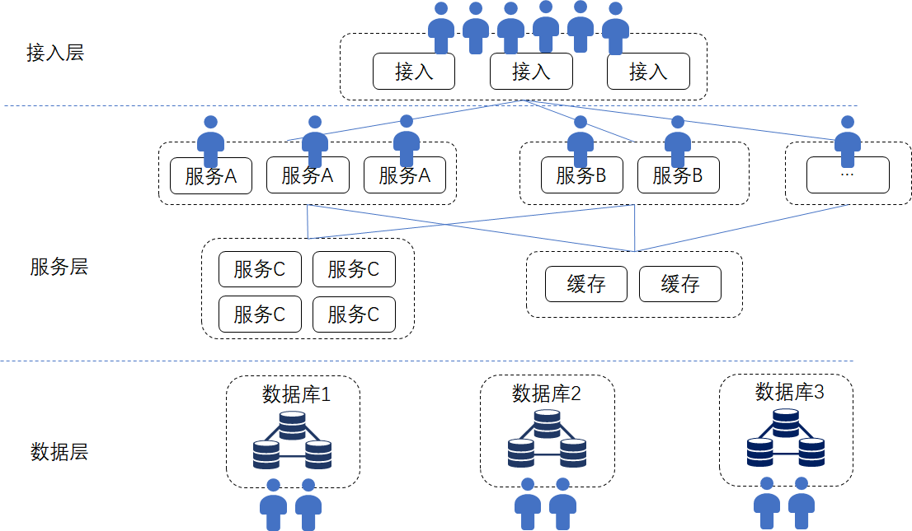

# Counterintuitive, counterintuitive, how a blockchain is a "distributed system"

Author: Zhang Kaixiang ｜ Chief Architect, FISCO BCOS

We often see the saying that "blockchain is a distributed system" and infer that blockchain inherently has the advantages of a distributed system, as if, as a distributed system, the scale should be large enough and the data should be decentralized enough。
In fact, typical blockchains have many characteristics that are different from, or even contrary to, common distributed systems, for which blockchains have been jokingly called "the slowest distributed database."。
**In fact, one of the reasons why blockchain is difficult to understand is the "counterintuitive and counterintuitive" of its design philosophy**。The author himself has been in the field of Internet mass services for many years, and then turned to the field of blockchain in-depth research, but also experienced a period of concept switching。

This article is not intended to be a comprehensive account of the principles and history of distributed systems, so several books can be written。Starting from the common and widely recognized Internet distributed systems, we will talk about the similarities and differences between "distributed systems" and blockchain, and what path branches are required for technology and design。

In the classic distributed book "Distributed Systems Concepts and Design," the definition of "distributed system" is actually very general**A distributed system is a system in which hardware or software components are distributed over different networked computers and communicate and coordinate with each other solely through message passing。**

In short, any system that is not running on a machine or in a process can be a distributed system。
For example, large websites, apps, support systems for universal IM social software, and new financial infrastructure based on the X86 system can all be distributed systems。
Whether this distributed system belongs to one organization or is maintained by multiple different organizations is not the focus of this definition。

## The Way of Internet Mass Service System

Tip: Readers who are already familiar with the massive design of the Internet can skip this section

If an Internet service architect is required to provide a good user experience and ensure a short-delayed response performance while facing the tsunami of requests and saving unlimited growth of data, the architect's mind is usually popped up with keywords such as "hierarchical design," "hot and cold separation," "parallel expansion," "parallel processing," "sub-library sub-table" and so on。
The architecture of Internet mass services is usually hierarchical, such as access layer, service layer, data layer, etc。Load balancing and flexible routing distribution at the access layer according to various policies, services can be grouped by function。For example:
User to change personal data, request to send to data service；
Users browse web pages, request query service spit data；
User to post, transfer to content service；
The user wants to place an order, the transaction server takes over, each service only handles part of the business logic, calls each other through remote interfaces, and is usually "stateless" and is not constrained by its own and other service processing states；
Finally, data storage is "sharded," commonly known as "sub-database sub-table," according to the user identity, business type and other rules, the data will be distributed in different database instances, each database instance only "part" of the data, only a "subset" of the data。

UGC, social, rich text, video content-based Internet services, the "transactional" requirements are not so strong, its "distributed" is more the pursuit of computing and data evenly distributed on multiple servers, using more CPU, more bandwidth, more memory, more disk space to process requests。
A group of servers is not enough, immediately add a group, parallel expansion and multi-live features to the fullest。The entire system will have some primary and redundant, more to meet the quality of service, availability, backup requirements。
E-commerce and some financial and payment-related processes will emphasize ACID transactional, using distributed consistency algorithms, such as Raft, Paxos, etc., mainly to pursue the ultimate consistency between multiple modules and system stability。

After all, in the same organization of the system, the requirements against fraud is not too harsh, and can be based on specific business processes to classify transactions, a single transaction control in a limited range (e.g., only the user to the merchant one-way transfer), transactions and transactions between the clear separation, so that it is easier to scale in parallel。

As shown in the figure above, a typical multi-tier Internet service has many modules, and the distribution of computing and storage is relatively uniform。

"Distributed systems" such as distributed databases, big data clusters, or BT networks and CDNs, mostly follow the "**Split users and data across different physical devices**This principle, to achieve a simple "heap hardware" can be extended in parallel effect。
The more hardware, the more significant the technical "scale effect," i.e., the more storage, more computing power, and more total bandwidth, the more users can be served。
The most important thing is that most of the entire service is in the same organization, maintained by the team of the same company, and there is no need to solve the problem of "trust" between the service and the service, and the result given by the interface of other services is trusted by default。
If some interfaces of the cooperation class are exposed to external companies, you only need to ensure that the interface layer is performance, safe, stable, and meets the cooperation rules。

## Blockchain "dancing with chains"

Look at the blockchain, first of all**The entire network is not only one agency involved, nodes may belong to different agencies**Together, we maintain the network and reach a consensus on the deal。
The mission of blockchain is to break through institutional boundaries and solve trust and game problems between institutions。
In the blockchain system, in order to ensure data traceability and verifiability, to avoid a few nodes tampering with data affecting the entire network**Each node saves all data**, rather than "sub-library and sub-table" like Internet services。

Let's calculate that if there are 10 million users, divided into 10 database instances in the Internet system, each database instance only holds the data of 1 million users。
Even if each DB instance is "one master and two spares," the total data overhead is only three times the original data。
The classic blockchain design is that each node holds all the data of 10 million users, and the more nodes in the network, the more copies of the data will be saved。
If the whole network has 100 nodes, the total data storage overhead of the whole network is 100 times that of the original data；If there are 200 nodes, the total data storage of the whole network will reach 200 times of the original data...... and so on, quite shocking。
In extreme cases, if the entire Earth's data is on the chain, and there are 10,000 nodes on the chain, then we have 10,000 Earths... but we don't have that many resources。

The data structure of the blockchain itself is also an interesting link。There is a chained relationship between blocks, and new blocks must be generated based on old blocks。
The state data generated by smart contracts is global and is often maintained in complex data structures such as Patricia trees and merkle trees for network-wide traceability, verification and calculation。
Data interlocking, as if "monolithic," making it quite challenging to slice data according to hot and cold characteristics, time and user dimensions, not only to make the data can be distributed to different storage, but also to ensure that it can be quickly accessed, to ensure that the intricacies of traceability verification。engineering is very difficult。

At the transaction level, in a network that does not have a strong trust relationship with each other, and deals with transactions that have a high probability and "value" relationship**In particular, the blockchain emphasizes the global transactionality of transactions to ensure the consistency of the entire network, and in order to prevent malicious nodes from falsifying false data, all transactions will be sorted, calculated and verified on all nodes driven by the consensus mechanism and network synchronization。**
On a blockchain that supports smart contracts, when each smart contract is invoked by a transaction, the contract code is run through all nodes to ensure that the process of generating data on each node is recognized and the results are consistent。

It can be seen that the blockchain does not allocate the amount of computation to different servers, all nodes are "repeaters," which means that adding nodes will not increase the parallel computing capacity of the whole network, even if the whole network has 10,000 computers, the speed is the same as only one。
If this blockchain is called the "world computer," it can be regarded as the world computer with the most uniform steps, the highest redundancy and the slowest speed in the world。

**The core of the blockchain system is the consensus algorithm。**

POW mining is a difficult problem for miners to solve with computing power, in order to fight for the right to keep accounts, and then keep accounts, and expect their own bookkeeping results to become the longest chain。
The POW algorithm is notoriously slow and consumes electricity；
POS equity consensus, by a group of "rich men" mortgage assets to obtain the right to book, take turns to book, do not need to calculate the power of competition, performance is better, but there is still a process of taking turns to package the block and then the whole network final confirmation；
PBFT (Practical Byzantine) consensus, which requires multiple round-trip interactions by the bookkeeper, with most people involved in multi-stage confirmation to reach the final state。
In general, unlike the "statelessness" pursued by Internet services, consensus services are "stateful," and each consensus algorithm needs to make decisions based on multi-dimensional information such as network, data, bookkeeper engagement, and the current state of the chain (e.g., "block height" and "consensus stage")。

The more accounting nodes, the higher the cost of collaboration, especially the typical PBFT algorithm, when the number of nodes increases, the consensus will be slower and the transaction delay will be higher and higher。
If the nodes are also "clustered" and adopt a "multi-layer distributed architecture," is it possible to achieve parallel scalability similar to the Internet mass service system?？For example, changing the virtual machine to multiple instances and computing transactions in parallel can solve the computing bottleneck problem。
But the faster the calculation, the more data can be generated per unit time, which also requires the hard disk to store more data, and the capacity and IO speed of the hard disk is limited。
At the same time, the calculation is fast, the node will broadcast more data to the network, the bandwidth of the node public network interconnection is usually not too large, the delay is generally more obvious (tens of milliseconds)。
As a result, the interaction between nodes and nodes will hit the bottleneck of network speed, consensus delay and data synchronization time becomes longer, the nodes are like a string of grasshoppers tied to the rope, no one can jump high。Due to the ceiling of hard conditions such as storage and networking, clustered computing is useless no matter how fast it is。
Finally, node clustering does increase the service processing capacity on a node-by-node basis, while also bringing additional architectural complexity and deployment O & M costs。

Or to quote an example of counting money:
There's a whole lot of money to make ten numbers, there are two ways。
Method one, you can divide the money into ten parts, one for each number, so that it is quickly counted, the more people, the faster the count, but if there is a wrong number of people, or even steal money, then there is a problem。
So, for the safety of funds, change to method two, let a person sort out a stack of money, first count it, and then let the other nine people also count it, everyone check the bookkeeping, and then change the person to sort out the next stack of money, repeat the above rhythm to count, so that the result is certainly not wrong, and can be recognized by everyone。But an increase in the number of people involved in counting money does not speed up the count, but may lead to a slower count due to a large number of people。
Method 1 is the practice of common Internet distributed systems, and Method 2 is blockchain。
It can be seen that different purposes lead to different design philosophies, system structures, and final results。

## How to use "good steel on the blade"

In summary, blockchain, a "distributed system," has a linear year-on-year increase in storage costs and the number of nodes, while computing efficiency has declined instead of rising, making the entire system appear "expensive" and "heavy," which is contrary to the "light spirit" of Internet services。Most importantly, it is difficult to significantly increase parallel processing power and storage by increasing hardware, bandwidth, and number of nodes。
But the "network scale effect" of blockchain is not reflected in hardware and computing, but in "consensus" and "trust."。
Blockchain builds a trusted network through complex algorithms and games, making more people willing to participate in the network, contributing data and maintaining the network, reflecting the value effect of "win-win collaboration."。
This also gives us an important lesson: since the cost of computing and storage of blockchain is very high, the purpose is to achieve consensus, then we should let the blockchain do the most things。

### 1. Which data can be "chained"？

**Only key data that must be shared by multiple parties to be used in the transaction process is to be chained, such as the accounts of a public ledger。**

Videos, files, images, and large-scale business data can be generated and associated with transaction data, and their ontologies are exchanged through other channels (such as FTP, distributed file systems, etc.)。
For example, in chess, you only need to put the results of the game on the chain, or calculate a summary of the data for each step on the chain, and you don't need to record every step on the chain (unless you think this is also very critical information)。
After all, every data placed on the "chain" will occupy the hard disks of all nodes。

### 2. What logic is written in the contract？

should be**Write the key logic of multi-party participation, collaborative bookkeeping, and the need for global consensus, rather than logic that involves intensive computing**。
For example, for complex queries or modeling analysis, you can export the data on the chain and do it down the chain instead of writing it in a contract。To be clear, every line of code you write will no longer run only once on your own service, but will run on the nodes of all participants in the chain, and writing one more line of code will consume a little more CPU。
Therefore, there will be a mechanism like "Gas cap" on the blockchain to control the code size of the contract。The new generation of contract engines is more concerned with providing only limited, customizable implementations of business rules rather than full open programming。 
As a developer, whether to program for "your own computer" or for "everyone's computer," this is the biggest difference between the Internet mass service system and the blockchain。
Developers must switch their thinking mode, avoid abusing the valuable computing, storage, and network resources on the blockchain, and avoid intentional or unintentional "tragedy of the commons," but instead calculate carefully, weigh the overall situation, find out the "greatest common divisor" in collaboration mode and data sharing, and use good steel on the cutting edge。

## Performance is not a big deal

The scale and concurrency of blockchain is still a research direction of great concern to the industry。Some ideas of the Internet's massive distributed system also have important reference significance for the optimization of blockchain, including parallel expansion, sub-library sub-table, hot and cold separation, service clustering, load balancing, and so on。
Now when we study blockchain optimization, we often have the feeling that the process of solving the classic "C1000K problem (dealing with millions of concurrency)" in the Internet industry is repeated。
Technical optimization solutions are in full bloom, such as FISCO BCOS's multi-group and parallel multi-chain architecture, DAG-based transaction concurrency models, and the industry's hotly debated transaction sharding, Layer 1 / 2 multi-layer networks, and off-chain channels such as Lightning Networks。
Because of the demanding trust and security requirements of blockchain, implementing these solutions becomes a hard work of "dancing with chains."。In the near future, under the premise of ensuring "trust," "consistency," "transactional," "security" and so on, the blockchain system can also have considerable scalability, breaking or approaching the limit of the "impossible triangle" is not a dream。

**At present, under the premise of ensuring the correctness and stability of financial-grade business, FISCO BCOS has achieved a single-chain TPS of more than 20,000 under the conditions of PBFT consensus, 16 node size, and the use of smart contracts to implement business logic (a stress testing environment with ideal hardware conditions)**。
If you open multi-group, multi-chain cross-chain, point-to-point channel and other modes, more significant parallel expansion effect, to meet the current business needs has no problem, as long as there is sufficient hardware resources investment, reasonable scheduling, millions of TPS is not a dream。

To conclude, we believe that blockchain is a special kind of "distributed system," in order to thoroughly understand the blockchain, it should be clearly distinguished from other types of distributed systems, clarify their nature and design philosophy, to avoid confusion and confusion。
At the end of the day, "distributed systems" itself is a broad and profound discipline, all-encompassing, and not from one point of view, but there are too many wonderful and technical paths to learn and explore。

