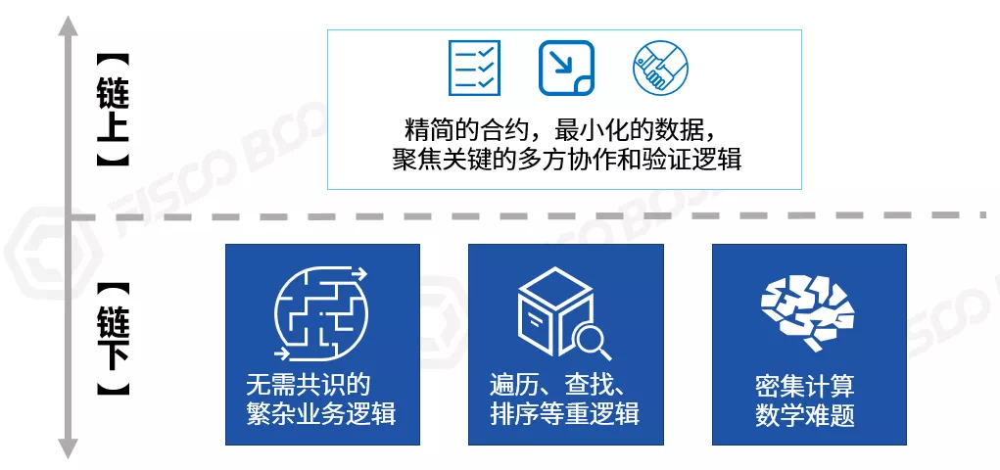

# An article on "on-chain" and "off-chain"

Author: Zhang Kaixiang ｜ Chief Architect, FISCO BCOS

What is "chain"?？What data and logic should be "chained"？Can the file be linked？Can you batch check data on the chain？What is "Under the Chain"?？
"On-chain," "off-chain" many problems, a clear article。

## What is "on-chain" and "off-chain"?

chains of block "chains," containing "**Data Link**"和"**node chain**”。Data chain refers to the chain structure of block data, which constitutes the chain of data verification and traceability.；"Node chain" means that multiple nodes are connected together through a network to share information with each other, and the consensus nodes jointly execute the consensus algorithm to generate and confirm blocks。

The brief process of trading "on-chain" is as follows.

1. Bookkeepers collect transactions and package them into "blocks" in a chain data structure.。
2. Consensus algorithm drives everyone to verify transactions in new blocks to ensure consistent results are calculated。
3. The data is broadcast to all nodes and stored securely, and each node stores a complete copy of the data.。

Once the transaction is "on-chain," it means that it is fully executed and "distributed transactionality" is achieved.。Simply put, it's like a passage that has been collectively approved and posted on a bulletin board, with a lot of good words, permanently visible and unalterable.。
"On-chain" means "**Consensus**"和"**Storage**"Both are indispensable.。Transactions are not consistent and correct without consensus and cannot be accepted by all participants in the chain.；Consensus data is not stored by multiple parties, meaning that data can be lost or unilaterally tampered with, let alone redundantly available。
In addition, if you just call the interface to query, do not change any on-chain data, and do not need to confirm the consensus, it is not "on-chain."。

Alternatively, a business service itself is not directly related to the blockchain, or its business processes do not need to participate in consensus, and the data generated is not written to the node storage, then the business service is called "**Off-Chain Services**"Whether it is co-deployed with the blockchain node on a server or even compiled with the node process。
When the business service calls the blockchain interface to send a transaction, and the transaction completes "consensus" and "storage," it is called "on-chain."；If the transaction is not packaged as expected, it can be called "**Failed to chain**”。

In fact, almost all blockchain systems, especially those combined with the real economy and the real world, require on-chain and off-chain collaboration, using a "hybrid architecture" to achieve the system itself contains a rich technology ecology.。

*Note 1: Transaction (transaction) is a general term in the blockchain, which refers to a piece of instruction and data sent to the blockchain that changes the data and state on the chain.

*Note 2: This section describes a brief model, in the multi-layer chain, sharded model, the process will be more complex, the transaction division is more detailed, but "consensus" and "storage" is the basic principle of the chain unchanged.

## The light of the transaction and the weight of the "chain."

At present, the underlying blockchain platform is gradually maturing, performance and cost are no longer a big problem, but the following overheads are inherent due to "distributed multi-party collaboration."

- **Consensus overhead**: In mainstream consensus algorithms, PoW (proof of work, i.e. mining) consumes electricity.；PoS (Proof of Equity) to mortgage assets to obtain bookkeeping rights；PBFT (Byzantine Fault Tolerance Algorithm Commonly Used in Alliance Chains) Bookkeepers have to complete multiple round trips to vote, and the process steps are complicated。
- **Computational overhead**: In addition to calculations such as encryption and decryption, protocol resolution, etc., on the blockchain that supports smart contracts, in order to verify the execution results of the contract, all nodes will execute the contract code indiscriminately, which will affect the whole body.。
- **network overhead**: Exponentially proportional to the number of nodes. The more nodes, the more network propagation times, and the greater the bandwidth and traffic overhead. If the data packet is too large, it will be even worse.。
- **Storage overhead**: proportional to the number of nodes, all the data on the chain will be written to the hard disk of all nodes, in a chain of 100 nodes, it becomes 100 copies, if there are 1000 nodes, that's 1000 copies。

One might say, "That's the cost of 'trust."！"I agree.。Only the ideal can not be divorced from reality, after all, hardware resources are always limited。
Imagine if each transaction were a complex scientific computing task, each node would run full of CPU and memory.；If each transaction contains a large picture or video, the bandwidth of the entire network, as well as the storage of each node, is quickly plugged.；"The tragedy of the Commons" is inevitable if everyone is open to misuse of "on-chain" resources.。
Calling an API to make a transaction is easy, and the overhead on the chain is like an elephant in the room, hard to ignore.。As a developer, you need to "**The light of the transaction and the weight of the chain**, "actively" up-chain "while reducing unnecessary overhead and finding a way to balance。

*Note 1: General Alliance Link node reference configuration: 8 cores / 16G memory / 10m external network bandwidth / 4T hard disk, regardless of "miner" and other special configurations。Local tyrants, as the saying goes, "money can solve the problem is not a problem, the problem is..."

*Note 2: This section does not discuss "local / shard consensus" for the time being, nor does it discuss "parallel scaling."

## Let "on the chain" belong to the chain, "under the chain" to the chain

Overhead is just a matter of cost, and in essence, blockchain should be allowed to do what it should do most。Focus on multi-party collaboration in the chain, reach consensus as soon as possible, create or pass on trust, and use good steel to the cutting edge.；Those non-global, without the need for multi-party consensus, large amount of data, computational complexity... All put down the chain to achieve, a hero three help.。

How to cut？At the business level, identify the "greatest common divisor" in multi-party collaboration transactions and data sharing, grasp the key points and pain points, and make a difference.；Technically, the rational design of multi-layer architecture, foster strengths and avoid weaknesses, according to local conditions to use a variety of technologies, to avoid holding a hammer to see what is a nail, a move to hit the world thinking。

To avoid being too abstract, a few examples are given below.。

*Note: Each example actually has a lot of detail, considering the length, here is a summary, focusing on the difference between the chain and the organic combination.

## Can the file be linked？

It's a very high-frequency question that's often asked。The file here generally refers to images, videos, PDFs, etc., but also refers to a large amount of data set, the purpose of the chain of trusted sharing, is to enable the recipient to verify the integrity and correctness of the file.。
In common scenarios, file sharing is generally local, peer-to-peer, rather than broadcast to everyone, so that the blockchain indiscriminately stores massive amounts of data, which can be overwhelmed.。Therefore, it is reasonable to calculate the digital fingerprint (MD5 or HASH) of the file and link it with some other optional information, such as author, holder signature, access address, etc.。
The files themselves are stored on private file servers, cloud file storage, or IPFS systems, which are more suitable for maintaining large amounts of files and large-size files, with higher capacity and lower cost.。**Note that if the security level of the file reaches the level of "not a byte can be leaked to unrelated people, etc.," then IPFS should be used with caution, preferably private storage.。**
When you need to share a file with a specified friend, you can send the file point-to-point through a dedicated transmission channel, or authorize a friend to download the file at a specified URL, which can be isolated from the P2P network of the blockchain and does not occupy blockchain bandwidth.。After the friend obtains the file, calculate the MD5 and HASH of the file, compare it with the corresponding information on the chain, verify the digital signature, and ensure that the correct and complete file is received.。
In this scheme, the file is "confirmed," "anchored" and "addressed" on the chain, and the plaintext is transmitted off-chain and intertested with the chain, balancing cost, efficiency, and privacy security.。

## How to query and analyze data in batches？

It is a natural requirement to analyze the data on the blockchain, such as "which business processes an account participates in, how many transactions it completes, and how successful it is," "how many times a billing node participates in block bookkeeping over a period of time, whether it is timely, and whether it cheats," these logics will involve dimensions such as time range, block height, transaction sending and receiving parties, contract address, event log, and status data.。
At present, the underlying platform of the blockchain is generally using "Key."-Value "storage structure, the advantage is that read and write efficiency is extremely high, but it is difficult to support complex queries.。
Secondly, the complex query logic is generally carried out after the block generation, the timeliness is slightly lower, and does not require multi-party consensus, there is a certain "offline" nature.。
Finally, once the data is "on the chain," it will not change, and only increase or decrease, the data itself has obvious characteristics (such as block height, interrelated HASH values, digital signatures, etc.) can verify the integrity and correctness of the data, in the chain or off-chain processing is no difference, any node with complete data can support independent complex queries.。

Therefore, we can export the complete data from the chain, including all blocks from the creation block to the latest, all transaction flows and receipts, events generated by all transactions, state data, etc., and write them into an off-chain relational database (such as MySQL) or big data platform to build a "mirror" of the data on the chain.。
Blockchain browser, operation management platform, monitoring platform, regulatory audit and other systems, will adopt this strategy, the chain out of the block, the chain in a timely manner ETL storage, localized analysis and processing, if necessary, and the chain to interact, and then send transactions through the interface on the chain can be。

## Complex Logic and Computation

Slightly different from complex queries, complex logic refers to the parts of the transaction process that have complex relationships and complex processes.。
As mentioned above, the smart contract on the chain will run on all nodes, and if the smart contract is written too complex or contains redundant logic that does not actually require consensus across the network, the entire network will incur unnecessary overhead.。An extreme example is a contract that writes a super-large data traversal logic (or even a dead loop), so all nodes in the network get caught up in this traversal, running for half a day, or even being dragged to death.。

In addition to using a GAS-like mechanism to control the length of the logic, within the allowable GAS range, we recommend that the design of smart contracts be as simple as possible, and that the code contained in a single contract interface is more complex than a hundred lines, you can consider whether to disassemble part of it.。
Dismantling boundaries vary from business to business, quite a test of familiarity with the business。Developers need to decouple the business in a hierarchical and modular way, and only put the parts of the business process that involve multi-party collaboration, consensus, sharing and publicity on the chain, so that the contract only contains "must" and "iron" logic to run on the chain, and the contract logic is "small and beautiful."。

Generally speaking, multi-witness online collaboration, public ledger management, and key data (or hash of data) that must be shared with all can be put on the chain, but some of the relevant pre-or follow-up inspection, accounting, reconciliation and other logic can be properly disassembled to the chain.。
Some of the logic related to intensive computation should be implemented off-chain as much as possible, such as complex encryption and decryption algorithms, which can be designed to generate off-chain logic for quick verification on the proof chain.；If the business process involves the traversal, sorting, and statistics of various data, the index is established under the chain, and only the key is performed on the chain.-Accurate reading and writing of Value。
In fact, now whenever I see that mapping or array is used in the contract, I will obsessive-compulsive to think about whether I can put this part of the service to the chain, personal more appreciate. "**Under the fat chain**"和"**On the thin chain**The design orientation of。
To emphasize, streamlining the contract logic on the chain is not all about the efficiency of the contract engine, which is getting faster and faster.。The core reason is to avoid the "tragedy of the commons" while maximizing the effectiveness of the blockchain.。Developers come up with contracts with minimal compute and storage costs, with "**Do not add entities if not necessary**"The Occam's razor-like beauty is all the more an expression of respect and responsibility for all participants in the chain.。

##  Instant Messaging: Quick Negotiation and Response

Due to the constraints of queue scheduling, consensus algorithm, network broadcast and other factors, the process of "up-chain" will be somewhat delayed.。Using the chain of proof-of-work consensus, the delay is from ten seconds to 10 minutes, using the consensus of DPOS and PBFT, the delay can be shortened to the second level, in addition, if you encounter network fluctuations, transaction congestion and other special circumstances, the delay performance will be jitter.。
In general, the "up-chain" will appear a little "slow" compared to transient interactions with millisecond or hundred millisecond responses.。For example, go to the supermarket to buy a bottle of water, after payment must not stand there and wait for ten seconds to ten minutes, chain out of the block after confirmation before leaving (slightly embarrassing)。

For similar scenarios, it is appropriate to combine on-chain pre-deposit and off-chain payment, in the point-to-point channel under the chain to achieve high-frequency, fast, low-latency transactions, under the chain to ensure receipt and response, and finally the account balance of both parties, transaction credentials to the chain, in the chain to complete the proper bookkeeping.。The famous "Lightning Network" is similar to this model.。

In addition, some business scenarios will be preceded by multiple rounds of order matching, bidding auctions or bargaining。Generally speaking, these operations occur between local counterparties and do not necessarily require a network-wide consensus, so they can also be completed through an off-chain channel, and finally the orders of both parties (including the results of the negotiations between the two parties, digital signatures and other information) are sent to the chain to complete the transaction.。

Take the example of fast chess, each move of the chess player does not need to be chained in real time, the two sides just snap underground, the referee and the audience just watch, at the end of the game, for example, a total of 100 hands, then the records of these 100 hands together, together with the winning or losing results on the chain, in order to record the record distribution bonus。If you want to replay the game details (such as video), you can refer to the above-mentioned off-chain file storage model, using a dedicated server or distributed storage implementation.。

In response to similar needs, the underlying FISCO BCOS platform provides AMOP (On-Chain Messenger Protocol), which uses the already built blockchain network to achieve peer-to-peer, real-time and secure communication across the network.。Based on AMOP, it can support instant messaging, quick negotiation, event notification, secret exchange, and building private transactions.。

*Note: [AMOP] details can refer to: https://fisco-bcos-documentation.readthedocs.io/zh_CN/latest/docs/manual/certificate_list.html

## How to trust the information under the chain？

Let's look at a typical question: "**What to do if you want to use off-chain information in the operation of a smart contract？**”
For example, there's a World Cup final quiz game on the chain, but the World Cup can't be played on the chain.；Or need to refer to today's weather, weather is obviously not native information on the chain, should be obtained from the Bureau of Meteorology；In cross-border operations, legal exchange rates may be used, which must come from an authoritative body and cannot be generated out of thin air on the chain.。
This is the time to use "**prophecy machine(Oracle)**"The public contract in which information such as the game, weather, exchange rate, etc. is written to the chain by one or more off-chain trusted agencies, and other contracts use this trusted information confirmed by consensus without ambiguity.。Considering security and efficiency, Oracle (Oracle) will have a variety of specific practices, which is quite interesting to implement.。

Further soul torture is:**“****How to ensure that the data on the chain is true****？”**Frankly speaking, the blockchain does not fundamentally guarantee the credibility of the data under the chain, only to ensure that once the information is on the chain, the whole network is consistent and difficult to tamper with.。When the blockchain is combined with the real economy, it is bound to face the problem of "how to trust the chain."。
Such as asset-related applications, in addition to personnel management, but also "**Four streams in one**"That is," information flow, business flow, logistics, capital flow "matching and cross-validation, will make the business process more credible.。These "flows" often occur in the real world below the chain, and to control them, a variety of technologies and methods may be used, such as the Internet of Things (sensors, cameras, etc.), artificial intelligence (pattern recognition, federal learning, etc.), big data analysis, and endorsement by trusted institutions, which are far beyond the scope of blockchain.。

So, the proposition in this section is actually.**How blockchain can be widely integrated with technology in the digital world to better play its role in multi-party collaboration and building trust**。
With the development of the digital world, especially "**New infrastructure**"We believe that extensive digitization will reduce the cost of information collection and verification while protecting privacy, and the data collected will become richer and richer."。
For example, in the use, transfer, recovery of physical materials, timely collection and monitoring, or even multi-party, multi-channel, multi-dimensional three-dimensional collection and monitoring, and on-chain consensus, publicity, anchoring, on-chain cross-validation, so that you can gradually approach "**The physical world is trusted on the chain.**"The effect will be tighter logic, more credibility, more reliable data and value flows, and lower friction for collaboration."。

##  "On-chain"Or "under the chain""Governance？

"Governance" is the development of industry alliances and business operating rules, ensuring the implementation of rules, handling unusual events, rewarding and disciplining participants, etc.。
By idealized standards, it seems that on-chain governance should be implemented, with code decisions, rule-making and enforcement, and systems with "self-healing" "superpowers" when errors occur."。In fact, complete on-chain governance is too complex and challenging to implement, especially when it comes to achieving the enforcement of real-world laws and regulations.。
One more step: if you rely entirely on the code, what if the code itself has a BUG, or you want to "change the requirements"?？How decision makers and developers under the chain discover and intervene？
Therefore, "Code is Law" is still an idealized goal, and off-chain governance is indispensable.。

The participants of the alliance chain form a management committee to conduct democratic centralism discussions and decisions in the real world, jointly formulate rules, initiate governance actions together in a multi-sign, workflow approach, and call the blockchain port on the chain.。
On the chain, including the underlying blockchain platform and smart contracts, a series of decision-making and control points are built in, such as supporting multi-party voting decisions, having access and permission control capabilities that penetrate from the business layer to the underlying layer, modifying business and node parameters, resetting accounts in response to abnormal situations, and correcting and adjusting accounts for errors.。
Governance actions and results have been confirmed by consensus, effective in the whole network on the chain, open and transparent, subject to extensive supervision, highlighting its rationality and impartiality.。Regulators and judicial arbitration can also be introduced if necessary.。
In turn, the data on the alliance chain is identity-aware, difficult to tamper with, undeniable and traceable throughout, providing a complete data base for off-chain governance decisions and easy to provide credible credentials for off-chain implementation.。Therefore, the organic combination of on-chain and off-chain helps to design a complete, controllable and sustainable governance mechanism.。

## How to do "up" and "down" freely

Maybe someone will say, "This chain is too complicated, I want to use the blockchain."！”
I think this statement is quite right。At the end of the day, users want a "chain" to take advantage of.。As developers, we want to create a flexible, plug-in system architecture, to achieve a variety of capabilities, what data export, file storage and transmission, intensive computing, data collection and asynchronous on-chain, governance supervision, one-click deployment... On-demand trade-offs, packaged out of the box, in fact, provides "**A range of blockchain-based capabilities**”。
The final presentation of the "chain," in addition to nodes, there are blockchain browser, management desk, monitoring and auditing system, business templates, APP / small programs and a series of interactive portals, users only need to move the mouse, click the page, adjust the interface, one-stop experience to a complete blockchain application.。Users will feel: "This is the blockchain," no longer need to be divided into "on-chain" and "off-chain."。

Having said that, I recommend a design that I think is great: Distributed Identity (DID).。
DID is a set of specifications covering distributed identity management and trusted data exchange.。Authority completes KYC for user, issues credentials。Users publish a summary of their identity on the chain, while their private data exists off the chain (this is very important)。
When used, the user adopts "**clear authorization**"和"**selective disclosure**"strategy, only need to show a small amount of information or encryption proof, and the chain data for comparison and verification, you can prove the credibility of user credentials and data, to achieve the" data more run, users less errands, "to protect the user's privacy of the gratifying effect.。
This design is a good combination of on-chain and off-chain, logical closed-loop self-consistent, not because the data exists under the chain, it weakens the efficacy of the chain, but makes the chain's credit model more important.。
The DID specification defines semantically clear, hierarchical data structures, as well as common interaction protocols。The open source project WeIdentity fully implements the DID protocol and provides a wealth of peripheral support tools and services, which is worth referring to.。

*Note: [WeIdentity] details can be seen: [https]://fintech.webank.com/weidentity](https://fintech.webank.com/weidentity)

## Conclusion

In the future, the "credible" blockchain will be increasingly linked to people's daily lives and the real economy, and will enter the homes of ordinary people.。As a practitioner, keep an open mind, actively and innovatively combine blockchain with more technologies, whether operating on or off the chain, as long as it can solve problems and create value, it is a good chain。
