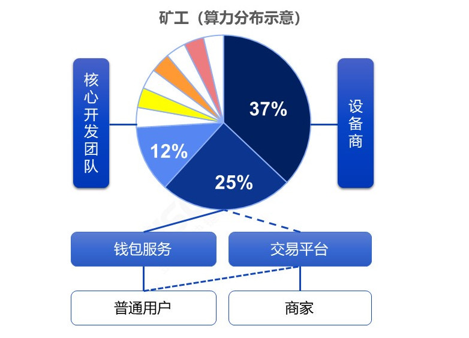
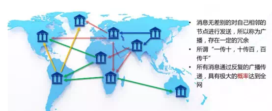
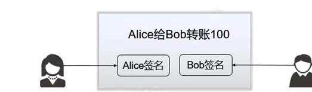
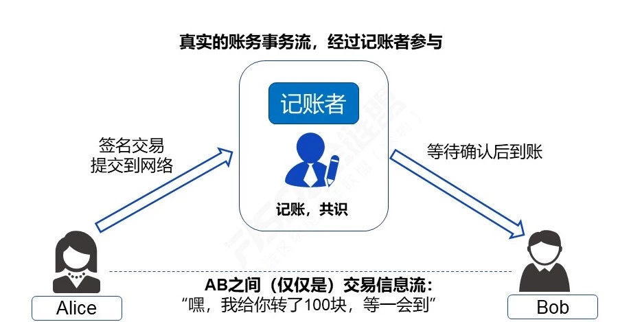
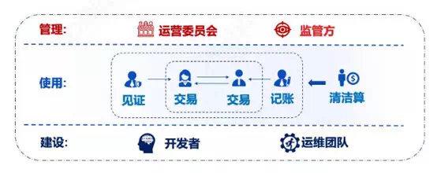

# Are transactions on the blockchain really "peer-to-peer"?？

Author: Zhang Kaixiang ｜ Chief Architect, FISCO BCOS

**Transactions on the blockchain are peer-to-peer and do not require a central entity to maintain transactions**。This is the opening phrase commonly used in many articles that wave the flag for the blockchain, and it's unequivocal, and there's no doubt that it's kind of "**One into the blockchain, like face to face**"The illusion。

Literally point-to-point and face-to-face

In fact, this sentence has a certain degree of confusion, if the precise "**central entity**"Defined as some strong intermediaries similar to today's (the good or bad of this model is not discussed here), it seems to make sense, after all, there is no intermediary on the blockchain that physically separates the participants.。

Star structure and public ledger interconnection model comparison.

But if you stop there, it's easy to mislead people that "transactions on the blockchain are 'peer-to-peer'," and obscure the fact that virtually any blockchain system needs to be**Consensus nodes, or "bookkeepers" or "miners"**to package and confirm transactions。Even solutions such as plasma, lightning / lightning networks, etc., only allow participants to exchange accounting information flows directly or indirectly on specific channels, and ultimately settle or resolve disputes, or have to go back to the main chain for consensus completion processes.。

The existence of "miners" can be conceptually "decentralized," because there is more than one miner, so the phrase "no central entity" seems right, but the "decentralization" of miners is in fact a kind of**Uncertainty**, there has been a clear trend of concentration of miners on the public chain, or something like "**21 Elders**This cartel, which has been criticized by devotees, has sprouted, and its degree of decentralization and security depends in part on the "community" game or the operation of a god.。

Network ecology around "miners"

In terms of efficiency and experience, the quality of service of "classical" decentralized bookkeeping is hardly reliable, once there is a hot transaction situation, then a few days of network congestion, transaction delays, soaring transaction fees are common things, a few dollars of value conversion, fees may be hundreds of dollars.。At the same time, as an ordinary small scattered leek users, basically no opportunity to complain or promote your expectations of service quality improvement, even customer service channels are not found, after all, is "decentralized."。

If the user is using a blockchain wallet or client-side transaction, let alone "peer-to-peer," a non-light client-type wallet client actually sends the transaction to the server, which acts as a proxy and submits the transaction to the blockchain network.。That's good, as long as the wallet service provider doesn't make a demon, it's not a problem.。

If it is the client of the exchange, then many cases are in the exchange.**Business Database**In a note, even the blockchain network does not touch。In the lack of regulation, operating level and uneven "exchange" industry, this model is both "centralized," but also faces serious moral and security risks, while the "decentralized exchange" is the intermediary role to the chain of smart contracts and miners, theoretically more transparent, but in terms of efficiency, process, still can not be said to be "peer-to-peer."。

What happens if the user simply installs the node themselves and joins the network directly?？

Physically, because of the constraints of the connection model (the common Gossip model only connects a few "neighbor" nodes), only from the network level, you and the counterparty will probably not be directly connected, but after multiple forwarding, the two sides can "meet," which is the basic characteristics of P2P networks, not "literally" point-to-point. "。If there are any moths on the forwarding link, it is also uncertain。

In general, in the network model of repeated broadcast forwarding, the information arrival rate can still be guaranteed under the premise of rigorous route selection and verification of connected neighbors.。The "point-to-point" here is in fact a generalized bridged multi-hop connection (similar to lightning / lightning networks), and this model inevitably has a certain transmission redundancy and delay rate。In fact, the well-known "P2P download network," if you want to achieve a flying speed experience, relies on centralized servers outside of ordinary nodes to accelerate.。

Having said that, even if the physical network establishes a point-to-point connection, the transaction transaction level still has to wait for the bookkeeper (miners) to collect the transaction package, consensus confirmation and synchronization of the block, a transaction is completed, the process of "physical direct connection" does not involve the significance of the economic model.。

To sum up, the so-called "point-to-point" is more like a slogan, and its true meaning needs to be understood through appearances.。For the average user, the simplest "peer-to-peer" they understand is**face to face to put money into each other's hands**, one handshake to complete the transaction。And the user sends out the transaction, whether the next step is to the bank, payment company, or "distributed ledger," for ordinary users, in essence, is a kind of**Entrusted transaction**。

One-handed delivery

Literally "peer-to-peer" trading

The de facto distributed ledger

In this pattern, "**Face to face**"It doesn't exist, and privacy to some extent doesn't exist.。How to keep accounts if the information is not given to the bookkeeper？Zero knowledge, ring signatures and other heavy weapons are not equipped with every chain, the pursuit of comprehensive privacy protection chain, computing and architecture will be more complex, we will analyze separately。

Finally, think about the current mobile payment all kinds of smooth experience, bank large transfer second-level SMS notification, blockchain literally called "**Point to Point**"It's a beautiful thing to say, and the real bone feeling。

Therefore, if you read the article and see that the slogan boasting that the blockchain is "peer-to-peer" is the basis for the argument, it is recommended that the reader first clarify what context he is talking about here.。The real meaning of the distributed ledger in my mind is not "peer-to-peer," but "reliable, credible and controllable," through the game and collaboration, multi-party value network, so that each participant has a sense of presence in it.。

When the blockchain system can reach or approach the speed and interactive experience of existing centralized trading systems, including**7\ 24 Highly available multi-active multi-party bookkeeping, second-level delay confirmation, fast final consistency, high enough concurrent processing capacity, low enough transaction cost, clear QoS agreement and bottom-up disaster tolerance scheme for public and private.**And the blockchain's innate distributed architecture system has a group scale effect, can prevent evil, tamper-proof, can be regulated, then it is considered.**"Multi-center" trust endorsement, transparent collaboration**The reliable distributed trading system.。Do not shout slogans, hard work-oriented alliance chain goals, closer to this direction。

