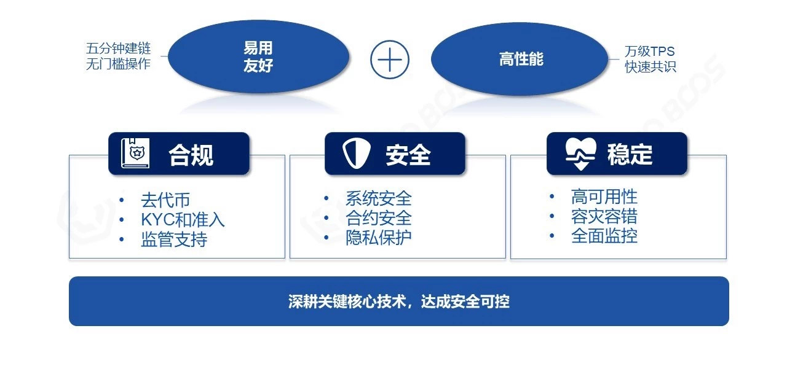
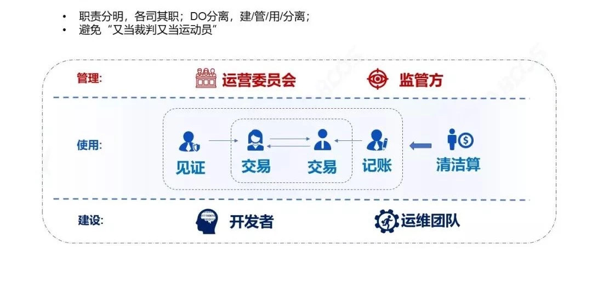
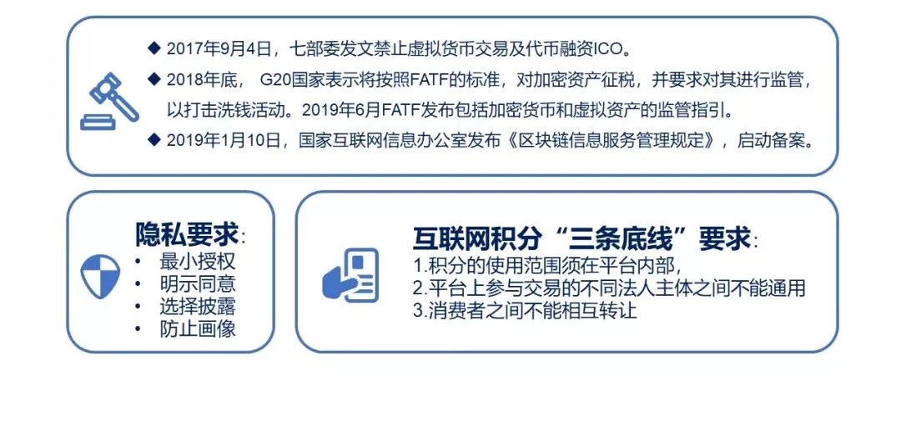

# How to make your blockchain more secure and controllable

Author: Zhang Kaixiang ｜ Chief Architect, FISCO BCOS

With the development of technology and industry, blockchain will be used in a wide range of real industries, as well as in key areas such as finance, government, and industry.。We need to pay more attention to the security and control of technology and operations to protect information security, financial security, and even social security.。

## Safe and stable technology path

Compared to any galloping "off-road vehicle," the alliance chain is more like a safe and reliable "business travel vehicle."。
As the so-called "road ten million, traffic regulations first," travel must first choose the right route, but also to comply with traffic regulations.；Secondly, the importance of safety is beyond doubt. The car hardware meets high safety standards and the driver is prudent and professional in driving to ensure the personal and financial safety of passengers.；Finally, the car itself must be reliable and durable, and not cause all kinds of trouble for the journey due to frequent breakdowns.。
On the basis of these, we will pursue to create a comfortable environment and friendly experience for passengers, and deliver passengers to their destinations with strong performance and high efficiency.。
Similarly, the technology path of the alliance chain takes into account stability and innovation, giving priority to the three indicators of "compliance, security and stability," and then pursuing ease-of-use, friendliness and high performance, both of which are also important additions.。

Specifically,**The first priority of alliance chain compliance is to go to tokens**The financial sector, in particular, should never participate in the operation of virtual tokens.。
In terms of security, the network, storage, business and other security reinforcement, to ensure that the chain of multi-party joint implementation, to avoid the short board of the barrel.。
In terms of stability, it is necessary to strictly test the quality of the system, follow the requirements of disaster tolerance and fault tolerance such as "two places and multiple centers," and establish a monitoring system that can respond quickly.。

## Several points of credibility and control

From the point of view of system function, blockchain is a multi-party participation, emphasis on collaboration, algorithm transmission and reinforcement of "trust" system, for the requirements of trust and control have the following points:

#### Identity knowable

Deny anonymity, anyone or node that joins this system needs to go through the KYC (Know Your Client) link, relying on the PKI system(Public Key Infrastructure)and other technologies to authenticate themselves to the network.。

#### Permissions can be configured

Assign different system permissions to different roles to avoid overstepping access or "being both a referee and an athlete."。

#### Controlled transactions

The transaction calls a smart contract, which is written in code, and the current "Code is law" is still an ideal value.。

#### Privacy can be guaranteed

Personal information, financial situation, transaction details, etc. are all personal privacy.。Institutions also have their own business privacy, such as wind control rules, details of major transactions, etc.。In the multi-party sharing of data at the same time, but also need to protect privacy from leakage。

#### History is verifiable

Block chain is a kind of "only add not delete" database。All historical transactions and the data generated can be recorded on the blockchain, the need to properly manage the chain of Shanghai volume data, the data exported to the chain, but also to have methods and on-chain comparison, to ensure that the data is complete and verifiable.。

#### Regulatory reachable

Many industries have corresponding regulatory authorities, and finance is a more strongly regulated industry。What blockchain systems do is provide regulators with relevant functional interfaces, access rights, and complete, verifiable data for audit analysis.。

## Alliance Chain Roles and Governance

The alliance chain governance model is also currently being explored, in general, the alliance chain is built, used and managed by the alliance together, the following will be summarized according to these three dimensions of role。

The operating committee can be composed of some or all of the institutions in the alliance, which itself is "polycentric" and is not exclusively managed.。
The Operations Committee jointly discusses and makes decisions on various matters of the alliance chain, including access approval, rule making and enforcement, and day-to-day operations of the alliance chain.。For example, some alliance chains will converge the authority of the "deployment contract" to the committee, which can ensure the validity and reasonableness of the trading rules on the chain.。

The regulator, on the other hand, is independent of the Operations Committee and can be assumed by authorities, authorities, industry associations, etc. The rules set by the Operations Committee should themselves meet regulatory requirements。

The roles of conducting transactions on the chain, participating in consensus bookkeeping, and being responsible for clearing and settlement are all summarized as "users" of the chain.。They follow the rules set by the operating committee to join the alliance chain, sign blocks and transactions with their own private keys, and efficiently complete collaboration based on on-chain smart contracts and consensus mechanisms.。

Developers are responsible for researching and developing the underlying platform of the alliance chain, building application systems and writing smart contracts according to business requirements, which are reviewed by the operations committee and then released and launched by the operations team.。

The operation and maintenance team is also responsible for configuring the parameters of the hardware and software environment, monitoring alarms, version upgrades, and long-term maintenance of system stability and sustainability.。

It can be seen that neither the "construction" nor the "management" roles are directly involved in the business transaction process, while the "use" role is based on a robust and efficient platform for collaboration and is subject to management oversight by the Operations Committee and regulators.。
At the same time, no matter which role, permission control and operation audit will be carried out, if the account loss, private key disclosure, but also through the chain of governance to retrieve and reset.。
Such a governance system is clear responsibilities, each performing its own duties, safe and controllable, which can not only ensure the rationality, effectiveness and safety of governance on the chain, but also protect the rights and interests of participants, so that everyone can collaborate efficiently.。

## Through the whole process of safety, control, compliance

**In terms of business processes, the blockchain has a large number of business participants, complex processes, and long asset lifecycles, which should ensure end-to-end business control.**Otherwise, it would be difficult to recover the asset if it was found to be worthless at the time of the acceptance settlement.。

First, people, things, and assets from the physical world must be rigorously identified before they can be put on the chain.。
This link still depends on a credible authority to check, such as the identity of Chinese citizens from the public security certification, property rights need to be certified by the Land Bureau, and so on.。You can also rely on the Internet of Things, genetic technology, artificial intelligence analysis and other technologies to cross-compare and analyze the data in depth to improve the efficiency and accuracy of identification.。
After the asset is issued on the chain, it is necessary to check whether the rights and responsibilities of the asset are clear, whether the pricing is fair, and whether the trading rules of the asset are open and transparent.。
It is a good practice to set a "pre-release" state for the assets just on the chain, and the assets can only be "effective" after multi-party inspection on the chain, and at the same time, it is a good practice to lock the assets to prevent "double flowers" in combination with off-chain measures.。

Then, assets can enter the "point-to-point transaction" efficient circulation link, the transaction process can use multi-party signature, Byzantine fault tolerance and other mechanisms to avoid a few people do evil.。

At the same time, set up key detection points, real-time monitoring of transactions, such as the discovery of possible anomalies, such as high-frequency trading, abnormal bids, violations of trading rules, etc., by the authority of the manager to call the management interface in a timely manner to stop and correct。

When the transaction is completed normally, that is, into the settlement and acceptance process, in the alliance chain without native tokens, the need for a secure docking chain payment system, as well as the physical world of the execution system, to ensure acceptance and execution.。
Even if the previous links are successfully completed, because of various complex factors, the business still has a small probability of errors or disputes, then regulatory audit and judicial arbitration can play a role, the current blockchain-based implementation of business certificate, judicial arbitration is also a very common way.。
Visible, end-to-end design and emphasis on on-chain and off-chain integration help manage asset lifecycles in a complete, closed-loop manner。

## Can be regulated, can intervene

The statement that "blockchain business is difficult to regulate" actually refers to a public chain that operates anonymously and across regulatory entities.。
Some public chain participants are anonymous, their networks are all over the world, the chain issues virtual tokens and there is no sound governance, often can only rely on hard fork governance, making it difficult to locate the chain actor, difficult to apply the corresponding laws and regulations, and unable to implement supervision for a node.。

The alliance chain with a series of trusted and controllable characteristics, because the identity is known, makes the participants' behavior on the chain with certainty, honest and compliant behavior can be rewarded in business cooperation, and malicious behavior can not deny denial.。Blockchain-specific chain data structure has a strong self-checking, data is difficult to tamper with, can be traced back to the whole process.。Regulators can install nodes to access the business chain, or use data synchronization to obtain data on the blockchain, resulting in a complete and error-free data collection.。

Incorporating this data into big data mining analysis can then enable end-to-end, cross-agency and transaction-wide regulatory audits。At the same time, wind control modeling is carried out to predict business risks in order to identify and rule on malicious behavior.。

Through permission configuration and the design of business smart contracts, the alliance chain can achieve fine-grained control functions, such as collecting contract release permissions to committees or regulators.。The contract is checked by regulatory rules at runtime, and any illegal transactions are immediately terminated or rolled back, blacklists are made for users and nodes, and measures such as freezing illegal accounts, kicking out malicious nodes, and correcting and replenishing accounts are taken.。Blockchain has the characteristics of consistency of transactions across the network, all nodes work together based on a consensus mechanism, regulatory measures can be accessed at one point, and the whole network takes effect, which provides effective operability for the whole network to collaborate on sound operations and anti-money laundering, and can achieve the effect of "penetrating supervision."。

Therefore, the alliance chain that adds trusted and controllable features to the blockchain can have a very different regulatable effect than the public chain.。

## Technology Neutral, Wind Control Priority

As blockchain and financial practitioners, we should also pay attention to the direction of policy while studying technology.。Since the seven ministries and commissions issued a document banning "virtual currency and token financing" in 2017, a series of regulations have been issued at home and abroad, clearly saying no to the "illegal behavior in the name of blockchain."。

"Technology neutrality" and "wind control priority" can be said to be a very classic summary, these two words from the Ministry of Industry and Information Technology to the National People's Congress reply letter, excerpted as follows: "The CBI urges and guides banking institutions to adhere to the 'technology neutrality' and 'wind control priority' principles, on the basis of clarifying the essential characteristics of financial business, follow the same business rules and risk management requirements, actively promote the application。Different industries have their own essential laws and basic rules, such as Internet points, although it does not seem to be "money," but in fact in the business points are clear accounting rules, the regulatory authorities also put forward the operation of the points "three bottom line" requirements (as shown above), and not because of the use of blockchain, the operation can break through these three bottom lines.。

For example, the "Privacy Protection Standards" issued by the relevant authorities, as well as the European GDPR and other regulations, define clear privacy protection requirements, technology application and management norms, so that privacy protection can be followed by law.。No matter what technology is adopted, it will eventually return to the essence of the business。The original intention of technology application should be to make the business more healthy and sustainable, and strictly control and reduce the risks, rather than bring new risks, especially in the financial industry.**"Finance is not just about operating capital, it's more about operating risk.。”**

To sum up, in the process of blockchain technology and application exploration, we have been guided by several basic principles:

**Excellent technology**: Deep cultivation of key core technologies, continuous innovation while pursuing safe and controllable。

**Extensive open source**: The open source community itself has lush vitality, but also through open source, access to community assistance, improve security。

**Good Norms**: When we use technology in the physical field, it may affect the people's livelihood and affect people's lives, so having good intentions and regulating compliance operations can make the world a little better because of innovation.。

------

#### FISCO BCOS Open Source Implementation Reference:

[FISCO BCOS Permission Control at a Glance](https://mp.weixin.qq.com/s?__biz=MzA3MTI5Njg4Mw==&mid=2247485317&idx=1&sn=4a7cf90cc727382af2099d11f67d8b0e&chksm=9f2ef599a8597c8f4116f5f3fa51570df9d71bfc4a4c11e1fe9878ad518337b3649bc4cd1270&token=1692289815&lang=zh_CN#rd)

[FISCO BCOS Security Control](https://fisco-bcos-documentation.readthedocs.io/zh_CN/latest/docs/design/security_control/index.html)

#### Industry specification reference:

[Guidelines for the Supervision of Data Centers of Commercial Banks](https://baike.baidu.com/item/%E5%95%86%E4%B8%9A%E9%93%B6%E8%A1%8C%E6%95%B0%E6%8D%AE%E4%B8%AD%E5%BF%83%E7%9B%91%E7%AE%A1%E6%8C%87%E5%BC%95)

[Guidelines on Information Technology Risk Management for Commercial Banks](https://baike.baidu.com/item/%E5%95%86%E4%B8%9A%E9%93%B6%E8%A1%8C%E4%BF%A1%E6%81%AF%E7%A7%91%E6%8A%80%E9%A3%8E%E9%99%A9%E7%AE%A1%E7%90%86%E6%8C%87%E5%BC%95)

[Code Law of the People's Republic of China](https://baike.baidu.com/item/%E4%B8%AD%E5%8D%8E%E4%BA%BA%E6%B0%91%E5%85%B1%E5%92%8C%E5%9B%BD%E5%AF%86%E7%A0%81%E6%B3%95/22860972?fromtitle=%E5%AF%86%E7%A0%81%E6%B3%95&fromid=24078179)

[Privacy Protection Regulations of the Ministry of Industry and Information Technology](http://www.cbdforum.cn/bcweb/index/bz/1-6.html)

[WeDPR White Paper on Privacy Protection](https://mp.weixin.qq.com/s/fYCHWb2SwWu-9ySLibrI0w)