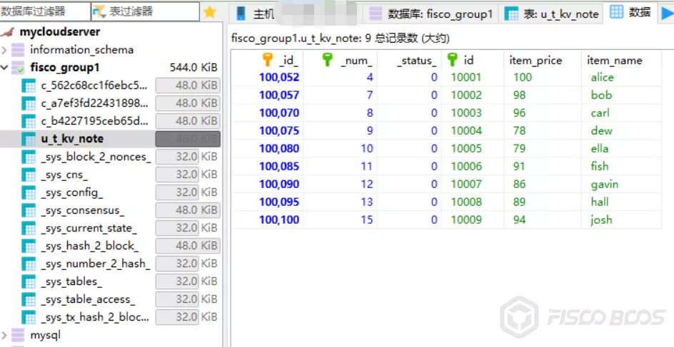
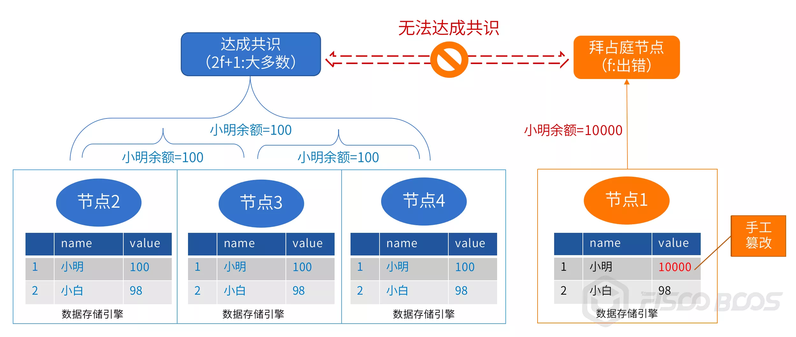
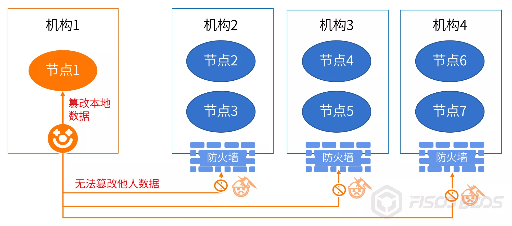
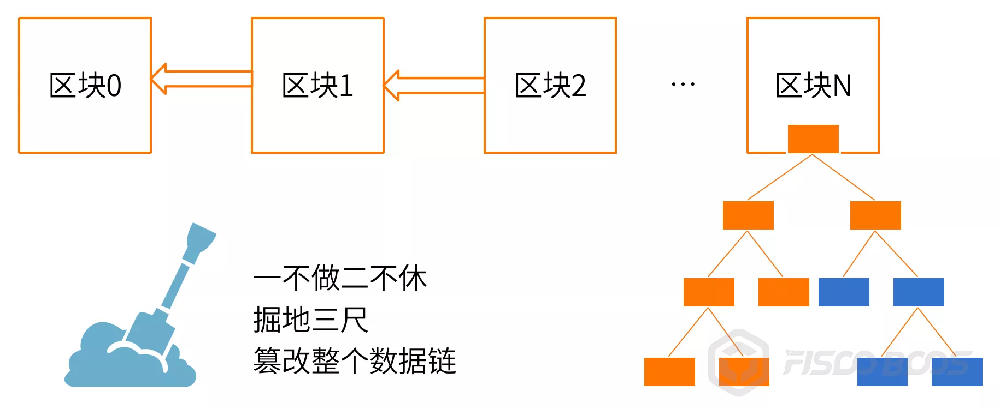
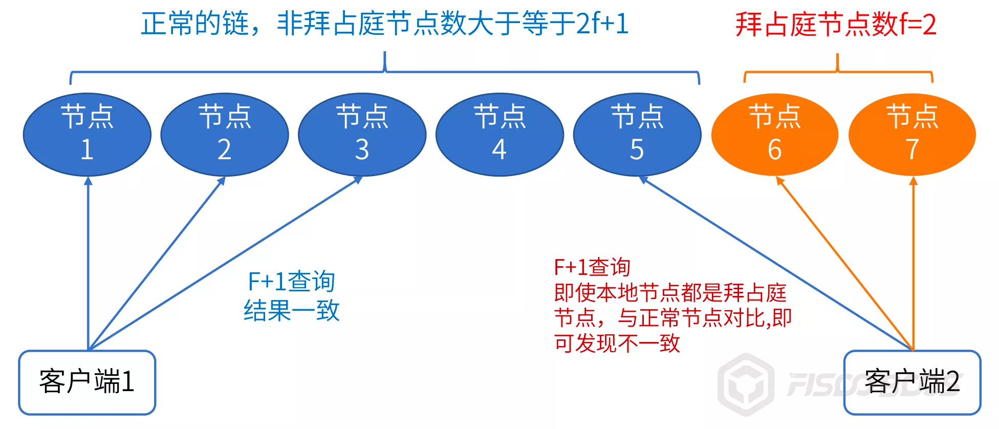

# How to explain the question "I tampered with the blockchain"

Author: Zhang Kaixiang ｜ Chief Architect, FISCO BCOS

Blockchain Data "**globally consistent**”、“**Difficult to tamper**These two characteristics are already well known and are the cornerstone of blockchain's creation of "trust."。In order to achieve these two effects, the blockchain consensus, synchronization, verification and other technical details are enough to be a book, and this article from the "**I tampered with blockchain data**"Speaking of。

## "I tampered with blockchain data"

The FISCO BCOS Open Source Consortium chain community is now quite active, generating a lot of discussion every day, and people are interested in researching and challenging how blockchain can be "hard to tamper with."。We noticed that, especially after FISCO BCOS supported MySQL database as the data storage engine, a classmate asked in the group after a while, "I manually modified some state data in the database connected to my node.**Is this tampering with the block chain data?**？”

Intuitively, for example, there is a smart contract on the chain that manages a specific asset balance, and in the database contract table, the consensus Alice balance would have been**100**At this time, someone opens the MySQL client, finds the Table corresponding to that contract, and updates Alice's balance to**10000**。

At this point he said, "Look, I called the contract query interface and found out that Alice's balance was indeed 10,000, which is not right, and the chain is still out of the block.**Not tamper-proof at all**！”。

## Preliminary analysis and answer

Why are these problems increasing recently?？We analyzed the next, guess is mainly due to the MySQL database user base is good, the system is more mature, to provide users with friendly command line or graphical interactive tools, FISCO BCOS provides a Table style contract development model, table structure design is clear and intuitive, for users, on the one hand, understand and manage it easier, on the other hand, easy to update or even delete a little meaning。

The following figure is only sample data, using the KVTable contract method, created a contract table named t _ kv _ node, the system automatically added the "u _" prefix, you can see, the table structure and data at a glance。

Previously, only LevelDB or RocksDB was used as the storage engine. These two file-based databases have few interactive tools, and their presence in front of users is not strong, and their operations are relatively obscure. They are mainly accessed through API programming. The data is addressed by Hash key, which is difficult to identify with the naked eye, and there are fewer cases (but not impossible) to modify the database by hand.。

So, hot issues emerge, provided that users can more easily modify the underlying data, rather than the problem did not exist before。At this time, we will recommend that the user try to initiate a transaction for Alice's balance, such as recharging Alice, or allowing Alice to transfer money, at this time, the node that has modified the data will not be able to participate in the consensus.。Because the balance of Alice calculated on this node is different from the results of other nodes, the other nodes are still calculated on the balance of 100 instead of**10000**Obviously the result is uneven.。

Review the fault-tolerant model of PBFT: define "f" as the number of fault-tolerant nodes, and the total number of consensus nodes in the network should be equal to or more than 3f.+1。That is, when there are 4 consensus nodes on the chain, the fault-tolerant f = 1, when the total number of consensus nodes is 7, f = 2, and so on.。

If the number of nodes with unmodified data meets the PBFT requirement of 2f+The number of 1, the chain can still out of the block。However, once a modified node has a transaction involving dirty data, it is like stepping on a mine, and from then on it can no longer be agreed and synchronized with the chain, which is equivalent to being abandoned.。Such nodes can be called "Byzantine nodes," that is, nodes that do evil or make mistakes, and alliance chains with node access control capabilities can even isolate Byzantine nodes.。

Another possibility is that the data in the database is manually modified, but a copy of the data is just cached in the node memory and has not been modified, so the query and transaction of this data through the node is normal, and even the tampered data in the database will be overwritten with the correct result, but this is a probabilistic event, depending on the size of the cache and the data items contained at the time.。

*Note: For chains that use PoW or other consensus mechanisms, the fault tolerance model is different, but a few nodes within the fault tolerance range are tampered with and will not affect the consensus of the chain.。

## "Can we tamper with the entire alliance chain?"

Some students may continue to ask questions: "**Then did I tamper with the data of a few more nodes?**？"The student who generally asks this question is facing his own deployment of the development and testing environment, all nodes are in his hands, so you can change it at will.。

In the real alliance chain environment, the nodes are in the hands of different institutions, to modify, first have to invade other people's networks, obtain server and database permissions, initiate modification and then retreat.。In fact, in a commercial environment that focuses on safety and security, this is very difficult and almost impossible to do.。

In terms of mechanism granularity, the number of nodes mastered by a single mechanism should be lower than the number of fault-tolerant consensus algorithms.。For example, there are a total of 7 consensus nodes on the chain, so a single organization should not have more than 2 consensus nodes, so as to avoid the organization's internal force to modify their own node data, or an organization of all nodes are accidentally wrong, dropped (such as the computer room fiber is cut off), resulting in the chain can not be out of the block.。

## Is there really no way to prevent "local tampering"??

Considering the local verification mechanism of blockchain data, such as the hash relationship between blocks, the Merkle tree structure of the state, the signature of the consensus node, etc., it seems that there is a certain probability that the data anomaly can be detected locally according to the mutual verification relationship of the data.。

However, for a data query, the local verification range of the blockchain is limited, and generally does not exceed a single block or a merkle tree, so if the tamper is familiar with the structure and local verification logic of the blockchain data, you can also follow the data verification relationship, starting from the state value, the merkle tree, block hash and other key data are all changed.。

Even more thoroughly, starting from the Genesis block, all the blocks, system configuration (for PoW, you can modify the mining difficulty to speed up the block), PBFT consensus list, etc., are changed according to his logic, so that the local data chain is still self-consistent, but can not be shared with other nodes.。

This kind of change sounds like a lot of effort, but for a determined and capable tamper, it's not difficult to change the local data, it's just difficult to change the data of other institutions.。

At this point, it is equivalent to a person determined to "deceive yourself," the gods have no choice。Once the authority to modify local data is given to an inappropriate person, in the worst case, no byte of the entire chain is right.。

However, no matter how wrong the local data is, it will only affect you, not others, and once you reach a consensus with other nodes, you will be discovered or even punished, and the whole effect will be a bit of a cover-up.。

## "Why the blockchain doesn't stop me from tampering with data？”

Further, the student would ask:“**Why the blockchain can't immediately detect and prevent me from tampering with data？Maybe I just accidentally**”。Frankly, this is a bit too much to expect from blockchain。Blockchain systems are not omnipotent and do not do everything, and blockchain does not prevent users from imposing operations on their servers, software, databases, etc., just as the law cannot and should not prevent you from breaking the cup at home.。

In essence, the consistent, difficult-to-tamper nature of blockchain is geared toward "**Global**"The consensus mechanism can detect and reject data that has been tampered with when transactions on the chain involve erroneous data, ensuring that most of the remaining healthy nodes on the chain continue to agree on blocks.。While nodes do not participate in consensus data locally, the consensus mechanism is beyond the whip.。

So why can't the blockchain actively detect and correct errors to ensure data consistency on each node？First of all, the data on the chain is very complex, the user directly logs into the database to manually modify a small amount of data, the blockchain node does not know which data has been modified, can not trigger the check.。

If the blockchain system regularly inspects all the data and compares all the data to other nodes, it is conceivable that doing so would be very costly to network, disk, and compute.。The point is, this doesn't solve the problem, because even if the dirty data only exists for a few tens of milliseconds from the time the data is tampered with to the time it is detected, then if unfortunately there is an application to query the data, it will still get the tampered results.。For demanding businesses, after-the-fact testing may not be the best option, as it is possible that business losses have already been caused, and the most that can be done at that time is to alert and correct the situation.。

Of course, you can also combine database operation monitoring, binlog and other auxiliary mechanisms to accelerate response speed and detection efficiency.。There are still methods, as mentioned above, but they are less cost-effective and do not completely solve the problem, and will only be considered as a remedy in specific scenarios where data modification is extremely sensitive and the business accepts delayed discovery and revision.。We classify this part into operations management tools and implement it based on scenario requirements.。

There is also a way to partially solve the query problem:**f+1 Query**。That is, when querying data, whether it is block data or contract status data, you may wish to check a few more nodes, the number of query nodes is more than f.。If there are 7 nodes on the chain, f = 2, the user queries his own node, continue to send a network request to query 2 nodes of other institutions, a total of 3 nodes, if the data is consistent, it means that the data must be correct, on the contrary, there must be a problem in these 3 nodes。

However, to perform f+1 query, the premise is that other institutions opened the query interface permissions, let you connect to query。In many secure alliance chains, only the network ports of P2P interconnection between nodes are generally opened, and data query permissions are not easily provided to other organizations.。In addition, multiple queries are initiated on the network, and their asynchronicity, timeliness, success rate, and performance are more variable.。

In summary, the data local to the node is like hitting a gopher, risking the head (issuing a transaction to participate in consensus, or performing f+1 query), the blockchain global consensus and fault tolerance mechanism can find that there is no head only squatting in the user's hard disk, only the user is responsible for it.。

## Conclusion

Blockchain realizes the fault tolerance and prevention of the whole network through network game and multi-party verification, and the local data synchronized to each node of the blockchain requires the user to manage and save it properly.。

From the point of view of trust transmission, first of all, users have to "believe in themselves," if they can not believe it, indicating that the system and data management loopholes, not to mention the modification of data, in the local system of the entire link, including blockchain software, SDK, business services are likely to make mistakes and tamper with fraud, such an environment what trust can be said？

Node holders must be very cautious, first of all, do not itch or mistake to change the data, and then the key is to establish a comprehensive system, including management policies and technical protection, such as host access control, database login and operation rights control, operation audit, log audit, etc.。

In case of data errors, the blockchain is a little better than the centralized system is that it may also be detected by checking with other nodes, at which point it should be alerted, verified, corrected and held accountable, as well as conditional and necessary premise, make good use of f.+1 query method, add a little insurance to the query operation。

In addition, we recommend that you regularly back up node data to a secure offline device so that you can quickly recover from cold data regardless of unexpected or man-made data problems, ensuring a certain RTO (Recovery Time Objective) and RPO (Recovery Point Objective).。

The robustness of the blockchain is that no matter how a single role tosses its own nodes and data, there is no impact on the overall situation, only the modifier itself is damaged.。Even if the nest is turned upside down, the chain is still light, its "**globally consistent**”、“**Difficult to tamper**"The law still holds, the chain is still the anchor of trust, this is the charm of the blockchain."。