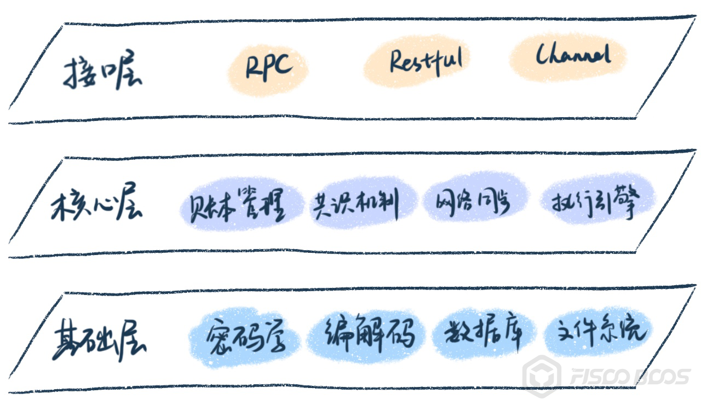
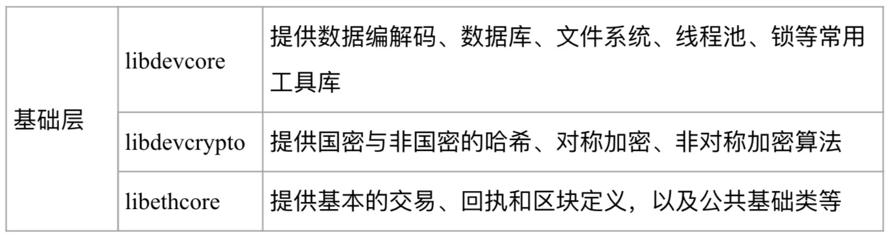
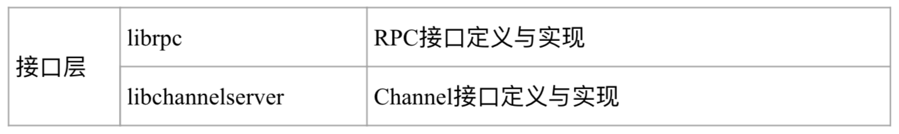
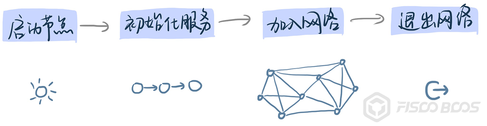
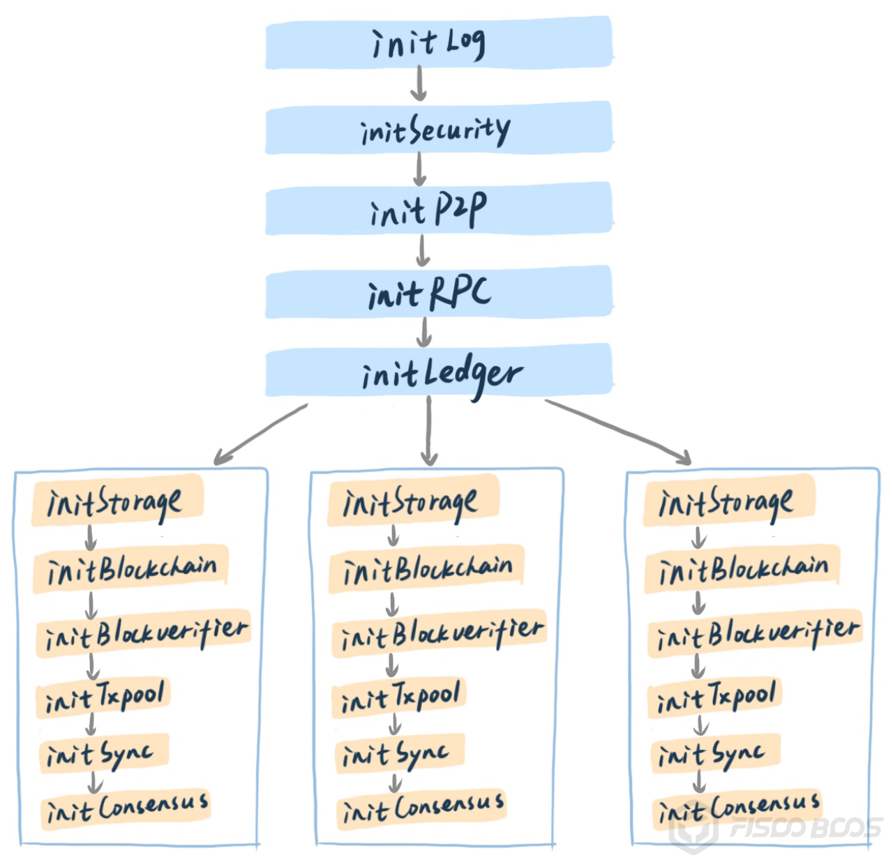
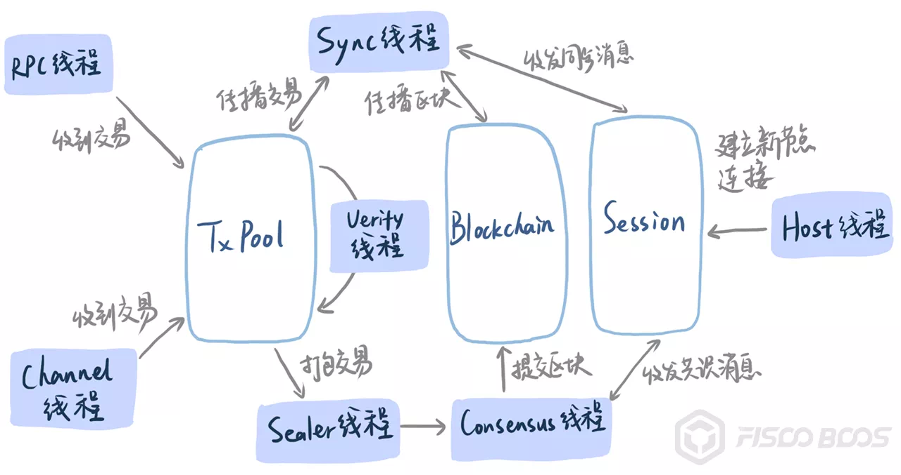
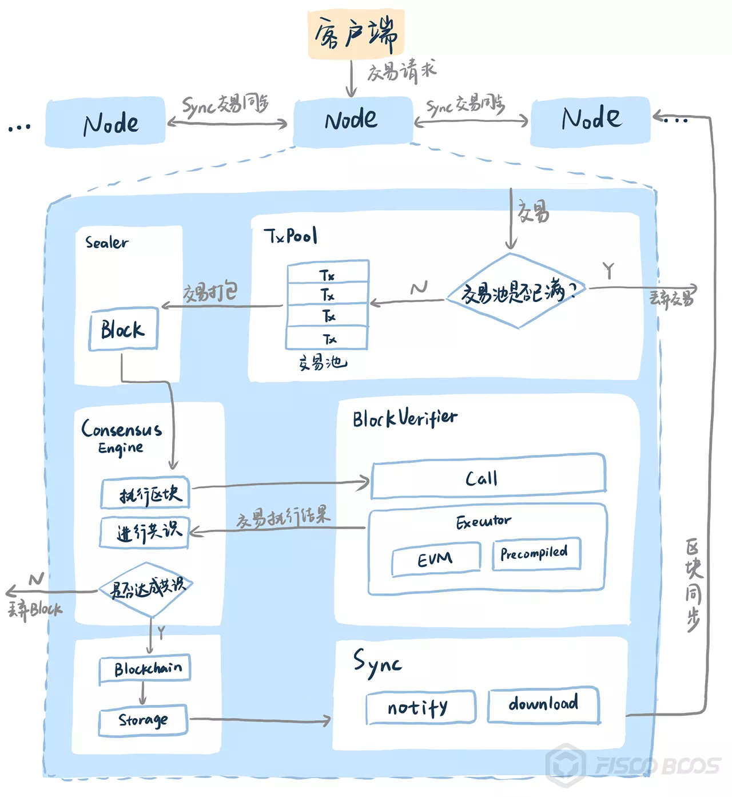

# Take you to read the source code: four perspectives multi-dimensional walk-through blockchain source code

Author ： LI Hui-zhong ｜ Senior Architect, FISCO BCOS

## Introduction

As an important part of "new infrastructure," blockchain has attracted more and more attention from technology enthusiasts。Blockchain geeks believe in "code is law" and believe that a trusted world can be built through code。

As a comprehensive subject technology, blockchain is based on mathematics, cryptography, computer principles, distributed networks and game theory and many other basic disciplines, the underlying code easily hundreds of thousands of lines, if not clear the way, to fully grasp these codes is very challenging。

This article hopes to give readers a way to read the blockchain source code, so that readers can calmly say "show me the code" when facing the underlying projects of the blockchain。

## Basic knowledge reserve

Blockchain is a comprehensive discipline, involving multiple professional fields, including a wide range of basic knowledge, before in-depth study of blockchain needs to do a certain breadth of knowledge reserves。Note that this is about breadth, not depth, which means you only need to know the basics and how they work。

- Cryptography related: understanding the basic principles and functions of hash, symmetric encryption, asymmetric encryption and digital signature；
- Computer operating system related: understanding of multi-process, multi-threaded, mutually exclusive, parallel and other related concepts and functions；
- Data structure related: understand the queue, stack, tree and other basic data structures and usage scenarios；
- Computer network related: understand TCP / IP, heartbeat packets, message flow and other basic concepts；
-Database related: understand the basic concepts of the database, understand the basic principles of KV database；
- Related to computer principles: understanding the concepts of program compilation, parsing, execution and bytecode, virtual machines, etc；
- Distributed systems related: understand the concepts and fundamentals of peer-to-peer networks, distributed consistency, CAP, etc；
- Program development related: master the relevant programming language, build tools, etc., understand the basic process of project construction。

## Multi-dimensional walking

After you have stored the relevant basic knowledge, you can open a real blockchain underlying code, which can be quickly downloaded to the project code through git clone。

But with hundreds of thousands of lines of code, where to start?？

An excellent blockchain underlying project must have an excellent engineering code that has its reasonable organizational structure and texture logic。The day-to-day code should follow the example of Ding Ding, first find out the basic structure and logic of the blockchain, and then start the day-to-day code, you can achieve twice the result with half the effort。

This article recommends going through four different perspectives and looking at the code from your own needs, rather than being swayed by huge amounts of code。These four perspectives are the functional perspective, the system perspective, the user perspective and the development perspective, which clarify the code architecture and key algorithms from the logical level, the operational level, the use level and the development level respectively。

## functional perspective

Before going deep into a blockchain underlying code, you should first obtain project design documents through its official website, technical documents, github wiki and other channels to understand its basic functional design。

Generally, each project will provide a list of core functions, overall architecture diagrams, functional module diagrams and other introduction documents, through which you can grasp the basic functions of the project。Even if you really can't find it, it doesn't matter. Most of the underlying blockchain projects have less difference at the functional design level, and the core functional modules are roughly the same。

Take FISCO BCOS as an example, the base layer code is as follows:

The core code of the core layer is as follows:

The core code of the interface layer is as follows:

From the functional perspective, first locate the code position of the core functional module, and then carefully in-depth each functional code, from a single functional module, you can also continue to recursively use the functional perspective split method, the breadth of traversal until you understand the whole picture。

## system perspective

From the perspective of the entire blockchain network operation, focus on the system behavior in which blockchain nodes participate throughout their life cycle。

Concerns include what initialization steps the node has gone through since tapping the command to start the node, and then how to establish a peer-to-peer network with other nodes, as well as complete distributed collaboration。

Due to the slight differences in the deployment architecture of different blockchains, the system operation mode is also different, but the change is inseparable, the system perspective, each blockchain system has to go through the process of node initialization, the establishment of peer-to-peer network, the completion of distributed interaction。

Looking at the blockchain from a systems perspective, we must first focus on initialization。Take FISCO BCOS as an example, the blockchain node starts from the main function entry, initializes and starts each module through the libinializer module, and the startup sequence is as follows:

An important feature of FISCO BCOS can be known through the startup sequence-support for multi-group ledgers, each group is an independent Ledger module, and each Ledger has independent storage, synchronization, and consensus processing functions。

At the same time, the system will start a number of threads (or processes, coroutines, similar principles), these threads include network monitoring, consensus, message synchronization, etc., can be combined with code analysis and system commands to view the running nodes to determine which key threads, to understand the working mechanism of key threads can be basically mastered blockchain system operation mechanism。

Taking FISCO BCOS as an example, the key threads after node startup and the relationship between them are as follows:

After the initialization is completed, the host thread of the network module will actively establish connections with other nodes according to the configuration list, and continue to listen for connections from other nodes；Sync threads start sending block heights to each other. If the block height is lower than that of other nodes, the download logic is enabled；RPC and Channel threads wait for the client to send a request and stuff the received transaction into txpool；The Sealer thread gets the transaction from txpool, and the Consensus thread starts processing the consensus packet。

In this way, the entire blockchain system operates in an orderly manner, completing client requests and distributed collaboration。

##  User perspective

The user perspective focuses on the operation interface and transaction life cycle, the interface and protocol design for accessing the blockchain, the codec method, the core data structure, the error code specification, etc. It also focuses on how to send a transaction to the chain and what processing processes the transaction goes through on the chain until a network-wide consensus is reached。

Generally, the underlying projects of the blockchain will provide documentation on the interaction protocols, usually implementing different types of interaction protocols, including JsonRPC, gRPC, Restful, and so on。

The interaction interface varies from project to project, but Metropolis contains interfaces such as sending transactions, deploying contracts, invoking contracts, viewing blocks, viewing transactions and receipts, and viewing blockchain status。The data encoding for different projects will also be different, some using Json, some using protobuf, etc。

After you understand the design details of the interaction protocol, interface, codec, and error code from the technical documents, the next most important thing is to send transactions, deploy contracts, call contracts, these key interfaces, the code is stripped, throughout the transaction life cycle, so as to understand the core logic of the underlying blockchain。

In the case of FISCO BCOS, multiple modules work together to complete the entire life cycle of a transaction

##  Development perspective

The development perspective focuses on the entire code project, including third-party dependencies, interrelationships between source code modules, unit test frameworks and test cases, compilation and build methods, continuous integration and benchmark, and how to participate in community source code contributions, among others。

Different languages have corresponding recommended compilation and build methods and single-test frameworks, usually in the blockchain project source directory can quickly locate the third-party dependency library, such as cmake built C++Project has CmakeLists.txt file, go project has go.mod file, rust project has cargo.toml file, etc。

Take FISCO BCOS as an example. From CMakeLists.txt, you can see that the dependent libraries include:

The core source code of the project includes the entry code of the fisco-bcos program and the code of each module of libxxx. According to the name of the module, the corresponding function can be quickly identified。

Unit test code in the test directory, using the boost unit test framework, subdirectory unittests single test code and source directory one-to-one correspondence, it is easy to find the source code corresponding to the unit test code。

The code of the build and continuous integration tool maintains a number of continuous integration use cases in different scenarios in the tools directory and sub-directory ci, and each pr (pull request) submitted on github triggers these continuous integration use cases, which can be merged into pr if and only if each use case passes successfully。

The code specification and contribution method of FISCO BCOS are described in detail in the CODING _ STYLE.md and CONTRIBUTING.md files, and community users are encouraged to actively participate in the contribution。

## SUMMARY

Blockchain involves a lot of fields and knowledge, you need to go deep into the details of the source code in order to truly fully grasp the core technology of blockchain。The so-called "heavy sword without a front, great skill without work," master the basic methodology of source code read, in order to be in front of a huge amount of code, the face does not change the color of the heart does not jump。

This paper proposes a way to read the underlying code of the blockchain from four different perspectives: function, system, user and development。

Finally, the examples given in this article are FISCO BCOS, but this walk-through method can be applied to any other blockchain underlying project, I hope this article is helpful to you。