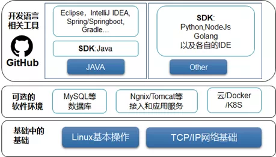
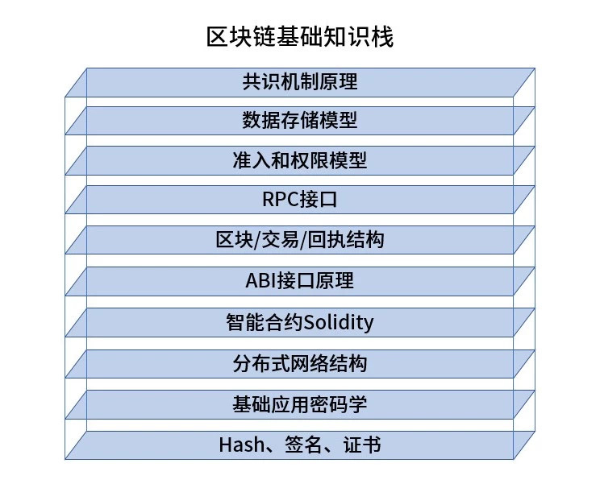

# Newcomers must read: blockchain practical skill tree

Author: Zhang Kaixiang ｜ Chief Architect, FISCO BCOS

With the new wave of blockchain craze, many students entered the field with great enthusiasm, but also encountered a lot of doubts, what knowledge blockchain development needs？How to learn？Where to learn from？What to do in case of problems？This article will try to give a quick and practical guide to newcomers in the blockchain field.。

## I. Basic IT Skills

Blockchain can be called "black technology," itself has a large number of technical elements, people who are interested in cutting into the blockchain from a technical point of view, should have or master the basic IT skills, to at least the conventional level of "programmer" or "system administrator" skill level.。

**Knowledge of Linux operating system is required first。**

Most blockchain systems can run on Linux, including CentOS and Ubuntu. You must know at least some basic Linux operating instructions, such as ls to view directories, ps or top to view processes, find files, netstat to view networks, ulimit to check system parameter limits, df / du to view disk space, apt / yum to install software, etc.。

There are many books and materials in this area, and I believe I can get started in a week.。In addition, good at Linux man instructions, you can get detailed help for each command。If you learn to write shell scripts, it's even more powerful, and you can automate a lot of tedious operations.。

**Have a clear network concept。**

The blockchain is originally a distributed system, and the nodes must be connected through the network, but if you run, you don't need much network knowledge, you only need to understand what TCP / IP is.；Difference between public network, intranet and local address；How to Configure Ports；Is the interconnection between nodes and nodes, SDKs, and nodes blocked by firewalls and network policies；Use ifconfig, telnet, ping, netstat and other commands to check network information and detect and locate network problems。Generally speaking, Linux books will also cover this part of the content。

Blockchain peripheral support, such as browsers, middleware, business applications, will rely on some third-party basic software, such as MySQL / MariaDB database, Nginx service, Tomcat service, etc., at least know how to install a specified version of the software, master the basic operation of modifying the configuration file of these software and making it effective, understand the password, permission configuration and network security policy of each software, in order to protect their own security。

If it is built based on a container environment such as cloud, docker, or k8s, you need to understand the functions, performance, and configuration methods of the service provider or container you are using, including resource allocation: CPU, memory, bandwidth, storage, etc., as well as security and permission configuration, network policy configuration, and operation and maintenance methods, so that you can easily distribute the build while maintaining its stability and availability.。

Various cloud service providers and container solutions have comprehensive documentation and customer service channels to help users use。

**To the programming language stage, according to their own learning path, choose a different language。**

If you are using the Java language, you should be familiar with Eclipse, IntelliJ IDEA and other integrated IDEs, familiar with Gradle-based project management software, familiar with Spring, Springboot and other java-based development components, familiar with the IDE or command line on the resource path such as ApplicationContext and other path definitions, and perhaps myBatis and other popular components, which can be found in java-related communities and websites information and books。

If you are proficient in the Java language, using the Java SDK to connect to the blockchain and run a Demo Sample will be very easy to write.。

If other languages are used, we also provide blockchain SDKs in Python, Node.js, Golang, etc.。

Different languages, their installation packages have different stable versions, will use different environments and dependent installation configuration methods, there will be different IDE and debugging methods, will not be listed in this article, I believe that learning and using the language itself, the programmer is already the most basic skills.。

**Finally, as a player surfing in the open source world, github, the "world's largest same-sex dating site," must be on it.。**

Register a github account, master the basic operation of the git version management tool, clone and pull open source software code, submit issue, commit your own modifications, submit a pull request to an open source project, and then click a star, passionate and stylish, leave your name in the open source world。

## Second, the basic knowledge stack in the field of blockchain.

The following sections of knowledge are more relevant to blockchain or a blockchain platform, from bottom to top as follows.

### HASH (hash algorithm), signature, certificate

Strictly speaking, this is not a proprietary knowledge in the blockchain field, but a basic knowledge that must be possessed, including digest algorithms such as SHA3 / SHA256 / RIPEMD160, and the relationship between these algorithms and "blockchain addresses," digital signature and verification methods based on public and private keys, digital certificate concepts and formats, such as X.509 certificates, and file formats for saving certificates / public and private keys, such as PEM files, keystore files。

###  Basic Applied Cryptography

Basic application cryptography is actually very wide, as a beginner, at least to understand the common algorithms of symmetric and asymmetric encryption, such as AES symmetric encryption, RSA, ECDSA elliptic curve and other asymmetric encryption algorithms, and the role of these algorithms in signature verification, data encryption, communication negotiation and protection.。If you want to use the national secret, you need to understand the concept and use of a series of algorithms from SM2 to SM9.。

###  distributed network structure

Blockchain is an innate "distributed network system." Nodes and nodes are interconnected through P2P ports of the network, and clients and SDKs are interconnected through RPC / Channel ports. First of all, it is necessary to ensure that the networks are interoperable, the listening addresses and ports are correct, the ports are open, the firewall and network policies are correct, and the certificates for secure connection are in place to ensure that the "general rules" of the blockchain are not painful.。

This also requires users to have basic network knowledge, network tools, and understand the unique node types (consensus nodes, observation nodes, light nodes, etc.) and interconnection methods (point-to-point two-way connections, JSON RPC HTTP short connections, Channel long connections, etc.)。For details, please refer to [FISCO BCOS Network Port Explanation](https://mp.weixin.qq.com/s?__biz=MzA3MTI5Njg4Mw==&mid=2247485319&idx=1&sn=b1fb98d27a0f34f5824a876ba8fa5fe6&chksm=9f2ef59ba8597c8d09eac31ccf0be07910e53f2d88afc5f58347247ba045c63736cc74133524&token=942411972&lang=zh_CN#rd)。

### Smart Contracts

Smart contracts can be said to be a door for application developers to face the blockchain, and getting into this door is exciting.。The popular smart contract language is Solidity, which originated from Ethereum and has been for blockchain since its inception.。

The Solidity language is actively updated, well-documented, consistent and transactional, and functional enough to enable medium-sized commercial applications.。

Of course, it is not as good as a mature language in terms of real-time debugging, third library support, and running speed, if the developer wants to use C++When writing smart contracts in languages such as Solidity, it is necessary to have an in-depth understanding of the computing paradigm on the blockchain to avoid writing smart contracts that cannot be agreed upon, and it is generally recommended to write contracts in languages other than Solidity after having an in-depth understanding.。

To master the Solidity contract, of course, read through the documentation and try it out.。Refer to the following: [https://fisco-bcos-documentation.readthedocs.io/zh_CN/latest/docs/manual/smart_contract.html](https://fisco-bcos-documentation.readthedocs.io/zh_CN/latest/docs/manual/smart_contract.html)

### ABI Interface Principle

On a blockchain that uses an EVM as a virtual machine, the EVM executes a contract in the Solidity language.。Contract compilation will generate a file with the suffix ABI, which is actually the JSON text defined by the contract interface. You can use the text viewer to find out how the contract you wrote is translated into the interface in the ABI, the interface return type, parameter list, parameter type, etc. As long as there is an ABI file for the contract, you can call the interface of the blockchain SDK to parse the transaction, return value, receipt, etc. related to the contract。

### block data structure

A block has a block header and a block block。The block has a transaction list, and each transaction (Transaction or Tx) in the transaction list has an initiator, a target address, a calling method and parameters, and a sender signature.。The result of the transaction will generate a "Receipt (Receipt)," which contains the return value of the called method, the EventLog generated by the running process, etc.

Knowing this, you can basically grasp the context of the blockchain data, and you can continue to delve into the data structure of the merkle root and the corresponding merkle tree is generated, what is the role (e.g. for SPV: Simplified PaymentVerification)。Refer to the following documentation: [https://fisco-bcos-documentation.readthedocs.io/zh_CN/latest/docs/design/protocol_description.html](https://fisco-bcos-documentation.readthedocs.io/zh_CN/latest/docs/design/protocol_description.html)

### RPC Interface

Here, the functional interfaces exposed by blockchain nodes are collectively referred to as "RPC interfaces"。View on-chain data, including blocks, transactions, receipts, system information, configuration information, initiate transactions to the chain to invoke smart contracts, modify system configurations, etc., or send messages and listen for events through the AMOP protocol, all through the RPC interface。

Dozens of RPC interfaces are suggested to read one by one, or make good use of searching to find the interface you want.。

The protocol used for interface communication may be JSON RPC or the original Channel protocol created by FISCO BCOS. The SDK has basically packaged the interface and protocol well, and you can also develop your own interface client based on an in-depth understanding of coding modes such as ABI and RLP.。Refer to the following documentation: [https://fisco-bcos-documentation.readthedocs.io/zh_CN/latest/docs/api.html](https://fisco-bcos-documentation.readthedocs.io/zh_CN/latest/docs/api.html)

### Admission and permission models

The alliance chain emphasizes security and control, and node access is the first step. After the chain is initialized, other nodes or SDKs are configured with corresponding certificates to access the existing alliance chain.。

The roles on the chain are controlled by a permission model, including administrator permissions, permissions to publish contracts, permissions to create tables, parameter configuration permissions, etc., to avoid confusion between roles, and some roles are both athletes and referees.。

Beginners need to carefully read the technical documents provided by the blockchain platform to understand the principles and follow the steps in the operation manual.。Refer to the following documentation: [https://fisco-bcos-documentation.readthedocs.io/zh_CN/latest/docs/manual/permission_control.html](https://fisco-bcos-documentation.readthedocs.io/zh_CN/latest/docs/manual/permission_control.html)

### data storage model

Blockchain nodes will use file databases (LevelDB or RocksDB), or relational databases such as MySQL to store data, so there is really a "database" on the chain.。

The data written to the database includes blocks, transactions, receipts, status data generated by contracts, etc. Whether to write "historical data generated by calling contracts" depends on different platforms, FISCO BCOS only saves the latest status value by default, and can optionally write modification records to the "receipt" or "history table" for tracking.。

FISCO BCOS also provides solutions to export historical data to an off-chain database for correlation analysis.。Refer to the following documentation: [https://fisco-bcos-documentation.readthedocs.io/zh_CN/latest/docs/design/storage/index.html](https://fisco-bcos-documentation.readthedocs.io/zh_CN/latest/docs/design/storage/index.html)

### Principle of consensus mechanism

Alliance chains are usually implemented using plug-in consensus mechanisms, and FISCO BCOS provides two efficient consensus algorithms, PBFT and RAFT, rather than "mining" these energy-intensive and inefficient consensus。

The consensus mechanism is the soul of the blockchain, and only through in-depth study of the consensus mechanism can we gain a deeper understanding of the effectiveness of the blockchain through multi-party collaboration, high consistency, support for transaction transactions, and tamper-proof and evil-proof.。Refer to the following documentation: [https://fisco-bcos-documentation.readthedocs.io/zh_CN/latest/docs/design/consensus/index.html](https://fisco-bcos-documentation.readthedocs.io/zh_CN/latest/docs/design/consensus/index.html)

The knowledge of blockchain is all-encompassing, and the deeper knowledge includes distributed system theory, game theory, cutting-edge cryptography, economics, sociology, etc. Only by mastering the above basic knowledge, and then in-depth study, by analogy, using scenarios to verify and explore innovative applications, can we give full play to the potential of technology and feel the charm of distributed commerce.。

## Third, what a learner.

In this process, learners are expected to:

### Patience in reading documents

Our open source project documents are more than 200,000 words long, and there are a large number of technical analysis and popular science articles in the public number, which are programmers in addition to coding, exhausted their only language reserves, code out of the massive text, is a huge technical wealth, covering all aspects of related open source projects.。If you can read through, or remember the document structure and title, open it quickly when needed, enough to solve puzzles and go deep.。

### Ability to search information

Documents, public numbers have a search function, when you think of questions related to the open source community, you can easily use keyword search, generally can find the answer。If there is a language unknown, you can raise it with the open source project team or supplement it according to your own understanding.。Common knowledge points, such as operating systems, networks, etc., can generally be found through public network search engines。

### Ability to troubleshoot environmental and dependency issues

Open source software involves the system environment, third-party software, software versions, etc. often have complex dependencies, too high or too low version may have some problems, please pay attention to read the project documentation on the hardware and software environment and dependency description, to ensure that your environment meets the requirements, and make good use of configuration management tools, software installation tools to obtain and set the appropriate version.。

### Commissioning capability

As mentioned above, the debugging tools of the Solidity language are not yet perfect, but you can make good use of the return value of the contract, EventLog, etc., through WeBASE, console and other tools to debug, and consult the Solidity documentation to understand where the problem may be.。

After the debug level is enabled for the logs of the blockchain nodes, detailed information will also be printed. You can check the running logs to obtain running information and possible error information, and analyze these information in combination with your own operations, such as the process of issuing transactions, to improve debugging efficiency.。

At the same time, the current open source software usually prints the cause of the error and the prompt to solve the problem on the screen, carefully check the operation feedback, the probability can understand the cause of the error and the solution.。

### Code reading ability

The maximum performance of open source software is to spread the code to the developers and learners without omission, understand the code structure, check the key processes in the code, use keywords to search for the corresponding implementation in the code, you can go deep into the details of the system, dig design ideas, locate problems, find optimization methods.。A studious and hardcore programmer who can talk to the world through code.。

### Ways and means of asking questions

"A good question is more important than an answer."。Our community is very active, everyone is very enthusiastic to answer and solve problems。We encourage questions to be asked openly in the community, so that on the one hand, everyone can share the problem and find solutions, and on the other hand, more people can help the questioner.。At the same time, I hope that when the questioner asks a question, a one-time detailed description of the relevant operating steps, system environment, software version, error tips and the desired solution are put forward.。

If it is a general problem, you can search and then ask questions, which is conducive to cultivating the ability to solve problems independently.。Hope that the questioner can feedback deeper questions to the community to help the community quickly optimize。For many typical problems, the community has also accumulated some proven solutions that we will collate and publish for easy access.。

The road from newcomers to old birds may be long, if you can refer to some of the methods of this essay, you can step on many fewer pits and write more applications。Enjoy blockchain, the community advances with you。

------

### Resource Links:

[Index of Open Source Components](https://fintech.webank.com/)

[FISCO BCOS Open Source Documentation](https://fisco-bcos-documentation.readthedocs.io/zh_CN/latest/)

**Newcomers please pay attention to reading:**

[Key Concepts](https://fisco-bcos-documentation.readthedocs.io/zh_CN/latest/docs/tutorial/key_concepts.html)

[and instruction manual](https://fisco-bcos-documentation.readthedocs.io/zh_CN/latest/docs/blockchain_dev/index.html)

[FISCO BCOS Public Development Tutorial Warehouse](http://mp.weixin.qq.com/mp/homepage?__biz=MzU5NTg0MjA4MA==&hid=9&sn=7edf9a62a2f45494671c91f0608db903&scene=18#wechat_redirect)

[The sparrow is small and has all five internal organs| From Python-SDK Talk about FISCO BCOS Multilingual SDK](https://mp.weixin.qq.com/s/YZdqf3Wxsnj8hY2770CuQA)This article explains in detail how to understand the block link port from the client's application.。

[Solidity Smart Contract (Chinese)](https://solidity-cn.readthedocs.io/)(Note that select the corresponding version)

[Solidity Smart Contract](https://solidity.readthedocs.io/（)Pay attention to select the corresponding version)

[How to write smart contracts elegantly](https://mp.weixin.qq.com/s?__biz=MzA3MTI5Njg4Mw==&mid=2247485277&idx=1&sn=c3703ab72802dc3de893eddb1e7c2c36&chksm=9f2ef541a8597c570865119298693bf2fbe18d57c03293ce721bf625271e7f75deaece6f8c0c&token=942411972&lang=zh_CN#rd)

[WeBASE Data Export: Helping Blockchain Big Data Scenarios Landing Quickly](https://mp.weixin.qq.com/s?__biz=MzA3MTI5Njg4Mw==&mid=2247485297&idx=1&sn=52b44667551f6ebe6eb41cc192e07486&chksm=9f2ef56da8597c7b937decd777a0c38cb0bb15c885bd84900497fbc3fa9432281a7ef2238a05&token=942411972&lang=zh_CN#rd)The blockchain data is exported outside the chain, using massive data storage。

[Graphical Blockchain, WeBase Documentation](https://webasedoc.readthedocs.io/zh_CN/latest/index.html)

------

**Recommended Bibliography:**

["bird brother's linux private dishes" (series)](https://book.douban.com/subject/2208530/)

[UNIX Network Programming (Series)](https://book.douban.com/subject/1500149/)

[Java Core Technology (Series)](https://book.douban.com/subject/26880667/)

["Springboot"](https://book.douban.com/subject/26857423/)

[The Spring War](https://book.douban.com/subject/26767354/)

