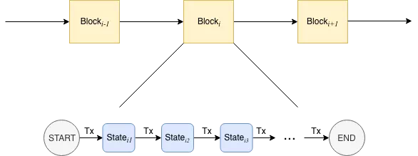
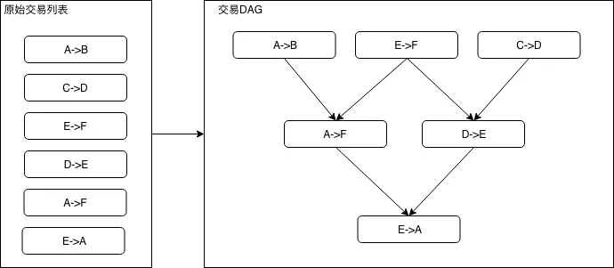
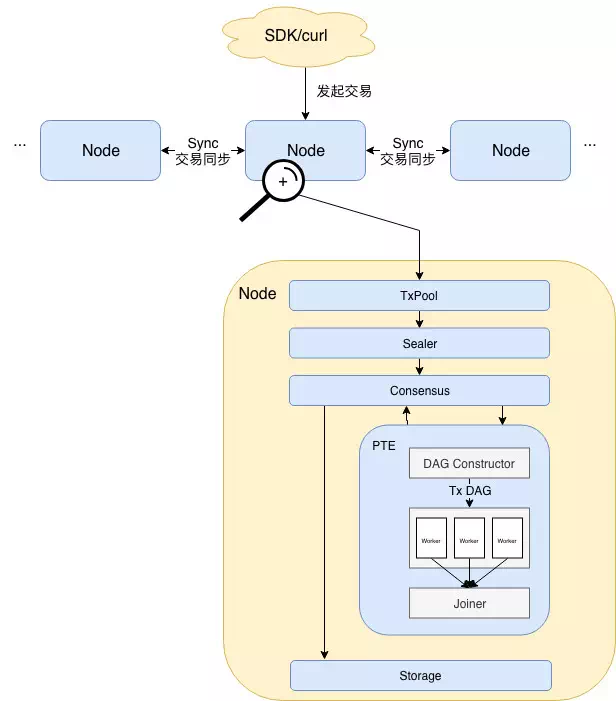
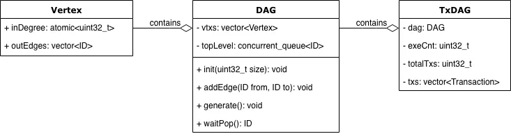
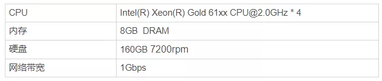
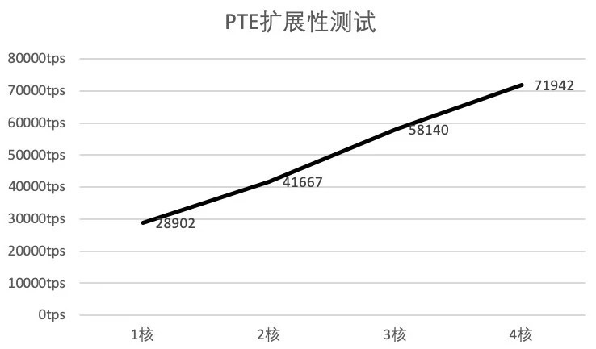

# Blockchain performance takes off: DAG-based parallel transaction execution engine

Author: Li Chen Xi | FISCO BCOS Core Developer

In the blockchain world, transactions are the basic units that make up transactions。To a large extent, transaction throughput can limit or broaden the applicable scenarios of blockchain business. The higher the throughput, the wider the scope of application and the larger the user scale that blockchain can support.。Currently, TPS (Transaction per Second), which reflects transaction throughput, is a hot indicator for evaluating performance.。In order to improve TPS, the industry has put forward an endless stream of optimization solutions, all kinds of optimization means of the final focus, are to maximize the parallel processing capacity of transactions, reduce the processing time of the whole process of transactions.。

In the multi-core processor architecture has become the mainstream of today, the use of parallel technology to fully tap the potential of the CPU is an effective solution.。A parallel transaction executor (PTE, Parallel Transaction Executor) based on the DAG model is designed in FISCO BCOS 2.0.。

PTE can take full advantage of multi-core processors, so that transactions in the block can be executed in parallel as much as possible；At the same time to provide users with a simple and friendly programming interface, so that users do not have to care about the cumbersome parallel implementation details。The experimental results of the benchmark program show that compared with the traditional serial transaction execution scheme, the PTE running on the 4-core processor can achieve about 200% ~ 300% performance improvement under ideal conditions, and the calculation improvement is proportional to the number of cores.。

PTE has laid a solid foundation for the performance of FISCO BCOS. This article will comprehensively introduce the design idea and implementation scheme of PTE, including the following contents:

- **背景**Performance Bottlenecks of Traditional Schemes and Introduction of DAG Parallel Model
- **Design Ideas**: Problems encountered when PTE is applied to FISCO BCOS and solutions
- **Architecture Design**: Architecture and core process of FISCO BCOS after PTE application
- **core algorithm**: Introduces the main data structures and algorithms used.
- **Performance evaluation**Performance and scalability test results of PTE are given respectively

## 背景

The FISCO BCOS transaction processing module can be abstracted as a transaction-based state machine。In FISCO BCOS, "state" refers to the state of all accounts in the blockchain, while "transaction-based" means that FISCO BCOS uses transactions as a state migration function and updates from the old state to the new state based on the content of the transaction.。FISCO BCOS starts from the genesis block state, continuously collects transactions occurring on the network and packages them into blocks, and executes transactions in the blocks among all nodes participating in the consensus.。When transactions within a block are executed on multiple consensus nodes and the state is consistent, we say that consensus is reached on the block and the block is permanently recorded in the blockchain。

As can be seen from the above-mentioned blockchain packaging → consensus → storage process, executing all transactions in the block is the only way to blockchain。The traditional transaction execution scheme is that the execution unit reads the transactions one by one from the block to be agreed upon, and after each transaction is executed, the state machine migrates to the next state until all transactions are executed serially, as shown in the following figure.



Obviously, this way of executing transactions is not performance-friendly。Even if two transactions do not intersect, they can only be executed in order of priority.。As far as the relationship between transactions is concerned, since the one-dimensional "line" structure has such pain points, why not look at the two-dimensional "graph" structure?？

In practical applications, according to the mutually exclusive resources that need to be used when each transaction is executed (mutually exclusive means exclusive use of resources, for example, in the above-mentioned transfer problem mutually exclusive resources, refers to the balance status of each account), we can organize a transaction dependency diagram, in order to prevent the transaction dependency relationship in the diagram into a ring, we can specify that the transaction list involves the same mutually exclusive resources, and the order of the lower transaction is a D。

As shown in the figure below, the 6 transfer transactions on the left can be organized as the DAG on the right:




In a trade DAG, a trade with an entry of zero is a ready trade that has no dependencies and can be put into operation immediately.。When the number of ready transactions is greater than 1, ready transactions can be spread across multiple CPU cores for parallel execution.。When a transaction is executed, the entry of all transactions dependent on the transaction is reduced by 1, and as the transactions continue to be executed, ready transactions continue to be generated.。In the extreme case, if the number of layers of the constructed transaction DAG is 1 (i.e., all transactions are independent transactions without dependencies), the increase in the overall execution speed of the transaction will directly depend on the number of cores n of the processor, and if n is greater than the number of transactions in the block, the execution time of all transactions in the block is the same as the execution time of a single transaction。

How to apply the trading DAG model, which theoretically has such an irresistibly beautiful feature, to FISCO BCOS？

## Design Ideas

**To apply the transaction DAG model, the primary problem we face is: for the same block, how to ensure that all nodes can reach the same state after execution, which is a key issue related to whether the blockchain can be out of the block normally.。**

FISCO BCOS Adoption Verification(state root, transaction root, receipt root)The way in which the triples are equal to determine whether the states agree。The transaction root is a hash value calculated based on all transactions in the block. As long as all consensus nodes process the same block data, the transaction root must be the same.。

As we all know, for instructions executed in parallel on different CPU cores, the order of execution between instructions cannot be predicted in advance, and the same applies to transactions executed in parallel.。In the traditional transaction execution scheme, every time a transaction is executed, the state root changes once, and the changed state root is written into the transaction receipt. After all transactions are executed, the final state root represents the current state of the blockchain, and a receipt root is calculated based on all transaction receipts.。

As you can see, in the traditional execution scenario, state root plays a role similar to a global shared variable.。When transactions are executed in parallel and out of order, the traditional method of calculating state root is obviously no longer applicable, because on different machines, the order of execution of transactions is generally different, at this time there is no guarantee that the final state root can be consistent, similarly, receive root can not guarantee consistency.。

In FISCO BCOS, the solution we use is to execute the transaction first, record the history of each transaction's change of state, and then calculate a state root based on these history after all transactions are executed, and at the same time, the state root in the transaction receipt is all changed to the final state root after all transactions are executed, thus ensuring that even if the transactions are executed in parallel, the final consensus node can still reach an agreement.。

**Once the status problem is solved, the next question is how to determine if there is a dependency between two transactions.？**

Unnecessary performance loss if two transactions are judged to have no dependencies；Conversely, if the two transactions rewrite the state of the same account but are executed in parallel, the final state of the account may be uncertain。Therefore, the determination of dependencies is an important issue that affects performance and can even determine whether the blockchain can work properly.。

In a simple transfer transaction, we can determine whether two transactions are dependent based on the addresses of the sender and recipient of the transfer, such as the following three transfer transactions: A → B, C → D, D → E. It is easy to see that transaction D → E depends on the result of transaction C → D, but transaction A → B has nothing to do with the other two transactions, so it can be executed in parallel。

This analysis is correct in a blockchain that only supports simple transfers, but once it is put into a Turing-complete blockchain that runs smart contracts, it may not be as accurate because we don't know exactly what is going on in the transfer contract written by the user, and what might happen is: A.-> B's transaction seems to have nothing to do with the account status of C and D, but in the user's underlying implementation, A is a special account, and every money transferred out of account A must be deducted from account C for a fee.。In this scenario, if all three transactions are related, they cannot be executed in parallel, and if the transactions are also divided according to the previous dependency analysis method, they are bound to fall.。

Can we automatically deduce which dependencies actually exist in the transaction based on the content of the user's contract?？The answer is not very reliable。It's hard to keep track of what data is actually manipulated in a user contract, and even doing so costs a lot of money, which is a far cry from our goal of optimizing performance.。

In summary, we have decided to delegate the assignment of transaction dependencies in FISCO BCOS to developers who are more familiar with the content of the contract.。Specifically, the mutually exclusive resources on which the transaction depends can be represented by a set of strings, FISCO BCOS exposes the interface to the developer, the developer defines the resources on which the transaction depends in the form of a string, informs the executor on the chain, and the executor automatically arranges all transactions in the block as a transaction DAG based on the transaction dependencies specified by the developer.。For example, in a simple transfer contract, the developer only needs to specify that the dependency of each transfer transaction is the sender address.+Recipient's Address。Further, if the developer introduces another third-party address in the transfer logic, the dependency needs to be defined as the sender address.+Recipient Address+The third party address.。

This method is more intuitive and simple to implement, but also more general, applicable to all smart contracts, but also increases the responsibility of developers, developers must be very careful when specifying transaction dependencies, if the dependencies are not written correctly, the consequences are unpredictable.。The relevant interface for specifying dependencies will be given in a subsequent article using the tutorial, this article assumes for the time being that all the trade dependencies discussed are clear and unambiguous.。

**After solving the two more important issues above, there are still some more detailed engineering issues left: such as whether parallel transactions can be mixed with non-parallel transactions for execution.？How to ensure the global uniqueness of resource strings？**

The answer is also not complicated, the former can be achieved by inserting non-parallel transactions as a barrier (barrier) into the transaction DAG - i.e., we believe that it is dependent on all of its pre-order transactions and at the same time is dependent on all of its post-order transactions -；The latter can be solved by adding a special flag to identify the contract in the transaction dependency specified by the developer.。As these problems do not affect the fundamental design of PTE, this paper will not expand。

Everything is ready, and FISCO BCOS with the new trade execution engine PTE is on the horizon。

## Architecture Design

**Architecture diagram of FISCO BCOS with PTE:**



**The core processes of the whole architecture are as follows:**

Users send transactions to nodes through clients such as SDKs, where transactions can be executed in parallel or not。The transactions are then synchronized between the nodes, and the node with the packaging rights invokes the packer (Sealer) to take a certain amount of transactions from the transaction pool (Tx Pool) and package them into a block.。Thereafter, the block is sent to the consensus unit (Consensus) to prepare for inter-node consensus。

The transaction in the block needs to be executed before consensus, and this is where the PTE exerts its power.。As can be seen from the architecture diagram, the PTE first reads the transactions in the block in order and inputs them to the DAG Constructor (DAG Constructor), which constructs a transaction DAG containing all transactions based on the dependencies of each transaction, and the PTE then wakes up the worker thread pool and uses multiple threads to execute the transaction DAG in parallel.。The Joiner suspends the main thread until all threads in the worker thread pool finish executing the DAG. At this time, the Joiner calculates the state root and receipt root based on the modification records of each transaction to the state, and returns the execution results to the upper caller.。

After the transaction is completed, if the status of each node is consistent, a consensus is reached, and the block is then written to the underlying storage (Storage) and permanently recorded on the blockchain.。

## core algorithm

### 1. The data structure of the transaction DAG.

The data structure of the transaction DAG is shown in the following figure:



**Vertex Class**For the most basic type, in the trading DAG, each Vertex instance represents a trade.。The Vertex class contains:

- **inDegree**: Indicates the degree of entry for this vertex
- **outEdges**: Used to store the outgoing edge information of the node, that is, the ID list of all vertices connected to the outgoing edge

**DAG class**Used to encapsulate the vertex and edge relationships of the DAG and provide the interface for operating the DAG, which includes:

- **vtxs**: Vertex array
- **topLevel**: A queue containing all vertices with an in degree of 0. Since topLevel will change dynamically during execution and will be accessed by multiple threads, it requires a container that can support thread-safe access
- **void init(int32_t size)Interface**Initializes a DAG structure containing the appropriate number of vertices based on the size passed in
- **addEdge(ID from, ID to)Interface**: Used to establish an edge relationship between vertex from and vertex to, specifically, add the ID of vertex to to the outEdges of vertex from
- **void generate()Interface**When all edge relationships have been entered, call this method to initialize the topLevel member
- **ID waitPop()Interface**Get a vertex ID with 0 in from topLevel

**TxDAG class**is the encapsulation of the DAG class to a higher level and is the bridge between the DAG and the transaction, which contains.

- **dag**The DAG class instance held by
- **exeCnt**: Total number of transactions executed
- **totalTxs**: Total number of transactions
- **txs**: List of transactions in the block

### 2. The construction process of the transaction DAG.

When constructing a transaction DAG, the DAG constructor first sets the value of the totalTxs member to the total number of transactions in the block and initializes the dag object based on the total number of transactions.。Subsequently, initialize an empty resource mapping table criticalFields and scan each transaction one by one in order。

For a transaction tx, the DAG constructor will resolve all the dependencies of the transaction, and for each dependency, it will go to criticalFields to query, if for a dependency d, a previous transaction also depends on the dependency, then build an edge between the two transactions, and update the mapping of d in criticalFields as the ID of tx。

The pseudo-code for the transaction DAG construction process is as follows.

```
criticalFields ← map<string, ID>();
totalTxs ← txs.size();
dag.init(txs.size());
for id ← 0 to txs.size() by 1 do
  tx ← txs[id];
  Dependencies ← Resolve tx dependencies;
  for d in dependencies do
    if d in criticalFields then
        dag.addEdge(id, criticalFields[d]);
      end
    criticalFields[d] = id;
    end
  end
end
dag.generate();
```

### 3. Execution process of transaction DAG

When a PTE is created, a worker thread pool is generated for executing the transaction DAG according to the configuration, the size of the thread pool is equal to the number of logical cores of the CPU by default, and the life cycle of this thread pool is the same as the life cycle of the PTE.。The worker thread will continuously call the waitPop method of the dag object to take out the ready transaction with an entry of 0 and execute it, and after execution, the entry of all subsequent dependent tasks of the transaction is reduced by 1, and if the entry of the transaction is reduced to 0, the transaction is added to the topLevel.。Loop the above process until the trade DAG is executed。

The pseudocode for the transaction DAG execution process is as follows.

```
while exeCnt < totalTxs do
  id ← dag.waitPop();
  tx ← txs[id];
  execute tx;
  exeCnt ← exeCnt + 1;
  for txID in dag.vtxs[id].outEdges do
    dag.vtxs[txID].inDegree ← dag.vtxs[txID].inDegree - 1;
    if dag.vtxs[txID].inDegree == 0 then
      dag.topLevel.push(txID)
    end
  end
end    
```

## Performance evaluation

We chose two benchmark programs to test how PTE has changed the performance of FISCO BCOS, namely, a transfer contract based on a pre-compiled framework implementation and a transfer contract written in the Solidity language, with the following code paths for the two contracts.

FISCO-BCOS/libprecompiled/extension/DagTransferPrecompiled.cpp

web3sdk/src/test/resources/contract/ParallelOk.sol

We use a single node chain for testing, because we mainly focus on the transaction processing performance of PTE, so we do not consider the impact of network and storage latency.。

**The basic hardware information of the test environment is shown in the following table**：



### 1. Performance testing


In the performance test section, we mainly test the transaction processing capabilities of PTE and Serial Transaction Execution (Serial) under each test program.。It can be seen that compared with the serial execution mode, PTE has achieved a speedup of 2.91 and 2.69 times from left to right, respectively。PTE has excellent performance for both pre-compiled and Solidity contracts。

### 2. Scalability testing



In the scalability test section, we mainly test the transaction processing power of PTE at different CPU core numbers, using a benchmark program based on a pre-compiled framework to implement a transfer contract。As can be seen, the transaction throughput of PTE increases approximately linearly as the number of cores increases。However, it can also be seen that as the number of cores increases, the rate of performance growth slows down because the overhead of inter-thread scheduling and synchronization increases as the number of cores increases.。

#### Write at the end

FROM LIST TO DAG, PTE GIVES FISCO BCOS NEW EVOLUTION。Higher TPS will bring FISCO BCOS to a wider stage。Give long sleeves, FISCO BCOS will be able to dance！