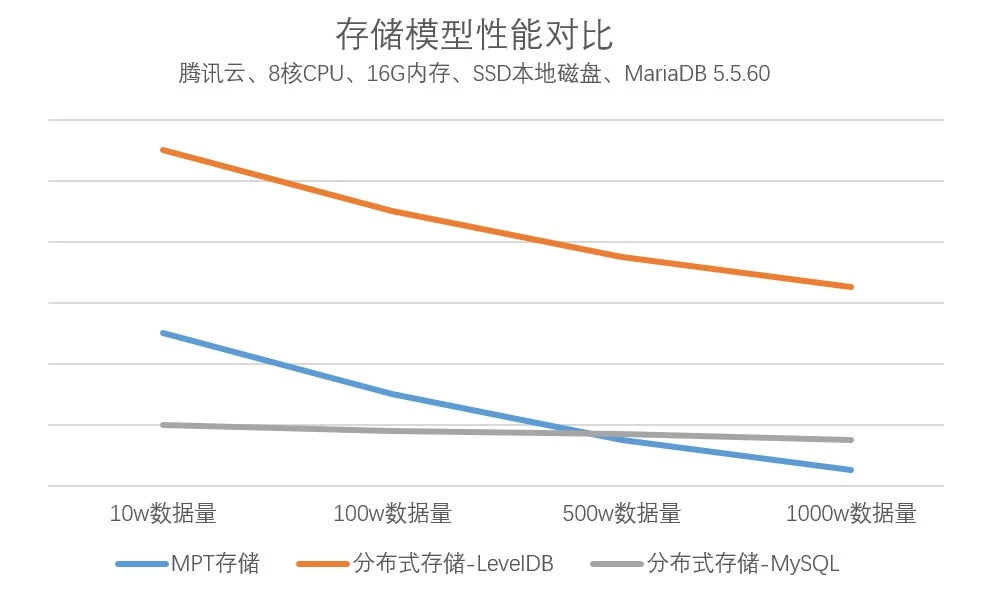

# FISCO BCOS 2.0 Principle Analysis Part 2: Distributed Storage Architecture Design

Author: Mo Nan ｜ Senior Architect, FISCO BCOS

FISCO BCOS 2.0 adds support for distributed data storage, overcoming many of the limitations of localized data storage。

In FISCO BCOS 1.0, nodes use MPT data structure to store data locally through LevelDB, which is limited by the size of the local disk, and when the volume of business increases, the data will expand dramatically, and data migration is also very complex, bringing greater cost and maintenance difficulty to data storage.。

In order to break through the bottleneck of performance, we redesigned the underlying storage in FISCO BCOS 2.0, implemented distributed storage, and used a different way from MPT to achieve traceability, bringing performance improvements.。

Let's start with the advantages of distributed storage solutions.

- Supports multiple storage engines and highly available distributed storage systems to support data expansion easily and quickly；
- The calculation and data are isolated, and node failures will not cause data anomalies；
- Data is stored remotely, and data can be stored in a more secure quarantine area, which makes sense in many scenarios；
- Distributed storage not only supports Key-The value form also supports SQL, making business development easier.；
- The storage of world state is changed from the original MPT storage structure to distributed storage, which avoids the problem of performance degradation caused by the rapid expansion of world state.；
- Optimize the structure of data storage and save more storage space。

## From MPT storage to distributed storage

### MPT Storage

**MPT(Merkle Paricia Trie)**From Ethereum, the external interface is Key-Value, which uses a prefix tree to store data, is the storage mode of FISCO BCOS 1.0。

MPT is a prefix tree structure, each leaf node in the tree is allowed to have up to 16 child leaf nodes, and the leaf node has a HASH field, which is derived from the HASH operation of all child leaf nodes of the leaf.。The root of the tree has a unique hash value, which identifies the hash of the entire tree.。

Image from Ethereum White Paper

The global state data of Ethereum, which is stored in the MPT tree. The state data consists of accounts。An account is a leaf node in MPT. Account data includes Nonce, Balance, CodeHash, and StorageRoot.。When any account field changes, the hash of the leaf where the account is located changes. The hash of all leaves from the leaf to the top changes, and finally the top StateRoot changes.。

Thus, any change in any field of any account will result in a change in StateRoot, which can uniquely identify the global state of Ethereum.。

Image from Ethereum White Paper

MPT can implement light client and data traceability, and can query the status of blocks through StateRoot.。MPT brings a lot of HASH computing, breaking the continuity of the underlying data storage.。In terms of performance, MPT State has a natural disadvantage。It can be said that MPT State pursues the ultimate provability and traceability, and compromises performance and scalability.。

### distributed storage

FISCO BCOS 2.0 introduces high-scalability, high-throughput, high-availability, high-performance distributed storage while maintaining storage interface compatibility。**distributed storage(Advanced Mass Database，AMDB)**: Re-abstracts the underlying storage model of the blockchain, implements an SQL-like abstract storage interface, and supports a variety of back-end databases, including KV databases and relational databases。 After the introduction of distributed storage, data read and write requests directly access the storage without MPT, combined with the cache mechanism, the storage performance is greatly improved compared to MPT-based storage.。MPT data structure remains, only as an option。

Distributed storage supports relational databases such as MySQL and parallel expansion methods such as MySQL clusters, sub-databases and sub-tables. Theoretically, the storage capacity is unlimited.。

## distributed storage architecture

#### State layer (State)

Abstracts the storage access interface of the smart contract, which is called by the EVM and divided into StorageState and MPTState.。StorageState is the adaptation layer of distributed storage. MPTState is the old MPT adaptation layer. FISCO BCOS uses StorageState by default.。

#### Distributed Storage Layer (Table)

Abstracts the SQL-like interface for distributed storage, which is called by the State layer and Precompiled.。The distributed storage layer abstracts the storage addition, deletion, modification, and lookup interfaces to classify and store the core data of the blockchain in different tables.。

#### Drive Layer (Storage)

Implement specific database access logic, including LevelDB and MySQL。

### **Distributed Storage Term Interpretation**

#### Table

Store all data in a table。The mapping between the master key of distributed storage and the corresponding Entries in Table. You can add, delete, modify, and query the master key of distributed storage. Conditional filtering is supported.。

#### Entries

Entries in which the same master key is stored, array。The master key of distributed storage is different from the master key in Mysql. The master key of distributed storage is used to indicate which key the Entry belongs to. Entries of the same key are stored in the same Entries。

#### Entry

Corresponding to a row in the table, each row takes the column name as the key and the corresponding value as the value, forming the KV structure。Each entry has its own distributed storage master key. Different entries can have the same distributed storage master key.。

#### Condition

The "delete, modify and check" interface in Table can pass in conditions, and supports filtering logic such as "equal to," "greater than" and "less than." The interface filters the data according to the conditions and performs corresponding operations to return the result data.。If the condition is empty, no filtering is done。

##### Example

Explain the above terms using the example of a company's employee registration form for receiving materials.

- Name in the table is the primary key of distributed storage。
- One Entry for each line in the table。There are four Entries, each with three fields。
- Name is the primary key in Table, and there are 3 Entries objects。There are two records of Alice in the first Entries, one record of Bob in the second Entries, and one record of Chris in the third Entries。
- When calling the query interface of the Table class, the query interface needs to specify the distributed storage master key and conditions, set the distributed storage master key of the query to Alice, and set the condition to price > 40, Entry1 will be queried。

### Distributed Storage Table Classification

All entries in the table will have _ status _, _ num _, _ hash _ built-in fields。

#### System tables

System tables exist by default. The storage driver ensures the creation of system tables.。

#### User Table

A table created by a user CRUD contract. The name of the table is _ user _ < TableName >.。

#### StorageState Account Table

_contract_data_+Address+_ as table name。Table stores information about external accounts。The table structure is as follows:

## SUMMARY

FISCO BCOS has experienced a lot of real business practices since its release.。In the process of continuous improvement, distributed storage has summed up a storage model suitable for financial business, high performance, high availability and high scalability, the architecture is becoming more stable and mature, and distributed storage will continue to be the cornerstone of blockchain systems in the future to support the development of blockchain systems.。

In the next article, I will provide the experience process of distributed storage. Please continue to lock in the FISCO BCOS open source community.。

### Series selection

[FISCO BCOS 2.0 Released](https://mp.weixin.qq.com/s?__biz=MzA3MTI5Njg4Mw==&mid=2247485340&idx=1&sn=310a442382c879aecaa0cb37c1bce289&chksm=9f2ef580a8597c96cada2526ad2df2e65c00c62a50bcebbd41d84c36aadfac2526f6a12aa2ec&token=705851025&lang=zh_CN#rd): (with new features interpretation)

#### principle analysis

[Design of Group Architecture](https://mp.weixin.qq.com/s?__biz=MzA3MTI5Njg4Mw==&mid=2247485338&idx=1&sn=9ce03340c699a8527960a0d0b26d4923&chksm=9f2ef586a8597c9003192718c1f60ed486570f6a334c9713cc7e99ede91c6f3ddcd7f438821f&token=705851025&lang=zh_CN#rd): Make it as easy as group chat to establish a multi-party collaborative business relationship between enterprises.。

#### Using tutorials

[Group Structure Practice Exercise](https://mp.weixin.qq.com/s?__biz=MzA3MTI5Njg4Mw==&mid=2247485337&idx=1&sn=622e88b631ae1bfe5789b2fe21576779&chksm=9f2ef585a8597c9311c972eb67174b3638f7b69d87d6eea243fc327bf515159fb53f216a5fec&token=705851025&lang=zh_CN#rd): Take building an arbitration chain as an example and demonstrate how to send transactions to that chain.。

