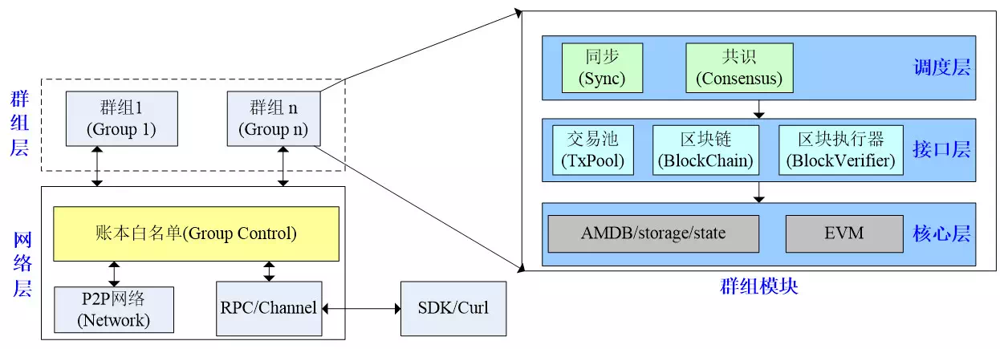
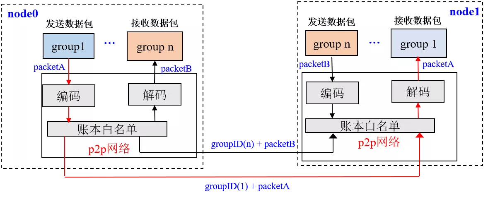
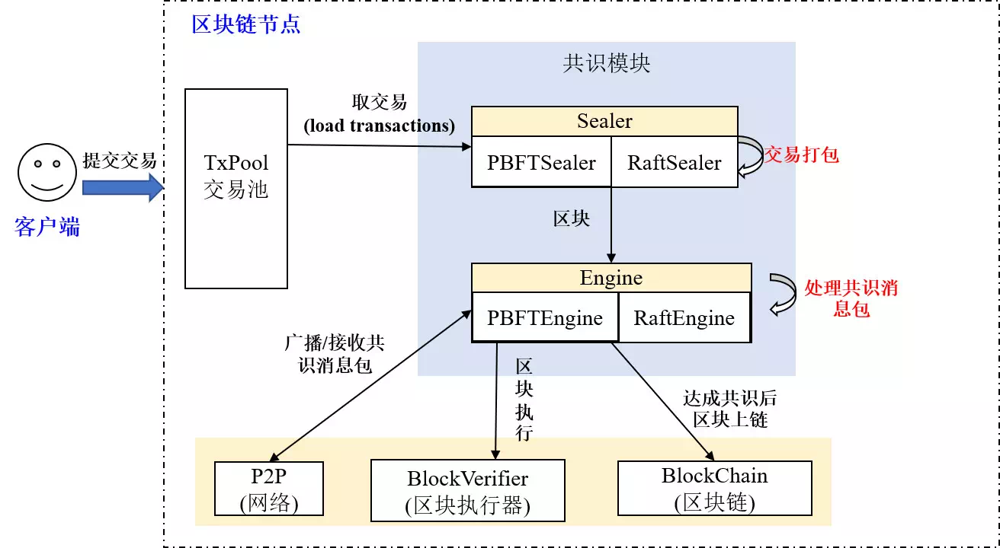
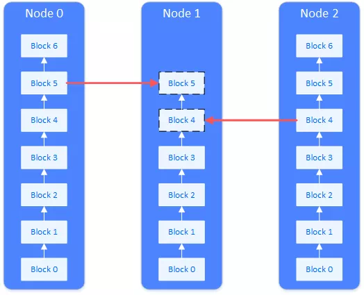

# FISCO BCOS 2.0 Principle Analysis Part 1: Design of Group Architecture

Author ： Chen Yujie ｜ FISCO BCOS Core Developer

In order to facilitate enterprises and developers to have a deeper understanding of the many new features of FISCO BCOS 2.0 and to use FISCO BCOS to build alliance chain applications more quickly, we have launched the FISCO BCOS 2.0 series analysis program.。In the follow-up push, we will launch a series of articles such as "FISCO BCOS 2.0 Principle Analysis," "FISCO BCOS 2.0 Usage Tutorial," "FISCO BCOS 2.0 Source Code Analysis," etc., to disassemble FISCO BCOS 2.0 in a comprehensive manner.。

This article is the first in a series of principle analysis, introducing the main line of the many new features of FISCO BCOS 2.0 - the group architecture.。It mainly includes the overall architecture design of the group architecture, which components the group architecture includes, the main functions of each component, and the interaction between the components.。

## Design Objectives

To understand the design goals of group architecture, you can start with the group chat model that everyone is familiar with.。

#### Flexible expansion: ensure business access and expansion as convenient as group chat

The establishment of the group is very flexible, a few people can quickly pull a theme group to communicate.。The same person can participate in multiple groups of interest to them, sending and receiving messages in parallel。Existing groups can also continue to add members。

Looking back at the group architecture, in a network with a group architecture, there can be multiple different ledgers depending on the business scenario, and blockchain nodes can select groups to join based on business relationships and participate in the data sharing and consensus process of the corresponding ledgers.。The group architecture has good scalability, and once an organization participates in such an alliance chain, it has the opportunity to flexibly and quickly enrich business scenarios and expand business scale, while the operational complexity and management costs of the system also decrease linearly.。

#### Privacy protection: decoupling between groups to operate independently

Recall the group chat scenario: group chat users are in your address book, are verified to add, and not in the group of users can not see the group chat information。This coincides with the alliance chain access mechanism, where the institutional identity of all participants is known.。

On the other hand, in the group structure, each group independently implements the consensus process, and each group independently maintains its own transaction transactions and data, independent of other groups.。The advantage of this is that it allows groups to decouple and operate independently, resulting in better privacy isolation.。In the inter-group message exchange, the authentication information will be carried, which is credible and traceable.。

## Architecture Design

### Architecture Design Panorama

▲ The picture shows the panorama of group architecture design

As shown in the above figure, the group architecture is mainly divided into network layer and group layer from the bottom down, the network layer is mainly responsible for communication between blockchain nodes, the group layer is mainly responsible for processing intra-group transactions, and each group runs an independent ledger.。

### network layer

In the group architecture, all groups share the P2P network, and the packets passed from the group layer to the network layer contain group ID information, and the receiving node passes the received packets to the corresponding group of the target node according to the group ID in the packet.。In order to isolate communication data between groups, the group architecture introduces the**Ledger White List**mechanism, the following figure shows the process of sending and receiving messages between groups under the group architecture:

#### Ledger White List

Each group holds a ledger whitelist that maintains a list of nodes for that group。In order to ensure consistency within the ledger whitelist group, the ledger whitelist can only be modified by issuing a transaction consensus.。

#### Contract awarding process

For example, the first group of node0 sends the message packetA to the first group of node1:

(1) group1 passes the message packetA to the network layer；

(2) The network layer module encodes packetA and adds the group ID to the packetA header, which is recorded as{groupID(1) + packetA}；

(3) The network layer accesses the ledger whitelist to determine whether node0 is a node of group1. If node0 is not a node of group1, the packet is rejected.；If it is a group1 node, the encoded packet is sent to the destination node node1。

#### Packing process

node1 received the packet of node0 group1{groupID(1) + packetA}After:

(1) The network layer accesses the ledger whitelist to determine whether the source node node0 is a group1 node. If it is not a group1 node, the packet is rejected. Otherwise, the packet is passed to the decoding module.；

(2) The decoding module decodes the group ID = 1 and the packet packetA from the packet and sends the packet packetA to group1。

Through the ledger whitelist, you can effectively prevent group nodes from obtaining other group communication messages, ensuring the privacy of group network communication.。

### Group Layer

The group layer is the core of the group architecture。To isolate ledger data between groups, each group holds a separate ledger module.。The group layer is divided into core layer, interface layer and scheduling layer from bottom to top: the core layer provides the underlying storage and transaction execution interface.；The interface layer is the interface to access the core layer.；The scheduling layer includes synchronization and consensus modules for processing transactions, synchronization transactions, and blocks.。

#### Core Layer

Mainly includes storage(AMDB/storage/state)and implementation(EVM)Two modules。Stores block data, block execution results, block information, and system tables that are responsible for storing or reading group ledgers from the underlying database.。Execute(EVM)The module is mainly responsible for executing transactions.。

#### interface layer

Interface layer includes transaction pool(TxPool), Blockchain(BlockChain)and block executor(BlockVerifier)Three modules。

##### Module 1: Trading Pools(TxPool)

The transaction pool is the interface between the client and the scheduling layer, responsible for new transactions received from the client or other nodes, the consensus module will take out the transaction packaging processing, the synchronization module will take out the new transaction from the broadcast.。

##### Module 2: Blockchain(BlockChain)

The blockchain module is the interface between the core layer and the scheduling layer, and is the only entry for the scheduling layer to access the underlying storage and execution modules, through which the scheduling layer can submit new blocks and block execution results, query historical blocks and other information.。The blockchain module is also the interface between the RPC module and the core layer. The RPC module can obtain information such as blocks, block heights, and transaction execution results through the blockchain module.。

##### Module 3: Block Actuator(BlockVerifier)

Interacts with the scheduling layer to execute the blocks passed in from the scheduling layer and returns the block execution results to the scheduling layer.。

#### scheduling layer

Scheduling layer includes consensus module(Consensus)and synchronization module(Sync)。

##### Module 1: Consensus(Consensus)Module

The consensus module is primarily responsible for executing the transactions submitted by the client and reaching consensus on the results of the transaction execution。

As shown below, the consensus module includes packaging(Sealer)Threads and consensus(Engine)thread, the Sealer thread is responsible for getting unexecuted transactions from the transaction pool and packaging them into blocks；The Engine thread is responsible for consensus on block execution results, and currently supports PBFT and Raft consensus algorithms.。

The main processes of the consensus module include:

(1) After the transaction submitted by the client is cached in the TxPool, the Sealer thread of the consensus node is awakened, and the Sealer thread obtains the latest transaction from the transaction pool and packages and generates a new block blockI based on the current highest block.；

(2) The Sealer thread passes the new block blockI generated by the package to the Engine thread for consensus；

(3) After receiving the new block blockI, the Engine thread starts the consensus process. During the consensus process, the block executor BlockVerifier is called to execute each transaction in the block blockI and reach a consensus on the execution results.；

(4) If the consensus is successful, call BlockChain to submit the new block blockI and block execution results to the underlying database.；

(5) After the new block blockI is successfully linked, the transaction pool is triggered to delete all transactions in the above chain and the transaction execution results are pushed to the client in the form of callbacks.。

##### Module 2: Synchronization(Sync)Module

Considering the need to ensure that each group node has as many transactions as possible during the consensus process, FISCO BCOS 2.0 introduces a synchronization module to ensure that client transactions are sent to each consensus node as much as possible。

The synchronization module mainly includes transaction synchronization and block synchronization:

##### Transaction synchronization

When the client submits a new transaction to the specified group transaction pool through RPC, it wakes up the transaction synchronization thread of the corresponding group synchronization module, which broadcasts all newly received transactions to other group nodes, and other group nodes insert the latest transactions into the transaction pool to ensure that each group node has the full amount of transactions.。

As shown in the following figure, after the client sends transaction tx _ j to group1 and tx _ i to group2, the transaction synchronization thread broadcasts tx _ i to group1 of all group nodes and tx _ j to group2 of all group nodes。

#### Block synchronization

Considering that inconsistent machine performance in the blockchain network or the addition of new nodes will cause the block height of some nodes to lag behind that of other nodes, the synchronization module provides the block synchronization function, which sends the latest block height of its own node to other nodes, and other nodes will actively download the latest block when they find that the block height lags behind that of other nodes.。

Taking the three-node blockchain system as an example, the block synchronization process is as follows:

(1) The block synchronization threads of Node0, Node1 and Node2 regularly broadcast the latest block height information；

(2) After receiving the latest block heights of Node0 and Node2, Node1 finds that its block height 3 is lower than the latest block height 6 of Node0 and Node2.；

(3)Based on the principle of load balancing, Node1 requests the fourth block from Node2, and requests block 5 and block 6 from Node0.；

(4) After receiving the block request from Node1, Node0 and Node2 send the{5,6}and No.{4}blocks returned to Node1；

(5) Node1 executes the 4th, 5th, and 6th blocks according to the block height, and commits the latest blocks to the underlying storage in order。

------

**The next notice**: Tutorial for Using the Group Schema

In the next article, I will take building a group blockchain as an example to provide you with practical courses on group architecture. Please continue to lock in the FISCO BCOS open source community.。
