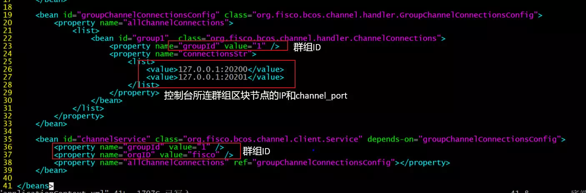

# FISCO BCOS 2.0 Use Tutorial Part 1: Group Architecture Practice Walkthrough

Author ： Chen Yujie ｜ FISCO BCOS Core Developer

If you say, the last article is to take you to dive into the team's brain, to see the origin of the birth of the group architecture and architecture design (partners who haven't seen it can click on the title and go directly to: [Group Architecture Design](https://mp.weixin.qq.com/s?__biz=MzA3MTI5Njg4Mw==&mid=2247485338&idx=1&sn=9ce03340c699a8527960a0d0b26d4923&chksm=9f2ef586a8597c9003192718c1f60ed486570f6a334c9713cc7e99ede91c6f3ddcd7f438821f&token=705851025&lang=zh_CN#rd)。

Then the next part, this article, focuses on the team's hands and sees how the group structure flies briskly through the beating ten fingers。

This article is a high-energy practical operation strategy, the whole hard core dry goods, I will**Take the construction of arbitration chain as an example**and demonstrates how to send transactions to that chain。

**course knowledge points**：

- Use build _ chain to create a multi-group blockchain installation package
- How to start a blockchain node and view the consensus status and block status of the node
- Build a console to deploy contracts to multiple groups

## Organizational structure of arbitration chain

The following figure is an example of a quorum chain:


Enterprise A, Enterprise B and Enterprise C respectively cooperate with arbitration institutions to build arbitration services using blockchain。In the group architecture, the chaining method is:**arbitration institution**Configure two nodes to join three groups；**Enterprise A**Configure two nodes to join group 1；**Enterprise B**Configure two nodes to join group 2；**Enterprise C**Configure two nodes to join group 3。

## Arbitration Chain Networking Details

The previous section introduced the arbitration chain organization structure, where the arbitration chain networking environment is simulated in a machine environment.。The simulated networking environment is as follows:

- **arbitration institution**Includes two nodes with IP addresses of 127.0.0.1, belonging to group 1, group 2, and group 3
- **Enterprise A**Includes two nodes, both of which have IP addresses of 127.0.0.1 and belong to group 1 only
- **Enterprise B**Includes two nodes. Both nodes have an IP address of 127.0.0.1 and belong to group 2 only
- **Enterprise C**Includes two nodes, both of which have IP addresses of 127.0.0.1 and belong to group 3 only

**Warm tips** ：

In actual application scenarios, we do not recommend that you deploy multiple nodes on the same machine. We recommend that you select the number of nodes to deploy based on the machine load.。In this example, the quorum node belongs to all groups and has a high load. We recommend that you deploy the quorum node separately to machines with better performance.。

## The key process of arbitration chain construction

As shown in the following figure, use the FISCO BCOS 2.0 quick chain building script to build an arbitration chain(and all other blockchain systems)It mainly includes five steps:


- step1: Install dependent software, mainly openssl and build _ chain.sh scripts
- step2: Use build _ chain.sh to generate a blockchain node configuration
- step3: Launch all institutional blockchain nodes
- step4: Start Console
- step5: Send a transaction using the console

Below I will describe in detail the key process of building an arbitration chain in these five steps.。

### Installing dependent software

To build a FISCO BCOS 2.0 blockchain node, you need to prepare the following dependent software:

- openssl: The network protocol for FISCO BCOS 2.0 depends on openssl
- build _ chain.sh script: mainly used to build blockchain node configuration, available from https://raw.githubusercontent.com/FISCO-BCOS/FISCO-BCOS/master-2.0 / manual / build _ chain.sh Download

```eval_rst
.. note::
    - If the build _ chain.sh script cannot be downloaded for a long time due to network problems, try 'curl-#LO https://gitee.com/FISCO-BCOS/FISCO-BCOS/raw/master-2.0/tools/build_chain.sh && chmod u+x build_chain.sh`
```

### Generate blockchain node configuration

The build _ chain.sh provided by FISCO BCOS 2.0 can quickly generate blockchain node configurations. According to the node organization structure introduced in [Arbitration Chain Networking Details], the blockchain configuration file ip _ list:

```
#ip _ list file content format: [ip]:[Number of Nodes] [Organization Name] [Group List]
$ cat > ipconf << EOF
127.0.0.1:2 arbitrator 1,2,3
127.0.0.1:2 agencyA 1
127.0.0.1:2 agencyB 2
127.0.0.1:2 agencyC 3
EOF
```

Call the build _ chain.sh script to build the native quorum chain of the simulation:

```
$ bash build_chain.sh -f ipconf -p 30300,20200,8545
```

After the blockchain node is configured successfully, you will see the output of [INFO] All completed.。

### Start Node

After the blockchain node is generated, all nodes need to be started. The start _ all.sh and stop _ all.sh scripts are provided to start and stop the node.。

```
# Start Node
$ bash start_all.sh

# View Node Processes
$ ps aux | grep fisco-bcos
```

When no transaction is issued, nodes with normal consensus will output+++logs, using tail-f node*/log/* | grep "++"Check whether the consensus of each node is normal。

### Start Console

The console is an important tool for users to interact with FISCO BCOS 2.0 blockchain nodes. It can query the blockchain status, deploy and invoke contracts, and quickly obtain the information needed by users.。

Obtain and configure the console before starting the console:

- **Get Console**From https:://github.com/FISCO-BCOS / console / releases / download / v1.0.0 / console.tar.gz Download Console

```eval_rst
.. note::
    - If the console script cannot be downloaded for a long time due to network problems, please try downloading from gitee: https://gitee.com/FISCO-BCOS/console/attach_files/420303/download/console.tar.gz
```

- **To configure the console:**Copy the certificate and configure the IP address and port information of the node to which conf / applicationContext.xml is connected. The key console configurations are as follows:



Of course, the console also supports connecting multiple groups and provides the switch command to switch groups. When connecting multiple groups, you need to configure multiple connections in the groupChannelConnectionsConfig bean id to connect to the blockchain nodes of the corresponding groups.。

**Note:**The console depends on Java 8 or above. You can install openjdk 8 on the Ubuntu 16.04 system.。CentOS Please install Oracle Java 8 or later。

Use the start.sh script to start the console. If the console is successfully started, the following interface is output:


### Issue transactions to groups

The console provides the deploy HelloWorld command to issue transactions to the node. After the transaction is issued, the block height of the blockchain node increases

```
# ... send a deal to group1...
$ [group:1]> deploy HelloWorld
0x8c17cf316c1063ab6c89df875e96c9f0f5b2f744
# Check the current block height of group1. If the block height is increased to 1, the block height is normal. Otherwise, check whether the consensus of group1 is normal.
$ [group:1]> getBlockNumber 
1
# ... make a deal to group2...
# Switch to group2
$ [group:1]> switch 2
Switched to group 2
[group:2]deploy Helloworld
...
```

## SUMMARY

This article describes the key process of building an arbitration chain. The FISCO BCOS 2.0 operation document step by step describes how to deploy a multi-group blockchain. For details, see [Multi-group Deployment](https://fisco-bcos-documentation.readthedocs.io/zh_CN/latest/docs/manual/group_use_cases.html)