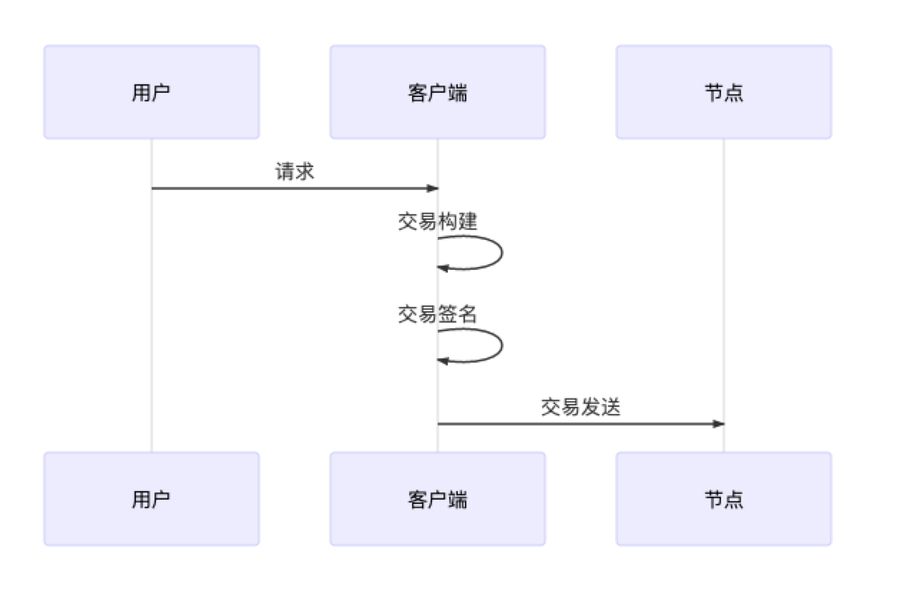

# Lifetime of trading in FISCO BCOS

Author: Li Chen Xi | FISCO BCOS Core Developer

Transactions - the core of the blockchain system, responsible for recording everything that happens on the blockchain。With the introduction of smart contracts in the blockchain, transactions go beyond the original definition of "value transfer," and a more precise definition should be a digital record of a transaction in the blockchain.。transactions, large or small, require the involvement of transactions。

The life of the transaction, through the stages shown in the chart below。This article will review the entire flow of the transaction and get a glimpse of the complete life cycle of the FISCO BCOS transaction.。

## Transaction Generation

After the user's request is sent to the client, the client builds a valid transaction that includes the following key information.

1. Sending address: the user's own account, which is used to indicate where the transaction came from。
2. Receiving address: The transactions in FISCO BCOS are divided into two categories, one is the transaction of the deployment contract and the other is the transaction of the call contract.。The former, since the transaction does not have a specific recipient, specifies that the receiving address for such transactions is fixed at 0x0；The latter requires that the receiving address of the transaction be set to the address of the contract on the chain.。
3. Transaction-related data: A transaction often requires some user-provided input to perform the user's desired action, which is encoded into the transaction in binary form.。
4. Transaction signature: In order to show that the transaction was indeed sent by itself, the user will provide the SDK with the private key to allow the client to sign the transaction, where the private key and the user account are one-to-one correspondence.。

The blockchain client then populates the transaction with the necessary fields, such as the transaction ID and blockLimit for transaction replay prevention.。For the specific structure and field meaning of the transaction, please refer to [Coding Protocol Document](https://fisco-bcos-documentation.readthedocs.io/zh_CN/latest/docs/design/protocol_description.html)After the transaction is constructed, the client then sends the transaction to the node via the Channel or RPC channel。

## Trading pool

After a blockchain transaction is sent to a node, the node verifies whether a transaction is legitimate by verifying the transaction signature。If a transaction is legal, the node further checks whether the transaction has been repeated, and if it has never occurred, the transaction is added to the transaction pool and cached.。If the transaction is illegal or the transaction is repeated, the transaction will be discarded directly。

## Transaction Broadcast

After the node receives the transaction, in addition to caching the transaction in the transaction pool, the node broadcasts the transaction to other nodes known to the node。

In order to make the transaction reach all nodes as much as possible, other transaction nodes that receive the broadcast will also select some nodes according to some ingenious strategies to broadcast the transaction again, for example, for transactions forwarded from other nodes, the node will only randomly select 25% of the nodes to broadcast again, because this situation generally means that the transaction has begun to be relayed by the nodes in the network, reducing the size of the broadcast helps to avoid the broadcast storm problem caused by too。

## Transaction Packaging

In order to improve the efficiency of transaction processing, and also to determine the order of execution after the transaction to ensure transactionality, when there are transactions in the transaction pool, the Sealer thread is responsible for taking out a certain number of transactions from the transaction pool in a first-in, first-out order, assembling them into blocks to be agreed upon, and then the blocks to be agreed upon are sent to each node for processing.。

## Transaction Execution

After the node receives the block, it calls the block validator to take the transactions out of the block one by one and execute them.。In the case of precompiled contract code, the execution engine in the validator calls the corresponding C++function, otherwise the execution engine will hand over the transaction to the EVM (Ethereum Virtual Machine) for execution.。

The transaction may execute successfully, or it may fail due to logical errors or insufficient Gas。The result and status of the transaction execution are returned encapsulated in the transaction receipt.。

## Trading consensus

The blockchain requires an agreement between nodes on the execution result of the block before the block can be released.。The PBFT algorithm is generally used in FISCO BCOS to ensure the consistency of the entire system, and the general process is as follows: each node executes the same block independently, and then the nodes exchange their execution results.。

## Trading Drop

After the consensus block is released, the node needs to write the transactions and execution results in the block to the hard disk for permanent storage, and update the mapping table of block height and block hash, etc., and then the node will remove the transactions that have been dropped from the transaction pool to start a new round of the block process.。Users can query the transaction data and receipt information they are interested in in the historical data on the chain through information such as transaction hashes.。