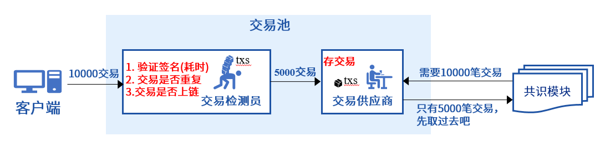
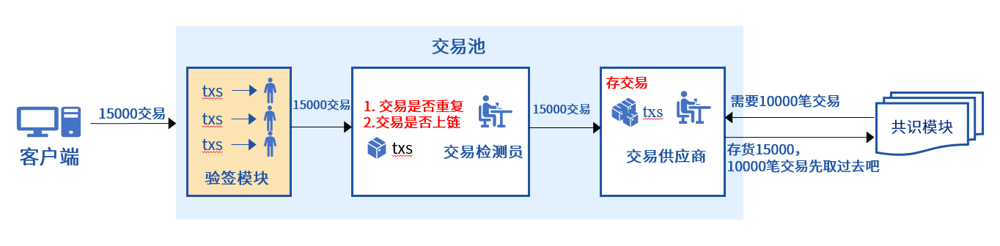

# Trading Pool and Its Optimization Strategy in FISCO BCOS

Author ： Chen Yujie ｜ FISCO BCOS Core Developer

**Author language**

In the FISCO BCOS blockchain system, transactions are stored in the transaction pool before they are put on the chain。The trading pool is a small blockchain expert, acting as a quality inspector on the one hand, shutting out all illegal transactions；On the one hand, it is the responsibility of the supplier to deliver legal transactions to the consensus module；Also responsible for pushing up-chain notifications to the client。It can be said that the transaction pool of the FISCO BCOS blockchain system is extremely busy, and its performance will directly affect the performance of the blockchain system。This article will lead you to unveil the transaction pool, understand the multiple identities of the transaction pool, and together understand how the transaction pool in the FISCO BCOS blockchain system can navigate between multiple roles。

------

## First-time trading pool

As shown in the figure above, in the FISCO BCOS blockchain system, it is the basic responsibility of the transaction pool to receive transactions sent by the storage client, which are the "raw materials" for the consensus module to package transactions and the synchronization module to broadcast transactions。The trading pool needs to ensure the quality of the "raw materials" of these transactions and verify the legality of the transactions。Of course, in order to prevent DOS attacks, FISCO BCOS limits the capacity of the trading pool and rejects new transactions sent by the client when the number of transactions in the trading pool exceeds the capacity limit。

## Importance of trading pools

In the FISCO BCOS blockchain system, the transaction pool, as a key system module, is responsible for interacting with the SDK and multiple back-end modules at the same time, and this section takes the multiple responsibilities of the transaction pool as a starting point to see how busy the transaction pool is。

### Four Duties of the Trading Pool

The above figure shows the multiple roles played by the transaction pool throughout the life cycle of the transaction from the client to the chain

- **Transaction Quality Inspector**: Before the transaction is placed in the transaction pool, the validity of the transaction is detected, and the valid transaction must meet: ① The signature is valid；② Non-duplicate transactions；③ Non-on-chain transactions。
- **Transaction Supplier**: Store legitimate transactions and provide transaction "raw materials" for back-end modules。
- **Check and sign anti-weight assistant**: Provides a block verification interface for the consensus module to verify only missed transactions in the transaction pool, improving the efficiency of consensus block verification。
- **Transaction Chain Notifier**: After the transaction is successfully linked, notify the client of the transaction execution result。

As the core module of the blockchain, the transaction pool has four functions, and each transaction processing process requires up to eight interactions with the three back-end modules, the four internal modules, and the client, which is indeed extremely busy。

### Role of trading pools

The following is an example of the transaction processing life cycle of a blockchain node to learn more about the role of the various roles in the transaction pool。

As shown in the figure above, the transactions sent by the client to the node will be pipelined, and each flow needs to have five processing processes:

- **Transaction detection**: After the transaction sent by the client is sent to the node, it must first be tested by the quality inspector of the transaction pool, and the transaction pool will only put transactions with valid signatures, non-duplicate, and not on the chain into the transaction pool。
- **Transaction Storage**: After the transaction has passed the "quality test," it is stored in the transaction pool, where the transaction pool assumes the role of "supplier," and the consensus module obtains new transactions from the transaction pool for packaging into blocks；The synchronization module retrieves new transactions from the transaction pool and broadcasts them to all other consensus nodes。
- **Transaction Packaging & & Transaction Consensus**: The consensus module obtains legal transactions from the transaction pool, packages them into new blocks, and broadcasts them to all other consensus nodes. After receiving the packaged new blocks, other consensus nodes verify the signature of each transaction in the blocks in order to ensure the legality of the blocks。Considering that transaction validation is a very time-consuming operation, and there is a high probability that transactions in the new block will hit the transaction pool of other nodes, in order to improve the efficiency of consensus validation, the transaction validation anti-heavy assistant is used at this time, it will only verify the transaction signatures in the new block that do not hit the local transaction pool。
- **Transaction Submission**After the transaction consensus is reached, the storage module is called to submit the transaction and its execution results to the blockchain database。
- **TRANSACTION NOTICE**: After the transaction is successfully chained, the chaining notifier of the transaction pool notifies the client of the transaction execution result。

The transaction pool is involved in each process throughout the life cycle of the transaction from issuance to the blockchain, so the transaction pool is very important to the entire blockchain system, and each process of the transaction pool directly affects the performance of the blockchain system。

## Trading Pool Optimization

From the previous introduction, we learned that the FISCO BCOS blockchain system's transaction pool is extremely busy and directly affects the performance of the blockchain system, and this section details the optimization process and optimization methods of the transaction pool。

### Optimize transaction processing pipeline efficiency

As can be seen from the above transaction processing pipeline diagram, the transaction pool participates in every process of transaction processing, so each process of the transaction pool has a significant impact on system performance。FISCO BCOS blockchain system uses split and parallel execution of transaction verification tasks, transaction asynchronous notification strategy to optimize transaction pipeline processing efficiency。

### Optimize transaction validation efficiency

After the introduction of parallel trading in FISCO BCOS rc2, FISCO BCOS developers found that each block of the consensus module was often unable to fill up the transaction during the pressure test, and occasionally the consensus module was empty and waiting for the trading pool to provide new transactions。The investigation found that the transaction pool as a transaction detector task is too heavy, not only to verify the transaction signature, but also to check whether the transaction is repeated, whether it has been on the chain, resulting in very low efficiency in providing transactions to transaction suppliers, often in short supply of transactions, seriously affecting the blockchain system TPS。

The following diagram depicts this phenomenon of short supply:

In order to break the dilemma that the transaction pool is in short supply and optimize the processing efficiency of the transaction pipeline, the FISCO BCOS blockchain system introduces a special transaction verification module and assigns the "verification signature" responsibility of the "transaction detector" to this new module, and in order to further improve the efficiency of transaction storage, the transaction verification module verifies transactions in parallel。After optimizing the transaction processing pipeline, the workload of the "transaction tester" is much lighter, the transaction supplier can fully meet the transaction needs of the consensus module, and still have some inventory。

After optimizing the processing pipeline,"Transaction Detector"The heavy work was"sufficient manpower""Validation module"Share, system performance significantly improved: using parallel transaction stress testing, FISCO BCOS blockchain system performance exceeded 1W。

### Transaction Asynchronous Notification

Through the previous introduction, we understand that the trading pool also bears the responsibility of transaction notification,"Transaction Notifier"It is also a busy role, it needs to receive the block drop signal, all the chain transactions to the client, if and only when the consensus module confirms that the previous round of consensus on the chain transactions will be notified, the consensus module will start the next round of consensus, transaction synchronization push will undoubtedly slow down the consensus process。In order to further optimize the processing efficiency of the pipeline, the FISCO BCOS blockchain system adopts the transaction asynchronous notification strategy: the storage module places the transaction notification results in the transaction notification queue and returns them directly, and the consensus module directly starts the next round of consensus process。

As shown in the following figure:

After adopting the transaction asynchronous notification strategy, the transaction notification will not block the consensus process, which can improve the system performance by about 10%。

### Dual Cache Queue

After FISCO BCOS 2.1, the FISCO BCOS team carefully counted the processing time of each block and felt that there was room for further improvement in system performance, so they decided to continue to optimize performance and further improve the processing power of the FISCO BCOS blockchain system。

When the storage module and execution module are optimized to the extreme, the final pressure test results are always not as expected。After checking, it is found that the transaction pool is in short supply again, but this short supply is caused by the client, after the client sends the transaction, a large number of threads are blocked waiting for the transaction verification to pass, return the transaction hash, can not empty more threads to send new transactions。

In order to improve the response speed of the node to the client, thereby improving the transaction sending rate of the client, the FISCO BCOS blockchain system introduces a transaction pre-buffer on the basis of the transaction storage queue held by the "transaction provider" to store the transactions sent by the client to the node and respond directly to the client。

The transaction pre-buffer continuously sends cached transactions to the"Validation module"和"Transaction Detector"The verified transactions will eventually be placed in the real transaction queue for the transaction provider to schedule, as shown in the following figure

This dual-cache queue mechanism greatly improves the response speed of the transaction pool to the client, and the client can continue to free up threads to continue to send new transactions。

## Summary

The transaction pool is very busy. In the FISCO BCOS blockchain system, the transaction pool is even busier. It is used to verify transactions, store transactions, prevent duplicate transaction checks, and push transaction execution results to the client。The transaction pool is very important, FISCO BCOS blockchain system, the transaction pool is more important, the task is heavy"Transaction Detector"Will greatly reduce the transaction insertion rate, resulting in a shortage of transactions；No"Transaction pre-buffer"The transaction pool will block the client transaction sending thread, reducing the client transaction sending rate；Transaction synchronization push, will lose about 10% of the system performance..

On the road to performance optimization, trading pool performance optimization has always been ranked high。