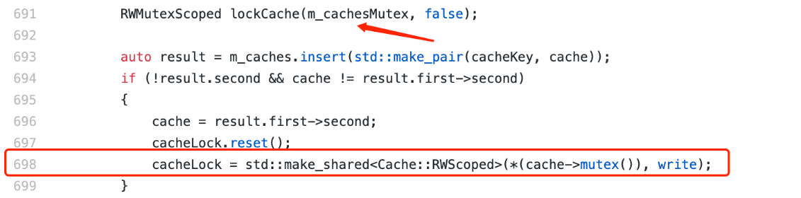
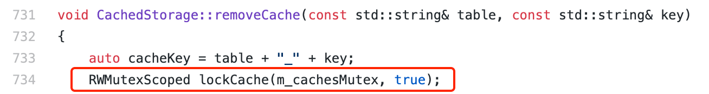

# Remember the Debugging Experience of Deadlock in CachedStorage

Author: Li Chen Xi | FISCO BCOS Core Developer

In the work of integrating FISCO BCOS non-national secret single test and national secret single test, we found that the single test of CachedStorage accidentally falls into a stuck state and can continue to reappear locally.。The recurrence method is to execute the CachedStorage single test about 200 times in a loop, and there will be a situation where all threads are stuck in a waiting state and the single test cannot continue to execute, we suspect that a deadlock has occurred in CachedStroage, so we debug this。

## Debug Ideas

Traditional Chinese medicine pays attention to the treatment of diseases, debugging bugs also need to follow the idea of finding clues, reasonable inference, verification and solution.。

### Observe Thread Stack

When a deadlock occurs, use the / usr / bin / sample tool (in the mac platform environment) to print out the stacks of all threads and observe the working status of each thread.。From the thread stack of all threads, it is observed that there is a thread (here called T1) stuck in the touchCache function on line 698 of CachedStorage.cpp, click on the reference [specific code implementation](https://github.com/FISCO-BCOS/FISCO-BCOS/blob/release-2.3.0-bsn/libstorage/CachedStorage.cpp)。

As you can see from the code snippet, T1 has acquired the read lock of m _ cachesMutex on line 691: code RWMutexScoped(some_rw_mutex, false)It means to obtain the read lock of a read-write lock.；Accordingly, the code RWMutexScoped(some_rw_mutex, true)The RWMutex is a Spin Lock.。

Then try to acquire a write lock for a cache at line 698。In addition to T1, there is another thread (here called T2) stuck in the touchCache function at line 691 of CachedStorage.cpp:

As you can see from the code snippet, T2 has acquired a write lock for a cache at line 681 and then attempts to acquire a read lock for m _ cachesMutex at line 691。 After further observation, several threads are also found to be stuck in the touchCache function at line 673 of CachedStorage.cpp:

Finally, there is a Cache cleanup thread (here called T3) stuck in the removeCache function at line 734 of CachedStorage.cpp:

As you can see from the code snippet, none of these threads hold any lock resources, but are simply trying to obtain the write lock of m _ cachesMutex.。

### The Hunger Problem

In the initial analysis of the problem, the most bizarre thing is that when T1 has already acquired the m _ cachesMutex read lock, other threads that are also trying to acquire the m _ cachesMutex read lock are unable to do so.。However, seeing that the T3 thread is trying to obtain the m _ cachesMutex write lock at this time, we think of the read-write lock hunger problem, and we think that the root cause of the problem that other threads cannot obtain the read lock is probably in T3.。

The so-called read-write lock starvation problem means that in an environment where multiple threads share a read-write lock, if you set that as long as there is a read thread to obtain the read lock, the subsequent read threads that want to obtain the read lock can share the read lock, it may cause the write thread that wants to obtain the write lock to never get the execution opportunity (because the read-write lock has been preempted by other read threads)。In order to solve the hunger problem, some read and write locks will increase the priority of the write thread in some cases, that is, the write thread occupies the write lock first, while other read threads can only queue up after the write thread until the write thread releases the read and write lock.。

In the above problem, T1 has acquired the read lock of m _ cachesMutex. If T3 acquires the time slice and executes to line 734 of CachedStorage.cpp, it will be stuck because it cannot acquire the write lock of m _ cachesMutex, and then other threads also start to execute and arrive at the line of code to acquire the read lock of m _ cachesMutex.。If the read-write anti-starvation policy really exists, then these threads (including T2) will indeed get stuck during the read lock acquisition phase, which will cause T2 to fail to release the cache lock, thus T1 cannot obtain the cache lock, and all threads will be stuck in waiting at this time.。

On this premise, it seems that everything can be explained。The sequence diagram of the above process is as follows:

We found the implementation code of Spin RW Lock in TBB, as shown in the following figure:

To acquire a write lock:

To acquire a read lock:

In the code that obtains the write lock, you can see that if the write thread does not obtain the write lock, a WRITER _ PENDING flag will be set, indicating that a write thread is waiting for the release of the read-write lock at this time.。

In the obtained read lock code, you can also see that if the read thread finds that the WRITER _ PENDING flag bit is set on the lock, it will wait in an honest loop, giving the write thread priority to obtain the read-write lock.。The behavior of the read-write lock here is perfectly in line with the previous speculation about the read-write lock's anti-hunger strategy, and the truth is now clear.。Now that you've found the cause of the problem, it's much easier to solve it.。In the design of CachedStorage, the priority of the cache cleanup thread is very low, and the call frequency is not high (about 1 time per second), so it is unreasonable to give it a high read-write lock priority.

After the modification, the method of acquiring a write lock is similar to acquiring a read lock: every time a write lock is acquired, try _ acquire first, and if it is not acquired, give up the current time slice and try again until the write lock is acquired. At this time, the write thread will not set the WRITER _ PENDING flag, which will not affect the normal execution of other read threads.。

The relevant code has been submitted to version 2.5, which will be available soon, so stay tuned。

### achieve effect

Before modification, a deadlock will occur when CachedStorage is cycled for about 200 times.；Modified Loop Execution 2000+No deadlock has occurred, and each thread can work methodically.。

## Experience summary

From the debugging process, summed up some experience to share with you。

First of all, the most effective way to analyze the deadlock problem is still the "two-step" method, that is, through pstack, sample, gdb and other tools to look at the thread stack, speculate on the thread execution timing that caused the deadlock.。The second step here requires a little more imagination。In the past, the deadlock problem is often caused by the interaction between two threads, textbooks also use two threads to explain the four elements of deadlock, but in the above problems, due to the special nature of read-write locks, three threads need to interact according to a special timing to cause deadlock, which is a relatively rare situation.。

Secondly, the mindset that "as long as a thread acquires a read lock, then other threads that want to acquire a read lock must also be able to acquire a read lock" is problematic.。At least in the above problem, the existence of the anti-starvation policy causes the read thread after the write thread to fail to acquire the read lock。However, the conclusion of this article is not universally applicable, whether or not to prevent hunger, how to prevent hunger in the implementation of various multi-threaded libraries have different trade-offs.。Some articles have mentioned that the implementation of some libraries is to follow the "read thread absolute priority" rule, then these libraries will not encounter such problems, so still need specific analysis of specific problems。