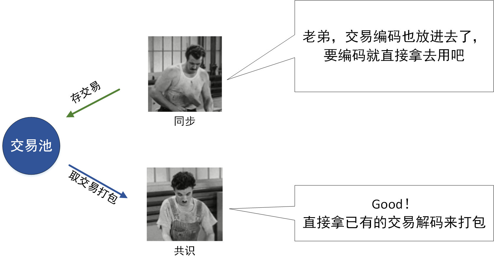
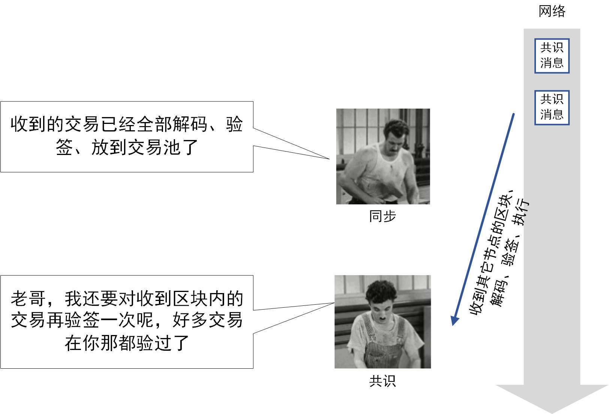

# New Modern Times: Chaplin's Deductive Consensus and Synchronization Process Optimization

Author ： SHI Xiang ｜ FISCO BCOS Core Developer

Consensus and synchronization process optimization is the first step in FISCO BCOS performance optimization。**Relying on this process optimization alone gives the system TPS a considerable 1.75x increase。**But that's not the purpose, the purpose is**The dominance of consensus is determined, eliminating the performance impact of synchronization on consensus, allowing subsequent performance analysis to better focus on the consensus process。**

## Basic explanation

In Chaplin's film Modern Times, Chaplin plays a worker who repeats the action of screwing the screw day after day: lifting the wrench, finding the part, aligning the screw, tightening, lifting the wrench again, finding the next part, aligning the screw again, and tightening again... In the design of FISCO BCOS, consensus and synchronization are also doing this repetitive thing。

## What is consensus and synchronization?？

Consensus and synchronization, two core processes in FISCO BCOS nodes。They work together to achieve the core function of the blockchain: to produce a blockchain that is consistent on every node。In the implementation of the FISCO BCOS node, the consensus and synchronization entities, which we call the consensus module and the synchronization module。

- **Consensus Module**: Responsible for the production block, so that the blocks generated by the node are identical

- **synchronization module**: Responsible for broadcasting transactions so that transactions sent by users reach each node as much as possible

## What is consensus and synchronization doing?？

Let's take a look at the working environment of the consensus module and the synchronization module:
- **Trading pool**Container in the node where unprocessed transactions are cached
- **Network module**: Receive message packets from other nodes, or send message packets to other nodes. So, what are the consensus module and the synchronization module doing?？ 

### Consensus Module

Constantly process and send consensus messages to make the blocks on all nodes consistent, taking the PBFT consensus as an example。

1. **Packing Block**: Take out transactions from the transaction pool, package them into blocks and broadcast them, or process blocks from other nodes taken from the network module
2. **Execution Block**Decode the block, verify the block, execute the block, and sign and broadcast the execution result of the block
3. **Collect signatures**Collect the signatures of the execution results of other nodes. If a certain number of signatures are collected, a "commit message" is broadcast to other nodes
4. **Collect commit**Collect the commit messages of other nodes. When the number of collected commit messages reaches a certain number, the blocks are consistent and can be dropped
5. **falling plate**: Connect the block to the end of the existing blockchain to form a blockchain and store it in the DB

### synchronization module

Constantly send and receive transactions so that each transaction reaches as many nodes as possible。

1. **Take transaction**: Remove unsent transactions from the transaction pool
2. **issue transaction**Broadcast unsent transactions to other nodes
3. **Receipt transaction**: Receive transactions from other nodes from the network module
4. **inspection transaction**: decoding and verifying transactions
5. **deposit transaction**: Deposit transactions that have passed the check in the transaction pool

## problem and optimization

Chaplin and his partner each perform their duties in an orderly and seemingly very harmonious manner。But when the backward productivity of the factory can not keep up with the strong market demand, even Chaplin such skilled workers, overtime can not finish。At this time, Chaplin had to start thinking about himself and his partners in the production relations。

In previous designs, the consensus module and the synchronization module were not prioritized, resulting in them wasting a lot of time competing for resources。At the same time, there are many repetitive operations in the consensus module and the synchronization module, which also wastes time。Therefore, the implementation process of the consensus module and the synchronization module should be considered together to optimize the process and improve efficiency。After detailed analysis and careful validation, FISCO BCOS optimizes the consensus and synchronization module processes。Optimization is based on the following ideas:

**The consensus module is responsible for dominating the rhythm of the entire blockchain, and the consensus module should be allowed to go first。The synchronization module, on the other hand, should play a good role in coordination, assisting the consensus module to come out faster。**

Based on the above ideas, let's take a look at the optimization methods for several of these problems。

### Problem 1: Job blocking

Both the consensus module and the synchronization module obtain message packets from the network module, and then proceed to the next step according to the corresponding message packets。However, due to the limitation of the number of network callback threads, the synchronization module occupies the callback threads of the network when processing message packets, resulting in the consensus module being unable to process consensus messages from other nodes in a timely manner, and the consensus process is blocked。

### How to solve？- Stripping the processing of synchronous messages from the network callback thread

Based on the idea of consensus module first, the consensus module should receive consensus messages in a more timely manner, and the synchronization module should not occupy the network callback thread for too long。Therefore, when the synchronization module gets the message, instead of decoding and checking the transaction directly in the callback thread, it caches the synchronization message package and processes it slowly "privately" with another thread。In this way, the processing of synchronous messages does not occupy the network callback thread for a long time, allowing consensus messages to respond faster。

### Issue 2: Codec redundancy

The synchronization module receives the transaction in the synchronization message, which is encoded, and the synchronization module needs to decode it into the data structure in the node code and store it in the transaction pool。When the consensus module packages a block, it takes the transaction out of the transaction pool, encodes the transaction, packages it into a block, and sends the block out。In this process, the transaction is decoded and encoded, and there is redundancy in the operation。

### How to solve？- Transaction encoding cache

Consensus takes precedence over synchronization, and unnecessary operations in the consensus module should be minimized。Therefore, when the synchronization module stores the transaction, the transaction code is also stored in the transaction pool。When the consensus module takes transactions, it takes out the coded transactions directly from the transaction pool, eliminating the need for coding operations。

### Question 3: Repeat

After receiving the transaction, the synchronization module needs to verify the signature of the transaction (referred to as "verification"), and the consensus module also needs to verify the transaction in the block after receiving the block。There is a high probability that the transactions checked by the synchronization module and the consensus module are duplicated。Checking is a very time-consuming operation, and each additional check consumes a lot of time。

### How to solve？--Check and remove the weight

Both the synchronization module and the consensus module go to the trading pool to check whether the transaction exists before checking the signature。If it exists, omit the check sign operation。As a result, a transaction is checked and signed only once, reducing unnecessary check-and-sign overhead。

### Can the solution be better?？- - Try to make synchronous check sign, reduce the number of consensus module check sign

Still the idea of prioritizing the consensus module to minimize the operation of consensus module validation。Therefore, the synchronization module must run faster than the consensus module, and before the consensus module processes a transaction, the synchronization module gets the transaction first and gives priority to the transaction verification。

The strategy FISCO BCOS adopts here for the synchronization module is:**Full broadcast of transactions**。

When one packaging node gets the transaction, the synchronization modules of the other nodes also receive the corresponding transaction。When other nodes receive the block sent by the packaging node, the transactions contained in the block have already been verified by the synchronization module and written to the transaction pool。At the same time, in order to make the synchronization module not lower than the consensus module in the processing speed of the same operation, the synchronization module's transaction codec also uses the same "parallel codec" and "transaction code cache" as the consensus module。

## How about the result？

The process optimization of consensus and synchronization also improves the TPS of transaction processing to some extent。After testing, the TPS of transaction processing increased to 1.75 times the original！More importantly, through process optimization, the dominance of consensus is determined, eliminating the performance impact of synchronization on consensus, allowing subsequent performance analysis to better focus on the consensus process！

Eliminating blocking, eliminating coding redundancy, eliminating duplicate checks, Chaplin and his partners work easier and smoother！

In the next article, we will focus on parallel optimization, so that parallelizable operations are parallelized！Please look forward to the**Omni-directional parallel processing**》。