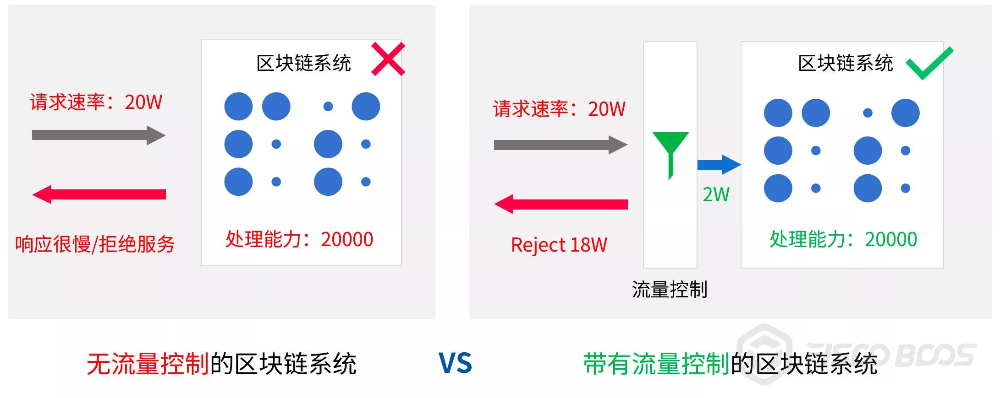
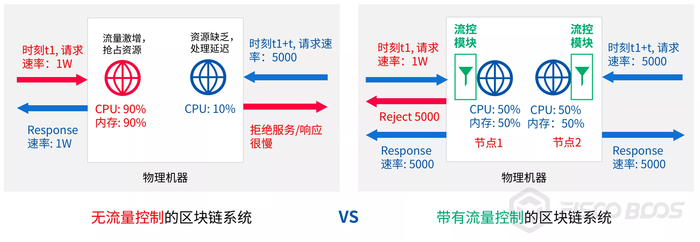
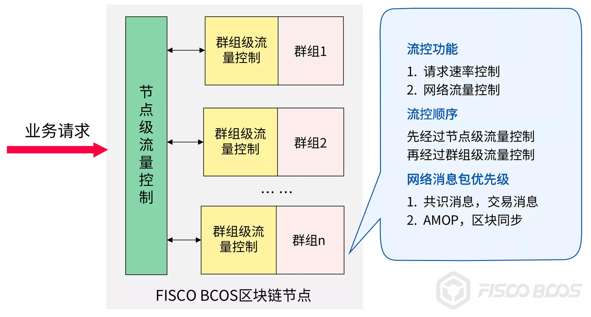

# FISCO BCOS Flow Control Implementation

Author ： Chen Yujie ｜ FISCO BCOS Core Developer

## Introduction

As a distributed system, in the face of large data burst request scenarios, skyrocketing requests can easily cause blockchain services or interfaces to be unavailable, and in severe cases, the entire blockchain system may fall into an avalanche state.。

In order to provide more stable, reliable and flexible services, FISCO BCOS v2.5 introduces the flow control function, which limits the flow from the two dimensions of nodes and groups. On the one hand, it protects the blockchain system in the face of large data burst requests to ensure the normal operation of the system and improve system availability.；On the other hand, it reduces resource interference between blockchain nodes and groups and improves the quality of service of the blockchain system.。

## Why introduce flow control

FISCO BCOS introduces flow control to:

- Response to large data burst requests
- Reduce resource interference between blockchain nodes and groups
- Reduce the interaction between modules

### Response to large data burst requests



The above figure compares**No flow control function**和**With flow control function**The processing of the blockchain system in the face of large data burst requests.。

Assuming that the processing capacity of the blockchain system is 2W, when the business accesses the blockchain node at a request rate of 20W:

- **No flow control**scenario, the system requests the business**Accept all orders**If the business continues to initiate requests at a rate higher than the system's processing capacity, the entire system may eventually fall into an avalanche and be unable to respond to any business requests.。
- Joined**Flow control function**After that, the flow control module will**根据****System Processing Capacity Filtering Business Requests**。When the business request rate exceeds the system's processing capacity, the flow control module rejects the remaining processing requests to maintain the system."balance of payments"state of health；The service can adaptively adjust the request rate based on the information to protect the blockchain system.。

In short, the introduction of the flow control module is to add a layer of security protection to the blockchain system, so that the system can work robustly and respond to business requests normally in the case of receiving large data bursts.。

### Reduce resource interference between blockchain nodes / groups



Note: The two nodes in the figure belong to two different chains and are connected to two different services.

As shown in the figure above, when multiple blockchain nodes are deployed on the same machine, there will be resource competition, some nodes occupy too many system resources will affect the normal service of other nodes.。

- At time t1, service 1 continues to request the left node at a request rate of 1W, and the traffic of this node surges. After the system receives and processes the request, it uses 90% of the CPU
- After t time interval, service 2 requests the right node at a request rate of 5000. The node is short of resources and can only preempt 10% of the CPU, which is very slow

In the above scenario, the left node occupies too many system resources and affects the quality of service of the right node。After the introduction of traffic control, you can limit the rate at which each node receives requests, control the resource occupation of each blockchain node, and avoid service quality degradation or service unavailability problems caused by blockchain node resource competition.。

Still above figure for example:

- At time t1, service 1 continues to request node 1 at a request rate of 1W, and the node 1 flow control module rejects redundant requests based on the configured request threshold(Here set the threshold to 5000)The CPU utilization rate of the machine is maintained at 50%.
- Business 1 Received"flow overload"can adjust its request rate to 5000
- After t interval, business 2 requests node 2 at a request rate of 5000, at which point the machine still has 50% of the CPU left, enough to process 5000 requests, and business 2 requests get a normal response.

Similar to resource competition when multiple blockchain nodes are running on a machine, there is also resource competition between groups under the multi-group architecture, and excessive resource occupation by one group will also affect the quality of service of other groups, using group-level flow control is a good way to solve the resource competition between groups.。

### Reduce interaction between modules

Different modules in the same node or group also have resource competition problems, mainly network resource competition. The modules with network resource competition include:

- Consensus Module
- Transaction Synchronization Module
- Block Synchronization Module
- AMOP Module

Among them, the consensus module and the transaction synchronization module are the key modules that determine the quality of service of the blockchain system, and other modules take up too much network resources, which will affect these key modules and thus the availability of the system.。FISCO BCOS implements module-level flow control, which prioritizes the quality of service of key modules and improves system robustness by controlling non-critical network traffic.。

## Flow control functions

FISCO BCOS implements service-to-node request rate limiting and module granularity network traffic limiting from both node and group dimensions.。The former limits the request rate from services to nodes to cope with large data bursts and ensure flexible services for blockchain nodes.；The latter limits the network traffic of non-critical modules such as block synchronization and AMOP, giving priority to ensuring the performance and stability of key modules such as consensus and transaction synchronization.。



- **Node-level request rate limiting**Limit the total request rate from the service to the node. When the request rate exceeds the specified threshold, the node will reject the service request to avoid node overload and prevent excessive requests from causing node abnormalities；Control node resource usage and reduce resource competition between blockchain nodes
- **Node-level flow control**Limits the average outbound bandwidth of the node. When the average outbound bandwidth of the node exceeds the set threshold, the node suspends sending blocks and rejects received AMOP requests after receiving block synchronization requests to avoid the impact of block synchronization and AMOP message packet sending on node consensus.

In the group dimension, the main functions include:

- **Group-level request rate limiting**Limits the service-to-group request rate. When the request rate exceeds the threshold, the group rejects the service request. This function protects the blockchain nodes in the scenario of large data burst requests, controls group resource usage, and reduces resource competition between groups.
- **Group-level flow control**Limits the average outbound bandwidth of each group. When the average outbound bandwidth traffic of the group exceeds the set threshold, the group suspends the block sending and AMOP request packet forwarding logic, giving priority to providing network traffic to the consensus module.

**When request rate limiting is turned on for both nodes and groups:**

When a node receives a request packet sent by a service, it first invokes the node-level request rate limiting module to determine whether to receive the request, and if the request is received, it enters the group-level request rate limiting module, and the request checked by the module is forwarded to the corresponding group for processing.。

**When both nodes and groups have network traffic control enabled:**

1, the node receives the client AMOP request, first call the node-level flow control module to determine whether to receive the AMOP request.

2. After a group receives a block request from a group corresponding to another node, the group needs to:

- Call the node-level flow control module to determine whether the average outgoing bandwidth of the node exceeds the set threshold.
- Invoke the group-level traffic control module to determine whether the outbound bandwidth of the group exceeds the set threshold. If and only if the average outbound bandwidth of the node level and the group level does not exceed the set threshold, the group will reply to the block request.

## How to use the flow control function

The flow control configurations are located in the [flow _ control] configuration items of the config.ini and group.i.ini configuration files, respectively, corresponding to the node-level flow control configuration and the group-level flow control configuration, respectively.。Here to show you how to enable, turn off, configure flow control。

### Node Level Flow Control

The node-level network traffic control configuration items are located in the config.ini configuration file and mainly include:

### Request Rate Limiting

The node-level request rate limit is located in the configuration item [flow _ control] .limit _ req, which is used to limit the maximum number of requests from the business to the node per second. When the number of requests exceeds the set threshold, the request will be rejected。**This configuration item is turned off by default**to turn on, set the;Remove。

An example of turning on the request rate limit and designing a node to accept 2000 business requests per second is as follows:

```
[flow_control]
  ; restrict QPS of the node
  limit_req=2000
```

### Network traffic restrictions

- [flow _ control] .outgoing _ bandwidth _ limit: the bandwidth limit of the node, in Mbit / s. When the bandwidth exceeds this value, block sending will be suspended and AMOP requests sent by clients will be rejected, but the traffic of block consensus and transaction broadcast will not be limited.。**This configuration item is turned off by default**To turn on, set the;Remove。

The following is an example of how to turn on the node outbound bandwidth traffic limit and set it to 5MBit / s:

```
[flow_control]
  ; Mb, can be a decimal
  ; when the outgoing bandwidth exceeds the limit, the block synchronization operation will not proceed
  outgoing_bandwidth_limit=5
```

### Group-level flow control

Network traffic control configuration items at the group level are located in the group.i.ini configuration file and mainly include:

### Request Rate Limiting

The request rate limit for group i is in the configuration item [flow _ control] .limit _ req of group.i.ini, which limits the maximum number of requests per second from the business to the group. When the number of requests exceeds the value of the configuration item, the request is rejected。This configuration item is turned off by default. To turn it on, set the;Remove。

An example of turning on request rate limiting and configuring the group to accept 1000 business requests per second is as follows:

```
[flow_control]
  ; restrict QPS of the group
  limit_req=1000
```

### Intra-Group Network Traffic Restrictions

[flow _ control] .outgoing _ bandwidth _ limit: the outbound bandwidth limit, in Mbit / s. When the outbound bandwidth exceeds this value, blocks are suspended, but the traffic of block consensus and transaction broadcast is not limited.。**This configuration item is turned off by default**To turn on, set the;Remove。

The following is an example of how to turn on the group outbound bandwidth traffic limit and set it to 2MBit / s:

```
[flow_control]
  ; Mb, can be a decimal
  ; when the outgoing bandwidth exceeds the limit, the block synchronization operation will not proceed
  outgoing_bandwidth_limit=2
```

## SUMMARY

With the development of blockchain technology, more and more applications are deployed in blockchain systems, and the requirements for the quality of service of blockchain systems are increasing, making it more important for blockchain systems to be flexible, available, stable and robust.。

FISCO BCOS v2.5 introduces the flow control function, which is an important step in FISCO BCOS's exploration of blockchain flexible services。

The community will continue to polish and optimize the service quality of the blockchain system, hoping to provide better and highly available flexible services for massive business scenarios in the future.。How to do a good job of flow control without affecting the performance of the original system？Please pay attention to the follow-up articles of the community to explain the specific implementation principle of the flow control strategy for you.。Welcome everyone to discuss the exchange, positive feedback using experience and suggestions for improvement。