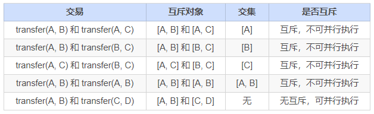

# FISCO BCOS parallel contract development framework (with practical tutorial)

Author ： SHI Xiang ｜ FISCO BCOS Core Developer

This special series of articles to catch up with now, you may want to ask, FISCO BCOS parallel how to use？As the end of the topic, this article will reveal the true face of Lushan and teach you how to use the parallel features of FISCO BCOS.！FISCO BCOS provides a parallelizable contract development framework, where developers write contracts in accordance with the framework specifications that can be executed in parallel by FISCO BCOS nodes.。The advantages of parallel contracts are:

- **high throughput**: Multiple independent transactions are executed at the same time, which maximizes the CPU resources of the machine and thus has a high TPS
- **Can be expanded**: The performance of transaction execution can be improved by improving the configuration of the machine to support the continuous expansion of business scale

Next, I'll show you how to write FISCO BCOS parallel contracts and how to deploy and execute them。

## preparatory knowledge

### parallel mutex

Whether two transactions can be executed in parallel depends on whether the two transactions exist.**Mutex**。Mutual exclusion means that two transactions are each**There is an intersection of the collection of operating contract storage variables.**。

For example, in a transfer scenario, a transaction is a transfer operation between users。with transfer(X, Y) Represents the transfer interface from user X to user Y.。The mutual exclusion is as follows:



A more specific definition is given here:

- **Mutex parameters:**合同**Interface**parameters related to read / write operations for contract storage variables in。For example, the transfer interface(X, Y)X and Y are mutually exclusive parameters.。

- **Mutex Object**: a sum of money**Transaction**The specific mutually exclusive content extracted from the mutually exclusive parameters.。For example, the transfer interface(X, Y), in a transaction that calls this interface, the specific parameter is transfer(A, B)then the mutex for this operation is [A, B]；Another transaction, the argument to the call is transfer(A, C)then the mutex for this operation is [A, C]。

**To determine whether two transactions can be executed in parallel at the same time is to determine whether the mutually exclusive objects of the two transactions intersect。Transactions with empty intersections can be executed in parallel。**

## Writing Parallel Contracts

FISCO BCOS provides**parallelizable contract development framework**The developer only needs to develop the contract according to the specification of the framework and define the mutually exclusive parameters of each contract interface to implement the contract that can be executed in parallel.。When the contract is deployed, FISCO BCOS automatically parses the mutually exclusive objects before executing the transaction, allowing the non-dependent transactions to be executed in parallel as much as possible at the same time.。

Currently, FISCO BCOS provides two parallel contract development frameworks, solidity and precompiled contracts.。

### Parallel Framework for Solidity Contracts

Write parallel solidity contracts, the development process is the same as the process of developing ordinary solidity contracts.。On this basis, simply use ParallelContract as the contract base class that requires parallelism and call registerParallelFunction(), register interfaces that can be parallel。

Give a complete example first.。The ParallelOk contract in the example implements the function of parallel transfer:

```
pragma solidity ^0.4.25;
import "./ParallelContract.sol";  / / Introducing ParallelContract.sol
contract ParallelOk is ParallelContract / / Using ParallelContract as the base class
{
    / / Contract implementation
    mapping (string => uint256) _balance;
    
    function transfer(string from, string to, uint256 num) public
{
        / / Here is a simple example, please use SafeMath instead of direct addition and subtraction in actual production.
        _balance[from] -= num; 
        _balance[to] += num;
    }
​
    function set(string name, uint256 num) public
{
        _balance[name] = num;
    }
​
    function balanceOf(string name) public view returns (uint256)
{
        return _balance[name];
    }
    
    / / Register contract interfaces that can be parallel
    function enableParallel() public
{
        / / Function definition string (note","There can be no spaces after), the first few parameters are mutually exclusive parameters (mutually exclusive parameters must be put in front when designing functions
        registerParallelFunction("transfer(string,string,uint256)", 2); / / conflict parameter: string string
        registerParallelFunction("set(string,uint256)", 1); / / conflict parameter: string
    } 
​
    / / deregister parallel contract interface
    function disableParallel() public
{
        unregisterParallelFunction("transfer(string,string,uint256)");
        unregisterParallelFunction("set(string,uint256)"); 
    } 
}
```

Specific steps are as follows:

#### step1 Using ParallelContract as the base class for contracts

```
pragma solidity ^0.4.25;
​
import "./ParallelContract.sol"; / / Introducing ParallelContract.sol
​
contract ParallelOk is ParallelContract / / Using ParallelContract as the base class
{
   / / Contract implementation
   
   / / Register contract interfaces that can be parallel
   function enableParallel() public;
   
   / / deregister parallel contract interface
   function disableParallel() public;
}
```

#### step2 Write a parallel contract interface.

The public function in the contract, which is the interface to the contract。To write a parallelizable contract interface is to implement the public function in a contract according to certain rules.。

##### Determine whether an interface is parallelizable

A parallelizable contract interface must satisfy:

- No call to external contract
- No call to other function interface

##### Determine Mutex Parameters

Before writing an interface, determine the mutex parameters of the interface, which is the mutex of global variables, and the rules for determining mutex parameters are.

- The interface accesses global mapping. The mapping key is a mutually exclusive parameter.
- The interface accesses the global array, and the subscript of the array is a mutually exclusive parameter
- The interface accesses global variables of simple types, all global variables of simple types share a mutually exclusive parameter, using different variable names as mutually exclusive objects

##### Determine parameter type and order

After determining the mutually exclusive parameters, determine the parameter type and order according to the rules. The rules are as follows:

- Interface parameters are limited to string, address, uint256, int256 (more types will be supported in the future)
- Mutex parameters must all appear in interface parameters
- All mutually exclusive parameters are arranged at the top of the interface parameters.

```
mapping (string => uint256) _balance; / / Global mapping
​
/ / The mutually exclusive variables from and to come first, as transfer()The first two parameters
function transfer(string from, string to, uint256 num) public
{
    _balance[from] -= num;  / / from is the key of global mapping and is a mutually exclusive parameter
    _balance[to] += num; / / to is the key of global mapping and is a mutually exclusive parameter
}
​
/ / The mutually exclusive variable name comes first, as set()Parameters at the beginning
function set(string name, uint256 num) public
{
    _balance[name] = num;
}
```

#### step3 Register a parallelizable contract interface in the framework

Implementing enableParallel in a contract() function, calling registerParallelFunction()Register parallelizable contract interfaces。Also need to implement disableParallel()function, giving the contract the ability to cancel parallel execution。

```
/ / Register contract interfaces that can be parallel
function enableParallel() public
{
    / / Function definition string (note","There can be no spaces after), the first few parameters are mutually exclusive parameters.
    registerParallelFunction("transfer(string,string,uint256)", 2); / / transfer interface, the first two are mutually exclusive parameters
    registerParallelFunction("set(string,uint256)", 1); / / transfer interface, the first four mutually exclusive parameters
}  
​
/ / deregister parallel contract interface
function disableParallel() public
{
    unregisterParallelFunction("transfer(string,string,uint256)");
    unregisterParallelFunction("set(string,uint256)"); 
}
```

#### step4 Deploy / Execute Parallel Contracts

Use the console or Web3SDK to compile and deploy the contract. Here, take the console as an example:

Deployment contract

```
[group:1]> deploy ParallelOk.sol
```

Calling enableParallel()interface to allow ParallelOk to execute in parallel

```
[group:1]> call ParallelOk.sol 0x8c17cf316c1063ab6c89df875e96c9f0f5b2f744 enableParallel
```

Send parallel transaction set()

```
[group:1]> call ParallelOk.sol 0x8c17cf316c1063ab6c89df875e96c9f0f5b2f744 set "jimmyshi" 100000
```

Send parallel transaction transfer()

```
[group:1]> call ParallelOk.sol 0x8c17cf316c1063ab6c89df875e96c9f0f5b2f744 transfer "jimmyshi" "jinny" 80000
```

View trade execution results balanceOf()

```
[group:1]> call ParallelOk.sol 0x8c17cf316c1063ab6c89df875e96c9f0f5b2f744 balanceOf "jinny"80000
```

An example of sending a large number of transactions with the SDK is given in the example below。

### Parallel Framework for Precompiled Contracts

Write parallel precompiled contracts, the development process is the same as the development of ordinary precompiled contracts.。Ordinary precompiled contracts use Precompile as the base class, on top of which the contract logic is implemented.。Based on this, Precompile's base class also provides two virtual functions for parallelism, which continue to be implemented to implement parallel precompiled contracts.。

#### step1 Defines the contract to support parallelism

```
bool isParallelPrecompiled() override { return true; }
```

#### step2 Defines parallel interfaces and mutually exclusive parameters

Note that once defined to support parallelism, all interfaces need to be defined。If null is returned, this interface does not have any mutex。The mutually exclusive parameters are related to the implementation of the precompiled contract, which involves an understanding of FISCO BCOS storage, and the specific implementation can be read directly from the code or ask the relevant experienced programmer.。

```
/ / According to the parallel interface, take out the mutex from the parameters and return the mutex
std::vector<std::string> getParallelTag(bytesConstRef param) override
{
    / / Get the called function name (func) and parameters (data)
    uint32_t func = getParamFunc(param);
    bytesConstRef data = getParamData(param);
​
    std::vector<std::string> results;
    if (func == name2Selector[DAG_TRANSFER_METHOD_TRS_STR2_UINT]) / / function is a parallel interface
    {  
        / / Interface: userTransfer(string,string,uint256)
        / / fetch the mutex from data
        std::string fromUser, toUser;
        dev::u256 amount;
        abi.abiOut(data, fromUser, toUser, amount);
        
        if (!invalidUserName(fromUser) && !invalidUserName(toUser))
        {
            / / Write the mutex to results
            results.push_back(fromUser);
            results.push_back(toUser);
        }
    }
    else if... / / All interfaces need to give a mutex, and the return is empty to indicate that there is no mutex.
        
   return results;  / / return mutex
}
```

#### Step3 Compile, Restart Node

Method of compiling nodes manually, [refer to FISCO BCOS technical documentation](https://fisco-bcos-documentation.readthedocs.io/zh_CN/latest/docs/manual/get_executable.html#id2)。After compiling, close the node, replace the original node binary, and restart the node。

## Example: Parallel transfer

Parallel examples of solidity contracts and precompiled contracts are given here.。

#### Configure Environment

The example requires the following execution environment:

- Web3SDK Client
- A FISCO BCOS chain

If the maximum performance of pressure measurement is required, at least:

- 3 Web3SDKs to generate enough transactions
- 4 nodes, and all Web3SDKs are configured with all the node information on the chain, so that transactions are evenly sent to each node, so that the link can receive enough transactions.

### Parallel Solidity Contract: ParallelOk

Transfers based on account models are a typical business operation。The ParallelOk contract is an example of an account model that enables parallel transfers.。The ParallelOk contract has been given above。

FISCO BCOS has the ParallelOk contract built into the Web3SDK. Here is how to use the Web3SDK to send a large number of parallel transactions.。

#### step1 Deploy contracts with SDK, create new users, and enable contract parallelism

```
# Parameter: < groupID > add < number of users created > < TPS requested by this create operation > < generated user information file name >
java -cp conf/:lib/*:apps/* org.fisco.bcos.channel.test.parallel.parallelok.PerformanceDT 1 add 10000 2500 user
# 10,000 users are created on group1, the creation operation is sent with 2500TPS, and the generated user information is saved in user
```

After the execution is successful, ParallelOk is deployed on the blockchain, and the created user information is saved in the user file, and the parallel capability of ParallelOk is enabled.。

#### step2 Send parallel transfer transactions in batches

Note: Before sending in batches, please adjust the log level of the SDK to ERROR to have sufficient sending capacity。

```
# Parameters: < groupID > transfer < total number of transactions > < TPS limit of this transfer operation request > < required user information file > < transaction mutual exclusion percentage: 0 ~ 10 >
java -cp conf/:lib/*:apps/* org.fisco.bcos.channel.test.parallel.parallelok.PerformanceDT 1 transfer 100000 4000 user 2
​
# Sent 100,000 transactions to group1, the maximum TPS sent is 4000, using the user in the previously created user file.。
```

#### step3 Verifying parallel correctness

After the parallel transaction is executed, the Web3SDK prints the execution result。TPS is the TPS that the transaction sent by this SDK executes on the node。Validation is a check of the results of the execution of the transfer transaction.。

```
Total transactions:  100000
Total time: 34412ms
TPS: 2905.9630361501804
Avg time cost: 4027ms
Error rate: 0%
Return Error rate: 0%
Time area:
0    < time <  50ms   : 0  : 0.0%
50   < time <  100ms  : 44  : 0.044000000000000004%
100  < time <  200ms  : 2617  : 2.617%
200  < time <  400ms  : 6214  : 6.214%
400  < time <  1000ms : 14190  : 14.19%
1000 < time <  2000ms : 9224  : 9.224%
2000 < time           : 67711  : 67.711%
validation:
   user count is 10000
   verify_success count is 10000
   verify_failed count is 0
```

As can be seen, the TPS executed in this transaction is 2905。No errors after performing result validation(verify_failed count is 0)。

#### step4 Calculate Total TPS

A single Web3SDK cannot send enough transactions to reach the upper limit of the node's ability to execute in parallel。Requires multiple Web3SDKs to send transactions simultaneously。After multiple Web3SDKs send transactions at the same time, simply adding the TPS in the result to get the TPS is not accurate enough, you need to get the TPS directly from the node。

Calculate TPS from log file with script

```
cd tools
sh get_tps.sh log/log_2019031821.00.log 21:26:24 21:26:59 # Parameters: < log file > < calculation start time > < calculation end time >
```

Get TPS (3 SDK, 4 nodes, 8 cores, 16G memory)

```
statistic_end = 21:26:58.631195
statistic_start = 21:26:24.051715
total transactions = 193332, execute_time = 34580ms, tps = 5590 (tx/s)
```

### Parallel precompiled contract: DagTransferPrecompiled

Like the ParallelOk contract, FISCO BCOS has a built-in example of a parallel precompiled contract (DagTransferPrecompiled) that implements a simple account model-based transfer function.。The contract can manage the deposits of multiple users and provides a parallel transfer interface for parallel processing of transfer operations between users.。

**Note: DagTransferPrecompiled is used as an example only and should not be used directly in the production environment.。**

#### step1 Generate User

Use the Web3SDK to send the operation of creating a user, and save the created user information in the user file。The command parameters are the same as parallelOk, except that the object called by the command is precompile.。

```
java -cp conf/:lib/*:apps/* org.fisco.bcos.channel.test.parallel.precompile.PerformanceDT 1 add 10000 2500 user
```

#### step2 Send parallel transfer transactions in batches

Send parallel transfer transactions with Web3SDK。

**Note: Before sending in batches, adjust the log level of the SDK to ERROR to ensure sufficient sending capability.。**

```
java -cp conf/:lib/*:apps/* org.fisco.bcos.channel.test.parallel.precompile.PerformanceDT 1 transfer 100000 4000 user 2
```

#### step3 Verifying parallel correctness

After the parallel transaction is executed, the Web3SDK prints the execution result。TPS is the TPS that the transaction sent by this SDK executes on the node。Validation is a check of the results of the execution of the transfer transaction.。

```
Total transactions:  80000
Total time: 25451ms
TPS: 3143.2949589407094
Avg time cost: 5203ms
Error rate: 0%
Return Error rate: 0%
Time area:
0    < time <  50ms   : 0  : 0.0%
50   < time <  100ms  : 0  : 0.0%
100  < time <  200ms  : 0  : 0.0%
200  < time <  400ms  : 0  : 0.0%
400  < time <  1000ms : 403  : 0.50375%
1000 < time <  2000ms : 5274  : 6.592499999999999%
2000 < time           : 74323  : 92.90375%
validation:
    user count is 10000
    verify_success count is 10000
    verify_failed count is 0
```

As can be seen, the TPS executed in this transaction is 3143。No errors after performing result validation(verify_failed count is 0)。

#### step4 Calculate Total TPS

A single Web3SDK cannot send enough transactions to reach the upper limit of the node's ability to execute in parallel。Requires multiple Web3SDKs to send transactions simultaneously。After multiple Web3SDKs send transactions at the same time, simply adding the TPS in the result to get the TPS is not accurate enough, you need to get the TPS directly from the node。

Calculate TPS from log file with script

```
cd tools
sh get_tps.sh log/log_2019031311.17.log 11:25 11:30 # Parameters: < log file > < calculation start time > < calculation end time >
```

Get TPS (3 SDK, 4 nodes, 8 cores, 16G memory)

```
statistic_end = 11:29:59.587145
statistic_start = 11:25:00.642866
total transactions = 3340000, execute_time = 298945ms, tps = 11172 (tx/s)
```

## Result description

The performance results in this example are measured under 3SDK, 4 nodes, 8 cores, 16G memory, and 1G network.。Each SDK and node are deployed in a different VPS.。Actual TPS will vary based on your hardware configuration, operating system, and network bandwidth。

**If you encounter obstacles or need to consult during the deployment process, you can enter the FISCO BCOS official technical exchange group for answers.。**(into the group, please long press the two-dimensional code below to identify the small assistant)