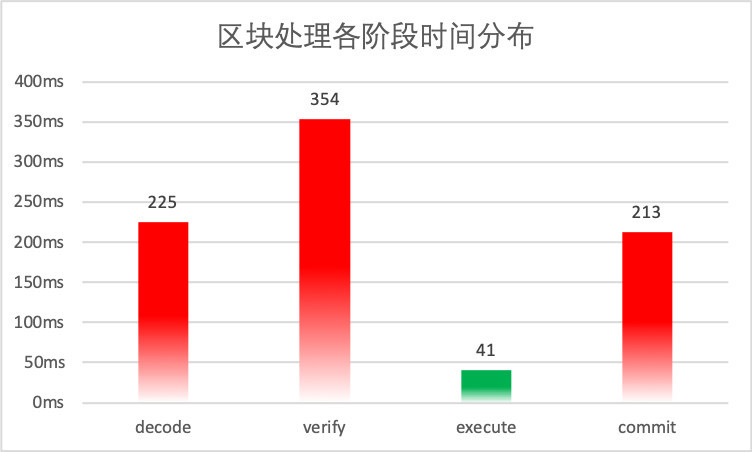
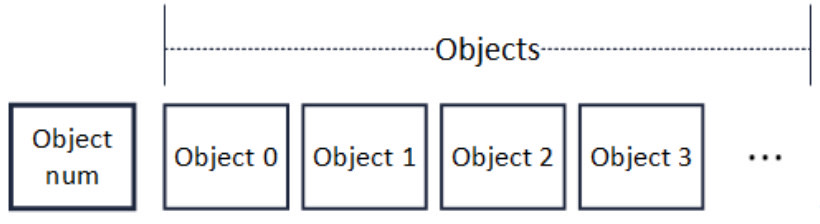
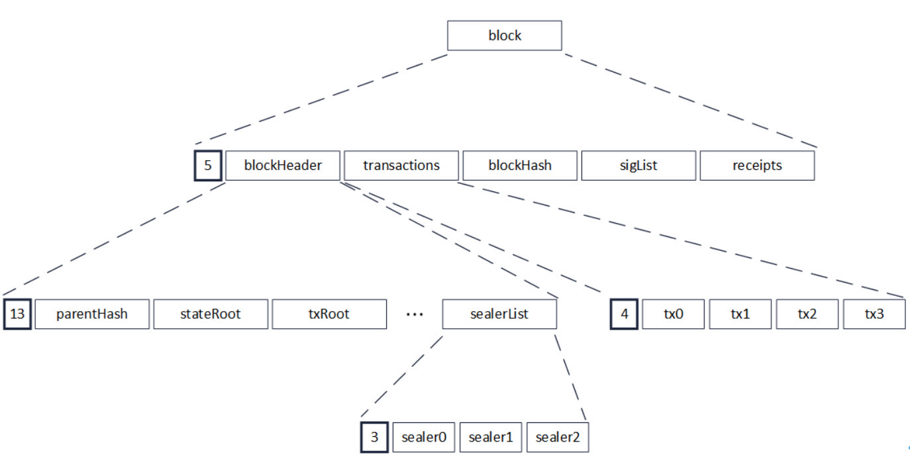
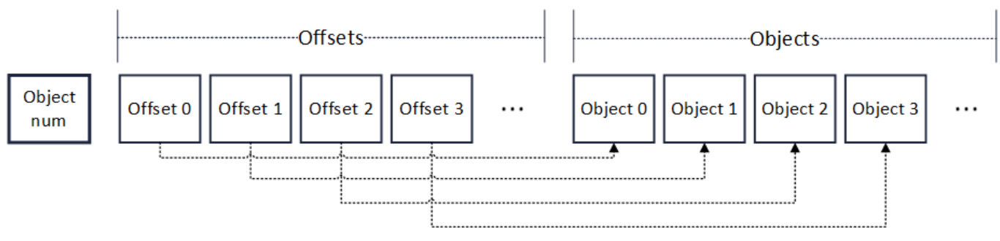

# Let the barrel without short board, FISCO BCOS comprehensive promotion of parallel transformation

Author: Li Chen Xi | FISCO BCOS Core Developer

## 背景

The introduction of PTE (Parallel Transaction Executor, a parallel transaction executor based on the DAG model) gives FISCO BCOS the ability to execute transactions in parallel, significantly improving the efficiency of node transaction processing。We are not satisfied with this stage result, and continue to dig deeper and find that the overall TPS of FISCO BCOS still has a lot of room for improvement。 To use a barrel as an analogy: if all the modules of the transaction processing of the participating nodes constitute a barrel, the transaction execution is just a piece of wood that makes up the entire barrel, and according to the short board theory, how much water a barrel can hold depends on the shortest piece on the barrel wall, by the same token**FISCO BCOS performance is also determined by the slowest components**。 Despite the theoretically high performance capacity achieved by PTE, the overall performance of FISCO BCOS is still constrained by the slower transaction processing speeds of other modules。**In order to maximize the use of computing resources to further improve transaction processing capabilities, it is imperative to fully advance the parallelization transformation in FISCO BCOS。** 

## Data analysis

According to the four-step principle of "analysis → decomposition → design → verification" of parallel programming, it is first necessary to locate the precise location of the performance bottlenecks that still exist in the system in order to decompose the tasks more deeply and design the corresponding parallelization strategy。**Using top-down analysis, we divide the transaction processing process into four modules for performance analysis**The four modules are:

**Block decoding (decode)**: Blocks need to be sent from one node to another during consensus or synchronization between nodes. In this process, blocks are transmitted between networks in the form of RLP encoding。After the node receives the block encoding, it needs to decode it and restore the block to a binary object in memory before further processing。

**Transaction verification (verify)**: The transaction is signed by the sender before it is sent, and the data obtained by the signature can be divided into(v, r, s)In the third part, the main task of signing is to receive the transaction or execute the transaction from the(v, r, s)Restore the public key of the transaction sender from the data to verify the identity of the transaction sender。

**Transaction execution**Execute all transactions in the block, update the blockchain status。

**Data drop (commit)**: After the block is executed, the block and related data need to be written to the disk for persistent storage。

Using a block containing 2,500 pre-compiled transfer contract transactions as the test object, the average time-consuming distribution of each phase in our test environment is shown in the following figure



As can be seen from the figure, the execution time of 2500 trades has been reduced to less than 50 milliseconds, which proves that PTE's optimization of the FISCO BCOS trade execution phase is effective。However, the chart also reveals a very obvious problem: the time taken at other stages is much higher than the time taken for trade execution, resulting in the performance advantage of trade execution being severely offset and the PTE not being able to deliver its due value。

As early as 1967, the law named after him by Amdahl, a veteran of computer architecture, has explained to us the rule of thumb for measuring the efficiency gains of processors after parallel computing


where SpeedUp is the speedup, Ws is the serial component of the program, Wp is the parallel component in the program, and N is the number of CPUs。It can be seen that in the case of a constant total amount of work, the more parallel parts of the code, the higher the overall performance of the system。We need to take our thinking out of the linear model, continue to subdivide the entire processing flow, identify the program hotspots with the longest execution time, and parallelize these code segments to break all the bottlenecks one by one, which is the best way to maximize performance gains through parallelization。

## Root cause dismantling

### 1. Serial block decoding

The main performance problem of block decoding lies in the RLP coding method itself。The full name of RLP is recursive length prefix coding, which is a coding method that uses length as a prefix to indicate the number of elements in the encoded object。As shown in the following figure, the beginning of the RLP code is the number of objects in the code (Object num)。After the number, is the corresponding number of objects (Object)。Recursively, each object is also RLP encoded, and its format is also the same as the figure below。

It is important to note that in RLP coding。The byte size of each object is not fixed. Object num only indicates the number of objects and does not indicate the byte length of an object。



RLP can theoretically encode any number of objects by combining a length prefix with recursion。The following figure shows the RLP encoding of a block. When encoding a block, it is recursive to the bottom layer to encode multiple sealers. After the multiple sealers are encoded and the length prefix is added, the encoding becomes a string of RLP encodings (sealerList)。This is followed by layer-by-layer recursion and the final encoding becomes the RLP encoding of the block。Because RLP encoding is recursive, the length after encoding cannot be known before encoding。



When decoding, because the length of each object in RLP encoding is uncertain, and RLP encoding only records the number of objects, not the byte length of the object, to obtain one of the encoded objects, you must recursively decode all the objects in its preamble, after decoding the preamble of the object, you can access the byte position of the encoded object that needs to be accessed。For example, in the above figure, if you need to access the 0th transaction in the block, that is, tx0, you must first decode the blockHeader, and the decoding of the blockHeader needs to be recursive again, decoding the parentHash, stateRoot, and even the sealerList。

The most important purpose of decoding a block is to decode the transactions contained in the block, and the codes of the transactions are independent of each other, but under the special coding method of RLP, the necessary condition for decoding a transaction is to decode the previous transaction, and the decoding tasks of the transaction are interlinked, forming a chain of dependencies。It should be pointed out that this decoding method is not a defect of RLP, one of the design goals of RLP is to minimize the space occupation, make full use of each byte, although the codec has become less efficient, but the compactness of the encoding is obvious to all, so this encoding is essentially a time-for-space trade-off。

Due to historical reasons, RLP coding is used in FISCO BCOS as a multi-site information exchange protocol, and the rush to switch to other parallelization-friendly serialization schemes may result in a greater development burden。Based on this consideration, we decided to slightly modify the original RLP codec scheme, by adding additional position offset information for each encoded element, we can decode the RLP in parallel without changing a lot of the original code。

### 2. Transaction verification & high cost of data placement

By breaking down the code for the trade check and data drop sections, we found that the main functions of both are concentrated in a time-consuming for loop。Transaction validation is responsible for taking out transactions in sequence and then from the signature data of the transaction(v, r, s)data and restore the public key of the transaction sender from it, where the step of restoring the public key is time-consuming due to the cryptographic algorithm involved；The data drop disk is responsible for taking out the transaction-related data from the cache one by one, encoding it into a JSON string and writing it to disk, which is also a disaster area for performance loss due to the low efficiency of the JSON encoding process itself。

The two codes are as follows:

```
/ / Transaction verification
for(int i = 0; i < transactions.size(); ++i)
{
  tx = transactions[i];
  v, r, s = tx.getSignature();
  publicKey = recover(v, r, s);  / / From(v, r, s)The sender's public key is recovered from the
  ...
}
```

```
/ / Data drop
for(int i = 0; i < datas.size(); ++i)
{
  data = datas[i];
  jsonStr = jsonEncode(data);  / / Encode data as a JSON string for storage
  db.commit(jsonStr);
  ...
}
```

The common feature of both processes is that they both apply the same operations to different parts of the data structure, and for this type of problem, you can directly use data-level parallelism for transformation。The so-called data-level parallelism, that is, the data as a partition object, by dividing the data into fragments of approximately equal size, by operating on different data fragments on multiple threads, to achieve the purpose of parallel processing of data sets。

The only additional requirement for data-level parallelism is that the tasks are independent of each other, and there is no doubt that in the FISCO BCOS implementation, both transaction validation and data drop meet this requirement。

## optimization practice

### 1. Block decoding parallelization

During the transformation, we added an offset field to the common RLP encoding used in the system to index the location of each Object。As shown in the following figure, the beginning of the modified encoding format is still the number of objects (Object num), but after the number field, it is an array (Offsets) that records the offset of the object。



Each element in the array has a fixed length。Therefore, to read the value of an Offset, you only need to access the array, according to the serial number of the Offset direct index can be randomly accessed。After Offsets, is a list of objects that are the same as the RLP encoding。Offset of the corresponding ordinal, pointing to the RLP-encoded byte position of the object of the corresponding ordinal。Therefore, to decode an object arbitrarily, you only need to find its offset based on the object's serial number, and then locate the RLP encoded byte position of the corresponding object based on the offset。

The coding process has also been redesigned。The process itself is still based on the idea of recursion. For the input object array, first encode the size of the object array at the beginning of the output encoding. If the array size exceeds 1, take out the objects to be encoded one by one and cache their recursive encoding, and record the offset position of the object in the Offsets array. After the array is traversed, take out the cached object encoding for the first time and append it to the output encoding；If the array size is 1, it is recursively encoded and written to the end of the output encoding, ending the recursion。

**The pseudocode for the coding process is as follows:**

```
Rlps = RLP();  / / Output, null initially
void encode(objs)  //Input: objs = array of objects to be encoded
{
  offset = 0;
  codes = [];
  
  objNum = objs.size()
  Rlps.push(objNum)
  if objNum > 1
  {
    for obj in objs
    {
      rlp = encode(obj);  / / Recursively call the encoding method
      Rlps.push(offset);
      offset += rlp.size();
      codes.add(rlp);  / / Cache the result of recursive encoding
    }
    for x in codes
    {
      Rlps.push(x);
    }
  }
  else
  {
    rlp = encode(objs[0]);
    Rlps.push(rlp);
  }
}
```

The introduction of offsets enables the decoding module to have random access to the element encoding。The array range of Offsets can be spread evenly across multiple threads, so that each thread can access different parts of the object array in parallel and decode them separately。Because it is read-only access, this parallel approach is thread-safe and only needs to summarize the output at the end。

**The pseudo-code for the decoding process is as follows:**

```
Objs decode(RLP Rlps)
{
  objNum = Rlps.objNum；  / / Get the number of objects
  outputs = [] / / Output object array
  if objNum > 1
  {
    parallel for i = 0 to objNum
    {
      offset = Rlps.offsets[i];
      code = Rlps.objs[offset];
      x = decode(code);
      outputs.add(x);   / / Ordered inserts outputs
    }
  }
  else
  {
    outputs.add(decode(Rlps.objs[0]));
  }
  return outputs;
}
```

## 2. Transaction Verification & Parallelization of Data Drop

For data-level parallelism, there are a variety of mature multithreaded programming models in the industry。While explicit multithreaded programming models such as Pthread can provide more granular control over threads, they require us to have skillful mastery of thread communication and synchronization。The higher the complexity of the implementation, the greater the chance of making mistakes, and the more difficult it will be to maintain the code in the future。Our main goal is to parallelize only intensive loops, so Keep It Simple & Stupid is our coding principle, so we use an implicit programming model to achieve our goal。

After repeated trade-offs, we have chosen the Thread Building Blocks (TBB) open source library from Intel among the many implicit multithreaded programming models on the market。In terms of data-level parallelism, TBB is a veteran, and the TBB runtime system not only masks the implementation details of the underlying worker threads, but also automatically balances workloads between processors based on the amount of tasks, thus making full use of the underlying CPU resources。

**With TBB, the code for transaction validation and data drop is as follows**

```
/ / Parallel transaction verification
tbb::parallel_for(tbb::blocked_range<size_t>(0, transactions.size()),
[&](const tbb::blocked_range<size_t>& _range)
{
  for(int i = _range.begin(); i != _range.end(); ++i)
  {
    tx = transactions[i];
    v, r, s = tx.getSignature();
    publicKey = recover(v, r, s);  / / From(v, r, s)The sender's public key is recovered from the
    ...
  }
});
```

```
/ / Parallel data drop
tbb::parallel_for(tbb::blocked_range<size_t>(0, transactions.size()),
[&](const tbb::blocked_range<size_t>& _range)
{
  for(int i = _range.begin(); i != _range.end(); ++i)
  {
    data = datas[i];
    jsonStr = jsonEncode(data);  / / Encode data as a JSON string for storage
    db.commit(jsonStr);
    ...
  }
});
```

As you can see, in addition to using the tbb provided by the TBB::parallel _ for parallel loop and tbb::The code inside the loop body is almost unchanged outside the blocked _ range reference data shard, close to C++Native syntax is exactly what makes TBB。TBB provides parallel interfaces with a high level of abstraction, such as generic parallel algorithms such as parallel _ for and parallel _ for _ each, which makes the transformation easier。At the same time, TBB does not depend on any language or compiler, as long as it can support ISO C++Standard compiler, there is TBB use。

Of course, the use of TBB is not completely without additional burden, such as inter-thread security or need to be carefully analyzed by developers to ensure, but TBB thoughtful, provides a set of convenient tools to help us solve the problem of mutual exclusion between threads, such as atomic variables, thread local storage and parallel containers, these parallel tools are also widely used in FISCO BCOS, for the stable operation of FISCO BCOS escort。

#### Write at the end

After a set of parallel optimization of the combination of fist, FISCO BCOS performance to a higher level。The results of the stress test show that the transaction processing capacity of FISCO BCOS has been successfully improved by 1.74 times compared to before the parallel transformation, basically achieving the expected effect of this link。

But we also deeply understand that the road to performance optimization is long, the shortest board of the barrel always alternates, the parallel way is, through repeated analysis, disassembly, quantification and optimization, so that the modules work together, the whole system to achieve an elegant balance, and the optimal solution is always in the "jump" to get the place。

