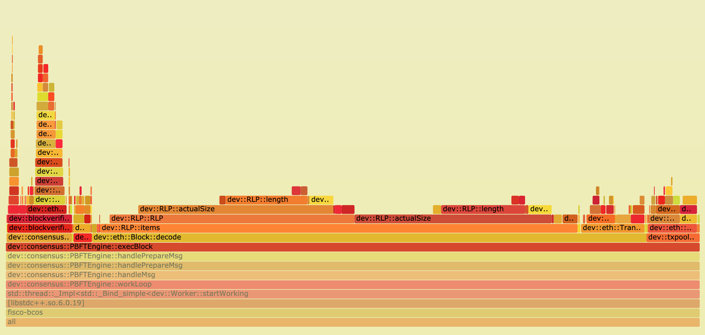

# FISCO BCOS Performance Optimization - Tools

Author: Li Chen Xi | FISCO BCOS Core Developer

We should forget about small efficiencies, say about 97% of the time: premature optimization is the root of all evil. Yet we should not pass up our opportunities in that critical 3%. ——Donald Knuth 

**"Premature optimization is the root of all evil."**

Donald Knuth, the computer science pioneer who said this, is not against optimization, but emphasizes optimizing key locations in the system。Assuming that a for loop takes 0.01 seconds, even if you use various techniques such as loop expansion to improve its performance by 100 times and reduce the time taken to 0.00001 seconds, it is basically imperceptible to the user。Before quantitative testing of performance issues, various flare-up optimizations at the code level may not only fail to improve performance, but may instead increase code maintenance or introduce more errors。

**"Optimization without any evidence is the root of all evil."**

Before optimizing the system, be sure to conduct a detailed performance test on the system to identify the real performance bottlenecks。Fighting on the front line of FISCO BCOS performance optimization, we have accumulated some experience on how to use performance testing tools to pinpoint performance hotspots。This article summarizes the tools we use in the optimization process for the reader。

------

## 1.Poor Man's Profiler

The Poor's Analyzer, or PMP for short。Although the name is somewhat confusing, but people are really a serious means of performance analysis, and even have their own official website https://poormansprofiler.org/。The principle of PMP is Stack Sampling. By calling a third-party debugger (such as gdb) and repeatedly obtaining the stack information of each thread in the process, PMP can obtain the hotspot distribution of the target process。

**The first step**to get a snapshot of a certain number of thread stacks:

```
pid=$(pidof fisco-bcos)
num=10
for x in $(seq 1 $(num))
  do
    gdb -ex "set pagination 0" -ex "thread apply all bt" -batch -p $pid
    sleep 0.5
done 
```

**Second step**function call stack information from the snapshot, sorted by call frequency

```
awk '
  BEGIN { s = ""; } 
  /^Thread/ { print s; s = ""; } 
  /^\#/ { if (s != "" ) { s = s "," $4} else { s = $4 } } 
  END { print s }' | \
sort | uniq -c | sort -r -n -k
```

Finally, the output is obtained, as shown in the following figure:


From the output, you can observe which functions of which threads are frequently sampled, and then you can follow the graph to find possible bottlenecks。These few lines of shell scripts are where the whole essence of PMP lies。Extremely simple and easy to use is the biggest selling point of PMP, in addition to relying on a ubiquitous debugger, PMP does not need to install any components, as the PMP author said in the introduction: "**Although more advanced analysis techniques exist, they are all too cumbersome to install without exception... Poor man doesn't have time. Poor man needs food.**。

The disadvantages of PMP are also obvious: the startup of gdb is very time-consuming, which limits the sampling frequency of PMP to not be too high, so some important function call events may be missed, resulting in the final profile result is not accurate enough。But in some special occasions, PMP can still play a role, such as in some Chinese technology blogs, there are developers mentioned using PMP to successfully locate the deadlock problem in the online production environment, PMP authors also said that this technology in Facebook, Intel and other large factories have applications。Anyway, this technique that flashes the programmer's little wisdom with a little humor is worth a glimpse。

## 2.perf

Perf's full name is Performance Event, which is integrated in the Linux kernel after version 2.6.31. It is a powerful performance analysis tool that comes with Linux and uses special hardware PMU (Performance Monitor Unit) and kernel performance counters in modern processors to count performance data。Perf works by sampling the interrupts of running processes at a certain frequency to obtain the name of the currently executing function and the call stack。If most of the sample points fall on the same function, it indicates that the function takes a long time to execute or the function is frequently called, and there may be performance problems。

Using perf requires first sampling the target process:

```
$ sudo perf record -F 1000 -p `pidof fisco-bcos` -g -- sleep 60
```

In the above command, we use perf record to specify the statistics for recording performance；Use -F to specify a sampling frequency of 1000Hz, that is, 1000 samples per second；Use -p to specify the process ID to be sampled (both the process ID of fisco-bcos), which we can get directly from the pidof command；Use -g to record call stack information；Use sleep to specify a sampling duration of 60 seconds。After sampling, perf writes the collected performance data to the perf.data file in the current directory。

```
$ perf report -n
```

The above command reads perf.data and counts the percentage of each call stack, in order from high to low, as shown in the following figure:


The information is rich enough, but the readability is still not very friendly。Although the use of perf in the example is relatively simple, perf can actually do much more than this。With other tools, the data sampled by perf can be presented to us in a more intuitive and clear way, which is the performance analysis artifact we will introduce next - the flame chart。

## 3. Flame Diagram

Flame Graph, or Flame Graph, is powered by the dynamic tracking technology proposed by system performance giant Brendan Gregg, which is mainly used to visualize the data generated by performance analysis tools so that developers can locate performance problems at a glance。The use of flame chart is relatively simple. We only need to download a series of tools from github and place them in any local directory:

```
wget https://github.com/brendangregg/FlameGraph/archive/master.zip && unzip master.zip
```

### 3.1 CPU flame diagram

When we find that FISCO BCOS performance is low, we intuitively want to figure out what part of the code is slowing down the overall speed, and the CPU is our primary focus。

First use perf to sample the performance of the FISCO BCOS process:

```
sudo perf record  -F 10000 -p `pidof fisco-bcos` -g -- sleep 60
# Parsing the sample data file to generate stack information
sudo perf script > cpu.unfold
```

After the sample data file is generated, the next step is to call the flame map tool to generate the flame map:

```
# Symbolic folding of perf.unfold
sudo ./stackcollapse-perf.pl cpu.unfold > cpu.folded
# Generate flame map in SVG format
sudo ./flamegraph.pl  cpu.folded > cpu.svg
```

Finally, an image in SVG format is output to show the CPU call stack, as shown in the following figure:


**The vertical axis represents the call stack**。Each layer is a function and the parent function of its previous layer. The top is the function being executed at the time of sampling. The deeper the call stack, the higher the flame。**The horizontal axis represents the number of samples**。Note that it does not indicate execution time。If the width of a function is wider, it means that it has been drawn more times, and all call stacks will be aggregated and arranged in alphabetical sequence on the horizontal axis。

The flame diagram uses the SVG format, and the interactivity is greatly improved。When opened in the browser, each layer of the flame is labeled with a function name, and when the mouse hovers over it, the full function name, the number of times sampled, and the percentage of the total number of words sampled are displayed, as follows


Click on a layer, the flame diagram will be horizontally enlarged, the layer will occupy all the width, and display detailed information, click on the upper left corner of the "Reset Zoom" can be restored。The following figure shows the percentage of samples for each function when the PBFT module executes the block



As can be seen from the figure, in the execution of the block, the main overhead in the transaction decoding, this is due to the traditional RLP encoding in the decoding, the length of each object in the RLP encoding is uncertain, and the RLP encoding only records the number of objects, not the byte length of the object, to obtain one of the encoded objects, you must recursively decode all the objects in its preamble。

Therefore, the decoding process of RLP encoding is a serial process, and when the number of transactions in the block is large, the overhead of this part will become very large。In this regard, we propose an optimization scheme for parallel decoding RLP encoding. For specific implementation details, please refer to the previous article ["Parallelization Practice in FISCO BCOS"](https://mp.weixin.qq.com/s?__biz=MzA3MTI5Njg4Mw==&mid=2247485324&amp;idx=1&amp;sn=94cdd4e7944f1058ee01eadbb7b3ec98&source=41#wechat_redirect)。

With a flame chart, it's easy to see where most of the CPU's time overhead is spent, and then optimize it。

### 3.2 Off-CPU Flame Chart

When implementing the parallel execution transaction function of FISCO BCOS, we found a confusing phenomenon: sometimes even if the transaction volume is very large and the load of the block is full, but the CPU utilization rate is still relatively low through the top command, usually the utilization rate of the 4-core CPU is less than 200%。After eliminating the possibility of dependencies between transactions, it is speculated that the CPU may be stuck in I / O or lock waiting, so you need to determine where the CPU is waiting。

Using perf, we can easily understand the sleep process of any process in the system, the principle is to use perf static tracer to grab the scheduling events of the process, and merge these events through perf inject, and finally get the call flow and sleep time that induce the process to sleep。

We're going to record sched separately through perf:sched_stat_sleep、sched:sched_switch、sched:sched _ process _ exit three events, which represent the wait event when the process actively abandons the CPU and goes to sleep, the wait event when the process is switched to sleep by the scheduler due to I / O and lock waiting, and the exit event of the process。

```
perf record -e sched:sched_stat_sleep -e sched:sched_switch \
-e sched:sched_process_exit -p `pidof fisco-bcos` -g \
-o perf.data.raw sleep 60
perf inject -v -s -i perf.data.raw -o perf.data
# Generate Off-CPU Flame Plot
perf script -f comm,pid,tid,cpu,time,period,event,ip,sym,dso,trace | awk '
    NF > 4 { exec = $1; period_ms = int($5 / 1000000) }
    NF > 1 && NF <= 4 && period_ms > 0 { print $2 }
    NF < 2 && period_ms > 0 { printf "%s\n%d\n\n", exec, period_ms }' | \
./stackcollapse.pl | \
./flamegraph.pl --countname=ms --title="Off-CPU Time Flame Graph" --colors=io > offcpu.svg
```

These commands may fail on newer Ubuntu or CentOS systems, which do not support logging scheduling events for performance reasons。Fortunately, we can choose another profile tool, OpenResty's SystemTap, instead of perf to help us collect performance data for the process scheduler。When we use SystemTap under CentOS, we only need to install some dependencies kenerl debuginfo to use。

```
wget https://raw.githubusercontent.com/openresty/openresty-systemtap-toolkit/master/sample-bt-off-cpu
chmod +x sample-bt-off-cpu
​
./sample-bt-off-cpu -t 60 -p `pidof fisco-bcos` -u > out.stap
./stackcollapse-stap.pl out.stap > out.folded
./flamegraph.pl --colors=io out.folded > offcpu.svg
```

If the 'sample-bt-off-cpu' script fails to download for a long time due to network problems, try the following command:

```bash
https://gitee.com/mirrors/openresty-systemtap-toolkit/raw/master/sample-bt-off-cpu
```

The obtained Off-CPU flame diagram is shown in the following figure:


After expanding the core function of executing the transaction, a bunch of lock _ wait on the right side of the flame chart quickly caught our attention。After analyzing their call stack, we found that the root cause of these lock _ wait comes from the fact that we have a lot of print debug logs in our program。

In the early development phase, we added a lot of log code to facilitate debugging, and did not delete it later。Although we set the log level high during the test, these log-related codes still incur runtime overhead, such as accessing the log level status to determine whether to print the log, etc。Because these states require mutually exclusive access between threads, they cause threads to starve due to competing resources。

When we deleted these log codes, the utilization of the 4-core CPU instantly rose to 300% when the transaction was executed+Given the overhead of scheduling and synchronization between threads, this utilization is already in the normal range。This debugging experience also reminds us that we must be careful to output logs in parallel code that pursues high performance to avoid unnecessary logs that introduce unnecessary performance losses。

### **3.3** Memory Flame Chart

In the early testing phase of FISCO BCOS, we used the test method of repeatedly executing the same block and then calculating the average time taken to execute a block, and we found that the first execution of a block takes much more time than the subsequent execution of a block。On the surface, this seems to be the first time the block is executed, the program allocates the cache somewhere, but we don't know exactly where the cache is allocated, so we set out to study the memory flame map。

Memory flame graph is a non-intrusive bypass analysis method. Compared with Valgrid, which simulates memory analysis, and TC Malloc, which counts heap usage, memory flame graph can obtain the memory allocation of the target process without interfering with the operation of the program。

To make a memory flame map, you first need to dynamically add a probe to perf to monitor the malloc behavior of the standard library and sample the call stack of the function that captures the memory request / release in progress

```
perf record -e probe_libc:malloc -F 1000 -p `pidof fisco-bcos` -g -- sleep 60
```

Then draw the memory flame chart:

```
perf script > memory.perf
./stackcollapse-perf.pl memory.perf > memory.folded
./flamegraph.pl  --colors=mem memory.folded > memory.svg
```

The resulting flame diagram is shown below:


We initially guessed that this unknown cache might be located in LevelDB's database connection module or JSON decoding module, but by comparing the memory flame maps of the first execution block and subsequent execution blocks, we found that the proportion of malloc samples in each module was approximately the same, so we quickly rejected these guesses。It was not until combined with the Off-CPU flame graph observation that we noticed an unusually high number of calls to sysmalloc when the block was first executed。Considering the feature that malloc will pre-allocate memory when it is first called, we suspect that this may be the result of the more time-consuming first execution of the block。

To test the conjecture, we lower the upper bound of malloc's pre-allocated space:

```
export MALLOC_ARENA_MAX=1
```

Then test again and draw the Off-CPU flame graph, and find that although the performance is reduced, the time taken to execute the block for the first time and the number of sysmalloc calls are basically the same as the blocks executed later。From this, we can basically conclude that this interesting phenomenon is due to malloc's memory pre-allocation behavior。

Of course, this behavior is introduced by the operating system in order to improve the overall performance of the program, we do not need to interfere with it, and the first block of execution speed is slow, the user experience will hardly have a negative impact, but no matter how small the performance problem is also a problem, as a developer we should get to the bottom of it and know why。

Although this memory flame chart does not help us directly locate the essential cause of the problem, through intuitive data comparison, we can easily rule out false cause guesses and reduce a lot of trial and error costs。In the face of complex memory problems, not only need to have a keen sense of smell, but also need a good helper such as Memory flame diagram。

## 4. DIY Tools

Although there are so many excellent analysis tools to help us in the performance optimization of the road ahead, but the powerful features sometimes can not keep up with the variability of performance problems, this time we need to combine their own needs, self-sufficient development of analysis tools。

During the stability test of FISCO BCOS, we found that as the test time increases, the performance of the FISCO BCOS node shows a trend of attenuation. We need to obtain the performance trend change graph of all modules to identify the culprit that causes the performance attenuation。

First, we insert a large number of stakes into the code, which are used to measure the execution time of the code segment we are interested in, and record it in the log with a special identifier attached to it

```
auto startTime = utcTime();
/*
...code to be measured...
*/
auto endTime = utcTime();
auto elapsedTime = endTime - startTime;
LOG(DEBUG) << MESSAGE("<identifier>timeCost: ") \
  << MESSAGE(to_string(elspasedTime));
```

When the node performance has started to drop significantly, we export its log, use the Python script we wrote to split the log in blocks, then read the pile point log generated by each block during execution, and parse out the time spent in each stage, then the script is summarized into a large Excel table, and finally directly use the chart function of Excel to draw the performance trend change chart of all modules, as shown in the following figure:


Where the abscissa is the block height, the ordinate is the execution time (ms), and the different color curves represent the performance changes of different modules。

As can be seen from the figure, only the execution time of the block drop module represented by the red curve obviously increases rapidly with the increase of the amount of data in the database, thus it can be determined that the root cause of the node performance degradation problem lies in the block drop module。Using the same method, we further dissect the functions of the block drop module, and we find that when the node submits new block data to the database, it calls LevelDB's update method, not the insert method。

The difference between the two is that because LevelDB stores data in the form of K-V, the update method performs a select operation before writing the data, because the data to be updated may already exist in the database, and the value data structure needs to be queried by Key before modification, while the query time is proportional to the amount of data, and the insert method does not need this step at all。Since we are writing brand new data, the query step is unnecessary, just change the way the data is written, and the problem of node performance degradation will be solved。

A slight change in usage of the same tool can lead to other uses, such as: putting two batches of pile point performance data into the same Excel table, you can use the bar chart tool to clearly show the performance changes of the two test results。

The following figure shows a performance bar chart before and after optimization when we optimize the transaction decoding and validation process


As can be seen from the figure, the optimized transaction decoding and validation process does take less time than it did before the optimization。With the help of the bar chart, we can easily check whether the optimization method is effective, which plays an important guiding role in the process of performance optimization。

In summary, DIY tools do not necessarily need to be complex, but they will certainly meet our customization needs as quickly as possible。