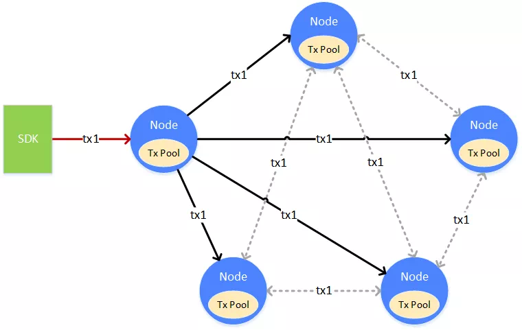

# Synchronization of blockchain and its performance optimization method

Author ： SHI Xiang ｜ FISCO BCOS Core Developer

Synchronization is a very important process in the blockchain, which is functionally divided into "transaction synchronization" and "state synchronization."。Transaction synchronization is executed when the transaction is submitted, giving priority to ensuring that the transaction can be sent to all nodes and packaged for processing。State synchronization occurs when a node finds that its block height lags behind the entire network, and quickly returns to the highest height of the entire network through state synchronization, so that it can participate in the latest consensus process as a consensus node, while non-consensus nodes can obtain the latest block data for storage and verification。

## Transaction synchronization

Transaction synchronization is to allow transactions on the blockchain to reach all nodes as much as possible, providing a basis for consensus to package transactions into blocks。

A transaction (tx1) is sent from the client to a node. After receiving the transaction, the node puts the transaction into its own transaction pool (Tx Pool) for consensus packaging。At the same time, the node broadcasts the transaction to other nodes, which receive the transaction and place it in their own transaction pool。

In order to make the transaction reach all nodes as much as possible, the node that receives the broadcast transaction will select one or more adjacent nodes according to its own network topology and network traffic strategy to relay the broadcast。

### Trading Broadcast Strategy

If each node does not have a limit on forwarding / broadcasting received transactions, the bandwidth will be full and there will be an avalanche of transaction broadcasts。In order to avoid the avalanche of transaction broadcasts, FISCO BCOS has designed a more sophisticated transaction broadcast strategy to minimize duplicate transaction broadcasts while ensuring transaction accessibility as much as possible。

- For transactions coming from SDK, broadcast to all nodes
- For transactions broadcast from other nodes, randomly select 25% of the nodes to broadcast again
- A transaction is broadcast only once on a node, and when a duplicate transaction is received, it will not be broadcast twice

Through the above strategy, the transaction can reach all nodes as far as possible, and the transaction will be packaged, agreed and confirmed as soon as possible, so that the transaction can be executed faster。

The broadcast strategy has pursued the network's final arrival rate as much as possible in complex networks, but there is also a very small probability that a transaction will not reach a node within a certain time window。When the transaction does not reach a certain node, it will only make the time for the transaction to be confirmed longer, will not affect the correctness of the transaction, and will not miss the transaction, because there is a broadcast mechanism, there are more nodes in the network have the opportunity to continue to process the transaction。

## Block synchronization

Block synchronization, which keeps the data state of blockchain nodes up to date。

One of the most important signs of the new and old state of the blockchain is the block height, and the block contains the historical transactions on the chain. If the block height of a node is aligned with the highest block height of the whole network, the node has the opportunity to backtrack the historical transactions to obtain the latest state of the blockchain。

When a new node is added to the blockchain, or a node that has been disconnected restores the network, the block height of this node lags behind other nodes, and its state is not up-to-date。At this time, block synchronization is required。As shown in the preceding figure, the node that needs block synchronization (Node 1) actively requests other nodes to download blocks。The entire download process spreads the network request load across multiple nodes。

### Block Synchronization and Download Queue

When a blockchain node is running, it regularly broadcasts its highest block height to other nodes。After receiving the block height broadcast from other nodes, the node will compare it with its own block height. If its own block height lags behind this block height, it will start the block download process。The download of blocks is completed through the "request / response" method. The nodes that enter the download process will randomly select the nodes that meet the requirements and send the height interval of the blocks to be downloaded。The node that receives the download request will respond to the corresponding block based on the content of the request。

The node that receives the response block maintains a download queue locally to buffer and sort the downloaded blocks。The download queue is a priority queue in order of block height。New blocks downloaded are continuously inserted into the download queue, sorted by height。The sorted blocks are executed and verified by the node in turn。After the verification is passed, update the local data status to increase the block height until the latest block is updated and the block height reaches the highest。

## Performance optimization

Performance optimization of synchronization can effectively improve system efficiency。FISCO BCOS has done a lot in this area, and here are some key optimization points。

### Encoding Cache

In the transaction broadcast, the transaction needs to be encoded into binary data and sent to other nodes, which, after receiving the transaction binary data, need to be decoded into a program-recognizable data structure。Codec becomes a performance bottleneck for transaction broadcasting when the transaction volume is large。FISCO BCOS caches the binary encoding of the transaction, and when the transaction is to be sent, the binary transmission is taken directly from the cache, reducing the frequency of encoding and decoding and increasing the rate of transaction broadcasting。

### load balancing

The node behind the block will download the block from other nodes by request。After receiving the request, other nodes will send the blocks of the corresponding interval to the backward nodes。When the block is far behind, the FISCO BCOS node will divide the download interval evenly, initiate requests to different nodes, and distribute the download load to different nodes to prevent a single requested node from affecting its performance due to carrying a large number of data access requests。

### **Callback Stripping**

In the FISCO BCOS node, there are multiple callback threads that process packets received on the network。When the network traffic is large, the thread processing the network packet cannot handle it, and the network packet will be placed in the buffer queue。The packets on the network are mainly synchronization packets and consensus packets, and consensus packets have a higher priority, which directly affects the block speed。In order not to affect the processing of the consensus package, FISCO BCOS strips the processing logic of the synchronization package from the network callback thread and hands it over to another independent thread, which is coupled and parallelized with the consensus package。

### **Check and remove weight**

When the synchronization module receives the transaction, it needs to verify the transaction。After the consensus module receives the block, it removes the transaction from the block and also needs to verify the transaction。Although it was the same transaction, it was verified in both synchronization and consensus。However, the verification is very time-consuming, which greatly affects the TPS of the transaction execution。FISCO BCOS in the execution of the transaction to do a de-duplication logic, whether it is synchronization or consensus, before the check-and-sign record, if the transaction has been checked, then directly from the record to obtain the check-and-sign results, to ensure that the same transaction only check-and-sign once。At the same time, FISCO BCOS allows synchronization to check signatures before consensus as much as possible, allowing consensus to obtain signature verification results as directly as possible, reducing the time-consuming process of signature verification in consensus。Consensus is accelerated and the TPS performance of the chain is improved accordingly。

## SUMMARY

Consensus and synchronization are essential links in the blockchain。Consensus takes the lead, synchronous play auxiliary。The synchronization process enables all nodes in the entire blockchain network to achieve data consistency, ensuring that the data is verifiable across the network。At the same time, without affecting the consensus, prepare the required data for the consensus in advance to make the consensus run faster and more stable。

#### Related reading

- [Chaplin deductive consensus and synchronization process optimization](./articles/3_features/31_performance/consensus_and_sync_process_optimization.md)

- [Sync Module Documentation](https://fisco-bcos-documentation.readthedocs.io/zh_CN/latest/docs/design/sync/sync.html)

#### "Group chat interaction"

 **Q**  **Snow without trace**: What if you synchronize to a block on a branch during load balancing synchronization？In addition, when a bifurcation occurs, how long after the branch is retained is discarded？

 **A**  **Shi Xiang**: The consensus algorithm used by FISCO BCOS is pbft and will not fork。Without rollback, synchronization can be load balanced, mpt tree can be gone, mpt is changed to table structure storage, there is no data conflict between table structures, you can execute transactions in parallel, so the alliance chain can be fast。