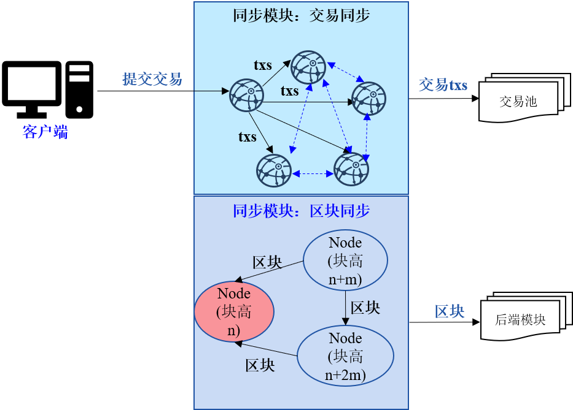
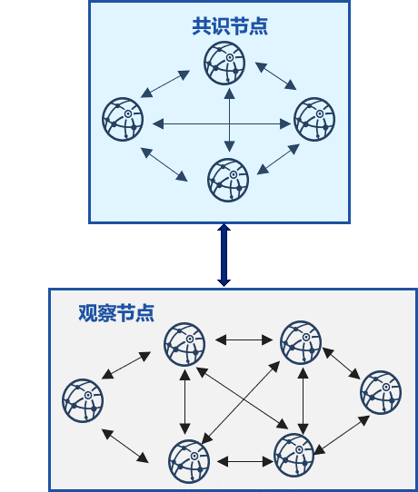
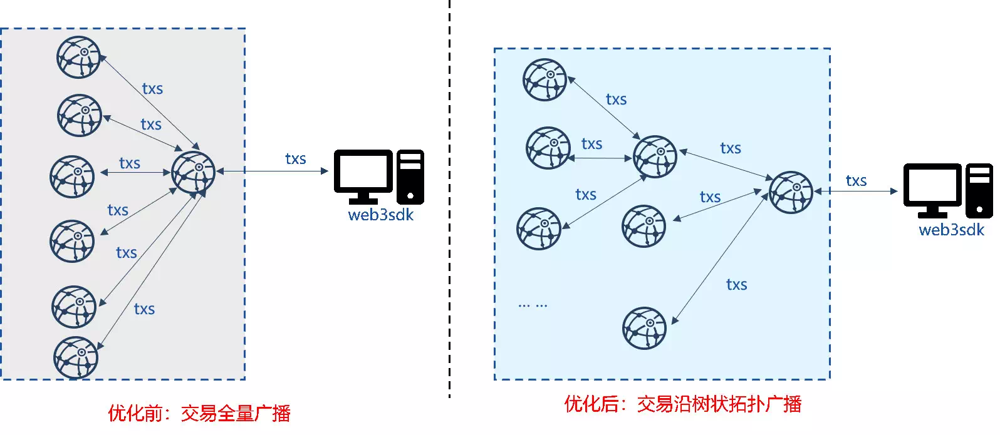

# Optimization Strategy of FISCO BCOS Synchronization Module

Author ： Chen Yujie ｜ FISCO BCOS Core Developer

**Author language**

In the FISCO BCOS blockchain system, the synchronization module is responsible。As a transaction transmission expert, the client sends transactions to all node transaction pools, continuously providing the consensus module with "raw materials" for packaging blocks.；It is also a "rescuer of needy households," synchronizing the latest blocks to the "needy households" node with high and backward blocks, so that they can participate in the consensus normally.。

Of course, since most of the responsibilities of the synchronization module are related to the network, it is also a "big bandwidth consumer" of the system, which will lead to high bandwidth load on some nodes of the blockchain.。To this end, FISCO BCOS developers have also designed a series of strategies to optimize this "bandwidth consumer" so that it can serve the system more elegantly.。

This article will detail the optimization of the FISCO BCOS synchronization module.。

------

## Initial synchronization module

Transaction synchronization and block synchronization are the main responsibilities of the synchronization module of the FISCO BCOS blockchain system, both of which are network-related.。

As shown in the figure above, transaction synchronization is responsible for sending transactions sent by the client to all other nodes, providing the consensus module with transactions for packaging blocks。To ensure that transactions can reach all nodes, transaction synchronization mainly includes two parts: transaction broadcast and transaction forwarding.

- **Transaction Broadcast**: The client first sends the transaction to the client directly connected node, which broadcasts the received transaction to all other nodes；
- **Transaction Forwarding**: In order to ensure that the transaction can reach all nodes in the case of network disconnection, the nodes that receive the broadcast transaction are randomly selected 25% of the nodes to forward the received transaction.。

Block synchronization is responsible for saving the high and backward blocks"Difficult households"to synchronize the latest block high to the node behind the block high。When the block height of a node is lower than that of other nodes, a new block is actively pulled from the node with a higher block height.。

## Unreasonable network use posture of synchronization module

The previous section mentioned that the synchronization module is a "large bandwidth consumer," so let's talk about the unreasonable network usage posture of this "large bandwidth consumer."。

### High network load of client directly connected nodes during transaction synchronization

Considering the slow messaging speed of the Gossip protocol, the alliance chain scenario generally adopts the method of fully interconnected node networks to improve network efficiency.。To ensure that the transaction sent by the client can reach all nodes quickly, the client directly connected node will broadcast the transaction to all nodes after receiving the transaction.。Due to the limited bandwidth of the external network of blockchain nodes, as the size of the nodes increases, the client directly connected nodes will inevitably become a system bottleneck due to the high network load.。

### Low network utilization efficiency when forwarding transactions

In order to ensure that transactions can still reach all nodes in the event that some nodes are disconnected from the network, the synchronization module introduces a transaction forwarding mechanism.。After a node receives a transaction, it randomly selects a number of nodes to broadcast the received transaction。

When the network is fully connected, this will cause some nodes to frequently receive duplicate data packets, and the more nodes, the more redundant message packets due to transaction forwarding, which will undoubtedly cause a huge waste of network bandwidth.。

### During block synchronization, the network load of some nodes is high, resulting in the node size is not scalable.

Considering the high complexity and non-infinite scalability of the blockchain of the BFT or CFT consensus algorithms currently in use, most business architectures have only some nodes as consensus nodes and other nodes as observation nodes.(Do not participate in consensus, but have the full amount of blockchain data), As shown in the figure below。

In this architecture, most observation nodes randomly download blocks from the consensus node with the latest block。In a blockchain system with n consensus nodes and m observation nodes, set each block size to block _ size, ideally(namely load balancing), one block per consensus, each consensus node needs to send blocks to m / n observation nodes, and the bandwidth out of the consensus node is approximately(m/n)*block_size；If the network bandwidth is bandwidth, each consensus node can send the(bandwidth/block_size)The maximum node size of the blockchain is(n*bandwidth/block_size)。When the bandwidth of the public network is small and the number of blocks is large, the number of nodes that can be accommodated is limited, so the random block synchronization strategy is not scalable.。

## Optimization Strategy of Synchronization Module

In order to improve the efficiency of system bandwidth use and the scalability of the system, FISCO BCOS developers have proposed a series of optimization strategies to "correct" the unreasonable network usage posture of the synchronization module, so that it can serve the FISCO BCOS blockchain system more elegantly and efficiently.。

### Strategy 1: Trading Tree Broadcast

In order to reduce the network pressure caused by the transaction broadcast of client directly connected nodes, FISCO BCOS adheres to the principle of load balancing and designs a transaction tree broadcast strategy to distribute the pressure of client directly connected nodes to its subordinate child nodes. The following figure shows the transaction broadcast topology of the seven-node blockchain system before and after optimization:

- **Before optimization:**After receiving the client transaction, the node broadcasts the full amount to other nodes.；
- **After optimization:**After the node receives the client transaction, it sends it to the child node, and after the child node receives the transaction, it continues to forward the transaction to its own child node。

After the transaction tree broadcast is used, the client directly connected nodes shown in the figure above allocate part of the network load to the child nodes, reducing the bandwidth load to half of the original, achieving the goal of load balancing.。And, since the outgoing bandwidth of all node broadcast transactions is only related to the width of the tree topology, the transaction tree broadcast strategy is scalable。In addition, compared to the Gossip-based transaction broadcast mechanism, the tree broadcast strategy increases the transaction broadcast rate while reducing the number of redundant message packets in the network.。

###  Strategy 2: Transaction forwarding optimization based on state packets

In order to eliminate the bandwidth consumption caused by transaction forwarding and improve network efficiency, FISCO BCOS proposes a transaction forwarding strategy based on state packets.。The node can obtain the missing transactions based on the received transaction status and the existing transactions in the transaction pool, and pull the missing transactions directly to the corresponding node.。

In the preceding figure, the client is directly connected to node0, but node0 is disconnected from node1 and node4. In this case, node0 can only broadcast transactions to node2 and node3.。After receiving the transaction, node2 and node3 package the list of the latest transaction into a status package and send it to other nodes。After receiving the status package, node1 and node4 compare the list of transactions in the local transaction pool to obtain the list of missing transactions and request transactions from node2 or node3 that have these transactions in batches.。In a fully connected network environment, the transaction status of all nodes is basically the same, and there are fewer transaction requests between nodes, which greatly reduces the bandwidth waste caused by forwarding redundant transactions compared to the strategy of directly forwarding transactions.。

### Strategy 3: Block synchronization scalability optimization

In order to reduce the impact of the network output bandwidth of the consensus node on the network scale when multiple observation nodes synchronize blocks to a single consensus node, and improve the scalability of block synchronization in the blockchain system, FISCO BCOS designs and implements a block state tree broadcast strategy.。

The following figure shows the block synchronization of a blockchain system consisting of three consensus nodes and 18 observation nodes along a trigeminal tree:

The strategy allocates the observation node to each consensus node and constructs a tritree with the consensus node as the vertex.。After the consensus node is out of the block, it gives priority to sending the latest block status to its child observation node, and after the child observation node synchronizes the latest block, it gives priority to sending the latest block status to its own child node, and so on.。After the block state tree broadcast strategy is adopted, each node preferentially sends the latest block state to the child node, and the child node preferentially synchronizes the latest block to the parent node, set the block size to block _ size and the width of the tree to w, then the network bandwidth for block synchronization is(block_size * w), regardless of the total number of nodes in the blockchain system, is scalable。

In addition, considering that in the tree topology, the disconnection of nodes may cause blocks to fail to reach some nodes, the block state tree broadcast optimization strategy also uses the gossip protocol to synchronize the block state regularly, so that the disconnected nodes in the tree topology can also synchronize the latest blocks from their neighbors, ensuring the robustness of the tree block state broadcast.。

## Summary

The synchronization module is a small expert in transaction transmission, as well as a "rescuer of needy households.""Large bandwidth consumption", this"Large bandwidth consumption"Whether you are performing the task of synchronizing transactions or performing the task of synchronizing blocks, you are suspected of wasting bandwidth and overusing part of the node bandwidth.。

FISCO BCOS developers use a series of optimization strategies to standardize the bandwidth usage posture of the synchronization module, minimize redundant message packets of the synchronization module, and allocate the bandwidth pressure of high-load nodes to subordinate child nodes, which improves the scalability of the blockchain system. The optimized synchronization module can serve the blockchain system more elegantly, efficiently and robustly.。