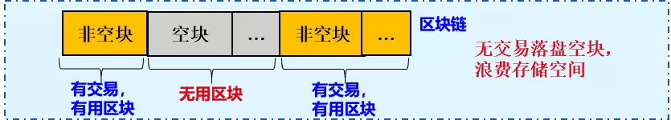
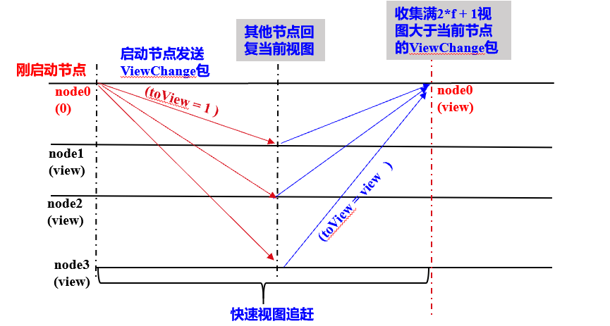

# FISCO BCOS Consensus Optimization

Author ： Chen Yujie ｜ FISCO BCOS Core Developer

**Author language**

The original PBFT consensus algorithm has room for continuous optimization in terms of block packaging, transaction validation, block execution, and empty block processing, and in order to make the PBFT algorithm faster and more stable, FISCO BCOS has made a series of optimizations, including

- Packaging and consensus performed concurrently；
- Do not repeat checking and signing transactions；
- Introduction of DAG parallel transaction execution framework for parallel execution of intra-block transactions；
-Empty blocks quickly trigger view switching and switch Leader, which does not drop empty blocks, eliminating the storage overhead of empty blocks and effectively preventing nodes from doing evil；
-Solves the problem that the node cannot quickly catch up with other node views after the node is down, ensuring the availability of the system。

This article details the consensus optimization scheme of FISCO BCOS from three aspects: performance, storage and availability。

## Performance optimization

Taking into account**Leader Rotating Serial Packaging Transactions**、**Slow transaction validation speed**以及**Block execution is slow**, are the main factors leading to performance problems, FISCO BCOS has done the following optimization:

### Packaging and consensus concurrent execution

PBFT consensus algorithm in each round of consensus, including**Packaging Phase**和**Consensus phase**When the Leader packages a new block, all consensus nodes are in the state of waiting for the Prepae package and cannot enter the consensus phase；When the consensus node is in the consensus phase, the leader's packaging thread does not work, but packaging blocks and consensus are two independent and mutually exclusive processes that can be executed concurrently。

Let the time overhead of the packaging phase be t, the time overhead of the consensus phase be u, and the time overhead of n rounds of consensus be n ∗(t+u)；However, if the leader of the next round of consensus participates in the consensus phase and also packages the blocks in advance and broadcasts the already packaged blocks at the time of the next round of consensus, the consensus time overhead can be reduced to n ∗ u+t, time overhead is reduced(n-1)*t, can effectively improve the performance of PBFT consensus algorithm。

### Avoid duplicate trade checks

After receiving the Prepare packet sent by the leader, the consensus node will take out the block and verify the validity of each transaction signature in the block. However, transaction verification is a time-consuming operation, which will increase the time cost of the PBFT Prepare phase and reduce performance。

Considering that when a transaction is inserted into the transaction pool, a validation is performed, as shown in the following figure, the FISCO BCOS system has been optimized to prevent duplicate validation of transactions, and the following is a detailed description of the FISCO BCOS process to prevent duplicate validation of transactions, taking into account the entire transaction flow process

1. After RPC receives the transaction sent by the client, it checks and signs the transaction；
2. After the transaction is verified, it is inserted into the transaction pool, and the synchronization module broadcasts the transaction；
3. After receiving the transaction from other nodes, the synchronization module of other nodes checks the transaction and inserts the valid transaction into the transaction pool；
4. After receiving the Prepare package, the consensus module solves the blocks in the Prepare package, determines whether the transactions in the block are in the transaction pool, and verifies only the transaction signatures that are not included in the transaction pool。

After the above optimization, the block decoding and verification time of 10000 transactions in the Prepare request is reduced from 2s to 200ms, which greatly reduces the time overhead of the Prepare phase。

### block parallel execution

Block execution is one of the main time overheads of the PBFT consensus algorithm. Without any parallel optimization, the PBFT consensus algorithm can hardly reach consensus on a block containing tens of thousands of transactions。

In order to improve the TPS of the blockchain system, the FISCO BCOS system has developed a DAG-based transaction parallel execution engine and introduced a parallelizable contract development framework to support parallel execution of transactions, reaching tens of thousands of TPS。For details, please refer to: [Blockchain Performance Take Off: DAG-based Parallel Transaction Execution Engine]。](https://mp.weixin.qq.com/s?__biz=MzU5NTg0MjA4MA==&mid=2247484211&idx=1&sn=73591fef0a1a7cc683fd6577b362efca&chksm=fe6a867cc91d0f6aad155a2b7ecd2e077ff35af41e088533626ede34af24a57f3613e197af2d&mpshare=1&scene=21&srcid=0806kJGQCVXQewNJU9ZsRQ2w&sharer_sharetime=1565076787459&sharer_shareid=bc5c95f953e1901389b9c82c159fbb6b&rd2werd=1#wechat_redirect)

## Storage optimization

In order to ensure the normal operation of the system, confirm that the Leader is available, and prevent the Leader from deliberately doing evil, the blockchain system based on the PBFT consensus algorithm will generate empty blocks when there are no transactions and reach a consensus on the empty blocks。
Although the empty block consensus is necessary, considering that the QPS of the current blockchain system is not large, the empty block will consume storage space and reduce the efficiency of hard disk utilization(Number of transactions that can be stored)。
FISCO BCOS implements an efficient empty block processing method based on the PBFT consensus algorithm, ensuring that empty blocks participate in the PBFT consensus process while not falling empty blocks, improving disk utilization efficiency。Detailed scheme can refer to here: ["FISCO BCOS PBFT empty block processing"](https://mp.weixin.qq.com/s?__biz=MzU5NTg0MjA4MA==&mid=2247485288&idx=2&sn=35e32f22cda893e7f02fe58369000164&chksm=fe6a8227c91d0b31133d7302b25decb6f6bba08a8d70848fcaf6573e6983a8e69885d2ed7fa3&mpshare=1&scene=21&srcid=&sharer_sharetime=1565077005952&sharer_shareid=bc5c95f953e1901389b9c82c159fbb6b&rd2werd=1#wechat_redirect)。

## Availability Optimization

When a newly started node or a new node joins the blockchain network, if it cannot immediately reach an agreement with other node views, it will affect the fault tolerance of the system。

-case1: 4-node blockchain system, node0 downtime, the number of fault-tolerant nodes of the remaining three nodes is 0；If node0 restarts and cannot quickly catch up with other node views, the number of fault-tolerant nodes in the system is still 0, and node0 is in the consensus exception state。
-case2: The 2-node blockchain system is running normally. The new node node2 is added. If node2 cannot quickly catch up with other node views, the system will be abnormal due to one node(New Joined Node)while in a consensus abnormal state。

To solve the above problems, the FISCO BCOS PBFT consensus algorithm introduces a fast view catch-up mechanism. The newly started node sends a view switching packet to all other consensus nodes, and other nodes reply to the latest view after receiving the packet, so that the newly started node can quickly reach a consistent view with other consensus nodes, and the system will not have a consensus exception after adding a new node。

As shown in the figure above, the core process is as follows:

- The newly started node broadcasts the view switching request package ViewChange to all other nodes, and the view ViewChange.toView in the request package is 1；
- When other nodes receive a ViewChange request with a toView much smaller than the current node view, the reply contains the current view(view)ViewChange package for；
- just started node collection full 2*f+After 1 ViewChange package, switch to a view consistent with other consensus nodes。

## SUMMARY

The above details the optimization strategy of FISCO BCOS on the consensus algorithm, FISCO BCOS uses a systematic approach to make the PBFT algorithm more efficient and usable。
Of course, in addition to the problems mentioned above, the PBFT algorithm also has room for continuous optimization in terms of network complexity. The FISCO BCOS development team is also actively investigating the latest consensus algorithm and consensus algorithm optimization strategies, and seeking solutions for large-scale node consensus。

